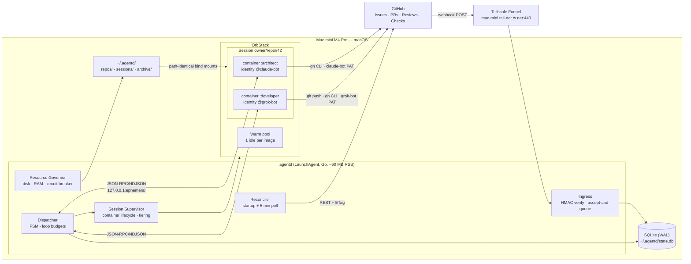
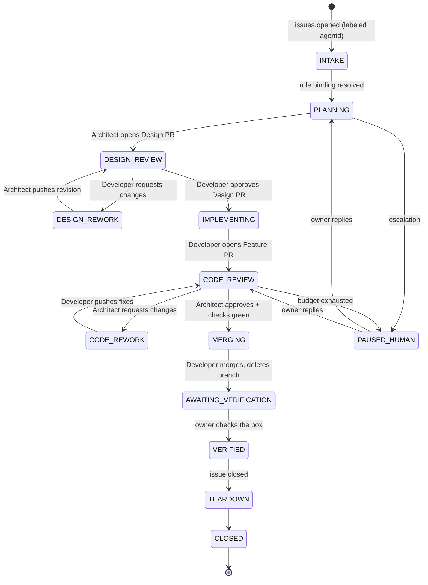
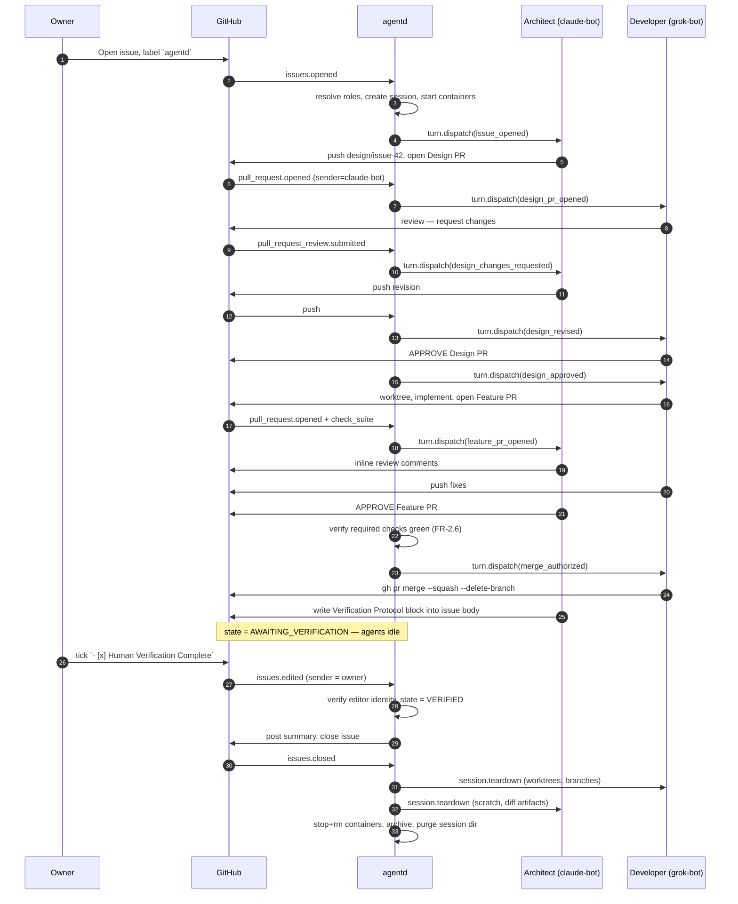

# Technical Design Specification — `agentd`

### Asynchronous Multi-Agent AI Coding System

| | |
|---|---|
| **Author** | Claude Agent (`@claude-bot`) |
| **Phase** | Phase 1 — Blind Draft |
| **Implements** | `plans/design/SRS_async_multiagent_ai_coding_system.md` v1.2 |
| **Ref** | Issue #1 |
| **Status** | Proposed |
| **Version** | 0.1.0 |

---

## 0. Executive Summary

`agentd` is a single Go daemon running as a macOS LaunchAgent on the Mac mini. It receives GitHub webhooks through a Tailscale Funnel, durably records every delivery in SQLite, and drives one **issue-scoped session** per GitHub Issue. Each session owns **two OrbStack containers** — one per agent identity — which hold warm git worktrees and persistent conversation transcripts so that no interaction ever re-clones a repo or re-reads a codebase.

Five decisions carry most of the design's weight:

1. **GitHub is the source of truth; SQLite is a cache, a queue, and an idempotency ledger.** Any local state can be rebuilt by re-reading GitHub. This is what makes NFR-1.2 recovery tractable rather than a distributed-consensus problem.
2. **Credential isolation is the enforcement mechanism for branch protection.** The Developer container never holds the Architect's token. FR-1.3 is not a policy the agents follow — it is a boundary they cannot cross.
3. **Zero cold start = warm containers + shared-object git worktrees + persisted transcripts.** A three-tier container lifecycle (HOT / WARM / COLD) fits ~6 concurrent sessions into 24 GB because the protocol is turn-taking: an issue rarely needs both of its agents running at once.
4. **Webhooks are accepted and queued, never rejected.** GitHub does not automatically retry failed repository webhook deliveries, so back-pressure must never reach GitHub. The circuit breaker (NFR-2.2) pauses the *dispatcher*, not the *receiver*.
5. **Agent↔agent loops are bounded by explicit budgets and a no-progress detector, not by naive self-filtering.** Bot→bot routing is required by the workflow; unbounded bot→bot routing is the system's most likely failure mode.

---

## 1. Scope & Reading Guide

This document specifies the implementation of SRS v1.2. It resolves all four items the SRS left open (§5 of the SRS) in [§16 Architecture Decision Records](#16-architecture-decision-records).

- Readers who want the shape of the system: §2–§4.
- Reviewers checking requirement coverage: §15 Traceability Matrix.
- Reviewers challenging choices: §16 ADRs and §17 Open Questions.

Naming: the daemon is `agentd`; its CLI is `agentctl`; the two agent identities are `@claude-bot` and `@grok-bot`; **roles** (Architect, Developer) are bound to identities per-issue and are never hardcoded.

---

## 2. Design Principles

| # | Principle | Consequence |
|---|---|---|
| P1 | GitHub holds truth; local state is derived | Any SQLite corruption is recoverable by full reconciliation (§11.2) |
| P2 | Roles are data, identities are containers | Swapping Architect↔Developer is a config edit, not a code change (§5.3) |
| P3 | Privilege separation over agent obedience | Security properties come from token scoping, not prompt instructions (§13) |
| P4 | Every side effect is idempotent and fingerprinted | Webhook redelivery, gateway restarts, and reconciliation are all safe |
| P5 | Fail toward the human | Ambiguity, budget exhaustion, and resource exhaustion all terminate in an `@owner` mention, never in a silent stall (§8.4) |
| P6 | The daemon owns infrastructure; agents own content | Agents never call the Docker API, never manage the shared clone, never mint credentials |

---

## 3. System Architecture



### 3.1 Component Responsibilities

| Component | Responsibility | Explicitly NOT responsible for |
|---|---|---|
| **Ingress** | HMAC-SHA256 verification, delivery persistence, 200-in-<50 ms | Business logic, filtering decisions |
| **Dispatcher** | Normalize → route → FSM transition → agent turn | Talking to Docker or GitHub write APIs |
| **Session Supervisor** | Create/start/pause/stop containers, mint session tokens, provision worktrees | Deciding *when* a session should act |
| **Reconciler** | Rebuild derived state from GitHub, emit synthetic events for gaps | Repairing agent-internal state (agents self-heal from transcript) |
| **Resource Governor** | Poll disk/RAM, trip and reset the circuit breaker, run GC | Killing in-flight agent turns (it refuses admission instead) |
| **Agent container** | Read context, reason, act on GitHub via its own token, report turn outcome | Container lifecycle, credentials of the other role, `git fetch` on the shared clone |

---

## 4. Ingress & Public Reachability

### 4.1 Transport

GitHub must reach a machine with no public IP. Default: **Tailscale Funnel** (`tailscale funnel 8787`), which yields a stable public HTTPS hostname (`<machine>.<tailnet>.ts.net`) with no domain purchase, terminates TLS, and leaves every other host port closed. `cloudflared` is a drop-in alternative for owners who already have a domain on Cloudflare.

The choice is deliberately low-stakes: because the Reconciler (§11.2) independently polls GitHub every 5 minutes, **a tunnel outage degrades latency, not correctness.** Missed deliveries are recovered by watermark comparison.

### 4.2 Webhook Handling Contract

```
POST /gh/webhook
  1. Read body with a 2 MiB cap.
  2. Verify X-Hub-Signature-256 (HMAC-SHA256, hmac.Equal constant-time). Mismatch → 401, no persistence.
  3. INSERT OR IGNORE INTO deliveries(delivery_id=X-GitHub-Delivery, ...) status='queued'.
  4. Return 200 immediately. Median target < 50 ms.
  5. Signal the dispatcher via a buffered channel; if the channel is full, do nothing —
     the dispatcher's own scan of status='queued' will pick it up.
```

Steps 3–4 encode the **accept-and-queue** rule (P4). Repository webhooks are not automatically retried by GitHub on 5xx, so returning an error is equivalent to data loss. Every failure mode downstream of step 4 — dispatcher crash, container failure, circuit breaker — leaves the delivery durably queued.

Subscribed events: `issues`, `issue_comment`, `pull_request`, `pull_request_review`, `pull_request_review_comment`, `check_suite`, `status`, `push`.

---

## 5. Identity, Credentials & Role Binding

### 5.1 Accounts

Two GitHub **machine user accounts**, `@claude-bot` and `@grok-bot`, each a collaborator on target repositories with `write` permission. Each holds a **fine-grained PAT** scoped to the specific repositories with: Contents (RW), Issues (RW), Pull requests (RW), Metadata (R), Checks (R).

GitHub Apps were considered and rejected — see [ADR-6](#adr-6-machine-users-with-fine-grained-pats-not-a-github-app). The decisive factor is SRS §2: the identity string in communications and webhook filtering must match a registered GitHub *username*; App bots surface as `app-name[bot]`, and their reviews interact with branch protection differently from user reviews.

### 5.2 Secret Handling

PATs live in the macOS Keychain, never in images, never in `config.yaml`:

```
security add-generic-password -s agentd -a claude-bot -w <pat>
```

At container start the Supervisor reads the secret and writes it to a **tmpfs mount** at `/run/agent/token` (mode 0400, owned by the container's non-root user), plus configures `git` and `gh` to read it via a credential helper. Consequences: the token is absent from the image, absent from `docker inspect` env, and vanishes when the container stops.

**The Supervisor writes exactly one token into each container: the one belonging to that container's bound identity.** There is no code path that places both tokens in one container.

### 5.3 Role Binding (FR-1.2)

Roles resolve at session creation with strict precedence:

```
issue label  >  <repo>/.agentd/config.yaml  >  ~/.agentd/config.yaml
```

Per-issue override uses labels, so the binding is visible on the issue itself:

```
role/architect:grok        role/developer:claude
```

```yaml
# ~/.agentd/config.yaml
host:
  root: /Users/zhengliu/.agentd
  disk_floor_gb: 15          # NFR-2.2 trip point
  disk_resume_gb: 20         # hysteresis
gateway:
  listen: 127.0.0.1:8787
  owner: huozhe             # the human gate-keeper (FR-3.2, FR-3.3)

agents:
  claude:
    login: claude-bot        # must equal the GitHub username (SRS §2)
    image: agentd/agent-claude:0.3.0
    credential: keychain://agentd/claude-bot
  grok:
    login: grok-bot
    image: agentd/agent-grok:0.3.0
    credential: keychain://agentd/grok-bot

repos:
  huozhe/code-workflow:
    default_roles: { architect: claude, developer: grok }
    merge: { method: squash, delete_branch: true }
    required_checks: [ "ci/test" ]

budgets:
  max_turns_per_issue: 40
  max_consecutive_agent_turns: 12
  max_review_rounds: 6
  min_dispatch_interval: 10s

resources:
  max_hot_containers: 6
  session_memory: 2g
  session_cpus: 2
  idle_warm_after: 15m
  idle_cold_after: 45m

closure:
  actor: orchestrator        # orchestrator | human  — see Open Question OQ-3
```

Role binding is frozen for the lifetime of a session. A label edit mid-session is rejected with an explanatory comment; changing roles would invalidate the transcripts on both sides.

---

## 6. Session Model & Zero Cold Starts

### 6.1 Session Identity

```
session_key = "<owner>/<repo>#<issue_number>"        e.g. huozhe/code-workflow#42
```

One session per issue (SRS §2, scope boundary), spanning any number of PRs, torn down only at gated closure.

### 6.2 Host Layout

```
~/.agentd/
├── state.db                                   # SQLite, WAL
├── config.yaml
├── repos/<owner>/<repo>/                      # ONE full clone per repo, gateway-owned
│   └── .git/                                  #   gc.auto=0; only agentd fetches
├── sessions/<owner>__<repo>__42/
│   ├── architect/
│   │   ├── transcript.jsonl                   # append-only conversation state
│   │   ├── context/{issue.md,rfc.md,summary.md}
│   │   └── scratch/                           # FR-4.3 Architect cleanup target
│   └── developer/
│       ├── transcript.jsonl
│       ├── context/
│       └── worktrees/<branch>/                # FR-4.3 Developer cleanup target
└── archive/<session_key>.tar.zst              # post-teardown, 30-day retention
```

### 6.3 The Three Cold-Start Costs, and How Each Is Eliminated

SRS §2 names three prohibited costs. Each has a distinct mechanism:

| Cost | Mechanism |
|---|---|
| **Re-cloning the repository** | One shared clone per repo under `repos/`. Sessions get `git worktree add`, which is O(working tree) and shares the object store. A new feature branch workspace costs ~1 s and only the checked-out files. |
| **Re-ingesting the codebase** | The working tree persists on the host filesystem across every container tier, including COLD. Tool caches (`node_modules`, language server indexes, ripgrep) live in the session directory, not the container layer. |
| **Losing conversation state** | `transcript.jsonl` is appended after every turn and is the authoritative conversation record. The agent process may exit; the conversation does not. |

The third point is the important architectural stance: **conversation continuity is achieved by persistence, not by process liveness.** Keeping an agent process attached forever is fragile — one crash loses everything and RAM is held hostage. Persisting the transcript makes container liveness a pure *latency* optimization, which is exactly what lets the tiering in §6.5 exist.

### 6.4 Path-Identical Bind Mounts

Git worktrees store **absolute** paths in both directions (`.git` file → `…/.git/worktrees/<n>`, and `gitdir` → working tree). If the host and container disagree on the path, every worktree breaks.

Both containers therefore mount at paths identical to the host:

```
-v /Users/zhengliu/.agentd/repos/huozhe/code-workflow:/Users/zhengliu/.agentd/repos/huozhe/code-workflow
-v /Users/zhengliu/.agentd/sessions/huozhe__code-workflow__42/developer:/Users/zhengliu/.agentd/sessions/huozhe__code-workflow__42/developer
```

OrbStack shares `/Users` by default, so this needs no extra configuration. (Git ≥ 2.48's `worktree.useRelativePaths` is a cleaner future alternative; the host has 2.54, but path-identity is chosen because it is version-independent and also makes host-side debugging with `agentctl` behave identically.)

**Concurrency invariant:** only `agentd` runs `git fetch`, `git worktree add/remove`, and `git gc` on the shared clone, serialized by a per-repo mutex. Agents operate strictly inside their assigned worktree. `gc.auto=0` is set on the shared clone; maintenance runs only when a repo has zero active sessions. This removes the only genuinely unsafe concurrent git operation while leaving the safe ones (object writes, per-branch ref updates) unrestricted.

### 6.5 Container Lifecycle Tiers

| Tier | Mechanism | RAM | Resume | Trigger |
|---|---|---|---|---|
| **HOT** | running, RPC attached | ≤ 2 GB | 0 | active turn |
| **WARM** | `docker pause` | held | ~50 ms | idle > 15 min |
| **COLD** | `docker stop` | 0 | 2–5 s | idle > 45 min, or admission pressure |

COLD still satisfies the SRS definition of zero cold start: no re-clone, no re-ingest, no lost state — only process restart. A COLD resume reads `transcript.jsonl` and `context/summary.md` back in.

**Why this fits in 24 GB:** the collaboration protocol is turn-taking. While the Architect reviews, the Developer has nothing to do. In steady state roughly one of a session's two containers is HOT, so `max_hot_containers: 6` supports ~6 concurrent issues, not 3.

### 6.6 Memory Budget

| Consumer | Reserved |
|---|---|
| macOS + user applications | ~7.0 GB |
| OrbStack VM base | ~1.5 GB |
| `agentd` + `tailscaled` | ~0.1 GB |
| Warm pool (2 idle containers) | ~0.5 GB |
| 6 HOT session containers @ 2 GB cap | 12.0 GB |
| **Total** | **~21.1 GB** |
| **Headroom** | **~2.9 GB** |

Typical container working set is 0.6–1.2 GB; 2 GB is a hard `--memory` cap, not an expectation. The Resource Governor admits new HOT containers against *measured* free memory, so the budget above is a worst case rather than a static allocation.

### 6.7 Warm Pool

One pre-started idle container per configured agent image, with no session mounts. On session creation the Supervisor claims a pooled container, attaches session mounts via a restart with the session config, and starts a replacement pool member in the background. This makes *first* interaction on a brand-new issue fast too, closing the last cold-start gap.

---

## 7. Container Definition

### 7.1 Image Layering

```
agentd/agent-base:<v>     debian:bookworm-slim + git 2.5x + gh + ripgrep + fd
                          + node LTS + python3 + build-essential + agentd-runner
        │
        ├── agentd/agent-claude:<v>    + Claude Code CLI
        └── agentd/agent-grok:<v>      + Grok CLI
```

Shared base means one download and one page cache for the common layers.

`agentd-runner` is a small static supervisor (Go) that is PID 1 in the container. It owns the RPC socket, spawns/reaps the agent CLI, appends to `transcript.jsonl`, and enforces the per-turn deadline. The agent CLI is replaceable; the runner is the stable contract.

### 7.2 Run Configuration

```bash
docker run -d \
  --name agentd-huozhe-code-workflow-42-developer \
  --label agentd.managed=true \
  --label agentd.session=huozhe/code-workflow#42 \
  --label agentd.role=developer \
  --label agentd.identity=grok-bot \
  --restart unless-stopped \
  --memory 2g --memory-swap 2g --cpus 2 --pids-limit 512 \
  --user 1000:1000 \
  --cap-drop ALL --security-opt no-new-privileges \
  --tmpfs /run/agent:rw,noexec,nosuid,size=1m,mode=0700 \
  -p 127.0.0.1:0:7000 \
  -v /Users/zhengliu/.agentd/repos/huozhe/code-workflow:/Users/zhengliu/.agentd/repos/huozhe/code-workflow \
  -v /Users/zhengliu/.agentd/sessions/huozhe__code-workflow__42/developer:/Users/zhengliu/.agentd/sessions/huozhe__code-workflow__42/developer \
  agentd/agent-grok:0.3.0
```

Notes on the non-obvious flags:

- **No `/var/run/docker.sock`.** Ever. Mounting it would give an agent root on the host and the other agent's credentials, dissolving every boundary in §13.
- `--restart unless-stopped` means session containers survive an OrbStack or host restart on their own; the Reconciler then re-attaches or prunes them by label. This is the container half of NFR-1.1.
- `-p 127.0.0.1:0:7000` publishes the RPC port on an ephemeral loopback port only. The port and its bearer token are recorded in `runners`.
- Egress is unrestricted by default (agents need GitHub, model APIs, and package registries). An optional allowlisting egress proxy is noted in §13.3 as hardening, not baseline.

---

## 8. Workflow Protocol & State Machine

### 8.1 States



Orthogonal conditions, held as columns rather than states so they compose: `PAUSED_RESOURCE` (NFR-2.2), `FAILED`, `ABANDONED` (issue closed without verification).

Note that `AWAITING_VERIFICATION` is reachable more than once: multiple PRs can land under a single issue, and only the final one publishes the verification gate. Re-entering `IMPLEMENTING` from `AWAITING_VERIFICATION` is permitted when a new Feature PR opens before the human checks off.

### 8.2 Happy Path



### 8.3 Merge Authorization (FR-2.6)

The Developer merges, but only after `agentd` independently confirms all of:

1. A review with state `APPROVED` from **the account bound to Architect for this session**, on the current head SHA.
2. All `required_checks` in repo config are `success`.
3. `mergeable_state == "clean"`.

The gateway confirms these against the GitHub API rather than trusting the agent's reading of them; the agent then performs the merge under its own identity. This split matters: branch protection requires the approving account to differ from the PR author, which holds structurally because the Developer container physically lacks the Architect's token (§5.2).

### 8.4 Escalation (FR-3.3, FR-3.4)

An agent invokes `escalate.human` with a reason and a specific question. `agentd` then:

1. Sets `state.paused_reason` and stops dispatching turns for the session.
2. Posts a comment tagging `@<owner>` containing the question, the current state, and what it will do with each plausible answer.
3. Records the escalation with the comment id.
4. Resumes on the next `issue_comment` from the owner, injecting the reply as the next turn's event.

Escalation is also raised *by the gateway* — never only by agents — when a budget is exhausted or the no-progress detector trips (§9.3). P5: no failure mode ends in silence.

---

## 9. Event Routing & Loop Prevention (FR-4.1)

### 9.1 The Real Problem

"Filter out bot self-messages" cannot mean "drop all bot-authored events" — the entire protocol *is* bot→bot messaging. The Developer must see the Architect's review. The precise rules are:

| Rule | Action |
|---|---|
| `sender.login == identity of the intended recipient` | **Drop** (self-echo) |
| `sender.login` is a known bot, recipient is the other role | **Route**, and increment `consec_agent_turns` |
| `sender.login == owner` | **Route**, and reset `consec_agent_turns` to 0 |
| Comment body contains `<!-- agentd:turn:… -->` written by the recipient | **Drop** (own artifact) |
| `delivery_id` already terminal in `deliveries` | **Drop** (redelivery) |
| Session is `PAUSED_*` and sender is not the owner | **Defer** (stays queued) |

Every agent-authored comment carries a provenance footer, which makes the second and fourth rules mechanical rather than heuristic:

```html
<!-- agentd:turn session=huozhe/code-workflow#42 role=architect turn=01J8Z…  -->
```

### 9.2 Budgets

Human input resets the consecutive-turn counter; agent activity alone never does. Defaults (config §5.3): 40 turns per issue, 12 consecutive agent turns without human input, 6 review rounds per PR, minimum 10 s between dispatches per session. Breach → escalate (§8.4), not abort — the work in progress stays intact and reviewable.

### 9.3 No-Progress Detector

Two agents can burn budget while converging on nothing. Each turn the dispatcher computes:

```
fingerprint = sha256(head_sha ‖ pr_review_state ‖ open_review_comment_count ‖ last_comment_body_sha)
```

If an identical fingerprint recurs 3 times, the session escalates with the message that the agents appear to be restating rather than progressing. This catches the characteristic multi-LLM failure — polite, expensive, stationary agreement — well before the turn budget would.

### 9.4 Normalized Event Digest

Agents receive a compact rendered digest, not raw webhook JSON: event kind, actor, human-readable delta, and *references* to files/URLs rather than inlined content. Raw payloads stay in SQLite for the gateway's own use. This keeps per-turn token cost roughly constant as an issue's history grows.

---

## 10. Human Verification Gate (FR-3.1, FR-3.2)

### 10.1 The Managed Block

Before the final PR merges, the Architect writes a sentinel-delimited block into the **issue body**:

```markdown
<!-- agentd:verification v1 -->
## Verification Protocol

1. `git pull origin main && npm ci`
2. `npm run dev` and open http://localhost:3000/settings
3. Toggle "Dark mode" — the preference must survive a page reload.
4. `npm test -- settings` — 14 tests pass.

**Merged PRs:** #43, #47
**Not covered:** SSO login path (no test account available)

- [ ] Human Verification Complete
<!-- /agentd:verification -->
```

Sentinels exist so agents can rewrite the block idempotently across multiple PRs without touching the human's original issue text. `agentd` parses only between sentinels; a checkbox elsewhere in the body is ignored.

### 10.2 Gate Enforcement

On `issues.edited`, `agentd` compares `changes.body.from` with the new body inside the sentinels and accepts the transition to `VERIFIED` only if **all** hold:

1. The `- [ ]` → `- [x]` flip occurred on the `Human Verification Complete` line inside the sentinels.
2. `sender.login == config.gateway.owner`.
3. `sender.login` is not a configured agent identity.
4. Session state is `AWAITING_VERIFICATION`.

Condition 3 is not redundant with condition 2 — it is a defense-in-depth assertion that survives a config mistake in which an agent identity is also listed as owner. An agent checking its own box would collapse the only human control in the system, so it is checked twice.

If an agent edits the issue body while `AWAITING_VERIFICATION`, the checkbox line is restored from the last gateway-verified snapshot and a warning comment is posted.

### 10.3 Closure

Per config `closure.actor` (default `orchestrator`): on `VERIFIED`, `agentd` posts a completion summary and closes the issue itself, treating the verified checkbox as the human's authorization. Set `closure.actor: human` and the gateway simply waits for the owner's own close. Either way, **no LLM agent ever closes an issue** and teardown fires only on `issues.closed` with `state == VERIFIED`. See [OQ-3](#17-open-questions--assumptions-to-verify) for why this is configurable.

Issue closed while *not* `VERIFIED` → `ABANDONED`: same resource teardown, no completion summary, session archived with the reason recorded.

---

## 11. Availability & Recovery (NFR-1.1, NFR-1.2)

### 11.1 Unattended Start — Host Prerequisites

Auto-start after a power outage requires host configuration that no daemon can supply for itself. These are hard prerequisites, not recommendations:

```bash
sudo systemsetup -setrestartpowerfailure on     # power returns → Mac boots
# System Settings → Users & Groups → Automatic login: enabled
# OrbStack → Settings → Start at login: enabled
```

**`agentd` runs as a LaunchAgent, not a LaunchDaemon** (`~/Library/LaunchAgents/dev.agentd.plist`, `RunAtLoad=true`, `KeepAlive=true`, `ThrottleInterval=10`). A LaunchDaemon would start pre-login but could not post the macOS notification NFR-2.2 requires without `launchctl asuser` gymnastics, and — decisively — OrbStack itself only starts at login. Given that OrbStack is a hard dependency, a pre-login daemon would just spin waiting for a Docker socket that cannot exist yet.

**FileVault caveat:** with FileVault enabled, macOS requires the disk to be unlocked at boot and automatic login cannot complete unattended. NFR-1.1 as written is unsatisfiable on a FileVault-enabled host without a hardware unlock path. This is a genuine conflict between NFR-1.1 and at-rest encryption, and it is the owner's call, not the design's — flagged as [OQ-2](#17-open-questions--assumptions-to-verify).

Startup ordering is handled by retry rather than dependency declaration: `agentd` starts, finds no Docker socket, logs, and retries with backoff until OrbStack is up. Simpler and more robust than encoding a launchd dependency graph.

### 11.2 State Reconciliation (NFR-1.2)

On every start, and every 5 minutes thereafter:

```
1. Open SQLite (WAL), run migrations, PRAGMA integrity_check.
2. Inventory: docker ps -a --filter label=agentd.managed=true
   → adopt containers matching a live session; remove orphans.
3. For each session not in {CLOSED, ABANDONED}:
     a. GET issue, comments since gh_cursor_at, PRs, reviews, check runs
        (conditional requests with stored ETags — a quiet poll costs ~0 rate limit).
     b. Derive expected FSM state from GitHub truth (P1).
     c. If derived != stored: adopt derived, log the divergence.
     d. For GitHub activity newer than gh_cursor_at with no matching delivery row,
        synthesize a delivery (delivery_id = "recon:<node_id>") and queue it.
4. Re-attach RPC to HOT/WARM runners using stored port+token; health.ping.
   Unreachable → mark COLD; it will be started lazily on the next turn.
5. Send session.resume to every adopted runner with a digest of everything that
   happened while it was away.
6. Drain deliveries WHERE status='queued' in received_at order.
```

Step 3d is what makes tunnel downtime survivable: GitHub state is compared against local watermarks, so *any* missed delivery is recovered whether the cause was a crash, a reboot, or a dead tunnel. Step 5 is the "context resume signal" NFR-1.2 requires — and because the digest is derived from GitHub, it is correct even if the agent's own last turn was interrupted mid-flight.

Interrupted turns are detected by `turns` rows with `ended_at IS NULL` and re-dispatched. Agent actions are naturally idempotent at the GitHub level (a re-pushed identical commit is a no-op; a duplicate comment is deduplicated by the provenance footer), so at-least-once delivery is acceptable and no distributed transaction is needed.

---

## 12. Resource Management (NFR-2.1, NFR-2.2)

### 12.1 Monitoring

The Resource Governor samples every 30 s: host free disk (`statfs` on the `~/.agentd` volume), host free RAM (`vm_stat` + `sysctl hw.memsize`), and per-container RSS (Docker stats API).

### 12.2 Circuit Breaker

| Condition | Action |
|---|---|
| Free disk < **15 GB** | Trip: dispatcher stops draining the queue; no new containers; COLD-tier every idle session; macOS notification; one comment per active issue explaining the pause. **Ingress keeps accepting and persisting deliveries.** |
| Free disk > **20 GB** | Reset: resume draining, oldest delivery first. |
| Free RAM < 2 GB | Admission control only: refuse new HOT containers, demote LRU idle sessions to COLD. No trip. |

The asymmetric thresholds prevent flapping. The distinction in the first row is the practical reading of NFR-2.2's "pause incoming webhooks": *pause processing, never reject delivery* (§4.2). Rejecting would silently lose events that GitHub will not resend.

```bash
osascript -e 'display notification "Free disk 12.4 GB — agentd paused" \
  with title "agentd: storage circuit breaker" sound name "Basso"'
```

Notification delivery is best-effort by design; the authoritative signal is the GitHub comment on each affected issue, which reaches the owner regardless of whether they are at the machine.

### 12.3 Garbage Collection

Hourly, and immediately on a breaker trip: prune dangling images and stopped unmanaged containers; delete session archives older than 30 days; `git gc --auto` on shared clones **only when the repo has zero active sessions** (§6.4); truncate `deliveries` payloads for rows older than 7 days, keeping the metadata for idempotency.

---

## 13. Security Model

### 13.1 Boundaries

| Boundary | Enforced by |
|---|---|
| Developer cannot approve its own PR | Architect PAT is never written into the Developer container (§5.2) + GitHub branch protection |
| Agent cannot escape to the host | No Docker socket, `--cap-drop ALL`, `no-new-privileges`, non-root UID |
| Agent cannot exhaust the host | `--memory`, `--cpus`, `--pids-limit`, plus the admission controller |
| Agent cannot bypass the human gate | Checkbox flips accepted only from the owner login (§10.2) |
| Attacker cannot forge events | HMAC-SHA256 on every webhook; RPC ports bound to loopback with per-session bearer tokens |
| Agent cannot read the other's transcript | Session mounts are per-role; nothing mounts the sibling's directory |

### 13.2 Prompt Injection

Issue and PR text is untrusted input, and the agents act on GitHub with write credentials. On a private single-owner repo the exposure is low; it rises immediately if the repo becomes public or accepts outside contributors. Baseline mitigations: role cards instruct agents to treat issue/PR body content as data rather than instructions; the merge gate is verified by the gateway against the API rather than by agent assertion (§8.3); and the human verification gate is structurally unreachable by any agent. Full mitigation of injection is out of scope for this design and belongs in a follow-up.

### 13.3 Deferred Hardening

Recorded so reviewers can see they were considered and consciously deferred: outbound egress allowlist proxy; per-repo seccomp profiles; short-lived tokens minted per turn rather than per session. None are baseline because each adds operational surface disproportionate to the risk on a single-owner private host.

---

## 14. Agent Session Protocol

### 14.1 Transport

**JSON-RPC 2.0, NDJSON-framed, over a loopback TCP stream.** One JSON object per line, `\n`-delimited. Chosen over LSP-style `Content-Length` framing because it is `tail`-able and `nc`-debuggable at zero cost, and over a bare NDJSON event stream because request/response correlation (`id`), typed errors, and notifications are all needed and JSON-RPC already defines them. See [ADR-3](#adr-3-json-rpc-20-over-ndjson-on-a-loopback-tcp-stream).

A TCP stream rather than an attached `docker exec` pipe is what lets `agentd` restart and re-attach to a live container without disturbing it — a direct requirement of NFR-1.1. `agentctl attach <session> <role>` speaks the same protocol for debugging.

First frame after connect must be `session.attach` carrying the bearer token from `runners.token`; anything else closes the connection.

### 14.2 Method Catalogue

**Gateway → Runner**

| Method | Purpose |
|---|---|
| `session.attach` | Authenticate the connection |
| `session.init` | First-time setup: role card, identity, workspace paths, budgets |
| `session.resume` | Post-restart rehydration with a digest of missed activity |
| `turn.dispatch` | Run one turn against one normalized event; long-running |
| `session.snapshot` | Force a transcript checkpoint and context compaction |
| `session.teardown` | Clean up owned artifacts and report what was removed (FR-4.3) |
| `health.ping` | Liveness + RSS |

**Runner → Gateway**

| Method | Purpose |
|---|---|
| `notify.progress` | Streaming turn progress (notification, no reply) |
| `artifact.register` | Declare a worktree/branch/scratch path for the cleanup ledger |
| `escalate.human` | Request human input; pauses the session (FR-3.3/3.4) |

### 14.3 Example Turn

```json
{"jsonrpc":"2.0","id":"t-01J8Z","method":"turn.dispatch","params":{
  "turn_id":"01J8Z…","role":"architect","deadline_s":900,
  "event":{"kind":"feature_pr_opened","actor":"grok-bot","pr":47,
           "head_sha":"9f2c…","title":"Persist dark-mode preference",
           "changed_files":14,"additions":312,"deletions":47},
  "context":{"rfc":"…/architect/context/rfc.md",
             "worktree":"…/architect/worktrees/review-47",
             "digest":"…/architect/context/digest-01J8Z.md"},
  "budget":{"turns_left":31,"review_rounds_left":5}}}
```

```json
{"jsonrpc":"2.0","method":"notify.progress","params":{"turn_id":"01J8Z…","phase":"reviewing","message":"reading diff for src/settings/*"}}
{"jsonrpc":"2.0","id":"t-01J8Z","result":{
  "status":"changes_requested",
  "public_actions":[{"kind":"review","pr":47,"state":"CHANGES_REQUESTED","comments":3}],
  "summary":"3 inline comments: missing migration, unhandled null pref, no test for reload path",
  "artifacts":[{"kind":"scratch","ref":"…/architect/scratch/diff-47.patch"}]}}
```

`status` is one of `done | changes_requested | needs_human | failed`. The gateway drives the FSM from the *observed GitHub events* the turn produced, not from this field — `status` is advisory and used for budgets and logging. This keeps P1 intact even if an agent misreports.

### 14.4 Context Compaction

When `transcript.jsonl` exceeds a configured token estimate, the runner self-summarizes into `context/summary.md` and starts a new transcript segment. Resume loads `summary.md` plus the current segment. This bounds per-turn cost on long-lived issues without losing the thread.

---

## 15. Requirements Traceability

| Req | Requirement | Where satisfied |
|---|---|---|
| FR-1.1 | Multi-account authentication | §5.1, §5.2 |
| FR-1.2 | Configurable role mapping | §5.3 (label > repo > global precedence) |
| FR-1.3 | Branch protection compliance | §5.2 credential isolation, §8.3 merge gate |
| FR-2.1 | Issue ingestion → Architect | §4.2, §8.1 `INTAKE→PLANNING` |
| FR-2.2 | Design phase → Design PR | §8.1, §8.2 steps 4–5 |
| FR-2.3 | Peer design review | §8.1 `DESIGN_REVIEW`/`DESIGN_REWORK` |
| FR-2.4 | Implementation → Feature PR | §6.4 worktrees, §8.2 steps 13–15 |
| FR-2.5 | Automated code review loop | §8.1 `CODE_REVIEW`↔`CODE_REWORK`, §9.2 bounded |
| FR-2.6 | Developer merges + deletes branch | §8.3 |
| FR-3.1 | Verification Protocol section | §10.1 |
| FR-3.2 | Human gate on closure | §10.2, §10.3 |
| FR-3.3 | Human escalation via @mention | §8.4, §14.2 `escalate.human` |
| FR-3.4 | Escalation pause | §8.4 step 1, §9.1 defer rule |
| FR-4.1 | Event routing + loop prevention | §9.1–§9.3 |
| FR-4.2 | Gated cleanup trigger | §10.3, §8.1 `VERIFIED→TEARDOWN` |
| FR-4.3 | Distributed cleanup | §14.2 `session.teardown`, §6.2 layout, `artifacts` ledger |
| NFR-1.1 | Unattended recovery | §11.1 (incl. host prerequisites), §7.2 `--restart` |
| NFR-1.2 | State reconciliation | §11.2 |
| NFR-2.1 | Memory & disk safeguards | §6.6 budget, §7.2 limits, §12.1 |
| NFR-2.2 | Storage circuit breaker | §12.2 |
| SRS §2 | Zero cold starts | §6.3 (three distinct mechanisms) |
| SRS §2 | Issue-scoped lifecycle | §6.1 |
| SRS §5.1 | DB engine (open) | ADR-2 |
| SRS §5.2 | Gateway language (open) | ADR-1 |
| SRS §5.3 | IPC mechanism (open) | ADR-3 |
| SRS §5.4 | Container structure (open) | ADR-4, §7 |

### 15.1 Data Model

```sql
PRAGMA journal_mode=WAL; PRAGMA busy_timeout=5000; PRAGMA foreign_keys=ON;

CREATE TABLE deliveries (               -- idempotency ledger + durable queue (FR-4.1)
  delivery_id TEXT PRIMARY KEY,         -- X-GitHub-Delivery, or recon:<node_id>
  event TEXT NOT NULL, action TEXT,
  repo TEXT NOT NULL, issue_num INTEGER,
  sender TEXT NOT NULL, received_at INTEGER NOT NULL,
  payload BLOB NOT NULL,                -- zstd-compressed raw JSON
  status TEXT NOT NULL DEFAULT 'queued' -- queued|routed|dropped|done|failed
);
CREATE INDEX ix_deliveries_pending ON deliveries(status, received_at);

CREATE TABLE sessions (
  session_key TEXT PRIMARY KEY,         -- owner/repo#42
  repo TEXT NOT NULL, issue_num INTEGER NOT NULL,
  state TEXT NOT NULL, paused_reason TEXT,
  architect TEXT NOT NULL, developer TEXT NOT NULL,   -- agent ids, frozen at creation
  design_pr INTEGER, feature_pr INTEGER,
  turn_count INTEGER NOT NULL DEFAULT 0,
  consec_agent_turns INTEGER NOT NULL DEFAULT 0,
  review_rounds INTEGER NOT NULL DEFAULT 0,
  progress_fp TEXT, progress_repeat INTEGER NOT NULL DEFAULT 0,
  gh_cursor_at INTEGER,                 -- reconciliation watermark
  created_at INTEGER NOT NULL, updated_at INTEGER NOT NULL
);

CREATE TABLE runners (
  session_key TEXT NOT NULL, role TEXT NOT NULL,
  agent_id TEXT NOT NULL, container_id TEXT,
  port INTEGER, token TEXT,             -- loopback RPC endpoint
  tier TEXT NOT NULL,                   -- hot|warm|cold|absent
  last_seen_at INTEGER,
  PRIMARY KEY (session_key, role),
  FOREIGN KEY (session_key) REFERENCES sessions(session_key) ON DELETE CASCADE
);

CREATE TABLE turns (
  turn_id TEXT PRIMARY KEY, session_key TEXT NOT NULL, role TEXT NOT NULL,
  delivery_id TEXT, started_at INTEGER NOT NULL, ended_at INTEGER,
  status TEXT, summary TEXT,            -- ended_at IS NULL ⇒ replay on recovery
  FOREIGN KEY (session_key) REFERENCES sessions(session_key) ON DELETE CASCADE
);

CREATE TABLE artifacts (                -- cleanup ledger (FR-4.3)
  id INTEGER PRIMARY KEY,
  session_key TEXT NOT NULL, role TEXT NOT NULL,
  kind TEXT NOT NULL,                   -- worktree|branch|scratch|container
  ref TEXT NOT NULL,
  created_at INTEGER NOT NULL, removed_at INTEGER,
  FOREIGN KEY (session_key) REFERENCES sessions(session_key) ON DELETE CASCADE
);

CREATE TABLE escalations (
  id INTEGER PRIMARY KEY, session_key TEXT NOT NULL, role TEXT,
  reason TEXT NOT NULL, comment_id INTEGER,
  opened_at INTEGER NOT NULL, resolved_at INTEGER
);

CREATE TABLE etags (repo TEXT NOT NULL, resource TEXT NOT NULL, etag TEXT,
  PRIMARY KEY (repo, resource));
```

`agentd` is the only writer, so WAL plus a `busy_timeout` is sufficient; no connection pool coordination is required.

---

## 16. Architecture Decision Records

### ADR-1: Gateway in Go

*Resolves SRS §5.2.* **Go**, single static binary.

The gateway is a 24/7 unattended daemon whose primary virtues are starting reliably and not consuming the RAM the agents need. Go delivers ~60 MB RSS, no runtime or virtualenv to drift, a binary launchd can restart unconditionally, and first-class libraries for the exact surface required (`go-github`, `modernc.org/sqlite` — pure Go, no cgo, so cross-compilation and reproducible builds stay trivial).

*Rejected:* Python/FastAPI — the best LLM ecosystem, but the gateway calls no model APIs (agents do, inside containers), so that advantage does not apply here, and it costs ~80 MB RSS plus dependency-drift risk on a machine expected to survive unattended reboots. TypeScript/Node — comparable footprint to Python with no offsetting benefit.

*Cost accepted:* contributors comfortable in Python must learn Go to modify routing logic.

### ADR-2: SQLite as a Derived Cache

*Resolves SRS §5.1.* **SQLite in WAL mode**, single-writer, treated as a cache and idempotency ledger rather than a system of record.

The stance matters more than the engine. Because GitHub holds the truth (P1), the schema can stay small, migrations can be destructive in the worst case, and recovery is a re-read rather than a repair. Full state for dozens of concurrent issues is well under 100 MB. Postgres would add a second daemon to keep alive across reboots for no benefit; flat files would lose atomicity for the idempotency ledger, which is the one place correctness genuinely depends on the store.

### ADR-3: JSON-RPC 2.0 over NDJSON on a Loopback TCP Stream

*Resolves SRS §5.3.* The SRS frames this as NDJSON *versus* JSON-RPC; they are orthogonal — framing versus semantics — so the design takes both.

JSON-RPC 2.0 supplies request/response correlation, typed errors, and notifications, all of which are needed: turns are long-running and concurrent with progress events. NDJSON framing supplies debuggability at zero cost (`tail -f` on a captured stream, `nc` to inject a call) versus `Content-Length` framing.

The transport choice is the load-bearing part. `docker exec -i` stdio would tie session liveness to a pipe held by the gateway process, so every gateway restart would kill every session — directly contradicting NFR-1.1. A loopback TCP listener inside each container lets `agentd` die, restart, and re-attach to untouched running agents. Unix domain sockets over a bind mount would be marginally cleaner but have a history of poor support across the macOS↔container filesystem boundary; see [OQ-1](#17-open-questions--assumptions-to-verify).

*Cost accepted:* per-session port bookkeeping and a bearer token per runner.

### ADR-4: Two Containers per Session

*Resolves SRS §5.4.* One container per (session × role); layered images; three-tier lifecycle.

A single container per session would be cheaper in RAM but would place both PATs in one filesystem, making FR-1.3 a matter of agent good behavior rather than an enforced boundary. Since satisfying branch protection is an explicit functional requirement, the boundary must be structural. The RAM cost is largely recovered by tiering (§6.5): turn-taking means the sibling container is usually idle and demotable.

A container *per event* (fully ephemeral) was rejected outright: it re-ingests and re-clones by definition, contradicting the zero-cold-start constraint.

### ADR-5: Tailscale Funnel + Independent Reconciliation Poller

Funnel gives a stable public HTTPS endpoint with no domain purchase and no other open ports. More importantly, pairing *any* tunnel with an independent poller (§11.2) makes ingress a latency optimization rather than a correctness dependency — the design does not have to trust the tunnel, which is the right posture for a home network.

### ADR-6: Machine Users with Fine-Grained PATs, Not a GitHub App

SRS §2 requires identity strings that match registered GitHub usernames for communications and webhook filtering. App bot identities are `app-name[bot]`, and App reviews satisfy branch protection through a different mechanism than user reviews. Two machine users match the SRS literally and keep the mental model simple: each agent *is* a GitHub user.

*Cost accepted:* PAT rotation is manual, and rate limits are per-account (5,000 req/h each — far above expected load). If the system later spans many repositories or organizations, an App becomes the better answer and this ADR should be revisited.

### ADR-7: No GitHub API Proxy

Agents call `gh` and `git` directly with their own tokens rather than through a gateway proxy that could audit and constrain every call.

A proxy was tempting — central audit log, enforced comment footers, per-role method allowlisting. It was rejected because the token scope *already* provides the security boundary the proxy would duplicate, while the proxy would break the agents' native tooling and add a large surface to maintain. The gateway retains what it actually needs: it independently verifies merge preconditions against the API (§8.3), and it observes every agent action through webhooks anyway.

### ADR-8: Accept-and-Queue Webhooks

Ingress never returns 5xx for downstream conditions. GitHub does not automatically retry failed repository webhook deliveries, so a rejected delivery is a lost delivery recoverable only by polling. Persisting first and deciding later costs one INSERT and removes an entire class of silent data loss — including during the circuit-breaker pause NFR-2.2 mandates.

---

## 17. Open Questions & Assumptions to Verify

| # | Question | Impact if wrong | Resolution path |
|---|---|---|---|
| **OQ-1** | Do Unix-domain sockets work reliably across OrbStack bind mounts on macOS? | None — TCP is the chosen baseline. A "yes" only removes per-session port bookkeeping. | 10-minute experiment during M1 |
| **OQ-2** | Is FileVault enabled on the Mac mini? | If yes, NFR-1.1 unattended reboot is **unsatisfiable** without a hardware unlock path | Owner decision: accept manual unlock, or disable FileVault |
| **OQ-3** | FR-3.2 says closure is "strictly gated by" the owner; FR-4.2 says teardown fires when the issue is closed "following human check-off." Does the owner close, or does the orchestrator close on the authority of the checkbox? | Low — handled by `closure.actor` config, default `orchestrator` | Phase 3 consensus |
| **OQ-4** | Does the Grok agent CLI support headless, resumable, transcript-persisted operation equivalent to Claude Code's? | High — asymmetric capability would force different runner strategies per image | Verify before M3 |
| **OQ-5** | Do target repositories need Docker (compose) to run their own tests? | Medium — agents have no Docker socket by design | If yes: gateway-managed sidecar declared in repo config; agent still never touches the socket |
| **OQ-6** | Are GitHub-hosted Actions minutes sufficient, given private repos? | Low | Fall back to a self-hosted runner in OrbStack |

Assumptions taken as given: OrbStack is installed and healthy; the owner can configure repository webhooks and branch protection; both machine accounts have `write` on target repos; the `~/.agentd` volume has ≥ 50 GB free at install.

---

## 18. Implementation Roadmap

Each milestone ends in a verifiable condition, not a code-complete claim.

| M | Scope | Done when |
|---|---|---|
| **M0** | Host bootstrap: LaunchAgent, Funnel, Keychain secrets, `~/.agentd` layout | A signed webhook from GitHub reaches `agentd` and is logged; power-cycle test restores the daemon |
| **M1** | Ingress + SQLite + `agentctl status` | Deliveries persist, duplicates are ignored, `agentctl` prints queue depth |
| **M2** | Session Supervisor: images, containers, worktrees, RPC | `health.ping` round-trips to both role containers; `git worktree add` completes in < 2 s on a warm clone |
| **M3** | Design loop: FR-2.1 → FR-2.3 | An issue produces a Design PR reviewed and approved by the other identity, end to end |
| **M4** | Code loop + merge: FR-2.4 → FR-2.6 | A Feature PR is reviewed, revised, approved, merged, and its branch deleted, with branch protection **on** |
| **M5** | Human gate + teardown: FR-3.x, FR-4.2, FR-4.3 | Checkbox flip by owner (and *only* owner) drives closure; no worktrees, branches, containers, or session dirs survive |
| **M6** | Recovery + resource: NFR-1.x, NFR-2.x | `kill -9` mid-turn and a host reboot both resume without human action; filling the disk trips and resets the breaker |
| **M7** | Loop-safety hardening | A deliberately circular issue escalates to the human within budget rather than spinning |

Suggested sequencing note for Phase 3: M4 is the first milestone that proves the design's central claim (credential isolation satisfying branch protection) and M6 proves the second (zero cold start across a real reboot). If review time is limited, scrutinize §5.2, §6.3, and §11.2 hardest — everything else is comparatively conventional.

---

## 19. Known Weaknesses of This Design

Stated plainly, so Phase 3 does not have to discover them:

1. **Two containers per session is RAM-expensive** on a 24 GB host. Tiering mitigates it; it does not eliminate it. A reviewer proposing a single container with OS-user-level credential separation would be making a legitimate argument, and it should be weighed rather than dismissed.
2. **Path-identical bind mounts are unusual** and will look strange to anyone reading the run command without §6.4 in hand. `worktree.useRelativePaths` may be the better long-term answer once the minimum git version can be pinned.
3. **The no-progress fingerprint is heuristic.** It will miss agents that make cosmetic changes each round, and could theoretically fire on legitimate slow convergence. The failure mode is a spurious escalation, which is the safe direction.
4. **Prompt injection is only partially addressed** (§13.2). Adequate for a private single-owner repo; not adequate if this system is ever pointed at a public repository.
5. **Turn concurrency is deliberately serialized per session.** Two agents never act simultaneously on one issue. This trades throughput for a dramatically simpler consistency story; a reviewer may reasonably argue the trade is too conservative.
