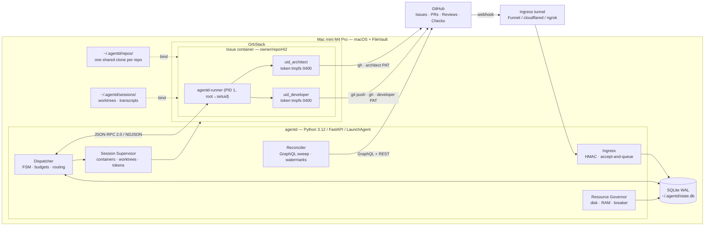
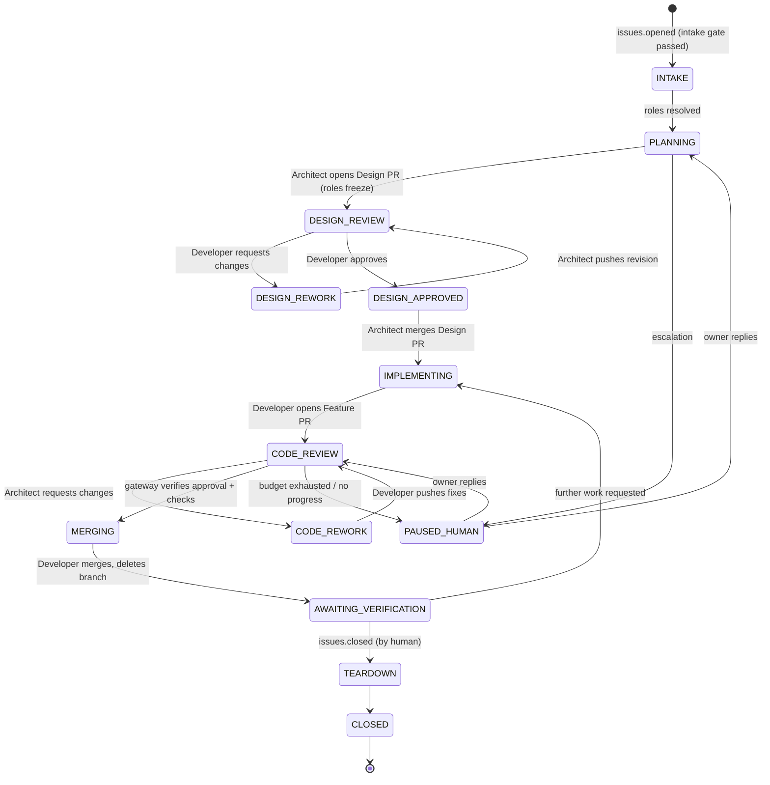
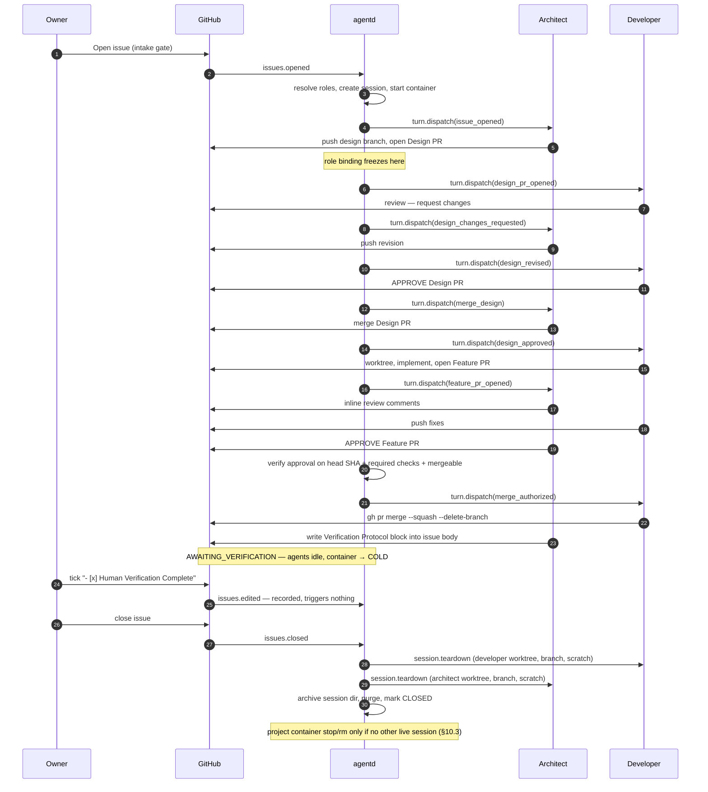

# Unified Technical Design Specification — `agentd`

### Asynchronous Multi-Agent AI Coding System

| | |
|---|---|
| **Status** | Proposed for formal approval (Phase 3 exit) |
| **Version** | 1.39.0 — see [Revision history](#revision-history) |
| **Implements** | [`docs/requirements/SRS_async_multiagent_ai_coding_system.md`](../requirements/SRS_async_multiagent_ai_coding_system.md) **v1.3** |
| **Supersedes** | [`proposals/claude_design_spec.md`](proposals/claude_design_spec.md) (#4) · [`proposals/grok_design_spec.md`](proposals/grok_design_spec.md) (#2) · [`proposals/gemini_design_spec.md`](proposals/gemini_design_spec.md) (#3) |
| **Ref** | Issue #1 |
| **Drafted by** | Claude Agent (`@huozheclaude`), per group assignment |
| **Consensus source** | Issue #1, Rounds 1–5 + owner rulings from `@huozhe` |

### Revision history

Amendments are also marked inline at the point they apply, which is where an implementer will meet them. This table exists so the version number means something.

| Version | Date | Change |
|---|---|---|
| **1.39.0** | 2026-08-27 | **`design_loop.py` is named for one phase of the session and owns all of them** (#159, ADR-39). M3 built the design half there; M4-1 added the code half to the same module and the name stopped being accurate. At `90ccc65` it is **3748 lines**, the largest module by 2.3×, and it owns the design half, the code half, teardown, escalation and the delivery drain — `Store.insert_turn` (`db.py:1086`) has exactly one non-test caller, `_dispatch_turn` (`design_loop.py:1352`), so every turn in the system is created in a file whose name claims one phase. Renamed to `session_loop.py` / `SessionLoop`, logger to `agentd.session_loop`. **Pure rename: no behaviour change**, and no semantic diff beyond the docstring, the logger, and three `log.exception` **messages** that spell the module name (`design_loop.py:426`, `dispatcher.py:77`, `server.py:98`). The logger question the issue left open is settled by measurement rather than taste — **not one documented deploy-verification grep in this repository keys on a logger name**; all six in `docs/ops/live-sign-offs.md` key on message text, the archive cost is bounded by rotation (1 MiB × 5 is the whole retained window), and 14 of 14 module loggers are `agentd.<module>` matching their filename. **The blanket sweep is rejected because it is green when it is wrong**: `sed` over all 374 `src`/`tests` occurrences and 72 spec occurrences passes `pytest`, `lint` and `types` while falsifying four dated records. References are **four classes** — identifiers; colloquial prose invisible to any identifier query (`verify.py:215` documents the **code-half** merge path as *"the design loop"*, #159's defect written as documentation); dated records, **frozen** (53 of 55 `design_loop`-bearing spec lines are revision-history rows or §16 ADR bodies, plus both RFCs and `live-sign-offs.md:158`'s captured log line); and dated citations **inside** the sweep (two test docstrings carrying ADR-30 / ADR-36 acceptance labels, which cannot be frozen under `tests/`, so path is rewritten and line numbers left stale). Two boundaries: never the bare word `design` (17 identifiers spell it about the **Design PR**), and never the bare phrase `design loop` — at `90ccc65` it names the module in all 6 of its `src`/`tests` occurrences and the protocol in all 5 of its `docs` occurrences, so a regex reaching the second renames an M3 milestone and rewrites a captured observation. This ADR adds three further `docs` occurrences describing the module — this row and two lines of ADR-39 — so the post-merge fixed point the implementation is held to is **8**, enumerated in the RFC's §7, not 5. Splitting the module is explicitly out of scope. |
| **1.38.0** | 2026-08-25 | **A `CHANGES_REQUESTED` that replaces an approval paused the session, and the delivery carrying that verdict was 19 ms behind it in the same batch** (#214, ADR-38). Session #57, PR #213: the drain is serialized behind the running turn, so `APPROVED` (02:47:03) and `CHANGES_REQUESTED` (02:49:02) drained together at 02:49:21 in `received_at` order; the older delivery, whose premise the newer one had already withdrawn, read live GitHub state, classified the verdict a **permanent** authorization fault and escalated — then the verdict's own delivery found the session paused and re-deferred **4,466 times over 6h14m**. Not the first instance: #63 (2026-08-18) paused on `DISMISSED` after `dismiss_stale_reviews_on_push`, with `resume=CODE_REWORK` proving the FSM had already moved on. Repair is a third classification, `superseded`, set in `_check_approver_on_head` so both halves inherit it — `CHANGES_REQUESTED`, `DISMISSED`, or an `APPROVED` on a stale head means a later event replaced this delivery's premise and already has its own FSM kind, so **drop the delivery, do not escalate, still do not merge**. Escalation is narrowed to authorization that cannot be *established*: no review from the counterpart, `dirty`, a concluded `failure`, an unresolved thread. The guard must not re-dispatch the rework itself — `delivery_nodes` is checked only by the reconciler, so a synth beside the real delivery makes two turns (#209's shape). `COMMENTED` is also fixed: it is not a verdict and today overrides an `APPROVED`. **Part 2:** `defer` has no clock. Schema v11 adds `deliveries.next_attempt_at` and `defer_count`, `list_deferred` filters on the clock, and the one `DEFER` branch backs off 5→300 s (the reconcile interval) — 4,466 lines become 79, and a parked row stops occupying a head slot in every batch. Not a `parked` status: any unpause path that forgot to un-park would seal the delivery silently. Unpause clears the clock globally, because `deliveries.issue_num` for a PR event is the PR number. Gateway-only; the migration must preserve the ledger. |
| **1.37.1** | 2026-08-25 | **ADR-37's spent-SHA gate is before the FSM, not after** (#211, found reviewing #223). A stale or duplicate head must not run `design_revised` / `feature_revised`. The take path still records P1. The merged-ADR sentence said after; the implementation put it before, which is the safer ordering, and the sentence is corrected in place. |
| **1.37.0** | 2026-08-25 | **A dropped `pull_request.synchronize` has no node id, so the sweep cannot regenerate it, and adopt would skip the review turn** (#211, ADR-37). Observed three times on session #57: `DESIGN_REWORK` stranded 26 minutes (GitHub: *failed to connect to host*); a failed `APPROVED` recovered only because the owner redelivered it; then `CODE_REWORK` lost the Developer's push, the silent-turn guard paused the session, and the later legitimate merge recorded `unauthorized Feature PR merge` because the FSM never reached `MERGING`. Cause is transport (Tailscale funnel), not HMAC or a 4xx. ADR-21 named synchronize as an adopt, which is the wrong half: `_adopt_forward` writes `state` and dispatches nothing, and `fsm.py` has no `DESIGN_REVIEW`+`design_revised` row anyway. Repair is a session head-SHA watermark plus a synthesized `pull_request.synchronize` when live head moves. Watermark advances when `_process_one` takes the event, not when the turn ends. Synth payload carries `pull_request.user.login` (the #209 hole). Unique `delivery_id` `recon:sync:<pr>:<sha>` stops a second pass re-inserting. A duplicate SHA is spent; a payload SHA that is not the forge's live head is spent — hashes are not ordered, so "newer" is not a rule. The live head is the existing ADR-30 (c) GET, grown by one field. Not `check_suite` (also droppable), not hook-redelivery (needs `admin:repo_hook`), not a quiet-pass `PAUSED_HUMAN` (punishes a correct wait). Gateway-only. |
| **1.36.0** | 2026-08-25 | **The identity boundary is an account control, and M4-A's claim is an operator claim** (#57, ADR-36). §5.5 decided the rule; this settles the residue, checked against the tree rather than the issue. **#57's item 2 was never done** — §5.1 still named branch protection as the FR-1.3 enforcement with no mention of §5.5, and no file under `docs/ops/` mentioned it at all — so §5.1 gains the account/operator split inline. **#57's item 3 is redirected**: step 3's *artifact* is sound (review `4913183219` was submitted by the `huozheclaude` account and the ruleset cleared), and what is void is the inference from four account facts to M4-A's operator sentence; a clean redo returns `200`/`APPROVED`/`huozheclaude`, field for field identical to the tainted run, so it would produce a new artifact and no new knowledge. §17's spike row is split — account claim PASS on steps 1, 2 and 4, operator claim NOT ESTABLISHED and false in the only run that exists — and the operator half is held open in `docs/ops/live-sign-offs.md` and discharged on a real Feature PR approval produced by an Architect turn in its own container, not on a hand-run probe. **The repository ships the violation and advertises it as the remedy**: `test_m4a_branch_protection_live.py` acquires both identities' tokens in one process — `os.environ.get(…) or get_password(…)` at `:54` and `:61`, and the `or` matters, since the documented run has `GH_TOKEN` set and `turn.py:310` exports it into every container turn — and posts an `APPROVE` as `huozheclaude` (`:208`), and the runbook's *"Automated re-check"* is that command; `conftest.py:120`'s no-writes guard patches `design_loop.post_issue_comment` only, while the test writes through `httpx` and never imports `design_loop`, so the guard is green while the write happens; CI is safe by a comment (`pr.yml:7`) and the rule does not exempt the owner. The live test therefore loses its Architect half — steps 3 and 4 leave the automated re-check **permanently**, because a test process is one operator and they need two — and since it creates a fresh probe PR every run (`:99`) rather than reusing a standing one, dropping the success merge means cleanup has to be its own `finally`, closing the PR and deleting the ref on the failure path as well. **The credential-read guard first proposed here is withdrawn**, found in the Developer's review to be the same one-function-one-module defect this ADR diagnoses: blind to the env arm, unable to rebind `from agentd.keychain import get_password` (`:29`), and a proxy that the gateway's own dual-reads trip legitimately (`supervisor._load_tokens` `:898–900`; `design_loop` `:1546–1547`, `:632`). It is replaced by an egress guard at `httpx.Client.send` refusing **any** GitHub API request from the test process, reads included, with a named opt-in — route-independent where the withdrawn one was not, and claiming only to stop the class returning silently, since (d) is what removes the hazard. **§5.5.2 gains a format and a place**: the producing `turn_id` in the artifact's own body, cross-checked against the gateway-written `turns` row (`turn_id`/`role`/window) — never `public_actions`, which is agent-authored and would be written by exactly the agent it is meant to catch — with the ledger as the place. Both bounds are stated: the stamp prevents nothing, and §5.5.2's *"cannot be re-checked from the database"* is narrowed to the unstamped case rather than left absolute. |
| **1.35.1** | 2026-08-22 | **Named residual on ADR-35's already-dead path** (#172, found reviewing #199). A CLI that exits on its own leaves its tool subprocesses running, so that path enumerates the group and `SIGKILL`s what remains — but it addresses the group by `proc.pid` **after the leader has been reaped**, and `is_alive()` polls, so the reap usually happened long before. Measured in the image: a zombie leader still answers `getpgid` (`7`), and once reaped the same call raises `ProcessLookupError` — the pid is then free for reuse. A recycled pid that has become a group leader (every `start_new_session=True` spawn is one) would be enumerated and killed as if it were the dead CLI's group. **Two independent bounds, both measured.** Volume: `/proc/sys/kernel/pid_max` in the image is **4194304**, so this needs roughly four million process creations in one container's lifetime. Permission: the signal goes through `_killpg_as_role` **as the role uid**, so it cannot cross to the sibling role whatever the pid did — `killpg` of a uid-1002 group issued as uid 1001 returns EPERM with the target alive, and as uid 1002 returns 0 with the target dead. The reachable victim is a **same-uid** process of the same role. ADR-35's own premise bounding its own blast radius, and the reason enumerated members need no uid filter: the kernel applies one at signal time. Recorded rather than engineered around, because the guard that makes the live path safe — `pgid == proc.pid` verified against a process that still exists — is unavailable here by construction, and "fine because pids do not wrap in practice" is the kind of accident this ADR refused elsewhere. |
| **1.35.0** | 2026-08-22 | **The runner cannot signal the CLIs it spawns, so the turn deadline and `session.teardown` bound nothing** (#172, ADR-35). Measured in a throwaway container from the deployed image with §7.2's flags: pid 1 is root with `CapEff …c9` — `CAP_KILL` is bit 5, absent — and signal permission needs a matching uid or `CAP_KILL`, which uid 0 does not bypass. Root `os.kill` of a uid-1001 child raises EPERM and the child survives; `fork` → `setgid`/`setuid(1001)` → `kill` reaps it `-15`. `_kill_unlocked` clears `self.proc`/`_stdout_q` **before** the attempt and swallows the exception, so the runner forgets a process it did not kill and the next turn spawns a second CLI against the same durable `home/<role>`. **#172's own argument against `CAP_KILL` is wrong** — a uid-1001 child shows `CapEff 0` even with `--cap-add KILL`, since caps clear on the uid transition — but `CAP_KILL` still loses: the image is rebuilt for the bookkeeping either way, so it saves no deploy, and it grants root the right to signal *anything* where a helper that became uid 1001 signals exactly what that role owns. **Three consequences the issue does not reach.** The CLI shares the runner's process group (measured `pgid == 1`), so descendants survive a direct-child kill (grandchild alive, `PPid 1`) — the fix is a group kill, and **an implementer who adds `killpg` without `start_new_session=True` at spawn calls `killpg(1)` and signals the runner**. A group kill leaves zombies whose `/proc/<pid>` still exists with `State: Z`, so #172's "check `/proc/<pid>`" acceptance reads a dead process as alive. And the reaper must not use a blanket `waitpid(-1)`: it would consume the **sibling role's** CLI status and break that role's `Popen`, so reap by scanning `/proc` for untracked `PPid == 1` zombies. **Four corrections from the Developer's review, all measured in the image:** the `waitid` peek this ADR first proposed never reaps — `WNOWAIT` does not consume, so it returns the same child forever while untracked orphans starve (`peeked: [7,7,7,7,7]`, untracked `[9,11]` left); the sibling's `wait()` does **not** raise `ChildProcessError` but returns **0** for a CLI that exited **7**, because CPython treats `ECHILD` as already-reaped — a silent wrong answer, and a wrong test; acceptance (7) as first worded passes with the blanket `waitpid(-1)` it exists to fail, since a *live* child cannot be stolen; and (6) must be scoped to *untracked* zombies, because the direct child is legitimately `Z` until the runner's own `wait()`. Placement of the reaper is load-bearing — a group stays addressable through its zombies, so reaping between the `SIGTERM` and the `SIGKILL` frees the pgid for recycling and the escalation can signal a stranger. Also: the escalation is decided by `proc.poll()` and never by probing the group — a root `killpg(pgid, 0)` does distinguish live (`EPERM`) from gone (`ESRCH`), which is worse than failing, because the sense is inverted and one `except PermissionError` away from reading a live group as dead. ADR-29 (b) is unaffected in purpose — stream freshness comes from the fresh `_stdout_q` — but ADR-29 and RFC-169 both describe it as killing the process, and that wording is corrected. Runner-image deploy: rebuild, `docker rm -f`, verify inside the image, and never ride a gateway-only change. |
| **1.34.2** | 2026-08-22 | **The reason vocabulary had a member the ADR never named, and acceptance (5) tested the wrong arm** (#116, ADR-34). `_probe_attachments` records `probe_error` when the probe *callable* raises, which appears nowhere in this ADR's reason list; and (5)'s "one project's probe failure does not abort the pass" was satisfied by a seam that **returns** a failed `ProbeResult`, which never reaches the `except` — so the only arm that could actually abort a pass was untested, and it is the defensive one. (5) now asserts both arms and (11) covers `no_endpoint`. `probe_error` is unreachable with the default `probe_runner`, which converts every failure into a `ProbeResult`; the branch guards an **injected** seam, which is what (5) is for. Found independently by both agents while the implementation was in review. |
| **1.34.1** | 2026-08-22 | **A rejected bearer is a fifth reason, and it is the one lazy promotion does not repair** (#116, ADR-34, found by the Developer driving the real `agentd_runner.server` in-process). A runner that is alive and initialised but whose stored token is wrong fails `session.attach` with `-32001`, which raises out of `RunnerClient.connect` into the same `except` as a dead socket and logged `unreachable`. The label matters because the repairs differ: `promote_hot` reuses `runners.token`, so the ping fails again inside `_ensure_session_locked`, the adopt branch's `except` runs, and a **healthy** runner holding both roles' conversation is `docker rm -f`'d and recreated. ADR-34's "repairable on demand" is therefore true of every cause except this one, and that sentence is corrected in place rather than left to generalise. Keyed on the **typed code**, never message text (#35), and the code is unambiguous only because the probe's first frame is always the attach — `server.py` also spells `-32001` as "not attached" and as "first frame must be `session.attach`". Acceptance gains (12) and (12b). Also recorded, because M6-3 will otherwise sum it as a scalar: `health.ping`'s `cli_rss_kb` is a **dict keyed by role**, not a number. |
| **1.34.0** | 2026-08-22 | **§11.2 step 7 attaches and records; its "mark COLD" clause is retired, and COLD has to survive GC before anything may write it** (#116, ADR-34). Step 7 was written when `tier` was the promotion trigger; ADR-25 moved that trigger to Docker state plus `initialized`, so the column now has no reader any repair depends on — and one reader that must not see it. `count_hot_sessions` (`db.py:928`) counts `runners` rows `WHERE tier = 'hot'`, and that count *is* §6.6 admission (`supervisor.py:396`, `:741`). Measured: four hot rows count 4; flipping one to `cold` counts 3 with the container untouched — marking a **running** but unserviceable runner COLD frees a 3 GB slot whose RAM is still resident, admitting a fifth container exactly when the host is already unhealthy. The instance that makes this concrete is the **host reboot**: `--restart unless-stopped` brings every container back running with `initialized: false`, so the literal step 7 marks the *whole fleet* COLD on its first pass while every container holds its RAM, and admission then reads zero HOT projects. Re-attachment is therefore a probe and a column: `health.ping` with ADR-25's serviceable test, one shared predicate rather than a second copy of `_runner_reachable` (`design_loop.py:1086`), stamping `runners.last_seen_at` — in the schema since v1 (`db.py:65`), written by `upsert_runner`, **read by nothing**. The reconciler never repairs (promotion is `docker start` + a 30 s `_wait_rpc` + `session.resume` per project, and ADR-23 already bars unbounded work from that thread) and removal never learns about the probe. **The finding that actually blocks the demotion half is in §12.3, not §11.2**: it instructs GC to prune "stopped containers carrying `label=agentd.managed=true`", and a COLD container is exactly that — demotion under that rule is ADR-25's delayed rebuild recreated in a second component. Harmless today only because `_sweep_containers` (`gc.py:389`) reports and removes nothing; the sentence is amended, since the code is currently safer than the document. Demotion stays M6-3, with its reason upgraded from sequencing to a defect: §6.5's "projects beyond `max_hot_containers` are held COLD and promoted on demand" is false in both directions — nothing demotes, and a project that never had a container is refused at create before there is anything to stop — and the two refusal paths disagree, dispatch escalating and spending the delivery after `_DELIVERY_MAX_ATTEMPTS` (`design_loop.py:995`) while intake logs and returns, leaving it `deferred` with no attempt counter and no escalation, re-picked every 5 s forever (`design_loop.py:459`). The LRU trap is named in advance: `last_seen_at` means "last upsert" today and "last probe" after this ADR — neither is activity, which is `turns.ended_at`. **Four corrections from the Developer's review, each changing what gets built:** the probe has **three** causes, not two — `runners.endpoint` is stale across a restart (ADR-25's own longest paragraph), so *running, initialised, unreachable at the stored address* fails at connect with no reply to read `initialized` from, and the reason is derived from **where** the probe failed rather than from a flag; the shared predicate cannot be a `bool`, since this ADR wants the cause *and* the RSS sample out of the reply `_runner_reachable` discards — `probe_runner(row) -> ProbeResult` with `.serviceable`/`.reason`/`.payload`, or an implementer lands a shared boolean plus a second `health.ping` and pays two round trips a pass; acceptance (8) needs a **`gc.py`** change the draft hid behind "that is the whole feature", because `_sweep_containers` drops the labels it already collects; and **ADR-25's "a cache nothing currently writes" is wrong** — `db.py:336` migrates any legacy row with a NULL/empty tier as `'cold'`, which is decision (1)'s failure mode with no demotion writer anywhere, under-counting HOT and losing the `tier == 'hot'` admission exemption. The pre-sign-off query returns nothing on this host, but `runners` is empty here, so that null proves only that the query runs. |
| **1.33.0** | 2026-08-22 | **A quota refusal that lands after real work is invisible, and the delivery pays for it** (#168, ADR-33). `cli_session.py:763` only calls `classify_quota` when the turn produced no assistant text and no tool use, so a session limit hit mid-turn is recorded `failed`; `_process_one` returns early only for `role_busy`/`quota_exhausted`, so `failed` falls through to `set_delivery_status(…, "routed")`, and `routed` is terminal. Live: `t-a2c3e6ebe3ae` (#151) and `t-690b8db01e8b` (#169), both `failed` with the limit copy as their summary and `public_actions=[]`; `classify_quota` returns `quota_exhausted` with a parseable `retry_after` for both strings, and delivery `2e2e5a1e…` is still `routed` today. **#168's premise is corrected**: the gate does not defend #94 B1 — `_LIMIT_PHRASES` does, by excluding bare "quota" and "rate limit". Deleting the condition leaves the whole suite green except `test_claude_quota_with_assistant_text_is_failed`, whose fixture is frame-for-frame the live defect and whose docstring states the false premise; it is replaced, not amended. The whole-string refinement #168 proposes is refused on the ground offered for it. **The real change is one condition and one test**: (c) retryable delivery, (d) the hold, and (e) the unspent turn budget are all already true via the `:1014` early return, and are asserted rather than built. **Corrected in review**: the draft claimed a re-pick under a hold costs only a dict lookup. It does not — the hold is checked at `:1187` inside `_dispatch_turn`, but `_process_one` reaches `_observe_stall_signals` at `:944` first, which for `design_changes_requested` fetches review threads uncached and increments `zero_thread_rounds` and `review_rounds` on every 5 s re-pick. Driven directly, that pauses the session in **~15 s** on `stall: zero thread progress for 3 review rounds` — a §9.3 counter answering a question about the drain, the same shape as #156. New binding (f) consults the hold above the stall observer; marking the delivery `deferred` does not help, since it already is, and `list_deferred` has no backoff. The churn is bounded at three fetches, because the escalation is what ends it. |
| **1.32.1** | 2026-08-22 | **ADR-32 corrected by its own implementation** (#184). Four things the ADR asserts are wrong, each found by running a revert rather than by reading. (i) Acceptance **(3) cannot fail on an inclusive lower bound**: the triggering delivery observing itself is harmless, because the retained trigger term already resets on a progress-kind trigger. What the strict bound protects is a *different* delivery that arrived in the same whole second **before** the turn — queued backlog counted as this turn's work — and that is what the item now asserts. (ii) Acceptance **(7)'s failure mode is unreachable**: `issues`/`closed` returns from `_handle_session_issue_closed` above the FSM and no other webhook kind transitions a live session into `TERMINAL_STATES`, so the post-FSM state is terminal exactly when the pre-FSM state already was; hoisting the gate changes nothing observable. (7) now asserts that a terminal session with **no** `paused_reason` — which never reaches the defer branch — is still stopped by the gate, which does fail if the gate is moved rather than duplicated. (c) stays a second check; only its justification was wrong. (iii) **(d) named the wrong write for TEARDOWN**: `:2775` is a conditional re-assert inside `_run_teardown_turns`; a session *enters* TEARDOWN at the `issues_closed` transition in `_handle_session_issue_closed`, which is where the clear belongs. (iv) The **escalation must stay gated on the counter having moved**: splitting the mode from the message put `breach_message` on the uncountable-status path, where the old early return had protected it, so a session already at the limit re-escalated on a turn that changed nothing. Also **measured**, since the draft note was a worry rather than a number: `deliveries_in_window` is repo-scoped and takes a full table scan (`deliveries` has no index whose leading column is `repo`, and nothing purges the table). On this host — 1,844 deliveries, fifteen days — a real seven-row window costs **0.85 ms** end to end, and the worst historical window, a turn whose `ended_at` landed four days after `started_at`, is 331 rows at **~20 ms**. Against a drain thread that has just been blocked for minutes by the turn itself, neither is worth an index migration. What *is* worth having is not asking: a turn whose status cannot move the counter discards the answer, so the query is skipped for those outright. Separately, and outside ADR-32: `_escalate` falls back to the real `post_issue_comment` with the gateway's Keychain token whenever `post_comment=` is not injected, so three unit tests were posting comments to live issues as `huozhegateway` — the §5.5 rule appearing as a defect. `tests/conftest.py` now fails any test that would post; the assertion is at teardown because `_escalate` swallows the exception, which is why CI never noticed. |
| **1.32.0** | 2026-08-21 | **Both loop-safety questions are asked of the wrong subject** (#156, #147, ADR-32). `observed` (`design_loop.py:1011`) is computed from the delivery that *woke* the turn, so a webhook the turn produced cannot count; ingress is accept-and-queue and writes `deliveries` from the request path, so that webhook is already in the table. `observed` becomes **three terms, widening only** — the trigger kind (retained), FSM state compared across dispatch, or a progress-kind delivery in the turn's window under a **strict** lower bound, since `received_at` and `started_at` are both whole seconds and collide in practice. `public_actions` still never reset (PR #42 B1). The whole post-turn counter write becomes atomic — `turn_count` and `consec_agent_turns` share the same read-modify-write off a snapshot taken at `:497`, so making only `silent_turns` atomic would not deliver the justification. Separately, `paused` (`:603`) is checked and the DEFER branch returns at `:810` before the `TERMINAL_STATES` gate at `:873`, and neither the close (`:2675`) nor the teardown (`:2775`) clears `paused_reason` (cleared only on unpause, `:3093`) — so a session closed while paused re-defers every delivery forever (#147: 5,918 log lines from two ids). **The gate is not moved**: `:855` reassigns `state`, so `:873` deliberately tests the post-transition state and moving it would regress #85; instead the defer branch is gated on liveness as a second check. **Evidence corrected in review**: session #84, named in the draft, has zero `pull_request` deliveries ever, so (a) would not have prevented it — #84 is a different instance of the same wrong subject, reachable only by widening `_OBSERVED_PROGRESS_KINDS`, which is refused. One confirmed live instance supports (a): `t-9e31cfd2f1f1` (#63). **The quiet #147 log is a manual `quarantine_deferred`, not a fix.** |
| **1.31.0** | 2026-08-21 | **ADR-31's `GIT_NO_LAZY_FETCH` scope, and an acceptance item for `--no-checkout`** (#171, #180). 1.30.0 asked for `GIT_NO_LAZY_FETCH=1` on "the gateway's git invocations". Read literally that breaks the loop: `worktree add` on a promisor clone **must** lazy-fetch, because it materialises the blobs the agent is about to edit — `fatal: could not fetch … from promisor remote`, reproduced on a `file://` fixture, where the same command without the guard succeeds. Scoped to the three clone-root maintenance calls (`update-ref`, `read-tree`, `branch -f`) and explicitly never `worktree add`. Found by the implementer running `ensure_shared_clone` against a copy of the live clone; **no fixture caught it**, which is acceptance (3)'s recorded blind spot arriving where that item predicted. Separately, `--no-checkout` had no acceptance item and reverts clean — all fifteen of #180's tests pass without it, because (d)'s `read-tree --empty` empties the index either way and masks it. New item 10 asserts the **missing-object count**, not the index: a clone that checks out materialises every blob and defeats `--filter=blob:none` outright (`missing=0` with a checkout, `missing=5` without). Same failure mode as `read-tree --empty` having had no item until the fifth review round — a binding whose only visible effect is the absence of work needs an assertion about that absence. Live item renumbers to 11. |
| **1.30.0** | 2026-08-21 | **Session worktrees are based on the remote-tracking ref, and the gateway fetches** (#171, ADR-31). Two independent defects: `worktree_add`'s `base_ref` defaults to `HEAD` — the clone's local default branch, which on this host **forked**, no common ancestor, 60 commits down a squashed-away branch — and there is no `git fetch` anywhere in `src/agentd/`. **#171 ranks them backwards.** `origin/<default>` is kept current as a side effect of *agents* fetching inside worktrees, which share the clone's `.git`, so basing on the remote ref alone would have fixed #169 with no gateway fetch; fetching alone updates a ref nothing reads. Live on #169: the architect detected its stale base and reset unprompted, while the Developer reviewed Design PR #170 out of a worktree 67 commits back — the write path fails loudly, the read path silently. (a) resolve the default from `refs/remotes/origin/HEAD`, `rev-parse --verify` it and fall back to **`HEAD`** — a hardcoded `origin/main` fails hard (`fatal: invalid reference`) against a `master`-default repo, which is what `git init` produces here, turning a stale session into a refused one — and pass `--no-track`, since a remote-tracking start point silently sets an upstream that `base_ref=HEAD` never set; (b) `git fetch origin --prune` plus `remote set-head origin --auto` in `ensure_shared_clone`, both with an explicit `timeout=` and `GIT_TERMINAL_PROMPT=0`, because `gitops._git` sets no timeout and the call sits under a single all-projects `admit_lock` where a hang blocks every project's drain; (b′) a failed fetch warns and proceeds, safe only because (a) verifies the ref exists; (c) an existing branch is **never** re-based — it carries the agent's work — and the staleness warning is emitted **above** `_worktree_already_on_branch`'s early return, which is the path live resumes actually take; (d) the clone root's `HEAD` is re-pointed at `origin/<default>` on every fetch with **`update-ref --no-deref`, never `checkout`** — a detached HEAD is a reachability root, so detaching once pins the forked line against ADR-23's gc, and `checkout` on this **promisor** clone (130 objects missing) spawns a lazy fetch as a *child of checkout* that (b)'s `timeout=` cannot reach; the root working tree is abandoned, its index emptied with `read-tree --empty` because a stale index pins the trees it names, and new clones use `--no-checkout` — and the local default is **force-updated**, never `--ff-only` which cannot cross a fork, but **skipped with a WARNING when any worktree has it checked out**: `git branch -f` refuses that, and `_git`'s `check=True` would otherwise refuse the session from inside `admit_lock`. Agents read `main` inside worktrees (`git diff main...HEAD`) because linked worktrees share `refs/heads/*`, so it is a working ref that must be correct rather than an inert artefact. Blocks #173's live sign-off: the clone sits at `85107b4`, four commits behind. Owner review corrected twenty things across five rounds, the last round from a host agent under §5.5.1, including that the fork was hand-repaired on 2026-08-20 and the ADR asserted it in the present tense, that acceptance (1)'s fixture omitted the `git fetch` that makes it fail first, and that (b′)'s "never forked" became false once (a)'s fallback was corrected to `HEAD` — the residual is now stated rather than papered over: this ADR converges on the first successful fetch and claims nothing before it. §6.4's "only agentd runs `git fetch` … agents operate strictly inside their assigned worktree" is amended inline: agents fetch and check out shared refs from their worktrees, so the gateway's exclusivity covers `worktree add/remove` and `gc` only, and ref updates from worktrees are unserialised — which ADR-23's `gc` under `admit_lock` had been assuming. |
| **1.29.0** | 2026-08-21 | **Host-side agent work is governed by protocol, not mechanism** (#57, §5.5). FR-1.3's boundary is mechanical inside a container — Linux, no Keychain, `0400` tmpfs token, `adversarial_token_check` on every create — and absent on the host, where agents run as the operator's user and can read the whole Keychain. Rule: an agent working on the host uses only its own identity's credential, and any artifact attributed to an identity must be produced by that identity's operator. The prohibition covers read-only use too, since the check is one flag away from the act; where such a command is needed the owner runs it. No mechanism is proposed and the reason is recorded, so it is not re-derived as an oversight. **#57's "write it into the turn prompt" is redirected**: `build_prompt` reaches only containerised agents, which are precisely the population that cannot commit the violation, and `_OBLIGATIONS` is keyed by `(role, state)` and prepended to every turn — the rule belongs in this section and in the repo's agent-facing instructions instead. Adds §5.5.1, the conditions under which a host agent may carry an absent role's work under the owner's identity (declare itself; never close a session issue, since the gateway's `sender == owner` test would pass while the rule it encodes fails; never stand in for an identity that is merely vendor-rate-limited, whose GitHub credential still works). §5.5.2 keeps #57's standing point that identity claims must record how the action was produced; #56 step 3 remains outstanding. |
| **1.28.0** | 2026-08-21 | **ADR-30's author drop must not swallow the owner** (#173, ADR-30 (a⁗)). 1.27.0 said "drop when `sender.login` equals the PR's author" and never carved out the owner, because every instance measured on #169 and #63 had an agent as author. `sender == author` is also true when the owner comments on or reviews a PR the owner opened — and the drop sits above `route_for_recipient`, so §9.1 rule 2 (*owner → Route, reset `consec_agent_turns`*) never runs. Found reviewing the implementation (#176), which was faithful to the text: an owner `issue_comment` and an owner `pull_request_review` on an owner-authored PR each dispatched zero turns. Reachable — PR #153 is owner-authored. The §8.5 unpause path was never at risk (session-issue comments carry no `issue.pull_request`), which is precisely why the omission survived: the one owner path a reader checks is the one the bug does not touch. `sender.lower() != owner.lower()` is now a precondition of the drop, stated in §9.1's prose as well, and acceptance gains item (6) asserting both owner events still route. |
| **1.27.0** | 2026-08-20 | **An agent's own PR-scoped events must not route to the counterpart** (#173, ADR-30). A thread reply is wrapped by GitHub in a `pull_request_review` whose `state` is `commented` and whose `body` is `null`; `_event_kind` (`design_loop.py:3232`) recognises only `APPROVED`/`CHANGES_REQUESTED`, so the kind falls through to `_pick_recipient`'s default tail (`:3335`) — *route to the role that is not the sender* — and `route_for_recipient` sees a peer bot and routes, because it is given sender, recipient and body but no event and no PR. Live on #169: nine of 29 turns were the Developer answering an event the Architect authored on its own Design PR #170, 176 s of budget, and §9.3's silent-turn guard escalated twice (17:47:56, 18:00:00), each pause costing an owner round-trip. Rule: drop, per recipient, `pull_request_review` (**any** action — `dismissed` from `dismiss_stale_reviews_on_push` is the same restatement, observed once in #63), `pull_request_review_comment`, and `issue_comment` on a PR, when the sender is that PR's author. Safe because a PR's author cannot approve or request changes on their own PR — 227 review deliveries show author-sent states only ever `commented` or `dismissed` — so no FSM kind is reachable; an author-sent verdict logs WARNING and routes rather than dropping. **`pull_request` is excluded**: `synchronize` is always author-sent and is the rework cue. #173's alternative check — drop empty-body `COMMENTED` reviews — is **rejected**: `design_loop.py:74–79` relies on exactly that review to wake the counterpart's standalone inline comment, whose part event is already terminal. Separately, a PR-scoped event whose PR merged or closed before the delivery drained is spent; it is gated as a **sibling of** the terminal-state gate at `:775` — after the FSM, not with the author rule at `:443` — because all three observed instances are FSM kinds and P1 must still record them, and because the session is `IMPLEMENTING` rather than terminal when they land. §9.3's tracker is unchanged — it was fed garbage, not broken. |
| **1.26.1** | 2026-08-20 | **ADR-29 implementation binding** (#169). The decisions stand; six corrections found placing the code are recorded as an addendum to ADR-29, and the implementation contract — placement, sequencing, and the test plan against acceptance (1)–(8) — moves to [`rfcs/169-adr-29-held-pipe-turn-boundary.md`](rfcs/169-adr-29-held-pipe-turn-boundary.md). Load-bearing among them: **(d) is inert as written and unbounded on a second edge** — `_run_teardown_turns` resets `_delivery_attempts` (`design_loop.py:2664`) before the open-artifact check reaches `_teardown_retry_or_give_up`, so the delivery defers at attempt 1 forever, and the same block re-arms a budget the exhausted path already spent, buying a second `_DELIVERY_MAX_ATTEMPTS` of teardown turns and a second escalation; and acceptance (7)'s live criterion is zero discarded frames of `type == "result"`, since a startup `system`/`init` frame is a legitimate first-drain discard. |
| **1.26.0** | 2026-08-19 | **The held CLI pipe has no turn boundary, so a vendor `result` frame is claimed by whichever turn reads next** (#162, ADR-29). `_claude_turn_unlocked` (`cli_session.py:559`) writes one user message and accepts the first `{"type":"result"}` frame it reads (`:607`) off `_stdout_q` — a queue created once per CLI process (`:321–325`), shared by every turn, never drained between them, and carrying nothing that correlates a frame with a prompt. **#162's own diagnosis is corrected here:** the mis-pairing is not a mis-delivered RPC frame. The wrong content is already in the *runner's* transcript record (`turn.py:504–524`, `"live_session": true`, a field the gateway never writes) under the *correct* `turn_id`, which `exec_turn_as_role` sets from its own params (`turn.py:528`) — so the issue's prescribed echo-and-assert guard would have passed. **Observed:** every architect turn on this host from 15:29:35 onward ran in **0 s** carrying its predecessor's result — six turns across #151 and #158, closing on itself when #151's teardown work was performed correctly and recorded against #158's teardown turn. **The origin is a session-limit refusal, not the gateway restart:** `t-a2c3e6ebe3ae` (#151, `pull_request.opened`, 12:50:29–12:56:09) returned `is_error` "You've hit your session limit · resets 10:10pm (UTC)", and the vendor then emitted the *real* result for the same message after the reset (15:10 PDT), which the next architect turn collected at 15:29:35 — 1 h 39 m **before** the 16:35:45 restart, and unaffected by it, since `ensure_spawned` (`:192`) returns immediately when the CLI is alive. **Only the architect was hit because the sibling adapter already solved this:** `_grok_turn_unlocked` correlates on the ACP `session/prompt` id (`:656`, `:700`) and discards the rest, and `resolve_adapter` maps `architect → claude-code`, `developer → grok-cli` — immunity by protocol, not by luck. **Fix:** drain `_stdout_q` before writing a prompt, logging every discarded frame at WARNING with the turn id (any queued frame is by construction from an earlier exchange, so this both closes the class and makes the next recurrence name its own origin); and respawn the role's CLI after any `is_error` result, because an error frame does not prove the vendor is done with the prompt — keyed on `is_error` and deliberately **not** on quota recognition, since `classify_quota` matches this string but `_claude_turn_unlocked`'s `#94 B1` gate (`:629–632`) suppresses the call for exactly the shape seen here, a limit hit *after* real work. **The respawn re-enters by session id, not by recency:** `_claude_cmd` (`cli_session.py:346`) emits `-c` today, which means "the most recent conversation in the current directory" — and the directory is the shared project root `/srv/agentd` (#25 decision (a)), so once §5.3 lets a second role run claude, `-c` can re-enter the *other* role's conversation, reproducing #162's family as a side effect of fixing it. It now emits `--resume <claude_session_id>` when that id is known (the runner already captures it at `:592`) and `-c` only as fallback — **never a bare `--resume`**, which at claude 2.1.237 opens an interactive picker: on a piped stdin that hangs nothing (B3 already sends stderr to a file, not a PIPE) but costs a turn either way — a fast exit whose stderr tail reads in the log exactly like a real CLI crash, or a spin to `deadline_s` if the picker blocks on stdin instead. `_spawn_unlocked` also gains a post-spawn poll, without which the `-c` fallback cannot exist at all: `Popen` succeeds for a child that dies 50 ms later, so a rejected resume id is invisible until the next write fails inside a turn. The drain must land first: `:592` learns the id from *any* frame carrying `session_id`, so under the off-by-one the id itself was being read off another turn's stream. Two independent repairs ride along, both named as not being the fix: `RunnerClient._id` (`rpc_client.py:39`) becomes process-unique so the mismatch guard at `:109` can fire at all (it has **0** occurrences across every rotated log, because `turn.dispatch` is `id=2` on every connection ever made); and a teardown that leaves open artifacts stops marking its delivery `done` before `_archive_and_close` (`design_loop.py:2257–2260`) — the amplifier that turned one wrong turn into a permanent zombie — and instead defers through `_teardown_retry_or_give_up`, the bounded-retry primitive every other failure edge in that handler already uses. **Out of scope:** extending GC's stale-ledger sweep to `branch` (`gc.py:334`), which caused nothing here and needs `local_branch_gone` semantics `_sweep_ledger` does not have; correcting quota classification of a post-work limit hit; and unsticking #151, which is data repair and `@huozhe`'s call. |
| **1.25.0** | 2026-08-19 | **Model and reasoning effort are configurable per adapter, and recorded (#92, ADR-9 v2).** Each role's CLI ran whatever it defaulted to: nothing in `config.yaml`, the runner contract, or the runner selected one, so the model was invisible to the spec, absent from every archive, and changeable only by editing code or poking CLI state inside the container — where the durable `home/<role>/` bind mount made it silently outlive the container it looked scoped to. `agents.<id>.model` and `agents.<id>.reasoning_effort` are now optional config, threaded to the runner as a fourth `session.init` field beside `roles`, `tokens` and `model_credentials`, and applied by the adapter at spawn — `--model` / `--effort` for claude, `-m` / `--reasoning-effort` for grok. **Keyed by adapter, never by role**: §5.3 lets a role swap adapter, and per ADR-9 the adapter is the only layer that knows what an opaque vendor string means. **Absent ⇒ the CLI's own default**, so an older gateway that omits the field is a valid downgrade and pre-#92 behaviour is unchanged; a *malformed* field is refused rather than silently defaulted, because a typo that quietly runs the wrong model is the whole failure this addresses. Because model and effort are spawn-time flags and `_SESSIONS` caches one CLI process per role for the container's lifetime, a changed value **respawns** that role's CLI (conversation reset, logged) rather than being ignored until the container is replaced. The values in force are echoed back on `session.init` and `health.ping`, and written to `manifest.json` at archive time, so a closed session can answer "what produced this" — `{}` there means every CLI ran its own default, which is an answer, not a gap. **Deploying a change needs `docker rm -f` on the project container**, not just a daemon restart (#64 / #70 / #77). Per-turn selection and any fallback ladder stay out of scope: a fallback would make the question unanswerable again, which is half the reason to do this. |
| **1.24.0** | 2026-08-19 | **ADR-27's in-flight set guards `_dispatch_turn`; it never covered `resume_interrupted_turn`, the other blocking-RPC call site** (#158, ADR-28). `resume_interrupted_turn` (`design_loop.py:1272`) takes its own per-role lock and opens its own `RunnerClient`, exactly like `_dispatch_turn`, but never touches `_inflight_turn_ids` — so while a resume RPC is in flight, the turn is absent from the set and reachable by `_apply_open_turn` on the reconciler's own thread, which takes no lock. ADR-27's own claim ("a live turn is never marked `resuming`, so `resume_interrupted_turn` never runs against one") is correct and unaffected — that closes the *start* of a second resume — but says nothing about the window *while* an already-started resume is executing. **Two paths reach it**, both already possible before ADR-27 and unaffected by it: `too_old`, since `started_at` is the turn's original start and an orphan is old by construction — one resumed near `resume_max_age_s` can cross the bound while its own RPC (`rpc_timeout_s = turn_deadline_s + rpc_timeout_grace_s`, `config.py:85`) is still running; and `not_running`, since `process_resuming_turns` (`design_loop.py:289`) checks session state once, before calling resume, and the state can change mid-RPC. **ADR-27 also made a wrong retire here worse, not just possible:** before ADR-27, the resumed turn's genuine `finish_turn` completion would have silently overwritten a bad retire — self-correcting, if silent. After ADR-27's `ended_at IS NULL` guard, that same completion is discarded and logged instead of applied: the row is now stuck `interrupted` with the retire's reason, permanently, while the agent's work actually landed. **The fix is the same guard, extended to the second call site**, via a shared `_inflight(turn_id)` context manager (`design_loop.py`, beside `_inflight_turn_ids`) used by both `_dispatch_turn` and `resume_interrupted_turn` rather than a second hand-rolled add/discard pair — one call site already went unguarded once. In `resume_interrupted_turn`, the guard opens immediately before the per-role lock (`:1308`) — after the `busy_until`/no-runner early returns, which take no RPC and so were never actually in flight — and wraps everything through the single `finish_turn` call (`:1348`) and the budget update to the function's `return True` (`:1364`); the existing RPC-only `try/except` at `:1309–1343` nests inside it unchanged. No change to `_apply_open_turn`, `NON_RUNNING_STATES`, `resume_max_age_s`, or any of ADR-27's out-of-scope items — this closes a gap inside what ADR-27 already covers, not a new decision. |
| **1.23.0** | 2026-08-19 | **§11.2 step 6's own definition covers a live turn, and nothing before this ADR told the two apart** (#151, ADR-27). "Rows with `started_at` set and `ended_at` NULL" describes an interrupted turn and a turn that is simply still running identically — `_apply_open_turn` (`reconciler.py:330`) had no liveness check on either arm. **Observed both directions on session #63:** five consecutive reconcile passes each marked the one open, healthy turn `resuming` — 100% false positive, 2026-08-18 23:19–23:39 — because the resume arm's only bound, `resume_max_age_s` (3600s), is far longer than this host's actual turn durations (15s–6min). And the retire arm, which has **no age gate at all** (`not_running` short-circuits before `too_old` is ever evaluated), retired two turns that ran to completion during #63's teardown: one 2m49s into a 7m37s run, one **11 seconds** after dispatch. Both evaporated silently — `finish_turn` (`db.py:959`) is an unconditional `UPDATE … WHERE turn_id=?` with no `ended_at` guard, so the turn's own normal completion overwrote the retire's `interrupted` status with `done`, leaving no trace outside the log. **The fix is a third state the row shape cannot express: whether the process that dispatched the turn is still the one reconciling it.** A module-level in-flight set (`design_loop.py`, beside `_role_busy_until`) is populated in `_dispatch_turn` right after `insert_turn`, before the per-role lock, and discarded in a `finally` wrapping both `finish_turn` call sites; `_apply_open_turn` checks it first, above both the retire and resume decisions, so one guard fixes both arms and is correct after a restart by construction — the set is empty exactly when a genuinely interrupted turn must still be caught. `finish_turn` also gains the `ended_at IS NULL` guard `mark_turn_resuming`/`clear_turn_resuming` already use, so a future spurious retire logs instead of self-erasing. `NON_RUNNING_STATES` (`reconciler.py:28`) and `process_resuming_turns`'s matching tuple (`design_loop.py:292`) are commented as a matched pair at both sites — no behavior change; a prior comment thread on the issue nearly edited one side alone, which would have made `resume_attempts` ratchet silently and escalate a healthy `TEARDOWN` into `PAUSED_HUMAN` mid-teardown. An age floor and dropping `TEARDOWN` from `NON_RUNNING_STATES` are both deliberately out of scope — see ADR-27. |
| **1.22.0** | 2026-08-19 | **`blocked` is classified by unresolved review threads before it is classified by checks** (#63, ADR-26). `verify_feature_merge`'s `mergeable_state == "blocked"` branch decided transient-vs-permanent from `required_checks` state alone and never asked *why* the PR was blocked. The two observed stalls (#58 / #62) burned all five `_MERGE_AUTH_MAX_ATTEMPTS` retries on addressed-but-unresolved threads — a cause retrying cannot clear (`required_review_thread_resolution: true`). Those incidents were under an unset `required_checks`. The live host now has `required_checks: [pytest, lint, types]` and a matching `required_status_checks` ruleset rule, so a thread-blocked PR whose checks are already green escalates on the first observation (generic "branch protection or review rule" wording) — #63's headline exit condition is met by configuration for that case. **What this still buys:** (a) naming the thread count so `@huozhe` can act without opening the PR, and (b) `unresolved_count > 0` outranking `checks_pending`, so an in-flight check cannot buy a thread-blocked PR four more retries. A `not wanted` cell stays in the table because `Config.required_checks()` returns `[]` for any repo not listed — that is a cell, not a claim about this host. **The fix reuses a signal already wired for a different purpose:** `fetch_pr_review_threads` (GraphQL `reviewThreads`, #29) already backs the design-half stall signal in `_observe_stall_signals` (§9.3); `verify_feature_merge` now calls it too, but only on the `blocked` branch — never on the `clean` happy path. **Unresolved threads outrank checks:** if the fetch reports `unresolved_count > 0`, the verdict is permanent and the reason names the count, regardless of whether `required_checks` is configured, pending, or empty. Zero unresolved threads falls through to the pre-existing checks-based classification, unchanged. **A failed thread fetch falls through to that same pre-existing classification** rather than inventing a verdict either direction — the same posture `_observe_stall_signals` already takes ("no placeholder hash — would be a blind countdown"). **No `design_loop.py` change:** the `feature_approved_unverified` call site already branches on `check.transient` — `False` already means escalate now, `True` already means defer and retry — so correcting the classification alone is enough, without touching the retry bound (explicitly out of scope per the issue: "do not fold this into a general retry-count increase"). **The escalation text needs no separate change either** — it already interpolates `check.reason` verbatim. **Deliberately out of scope:** the agent resolving its own addressed threads before requesting merge authorization (a runner-prompt change, needs an image rebuild) — session-scoped out because this session also carries the §18 chaos tests (host reboot, then a 30-minute tunnel sever), and a rebuild would recreate the container mid-test and invalidate both; naming individual threads by path/line beyond a count, since `reviewThreads` today returns only `id`/`isResolved` and the issue's own example text asks only for a count. |
| **1.21.0** | 2026-08-19 | **Lazy promotion, so §11.2 step 7 can be built at all** (#116, ADR-25). `promote_hot` has no caller outside a test, and the consequence is worse than the "strands the runner" wording admits: `_ensure_session_locked`'s adopt branch pings a stopped container, the ping raises, and the `except Exception` recreates — `docker rm -f` on the container the demotion was trying to preserve. Everything §6.5 claims for COLD is spent on a full rebuild, so a demotion today is not a saving but a delayed one. **Promotion goes in `ensure_session`, not `_dispatch_turn`**: four paths need a live runner — dispatch, teardown drain, resume-after-pause, create — and all four already pass through it, so wiring the dispatch path alone fixes one of four and leaves the unwatched ones destructive. **The trigger is Docker state, not the `tier` column**, which is a cache in the same sense the `sessions` counters are and which nothing currently writes. **Not-running is only half of it**, and the first draft claimed otherwise: create passes `--restart unless-stopped` (§7.2), so a host reboot or OrbStack restart brings the container back *running* — only `demote_cold` and a deliberate stop stay stopped. The Developer's review caught it, and the case it uncovers is a live defect rather than a missed trigger: after a restart `STATE.initialized` is `False` and the tmpfs is empty, `_runner_reachable` calls `health.ping` and **discards the payload**, so the runner reports reachable, `ensure_session` is never reached, and the turn draws `-32002 session not initialized` — an error nothing in the gateway handles. **Reachability therefore means serviceable, not answering:** ping must return `initialized: true`, a field already in the reply, and running-but-uninitialised and stopped become one failure with one repair (`session.resume`, plus `docker start` only when stopped). **The stored endpoint is stale across a restart** and that detail decides whether the feature works — a published port need not survive stop/start, `promote_hot` already re-reads it, and a promotion reusing `runners.endpoint` would fail its ping, re-enter the same `except`, and delete the container, failing exactly like the bug being fixed. **Promotion is not `docker start`:** §17's M2 residual check records that stop/start empties `/run/agent`, so the `session.resume` is what re-delivers credentials, not housekeeping. **Refusals must propagate** out of the adopt branch rather than be caught into a recreate; today §6.6's admission check happening before the removal saves this by accident. **Image drift is narrowed rather than widened:** adoption takes a running container regardless of image, extending it to stopped containers would widen that, so promotion compares the image and recreates on mismatch — while the running-adopt path keeps its behaviour, since self-replacing containers after a rebuild is a live-system change that deserves its own decision. **Scope is promotion only:** nothing gains the right to demote, `tier='cold'` is still written by nobody, and §6.5's idle trigger has no timer — the deliverable is that writing it becomes safe, with the COLD half landing with M6-3. A sibling session in the same project misses only its own `missed.retired_turns` notice, because tokens are role-scoped and one resume rehydrates the tmpfs for the whole container; no periodic path re-sends it, as the reconciler never calls `session.resume`. |
| **1.20.1** | 2026-08-17 | **ADR-24: the defuse set is repo-wide and not filtered by session state** (#106, #127). Clarification, not a behaviour change — the implementation already did this and the ADR did not say so, which is how the next reader ends up "fixing" it. The set is every issue in this repo with a row in `sessions`, resolved from that table rather than the GitHub label (a label can lag; the table is what the gateway trusts elsewhere). It is **not** filtered by state: §10.3 does not switch off when a session reaches `CLOSED`, so an owner who reopens an archived issue for follow-up must still not have it closed by an agent PR, and including closed sessions costs nothing because re-closing a closed issue is a no-op. It is also **repo-wide**, not this session's own issue — a Feature PR closing *another* session's issue is the same violation, and #106's original text said only `sess.issue_num`, which would have missed it. |
| **1.20.0** | 2026-08-17 | **The closing keyword is defused before the merge is authorised** (#106, ADR-24; owner ruling `@huozhe`). **§8.4 gains a fourth step and §13.1's row is corrected in place** — the Developer's review on #126 caught the ADR describing an amendment §8.4 did not carry, which is #122's lesson twice in three days: an implementer starts at the section, and `design_loop.py`'s merge gate is written to that numbered list. Step 4 is deliberately not symmetric with 1–3: those are observations GitHub's branch protection independently enforces, this is a write the gateway performs because nothing in GitHub enforces it. §13.1 claimed "Agent cannot close an issue — no component calls the close API." True, and wrong: an agent closes a session issue by writing `Closes #N` in a PR body and merging, which calls no close API anywhere. **Twice observed** — #32 (PR #33, `huozheclaude`, 2026-08-10) and #81 (PR #117, `huozhegrok`, 2026-08-15), both one second after merge, both `commit_id: null` — and the second is the one that matters, because it is the Developer closing an issue through the merge authority §8.4 grants it: the ordinary loop working as designed, not a mistake anyone made. **The threat is carelessness, not evasion**, which sets the strength required: both bodies read as ordinary good practice, and §8.4's other three conditions are backed by branch protection while a keyword check has no such backstop, so anything claiming to stop a determined agent would repeat the overclaim this ADR corrects. **§8.4's shape decides where the fix lives** — *the gateway verifies; the agent acts* — so the gateway is upstream of the merge in time and never in its path: it cannot refuse a merge, but it can change the body GitHub reads. Before emitting `merge_authorized` it rewrites a closing keyword aimed at a labelled session issue into a plain reference (`Closes #32` → `Refs #32`), leaves every other character intact, logs it, then authorises; **the PATCH failing refuses the authorization and escalates**, failing closed on the write. Refusing outright was rejected: it spends owner attention on a harmless habit and stalls the loop every time, where a mechanical correction costs nothing — the same trade ADR-17's lowering PATCH already makes on an issue body. Keywords are matched as GitHub matches them (`close/fix/resolve` and their inflections, case-insensitive, against `#N`, `owner/repo#N`, and full URLs), since missing `Fixes` would leave the hole open under a synonym. **Two residuals named rather than implied:** a keyword in a *commit message* still closes the issue and is not rewritten (never observed here; distinguishable at close time by a populated `commit_id`), and an agent editing the body after authorisation defeats this — closing that window would mean re-verifying every `pull_request.edited` in `MERGING` for a threat model that excludes evasion. §10.3's reopen-and-escalate is unchanged and remains the recovery for both; prevention makes it rare, not unnecessary. |
| **1.19.0** | 2026-08-17 | **M6-2: garbage collection, narrowed to what it may safely touch** (ADR-23, and **§12.3 itself is rewritten** rather than merely overridden — the Developer's review on #122 caught the ADR describing an amendment the section did not carry, which is 1.18.0's lesson repeated: an implementer starting at the table of contents builds what §12.3 says). The orphan set-diff is the valuable half; most of what §12.3 lists first is dangerous, worthless, or invisible on the host this runs on — each a measurement, not an opinion. **GC is about correctness, not disk:** 275 GB free against a 15 GB floor, every delivery payload together 3.4 MB, and the largest thing under `~/.agentd` is `projects/<key>/home` at 190 MB, which is §6.3 continuity and not garbage. A perfect pass today reclaims kilobytes; its real job is §19's weakness 7. **"Prune unmanaged stopped containers" is narrowed:** read literally it reaches every stopped container on the host, and this host runs three that are not agentd's (`finanalysis-*`) — the assumption that the machine is agentd's alone appears nowhere in the design. GC inherits ADR-4's rule without exception: `label=agentd.managed=true`, and dangling images only from agentd's own tags, never a bare `docker image prune`. **Payload truncation is removed:** 192 rows qualify for 3.4 MB total, against ADR-21's node-ID backfill reading that column (the v7 → v8 migration existed because it held the only copy) and two hand recoveries of an issue body from it. If disk pressure ever makes this real, archive deliveries out rather than blanking the column. **The archive sweep must enumerate, not glob:** `archive/pr26-demo-residue-20260810162145/` has been immortal since 2026-08-10 because it contains no tarball and no `.tmp`, so neither glob sees it. **Orphans are reported, not removed** (owner decision, `@huozhe`): a ledger/filesystem disagreement does not say which side is wrong, and the first orphan on this host is a `sessions/32/developer/context/` tree recreated twenty-five minutes after that session's verified teardown by a test suite building `DesignLoop` with a bare `Config()` (#121) — a deleting GC would have cleaned up after a broken test and told nobody, turning a leak detector into a leak concealer. Age floors carry over from ADR-20 unchanged. **`git gc` and the walk do not run on the reconciler thread**, which is #117's finding applied before it can recur: GC gets its own hourly timer, the breaker signals it rather than calling it inline, and `git gc` still waits for zero non-terminal sessions under the same lock that admits one. |
| **1.18.0** | 2026-08-15 | **The closed-issue marker re-arms on the reopen event, not on a sweep observation** (#118, ADR-21 amended). 1.16.0 said "an `issue_state == \"open\"` observation clears it", and an implementer builds what that says — the sweep observes, so the sweep clears, and the reset becomes only as reliable as the poll. It is not. Found by running #32's close on 2026-08-14: the owner's ordinary correction — reopen, tick, close — took **47 seconds**, entirely inside one five-minute pass interval, so no pass saw the issue open and `closed_issue_escalated_at` survived the event that was supposed to reset it. Harmless there because the session reached `CLOSED` and left the sweep's scope; damaging on a session that stays live, where a later missed close would find the marker still set and **report nothing at all**. That is the point worth keeping: the failure mode is *silence*, quieter than the five-minute comment flood the marker was introduced to stop (#113) and therefore worse, because a component that logs only its writes cannot be read for what it declined to do. The primary clear moves to the gateway's early `issues.reopened` handler, beside ADR-18's hold lift — same event, same reason, and an event handler cannot be missed by polling. The sweep's open-issue clear stays as the recovery path for a reopen whose webhook was dropped, which is the sweep's entire job; the two are complements in exactly the way ADR-18's lift and the sweep's lift already are. |
| **1.17.0** | 2026-08-14 | **M6-1c: interrupted turns, and the checkpoint that was already on disk** (#81, ADR-22). Steps 6 and 8; closes §11.2's implementation apart from step 7, which belongs to no milestone yet and cannot: `demote_cold` and `promote_hot` both exist on the supervisor but **nothing in the dispatch path calls `promote_hot`**, so a component writing `tier='cold'` today strands the runner it demoted — lazy promotion must be wired into dispatch first, as a gateway-only change that must not ride M6-1c's rebuild. **Step 8's checkpoint claim turns out to be literal:** `_dispatch_turn` writes the turn's digest to `sessions/<issue>/<role>/context/digest-<turn_id>.md` *before* the RPC, so an interrupted turn's declared intent is already on disk beside its worktree — the live fixture's file is still there four days later — and `turn.resume` re-sends a payload that never left rather than reconstructing one. **The work is small and the risk is not:** `turn.resume` is already routed in the deployed image and already sets `resuming=True`, and nothing reads the flag, which is the most misleading state a feature can be in. **Resume is bounded by age:** younger than `resume_max_age_s` (one hour, four times `turn_deadline_s`) resumes; older **retires**, because inside that window the only actor that could have moved the worktree is the crashed turn itself, and §11.1 already concedes that a turn outliving a host boot is one nobody was watching. A session that is not running — `PAUSED_HUMAN`, `TEARDOWN`, `CLOSED` — retires its turns at any age, or the reconciler would drive the very turn ADR-17's hold exists to prevent. **Retire ends the row honestly and charges nothing**: `budget.after_agent_turn()` runs only after a turn returns, so an interrupted turn was never charged, and a retire that "tidies up" by incrementing `turn_count` would have §9.2 counting crashes as turns. The work is not dropped silently because **step 8's other half** — `session.resume` carrying a digest of everything missed, where today it carries only roles, tokens and credentials — is where a retired turn is reported back to the agent that was running it. Resume at most twice, then retire and escalate, on ADR-21's synthesis-cap logic: a turn that kills the runner will kill it again. The runner half is a **prompt contract, not a mechanism** — `resuming=True` instructs the agent to establish actual state from `git status`, `git log`, the worktree and PR state before deciding what remains, because the gateway knows the intent and not what the vendor process had done when the host died. Live fixture and acceptance: `t-bf292cec8404` (#32, developer, open since 2026-08-10, reported by every pass since M6-1a and acted on by none) retires and `open_turns` goes 1 → 0. |
| **1.16.0** | 2026-08-14 | **ADR-21 amended from what building it found** (#81, #113). Four decisions the ADR left implicit, each of which the implementation got wrong first and each caught by review before deploy. **The closed-live escalation fires once per closed-issue episode**, not once per pass: `_escalate` posts and inserts unconditionally, so a per-pass report is an `@owner` comment every five minutes — about 288 a day on #32. The obvious suppressor is ADR-18's own hold, and it is wrong, because §8.5 resume writes `paused_reason=None` and the guard disarms the moment the owner answers — the session then re-pauses before the resumed turn lands, so the owner cannot resume at all while the issue stays closed. The marker needs a durable field of its own, cleared by an `issue_state == "open"` observation so that a reopen followed by a second missed close is a new divergence and gets a new report. **A synthesized delivery is only webhook-shaped if it carries the fields the classifier reads**: `_is_feature_pr` / `_is_design_pr` resolve a PR through `pull_request.head.ref` — mechanically, since a model-written title is not a control-plane signal (§9.1) — so an envelope carrying only `number` classifies a recovered APPROVED review as the fallback `pull_request_review.submitted`, and the delivery drains having moved nothing. The snapshot already holds the PR object; `head.ref` and `title` cost nothing. A review with no `submitted_at` is an unsubmitted draft and must not synthesize. **An issue observed open while `paused_reason` still carries `close-reconcile:` strips the prefix and dispatches nothing** — ADR-18's lift is an *event* handler and `transition()` has no pair for a missed `issues.reopened`, so a hold whose reopen webhook was dropped is a one-way door no later event opens, inside the component whose whole job is dropped webhooks; the sweep is the only thing that can observe "the issue is open" without being told. And **two non-recoveries are named as decisions**: PR-conversation comments are not fetched, and a PR not yet on `sessions.design_pr` / `feature_pr` is invisible to both halves at once — the set-diff has no node to miss and step 4 has no object whose state moved — so a dropped `pull_request.opened` is not recovered in this half. Both follow from issue scope, which is what keeps the sweep one cheap round trip, and both are residuals of **this** half for a later widening of the sweep — not M6-1c's (`turn.resume` plus a runner rebuild) and not M6-2's (§12.3 GC), neither of which has any reason to open a GitHub fetch. |
| **1.15.0** | 2026-08-14 | **M6-1b: the sweep, and the membership set it needs first** (#81, ADR-21). Steps 3–5; steps 6 and 8 split to M6-1c because `turn.resume` needs the runner to stop ignoring `resuming`, which means an image rebuild and `docker rm -f` — a different deploy shape that must not ride along with the largest new API surface in the system. **Step 5's set-diff has nothing to diff against:** `deliveries` is keyed by GitHub's webhook delivery GUID and no node ID has ever been stored, so membership matches nothing and the first sweep would synthesize a `recon:` delivery for every comment, review and PR event on every live session — each draining as an agent turn. A node-ID index comes first, populated at ingest (payloads already carry `node_id`; verified on this host) and **backfilled once** from stored payloads. Synthesis is bounded twice more: only nodes at or after the session's `created_at`, and a per-pass cap (50) logged at WARNING, since a sweep wanting hundreds is reporting a defect. Synthesized deliveries are **webhook-shaped**, translated once in the reconciler, because `_event_kind`, `route_for_recipient`, `build_digest` and every §10.2 handler read that envelope — and teaching them a second shape spreads across exactly the code ADR-15/16/17/19 all touch. Two prohibitions: **no synthesized `issues.edited`** (every restore branch decides from `changes.body.from`, and a snapshot has no before-image), and **the reconciler never writes `verified_at`** (it sees a ticked box, not who ticked it; an owner tick made while the daemon was down therefore reaches close with NULL, which is ADR-17's hold-and-escalate row, costing one re-tick rather than an unattributable verification). Step 4 adopts **forward only** and never into a terminal state: no classify, no teardown, no reopen, because a terminal state from a stale snapshot cannot be revised and teardown is irreversible. #32 forces that rule — closed on GitHub since 2026-08-10 by an agent via a PR closing keyword (#106), session still `IMPLEMENTING` — and the answer is escalate with the evidence, leave the session live. Membership is **per object, not per action** — `issue.node_id` is one ID across opened/labeled/edited/closed, and `pull_request.node_id` one ID from opened through merged (verified on this repo: #32's three `issues` deliveries share an ID, and PR #111's `opened` and `closed` share one). So the set-diff recovers **new objects** while step 4 is the **primary** path for later actions on known ones; a merged Feature PR is not a missing node but a known node whose state moved, and an implementer who reads step 4 as an exotic fallback ships a reconciler that recovers comments and misses every merge. #110's per-pass INFO line is folded in: M6's exit is "account for every delivery", which cannot be read from a component that logs only its writes. |
| **1.14.0** | 2026-08-14 | **M6-1a: the local half of §11.2 scoped, and its steps pinned down** (#81, ADR-20). Split at the issue's own seam — steps 1, 2, 9 (local) before 3–6, 8 (GitHub sweep) — and decided the four things the nine-step list leaves open, each of which has a plausible wrong answer. Step 1 needs no reconciler code at all: `Store.__init__` already runs `PRAGMA integrity_check` and **raises**, so the daemon cannot start on a corrupt file — fail-closed for the whole process, earlier and bluntly. The ADR's first draft had the reconciler run the check and, on failure, log, notify and stop scheduling passes; every line of that is unreachable inside a process whose `Store()` returned, and the Developer caught it on #107 before it shipped. `--dry-run` may report the PRAGMA as a read. The disk breaker stays out either way — the governor clears it above 20 GB free, silently resuming after a signal nobody answered, and halting the drain protects nothing while ingress keeps writing. An orphan container is a **project** with no session outside `CLOSED` — `TEARDOWN` counts as live, since teardown turns run inside that container — guarded by a 10-minute container-age floor (`ensure_session` creates before the row settles) and by any turn with `ended_at IS NULL`. A managed container whose project is live but has no `runners` row is **removed, not adopted**: the per-session bearer token lives in that row and is unrecoverable, so a lazy recreate is cheaper than a row the gateway cannot authenticate against; the mirror, a row with no container, is cleared. The reconciler **nudges** the dispatcher rather than draining, since two drainers over one table is a race for no benefit. `agentctl reconcile --once` waits for the half where re-queueing exists; this half ships a read-only `--dry-run` report. Out of scope and each tempting: FSM derivation, `recon:` synthesis, `turn.resume` (the runner's `resuming` flag is still a no-op alias), COLD demotion (writing `tier` without a promotion path breaks admission), and M6-2's GC. Acceptance fixture is **#32**, which this half deliberately cannot converge — only see and report. |
| **1.13.0** | 2026-08-14 | **The mirror: re-read the body rather than reverse the ruling** (#96, ADR-19, owner ruling `@huozhe`). An agent untick whose ADR-16 restore has not drained, plus a close, recorded `ABANDONED` on a session the owner verified. The recommended fix — make `verified_at` the verdict, since only an owner tick writes it and only an owner untick clears it — was **declined**: it reverses the 2026-08-07 ruling and would record `VERIFIED` while the box on screen is unticked, which is what makes the checkbox a thing the owner reads on GitHub rather than a thing the daemon believes about them. Decided instead: keep the checkbox as authority, change only when it is read. Body not ticked **and** `verified_at` set at close → hold for ADR-17's same 15-minute grace, then **re-read the issue** and classify from that body (up → `VERIFIED`, down → `ABANDONED`); a failed read classifies from the payload as today. `verified_at` is the trigger for the re-read, never the verdict — both conditions must still hold, so §13.1 is unchanged in both directions. A grace window alone could not work here, unlike ADR-17: there the missing fact was in the database and a later delivery filled it in, while here the payload froze the body and no wait changes a payload. Bounded exception, accepted knowingly: the body read is up to 15 minutes after the close, but it cannot revise a classification, cannot run after teardown, cannot demote `VERIFIED`, and cannot promote without a pre-close owner tick on record. The hold applies only when `verified_at` is set and the box is down, so ordinary abandons are untouched. **A reopen inside either window cancels the close**: the re-read also reads `state`, and an open issue means `done` with nothing classified, nothing torn down, and — amending ADR-17 — no escalation and no hold either, since ADR-18's lift event has already passed by then. Without it ADR-19 would tear down worktrees under an owner who reopened and went back to work. Free: `get_issue_body` already GETs the whole issue and discards all but `body`. Rejected: fail closed and classify anyway — teardown is unrecoverable, while waiting costs one more click from someone who has shown they are not finished. §10.2 also gains **withdrawal by deletion**: an owner edit leaving no checkbox inside the sentinels clears `verified_at`, as an untick does — otherwise a deleted box left the record standing and ADR-16 would permit a restore to raise a checkbox the owner removed. Rejected: escalate instead of classifying (spends owner attention on a harmless-direction failure and holds an unarchived session each time); leave as is. |
| **1.12.0** | 2026-08-13 | **The close-reconcile hold is scoped to the closed issue** (#98, ADR-18). ADR-17 named the second `issues.closed` as the hold's only exit, which is right for the owner who reopens to tick and wrong for the owner who reopens because the work needs more work — that owner had no path back short of editing `paused_reason` by hand, and there is no `agentctl` command for it. An `issues.reopened` now strips the `close-reconcile:` prefix, marks the delivery `done`, and **dispatches nothing** — strip and return, never strip and fall through, since that event is exactly ADR-17's B1 trap. **It gets an early handler above the paused defer, joining `issues.closed` and `issues.edited`**: §9.1 rule 4 defers every non-owner event while paused and returns before both hold gates, so a lift placed on the post-FSM gate could never fire for an agent reopen — the hold would stay on a live issue and the owner's reply would still no-op, which is the residual this rule exists to close. A deferred reopen is also worse than useless: it stays queued and can drain as a turn if the session is unpaused another way (two `issue_comment` deliveries have sat on #84 by that mechanism since 2026-08-13). Rejected: a routing exception feeding the hold gate — two mechanisms for one event. The session stays `PAUSED_HUMAN` with its escalation open and `resume_state` intact, so the next owner reply resumes through §8.5's ordinary path; the prefix is stripped rather than the column cleared, as hygiene (the resume digest prefers the open escalation's own reason). The reopen is the right discriminator because it removes both conditions the hold protects at once — the issue is live again, and the divergence is already discharged: the box was lowered, so a later close classifies `ABANDONED` unless the owner ticks, and ADR-16 refuses any agent raise. **Any** reopen lifts it: the first draft said owner-only for symmetry with §10.2/§10.3, but that left a non-owner reopen with a live issue and a hold still on, which is #98's stuck owner by another door. Safety does not rest on the sender — §9.1 rule 4 defers every non-owner event while paused, so an agent reopen buys the agent no turn. The escalation's *what a reply does* text now states both paths instead of "a reply changes nothing". Rejected: an `agentctl` release command (documents the trap instead of removing it, and moves an owner act off GitHub); and having the reopen resume outright (would dispatch on the next peer-bot event before the owner has said which thing they meant). Residual: an owner who ticks while the issue is still closed sets `verified_at` with no close to classify it — named, and left to #81's sweep. |
| **1.11.0** | 2026-08-13 | **A ticked body with no observed owner tick does not classify** (#90, ADR-17). ADR-16 gates the restore path; `_owner_close_teardown` still classifies from the closed payload's body alone, so any tick that reaches the body by an unguarded route is still accepted as authority at close. New third row in §10.3: ticked body with `sessions.verified_at IS NULL` classifies nothing, tears down nothing, and escalates. Two mechanisms make that decision survivable. **Grace:** deliveries drain in `received_at` order, so a late `issues.edited` (6m17s observed 2026-08-12) would make the naive check escalate honest tick-then-close sessions — the close stays `deferred` until `now - deliveries.received_at` exceeds 15 minutes, read from the durable column rather than the in-memory attempt counter, which is attempt-based and resets on restart. **Lower the box:** the refusal alone leaves a false tick on a closed issue, needs two owner edits to clear, and re-escalates on every re-close; a lowering PATCH cannot forge (ADR-16), so the gateway composes one against a fresh read and the remedy becomes reopen → tick → close. **The pause is a hold, not a §8.5 question** (PR #95 review): an owner reply on a paused session dispatches a turn today — #85's gate reads the *session* state, and `PAUSED_HUMAN` is not terminal — and so does the remedy's own `issues.reopened`, which routes as an owner event and matches no transition. A `close-reconcile:` marker on the existing `paused_reason` column blocks every ordinary dispatch and the reply-resume; `issues.edited` and `issues.closed` run above pause gating and are the only exits, so the second close ends the hold. The escalation carries its own *what a reply does* text, the later close closes the escalation row on every path, and an ignored escalation is named for what it is: a closed issue with a live session, unarchived, holding open ledger rows until #81 exists. Rejected: `ABANDONED` + teardown (permanent, and the same race would abandon honest sessions); reopen (contradicts §10.3, and the lowered box already gives a one-action remedy); classify `VERIFIED` and warn (the hole, with a log line). Owner item, not decided here: the mirror — `verified_at` set with an unticked body records `ABANDONED` on a verified session, and reversing it touches the 2026-08-07 ordering ruling. |
| **1.10.0** | 2026-08-13 | **Vendor quota refusal is not a failed turn** (#86, ADR-9). Live on #84: Claude `is_error` + `"You've hit your session limit · resets 9:30am (UTC)"` became `status=failed`, the delivery was `routed`, and `turn_count`/`consec_agent_turns` were charged for a turn the model never saw. Adapter (only) recognises vendor copy and returns `quota_exhausted` with best-effort `retry_after`. Gateway defers the delivery, holds the role via `_role_busy_until` (same in-memory gate as #34 timeout), and does not count budget. Unknown runner statuses degrade to `failed`. Not an escalation — one WARNING with the reset time. Gate is forgotten on daemon restart; `retry_after` does not schedule (host sleep on #84 meant the turn ran hours after reset). |
| **1.9.0** | 2026-08-13 | **No ordinary turn on a terminal session; gateway comments do not wake agents** (#85). `_process_one` dispatched any routed event, including `issue_comment` on `CLOSED`/`TEARDOWN`. Live on #49 six minutes after a clean teardown: one Developer turn, `sessions/49/` recreated, ledger still 0. Gate is immediately after the FSM block and before stall observation (P1: late events are still recorded; a late `changes_requested` on an `ABANDONED` close must not escalate a `CLOSED` row back to `PAUSED_HUMAN`). Not inside `_dispatch_turn` (teardown turns run while the session is `TEARDOWN`). `_escalate` itself refuses a `CLOSED` session (TEARDOWN may still escalate when retries exhaust). Delivery is `done`, not `dropped`. `issues.reopened` still processes. Same family: `_restore_agent_verification_edit`'s warning (and the close completion summary) now carry `<!-- agentd:gateway session=… -->`; `route_for_recipient` drops that marker the way it drops `agentd:escalation`. Broad marker, not per-kind: the gateway is not an agent, and no comment it authors should drive a turn. Escalation keeps its own marker so §8.5 owner-unpause is unchanged. |
| **1.8.0** | 2026-08-13 | **No restore may raise the checkbox without `verified_at`** (#89, ADR-16). #65's `was is True and now is False` branch treated `changes.body.from` as proof an *owner* tick was present and composed `checked=True`. Provenance was never established: an agent tick moments earlier produces the same `was=True`. Live on session #84 (gateway `d576107`, ADR-15 already deployed): `@huozhegrok` ticked then unticked; ADR-15 correctly aborted the first delivery (`payload now=True current=False`); the second delivery restored the tick up. `verified_at` stayed NULL; `classify_at_close` would still have recorded `VERIFIED`. The neighbouring spellings are the same forge: B4 (`was=True, now=None`) *inserts* a ticked line when the agent deletes rather than unticks; B2 re-splices a ticked `prev_block` when the agent deletes the whole block. New rule: a composition that raises the checkbox needs an owner tick this gateway observed (`sessions.verified_at` set, written only on `is_owner and not is_agent`); a composition that lowers or preserves it never does. Restore-up and B4 refuse and leave the body. B2 refuses the raise and reinserts the block unchecked — leaving no block would classify `ABANDONED` and drop the Architect's steps. Log the refusal with the branch name. Cost of the reversal: a genuine owner tick whose `issues.edited` delivery was dropped now costs one owner re-tick, instead of a silent false `VERIFIED`. B3/B5, B4-with-`was=False`, B2-with-an-unticked-block, and ADR-15's guards are unchanged. Close-time reconcile (ticked body + NULL `verified_at` must not classify `VERIFIED`) is defence in depth and a follow-up (#90). |
| **1.7.0** | 2026-08-13 | **Verification-block restore composes against a fresh read** (#84, ADR-15). `_restore_agent_verification_edit` (#65) decided *and* composed from the same webhook payload; nothing checked whether the issue had moved on by drain time. Live on session #49: a corrupting `-f`-vs-`-F` `gh api` edit was hand-corrected within seconds, but the gateway drained the corrupting delivery afterward and PATCHed a reconstructed block onto the 25-character wreck, destroying the issue body (recovered by hand from the delivery's stored payload). Fix, layered onto #65's unchanged branch-selection logic: fetch the current body only once a branch other than the no-op is selected (zero extra cost on plain step-refinements); abort if the checkbox has moved since this delivery's own webhook (one equality check covers both an owner tick and an owner untick landing in the window, since the discriminator is "did anything change," not "which direction"); compose the selected branch against the fresh body so an already-self-corrected issue reduces to a no-op; escalate instead of restoring when the current body has collapsed below half its predecessor's length, since a stale-read fix alone does not stop a restore from writing onto damage that is still the latest reality. |
| **1.6.0** | 2026-08-13 | **`agentctl review-stats` decided** (#49, ADR-14). #49's coalescing mechanism (PR #52) is code-complete; the outstanding checklist item is re-measuring turns-per-review rather than hand-writing a `SELECT`. Groups inline comments to their parent review via `comment.pull_request_review_id` (no linkage exists for thread-resolve events, so those are reported at session level instead of guessed into a review's count); session membership is `deliveries.repo` + `issue_num IN (sessions.issue_num, design_pr, feature_pr)`, since review traffic lands on the PR and `deliveries.issue_num` is the webhook's own issue-or-PR number, not the session issue (revised in review: the initial draft's `issue_num = sessions.issue_num` would have dropped all review traffic). Two separate grains: per-review `turns_woken`/`turns_empty` via the `turns.delivery_id` join is the coalescing check; session-wide `totals: {turns, empty}` via `turns.session_key` (no review join) is the #47-baseline comparison. `unmatched_inline_comments` reports comments whose review never emitted `review.submitted`. No new schema — decompresses `deliveries.payload` at query time. JSON output, `--session` optional, a `sessions` array always, following `write-verification`'s session resolution and `status`/`sessions`'s output convention. |
| **1.5.0** | 2026-08-13 | **Archive excludes role `home/`, `xdg/`, `tmp/` by filter** (#74). ADR-12 claimed those paths were outside the session tree so no filter was needed. Live #47/#67 tarballs contained `sessions/<issue>/<role>/{xdg,home,tmp}` because the runner puts XDG vars and a HOME fallback there. Filter those three at `<issue>/<role>/…`; transcript, context, scratch, and `manifest.json` stay. Durable project `home/`, `repo/`, `state.db`, and `config.yaml` remain excluded by construction. `tmp/` CLI logs are debug output, not audit trail. Existing #47/#67 archives are not rewritten (no credential was present). |
| **1.4.0** | 2026-08-12 | **Each role tears down its own worktree, branch, and scratch** (#68). §10.5 step 1 previously assigned *all* worktrees/branches to the Developer; step 2 gave the Architect only scratch. Live #47 left the Architect worktree and branch open because neither obligation named them as owned. Owner decision: each role removes its own worktree, branch, and scratch directory; both run `git worktree prune`. Order stays Developer then Architect for determinism, not dependency. Sequence in §8.2 updated to match. |
| **1.3.0** | 2026-08-12 | **`agentctl version` decided** (#58, ADR-13). M4-4's live end-to-end demonstration of the code loop (§21 M4 exit) needs a deliberately tiny Feature PR so the exercised behaviour is the loop's mechanics, not a design debate. Prints the installed `agentd` distribution version via stdlib `importlib.metadata.version("agentd")` (no dependency, no `pyproject.toml` path guess between editable and installed layouts); dispatches before `load_config()` so the command needs no configured host; bare string to stdout, not JSON, since it is a single value meant for direct interpolation rather than a script-parsed status report. |
| **1.2.0** | 2026-08-11 | **Session archive format & retention decided** (#47, ADR-12). §6.2/§10.5/§12.3 had asserted `tar.zst` and "30-day retention" since 1.0.0 without ever deciding either, and `<session_key>.tar.zst` was never a legal filename. Format is `tar.gz` (stdlib `tarfile`, no native dependency — same reasoning §15.1 already applied to reject `zstd` for the delivery-payload column); path is `archive/<owner>__<repo>/<issue_num>.tar.gz`; contents and exclusions are fully enumerated; retention is a config default (`retention.archive_days`, §5.4) enforced by a plain `mtime` sweep (plus stale-`.tmp` reclaim), deliberately outside the `artifacts` ledger. Revised in review: §10.5 step 3 now normatively orders archive-and-purge *before* the `CLOSED` flip (ADR-12's ledger rationale depends on that order, restated once there rather than independently in three places); step 3 no longer implies a per-issue container stop, which contradicted §10.3/ADR-4 under project-scoped runners; manifest `closed_at` is defined as archive-write wall-clock rather than a nonexistent `sessions` column. |
| **1.1.2** | 2026-08-08 | **Three identities + classic PATs** (M3-A). §5.1 / A2: Architect, Developer, and **gateway** (`huozhegateway`) machine users; classic `repo` PATs (fine-grained impossible on private personal repos); FR-1.3 boundary enforced by code paths and branch protection, not token scope. §9.1: gateway-authored / `agentd:escalation` comments drop for every recipient. |
| **1.1.1** | 2026-08-07 | **Runner-owned long-lived CLI per role** (#25). A6 / §7.3 / §14.2 / §14.5 wording aligned with §6.3 (process liveness fast path): privilege drop at session spawn, `turn.dispatch` multiplexes over a held pipe with per-turn deadline, oneshot `-p` remains the recovery path. Cwd decision (a): spawn at project root; worktree named per turn. |
| **1.1.0** | 2026-08-07 | **Container unit: issue → project** (ADR-4). Session directories nest under the project (§6.2); process liveness becomes the fast path and persistence the recovery path (§6.3); tiers and memory budget are per project (§6.5, §6.6); model-provider credential delivery and the never-copy rule (§5.2); cross-issue exposure and injection persistence (§13.2); ADR-3 clarified as being about *gateway*-held stdio. Owner decision on #19; implementation #20. |
| **1.0.0** | 2026-08-02 | Approved via #1. Amendments for M0, M1, M2 (×2) and M3 subsequently landed **against 1.0.0 without a version bump** — recorded here rather than retrofitted, since they are marked inline and reassigning versions after the fact would misstate what was approved when. |

Going forward: an amendment that changes an ADR or a section's contract bumps the minor version; a correction that clarifies without changing behaviour does not.

---

## 0. How This Document Was Produced

Three agents wrote independent blind drafts, cross-reviewed each other's pull requests, and then argued for five rounds on Issue #1. This document is the result. It is **not** any one draft with the others folded in — several sections replace what the drafter originally proposed, because the drafter lost the argument.

Every section carries provenance in §1.2. Decisions that were contested carry an ADR in §16 recording the rejected alternative and why it was rejected, including the alternatives this document's author originally argued for.

Two decisions were made by the repository owner (`@huozhe`) and are not open to agent revision: the gateway implementation language, and who closes an issue. One of the owner's rulings required amending the SRS rather than the design; that amendment is in this PR.

### 0.1 Reading Guide

- **Shape of the system:** §2–§4
- **The three claims the design rests on:** §5.2 (credential isolation), §6.3 (zero cold start), §11.2 (reconciliation)
- **Requirement coverage:** §15 traceability matrix
- **Contested choices:** §16 ADRs
- **What is not yet proven:** §17 open spikes, §19 known weaknesses

---

## 1. Design Principles and Provenance

### 1.1 Principles

| # | Principle | Consequence |
|---|---|---|
| P1 | **GitHub holds truth; local state is derived** | SQLite corruption or loss is recoverable by re-reading GitHub, not by repair |
| P2 | **Roles are data; identities are credentials** | Swapping Architect↔Developer is a config edit, never a code change |
| P3 | **Privilege separation over agent obedience** | Security comes from what a token *can* do, not from what a prompt *asks* an agent to do |
| P4 | **Every side effect is idempotent and fingerprinted** | Webhook redelivery, gateway restarts, and reconciliation are all safe |
| P5 | **Fail toward the human** | Ambiguity, budget exhaustion, and resource exhaustion all terminate in an `@owner` mention, never a silent stall |
| P6 | **The daemon owns infrastructure; agents own content** | Agents never call the Docker API, never manage the shared clone, never mint credentials |
| P7 | **Ingress never returns 5xx for a downstream condition** | GitHub does not retry failed repository webhook deliveries, so back-pressure must never reach GitHub |
| P8 | **Turns are serialized per session — and, under project scope, per (project, role)** | Eliminates the entire class of concurrent-git and concurrent-review hazards. The second clause is an ADR-4 amendment: one CLI conversation per role now spans a project's issues, so two concurrently-active issues would otherwise interleave turns into a single conversation |

### 1.2 Section Provenance

| Section | Source | Note |
|---|---|---|
| §4 Ingress, accept-and-queue | Claude #4 ADR-8 | Grok and Gemini both conceded their 503 behaviour |
| §4.1 Pluggable ingress backend | Grok #2 (E8) | Replaces Claude's Tailscale-as-architecture |
| §5.2 Credential delivery | Claude R4 → Grok R5 | Grok's host-mounted token files replaced; see ADR-6 |
| §5.3 Role binding precedence | Grok #2 §3.2 + Claude #4 §5.3 | Independent convergence |
| §5.3 Role freeze at Design PR open | Grok #2 §3.2 → narrowed in PR #5 review | Third position: later than Claude's session-creation freeze, earlier than Grok's design-freeze. See §5.3 |
| §6 Session model, zero cold start | Claude #4 §6 | Gemini #3 §2.2 supplied the clearest statement of the requirement |
| §6.4 Git layer | Claude #4 §6.4 | Replaces Grok's per-issue shallow clone |
| §7 Container topology | **Claude R2 middle path**, adopted by Grok R4 + Gemini R3 | Neither the original Claude nor original Grok/Gemini topology |
| §8.3 Design PR merge actor | **Grok #2 (E1)** | Resolves ambiguity Claude left open |
| §8.4 Merge gate | Claude #4 §8.3 + Grok req 4 | |
| §9 Loop prevention routing | Claude #4 §9 | Replaces Gemini's drop-all-bot-events |
| §9.3 Fingerprint composition | **Grok R4** | Replaces Claude's weaker `last_comment_body_sha` |
| §10 Verification block | Claude #4 §10 | |
| §10.3 Closure model | **`@huozhe` ruling** | Overrules the unanimous agent vote for orchestrator-close |
| §11.1 Host boot | **`@huozhe` ruling** → SRS v1.3 | |
| §11.2 Reconciliation sweep | **Gemini #3 §5.2** (GraphQL) + Claude #4 §11.2 (watermarks) + Grok E5 (`turn.resume`) | Three-way composite |
| §12 Resource governance | Grok #2 §9.3 + Claude #4 §12 | |
| §13 Threat model | Claude R5 + Grok R4 | |
| §14 Agent Session Protocol | Claude #4 §14 + Grok #2 §2.3 | Independent convergence on JSON-RPC 2.0 |
| §18 Testing strategy | **Grok #2 §14** | Claude had none |
| §20 Setup runbook | **Grok #2 §13** | Claude had none |
| §17 Assumptions table format | **Grok #2 §0** | |
| §12.4 FSM mirrored to labels | **Grok #2 §12** | Claude had no equivalent |

---

## 2. Assumptions

| # | Assumption | If wrong |
|---|---|---|
| A1 | OrbStack is installed, healthy, and set to start at login | Gateway retries until the Docker socket appears; no design change |
| A2 | Three GitHub machine users exist (Architect, Developer, gateway) with classic `repo` PATs and collaborator access on target repos | Auth module swaps token source; §5 unchanged in shape |
| A3 | The owner can configure repository webhooks and branch protection | Without branch protection, FR-1.3 is untestable and M4 cannot pass |
| A4 | `/Users` is shared into containers by OrbStack (default) | Mount root becomes configurable; §6.4 relative worktree paths already remove the path-equality dependency |
| A5 | Container-internal `tmpfs` enforces UID ownership and mode | **Load-bearing.** Falsified ⇒ fall back to two containers (ADR-4 fallback). **Spike M2-B** (M2-A is the separate host-bind expected-fail test) |
| A6 | Each vendor agent CLI can run headless, non-interactively, and accept sequential turns over a long-lived stdio session (or one-shot `-p` as recovery) | Adapter owns the protocol; **process liveness is the fast path** (§6.3). Our `transcript.jsonl` + vendor session store + `-c` / ACP re-entry is the recovery path when the process dies (ADR-9 — vendor resume is an optimization, not a dependency) |
| A7 | The `~/.agentd` volume has ≥ 50 GB free at install | Circuit breaker trips immediately and the system refuses work — loudly, which is correct |

---

## 3. System Architecture



### 3.1 Component Responsibilities

| Component | Owns | Explicitly does not own |
|---|---|---|
| **Ingress** | HMAC verification, durable delivery persistence, sub-50 ms 200 | Any filtering or business decision |
| **Dispatcher** | Normalize → route → FSM transition → dispatch turn | Docker, GitHub writes |
| **Session Supervisor** | Container lifecycle, worktree provisioning, token delivery | Deciding *when* a session acts |
| **Reconciler** | Rebuilding derived state from GitHub, synthesizing missed deliveries | Repairing agent-internal state |
| **Resource Governor** | Disk/RAM sampling, breaker, admission control, GC | Killing in-flight turns |
| **`agentd-runner`** (in container) | RPC endpoint, privilege drop, transcript append, turn deadline | Container lifecycle, the sibling role's credentials |
| **Agent CLI** | Reasoning, GitHub actions under its own identity | Everything else |

---

## 4. Ingress

### 4.1 Transport

The tunnel is a **pluggable backend**, not architecture: Tailscale Funnel (default — stable public HTTPS hostname, no domain purchase, no other ports open), `cloudflared`, `ngrok`, or `smee`. Configured by `ingress.backend`.

The choice is deliberately low-stakes. Because the Reconciler (§11.2) independently sweeps GitHub on a timer, **a tunnel outage degrades latency, not correctness.**

### 4.2 Webhook Handling Contract

```
POST /webhooks/github
  1. Read body, 2 MiB cap.
  2. Verify X-Hub-Signature-256 (HMAC-SHA256, constant-time). Mismatch → 401, no persistence.
  3. INSERT OR IGNORE INTO deliveries(delivery_id = X-GitHub-Delivery, ..., status='queued').
  4. Return 200. Median target < 50 ms.
  5. Nudge the dispatcher. If the nudge channel is full, do nothing — the dispatcher's
     own scan of status='queued' will collect it.
```

Steps 3–4 are P7. GitHub does **not** automatically retry failed repository webhook deliveries — a failed delivery is recorded and must be redelivered manually via the UI or redelivery API. Returning 5xx is therefore equivalent to data loss, and it loses data precisely during the incidents the circuit breaker exists to handle. Every downstream failure — dispatcher crash, container failure, breaker open — leaves the delivery durably queued.

Subscribed events: `issues`, `issue_comment`, `pull_request`, `pull_request_review`, `pull_request_review_comment`, `check_suite`, `status`, `push`.

### 4.3 Intake Gating

```yaml
intake:
  mode: label            # label | all
  label: agentd
  actors: collaborators  # only issues opened by repo collaborators are ingested
```

`mode: label` is the default so a repository does not start spending model tokens on every issue filed. `actors: collaborators` is baseline rather than deferred hardening: it costs one permission check and closes the FR-3.3 escalation-spam vector on any repository that accepts outside issues.

**Session creation eligibility (M3 / #16).** A `sessions` row is created only from an **intake-passing `issues` open/reopen/labeled event**. Deliveries parked as `deferred` (other event types, or historical traffic from before the design loop existed) must not conjure sessions on their own — they may only attach to a session that already exists. Ingress still accept-and-queues everything (P7); the gate is on *promotion*, not on persistence. Historical backlogs may be moved to a terminal status via `agentctl quarantine-deferred` before enabling the design loop on a host that already held M1 deferred rows.

---

## 5. Identity, Credentials & Role Binding

### 5.1 Accounts

Three GitHub **machine user accounts**, each a collaborator on the target repositories, each holding a PAT stored in the **macOS Keychain** and read by the gateway only:

| Role | Example login | Keychain account | Purpose |
|---|---|---|---|
| Architect | `@huozheclaude` | `claude-bot` | Agent turns, Design PR open/merge, reviews as Architect |
| Developer | `@huozhegrok` | `grok-bot` | Agent turns, Design PR review/approval, implementation |
| **Gateway** | `@huozhegateway` | `gateway` | §8.5 escalation comments only — not agent turns |

Machine users rather than a GitHub App, because SRS §2 requires the identity string used in communications and webhook filtering to match a registered GitHub **username**; App bots surface as `app-name[bot]`. See ADR-7.

**Credential shape (honest, 2026-08-08).** On a **private repository owned by a personal account**, fine-grained PATs cannot target that repository from a collaborator identity, and personal repos have **no collaborator roles** (every collaborator has push). So all three tokens are **classic PATs with the `repo` scope** — account-wide, not per-repository. Token scope therefore **does not** enforce the FR-1.3 boundary; branch protection and the gateway's narrow write surface (escalation comments only) do. **Both are account controls (#57, ADR-36):** they bind *which account* approves, pushes or merges, and nothing about *which operator* drives an account. In a container the second gap is closed mechanically — the other role's credential is unreachable by construction (§5.2) — and on the host it is closed by protocol only (§5.5). M4-A remains the demonstration that the **account** boundary holds; the operator half is not a claim GitHub's record can settle, and §17's spike row says which half its evidence carries. Blast radius is bounded by *collaborations*: keep each machine user a collaborator only on repos that need it.

```bash
security add-generic-password -s agentd -a claude-bot -w <pat>
security add-generic-password -s agentd -a grok-bot -w <pat>
security add-generic-password -s agentd -a gateway -w <pat>
```

The gateway identity exists so §8.5 can speak without (a) unpausing itself as `owner_reply`, (b) failing to notify the owner of their own @-mention, or (c) resetting `consec_agent_turns` as owner traffic. It must appear in `bot_logins` so §9.1 never classifies it as a human collaborator.

### 5.2 Credential Delivery — the mechanism FR-1.3 rests on

This is the most consequential mechanism in the document, and it is the one that changed most during review.

**Constraint discovered in review:** POSIX ownership does **not** survive the macOS→Linux bind-mount boundary. macOS UIDs have no meaning in the container's user namespace, so OrbStack UID-maps bind-mounted files and in-container `chown` on them does not reliably persist. Any scheme that provisions `0400` token files on the host and mounts them in provides **no isolation at all**.

The general form of this constraint governs what may live where:

| Location | UID/mode enforceable | Contents |
|---|---|---|
| Host bind mount (`worktrees/`, `transcript.jsonl`, `context/`, `scratch/`) | **No** — both role UIDs can read everything | Code, transcripts, scratch |
| Container-internal `tmpfs` | **Yes** — created by a Linux process in the namespace that owns it | **Credentials only** |

**Mechanism.** Tokens are delivered over the already-authenticated control channel in the `session.init` call (and again on `session.resume`). The in-container root supervisor writes them to container-internal tmpfs before dropping privilege:

```
--tmpfs /run/agent:rw,noexec,nosuid,size=1m,mode=0711

  /run/agent/architect/token   mode 0400  owner uid_architect
  /run/agent/developer/token   mode 0400  owner uid_developer
```

Consequences: no token material on the host filesystem, in the image, in `docker inspect`, or in Time Machine; ownership is real because it is created inside the namespace that enforces it; and tokens vanish when the container stops.

**Model-provider credentials (project-scope amendment).** The mechanism above governs **GitHub PATs**. Model-provider credentials are a different shape — they are subscription login state, not immutable API keys, and they are **provisioned manually, up front** rather than derived at session create. The granularity differs by vendor and the difference matters when setting a host up: Claude's is minted **once for the host** and reused across projects; Grok's is minted **once per (project, role)**. Evidence for every clause below is on spike #19.

| | Claude | Grok |
|---|---|---|
| Credential | one-year token from `claude setup-token` | OIDC login state |
| Stored | Keychain `agentd/claude-oauth-token` | durable per-role `HOME` in the project tree (§6.2) |
| Delivered | env `CLAUDE_CODE_OAUTH_TOKEN` at process start | the role's own `HOME`, mounted |
| Minted by | owner, **once for the host** — `claude setup-token` yields one account-wide token, reused across projects | `grok login --device-auth`, **once per (project, role)** |

**Never copy a credential file.** This is the rule the spike was run to establish, and both halves were demonstrated:

- The on-disk `~/.claude/.credentials.json` was **stale** (expired) while the live credential sat in the macOS Keychain — so copying that file authenticates nothing.
- Refresh tokens **rotate**. A container refreshing from a copied chain invalidated the host's, logging the host CLI out. Two containers sharing one chain fight; last refresh wins and the others die.

What makes this safe is that the container unit and the credential unit now agree (ADR-4): each (project, role) owns its own chain, nothing is shared and nothing is copied, so no broker, no host refresh-owner, and no cross-container file locking is required. Independence was verified — three concurrent chains (two roles plus the host) each survived a forced refresh of the others.

Two properties to hold when implementing: select the credential by **adapter**, not by role, or §5.3's `role/architect:grok` override silently delivers the wrong provider's token; and note that a subscription credential is **account-wide**, unlike a repo-scoped PAT, so although it is exposed no more widely than the PATs already are (§13.2), its blast radius is larger.

**The boundary this creates is precise, and the ADR states it plainly: the two-UID split protects _credentials_, not _data_.** Both roles can read each other's worktrees and transcripts. That is accepted — both roles are already trusted with the repository. What must not cross is the ability of the Developer identity to produce an approval that branch protection accepts on its own PR.

**Identity preflight (added M0 — see ADR-11 at end of §16).** Cross-role isolation inside the container does not stop an operator from mapping the *wrong* PAT to a role in config/Keychain. A wrong-identity token silently defeats §9.1 (owner login resets turn budgets), §10.2 (owner-only checkbox), and §8.4 (Architect approval). On every `session.init` and `session.resume`, **before any turn is dispatched**, the runner calls `GET /user` with each delivered token and asserts `login == the configured GitHub identity for that role`. Mismatch ⇒ fail the session loudly, escalate to `@owner` (§8.5), dispatch nothing.

**Inbound detection net:** the gateway rejects and escalates any event where `sender.login == config.gateway.owner` **and** the body carries an `agentd:turn` provenance footer — a combination that is impossible under correct operation and is the signature of an agent acting with the owner token.

**Model credentials (subscription, #19/#20) — separate from GitHub PATs.**

| Provider | Delivery | Storage |
|---|---|---|
| **Claude** | Env `CLAUDE_CODE_OAUTH_TOKEN` at container create (from Keychain `agentd` / `claude-oauth-token`, minted via `claude setup-token`) | Not a file copy of interactive Keychain / `.credentials.json` |
| **Grok** | Durable `projects/<owner>__<repo>/home/<role>/` with independent `grok login --device-auth` (Option D) | Never copy host `~/.grok/auth.json` into N places |

Provision **both** providers per project; select by **adapter** at turn time so §5.3's `role/architect:grok` override does not require a re-mint. See `docs/ops/project-onboarding.md`.

### 5.3 Role Binding (FR-1.2)

Precedence, highest first:

```
issue label  >  <repo>/.agentd/config.yaml  >  ~/.agentd/config.yaml
```

Per-issue override uses labels so the binding is visible on the issue itself:

```
role/architect:grok        role/developer:claude
```

**Binding freezes when the Architect opens the Design PR** — the `PLANNING` → `DESIGN_REVIEW` transition. The resolved binding is written to the session row and `roles_locked` is set at that moment.

This is narrower than the position originally locked in review ("at design freeze", i.e. when the Design PR merges), and it is narrower for a reason found during review of this PR: between Design PR *open* and Design PR *merge* the Developer is actively reviewing, so a label edit in that window would re-resolve roles and invalidate both the Architect's in-progress PR and the Developer's review context. Freezing at the first `turn.dispatch` instead — the other proposal — overshoots in the opposite direction, closing the window within seconds of the issue opening.

Opening the Design PR is the right boundary because it is the last moment before any peer-review context exists, while still leaving the whole RFC-drafting turn (tens of seconds to minutes) available for a human to correct a mislabelled role.

**Adapter swap and long-lived CLI (#25).** Changing a role's adapter (label override or config) while a project runner is HOT kills that role's held CLI process and starts the new adapter. The vendor conversation for the prior adapter is discarded — deliberate: one process cannot speak two protocols. Cross-issue context for that role is then rebuilt from `transcript.jsonl` / vendor store on the recovery path (§14.5), not carried across the adapter boundary.

### 5.4 Configuration

```yaml
# ~/.agentd/config.yaml
host:
  root: ~/.agentd
  disk_floor_gb: 15
  disk_resume_gb: 20
gateway:
  listen: 127.0.0.1:8787
  owner: huozhe
  # Per-turn liveness pair (#34): RPC socket timeout must outlive the deadline
  # sent to the runner. rpc_timeout_s = turn_deadline_s + rpc_timeout_grace_s.
  turn_deadline_s: 900
  rpc_timeout_grace_s: 60
ingress:
  backend: tailscale-funnel     # | cloudflared | ngrok | smee

agents:
  claude:
    login: claude-bot           # must equal the GitHub username (SRS §2)
    adapter: claude-code
    credential: keychain://agentd/claude-bot
  grok:
    login: grok-bot
    adapter: grok-cli
    credential: keychain://agentd/grok-bot

repos:
  huozhe/code-workflow:
    default_roles: { architect: claude, developer: grok }
    merge: { method: squash, delete_branch: true }
    required_checks: [ "ci/test" ]

budgets:
  max_turns_per_issue: 40
  max_consecutive_agent_turns: 30   # raised from 12 on M4-4 (#58) evidence: a full
                                    # design+code loop is ~13 uninterrupted agent turns
  max_review_rounds: 6
  min_dispatch_interval: 10s
  fingerprint_repeat_limit: 3
  zero_thread_rounds_limit: 3
  silent_turn_limit: 3          # #39: consecutive turns with no public_actions

resources:
  max_hot_containers: 4
  session_memory: 3g
  session_cpus: 2
  idle_cold_after: 30m
  awaiting_verification_container_ttl: 7d

retention:
  archive_days: 30          # §10.5 / §12.3 / ADR-12

intake:
  mode: label
  label: agentd
  actors: collaborators
```

### 5.5 Host-Side Agent Work (#57)

FR-1.3's identity boundary is enforced two different ways, and conflating them is what made #57 read as a security gap when it is a collaboration protocol.

**In a container it is mechanical, and needs no rule.** Containers are Linux: the macOS Keychain is unreachable by construction — no `security` binary, no Keychain daemon, no mount. A role's credential arrives only at `/run/agent/<role>/token` (tmpfs, `0400`, owned by the role UID, §5.2), and `assert_bearer_not_readable_by_roles` and `adversarial_token_check` run on **every** container create. A containerised agent cannot use another identity's credential, so nothing has to ask it not to.

**On the host it is a protocol, because no mechanism is proposed.** Agents doing dev, testing, review or verification on the host run as the operator's user and can read the whole Keychain. The rule:

> **An agent working on the host uses only its own identity's credential. Any artifact attributed to an identity — a commit, a push, a review, an approval, a merge, an issue close — must be produced by that identity's operator.**

The prohibition is on **producing an artifact** under another identity, and it extends to read-only use: an agent does not invoke another identity's token to check something either, because the check is one flag away from the act. Where such a command is genuinely needed, **the owner runs it**, which is what the interactive `!` prefix is for.

*Recorded because a rule that exempts its author is worth nothing:* on 2026-08-20 the Architect ran `GH_TOKEN=$(gh auth token --user huozhe) gh api user --jq .login` to confirm the shape of an approval command before handing it to `@huozhe`. Read-only, no artifact, at the owner's request — and under this rule it should have been the owner's command. The approval itself was correctly left to `@huozhe`.

**No mechanism is proposed, deliberately.** A process that can read the Keychain can read all of it; separate macOS accounts or a token broker cost more than the risk warrants for host-side dev. This is stated so it is not re-derived as an oversight.

**#57's "put it in the turn prompt" is redirected, and the reason is the reader.** `build_prompt` (`turn.py:216`) reaches **only** containerised agents — precisely the population that cannot commit this violation. `_OBLIGATIONS` (`turn.py:133`) is keyed by `(role, session_state)` and is explicitly "keep short — prepended every turn", so a standing, state-independent rule does not belong there either. The agents that *can* violate this never read that prompt: they read the repository's own instruction files. **The rule therefore lands in this section and in the repository's own `CLAUDE.md`** — added by this change, since none existed — **not in the runner prompt.** `CLAUDE.md` is loaded into every host-side agent session in this working tree, which is exactly the population the rule binds. Adding it to `_OBLIGATIONS` would cost a line of every container turn to tell the wrong audience.

#### 5.5.1 A host agent standing in for an absent role

When a vendor quota or outage makes a role's agent unavailable, its work may be carried by a host-side agent under **the owner's** identity, subject to three conditions:

1. **It declares itself.** Every artifact it authors says so in its body — the identity is `@huozhe`, the author is an agent. GitHub records the identity, never the credential's operator, so the declaration is the only durable trace.
2. **It never closes a session issue.** §10.3 reserves that to the human owner, and the gateway's check is `sender == owner` — an agent wearing that identity satisfies the mechanical test while defeating the rule it encodes. Closure is a judgement about whether the work is verified, and it stays with the human.
3. **It does not stand in for the identity that is merely rate-limited.** A machine user's GitHub credential usually still works when its *vendor* quota is exhausted; using it anyway would make the audit trail assert that an agent acted which did not.

Two-party review is unaffected and is what makes the arrangement safe: `main`'s ruleset requires one approving review with `require_last_push_approval` and no bypass actors (§13), so the stand-in and the remaining agent still review each other's work, and neither can author and unblock the same PR.

#### 5.5.2 Demonstrations that turn on which identity acted

Where a live demonstration's claim *is* an identity claim — "the Developer could not approve its own PR" — record **how the action was produced**, not only that it happened. GitHub logs the identity, not the operator, so an **unstamped** artifact of this class cannot be re-checked from the database afterwards; the stamp defined below is what makes part of it checkable, and the two paragraphs after it say exactly how much. #55's spurious approval was caught only because the Architect noticed a review under its own name that it had not written. **#56's step 3 is settled by ADR-36 rather than re-run**, as the next paragraph sets out.

**#56's step 3 is redirected rather than re-run (ADR-36).** Its artifact is not void: review `4913183219` really was submitted by the `huozheclaude` account and the ruleset really did clear. What is void is the inference from those four wire rows to M4-A's sentence, which is an operator claim. A clean redo returns the same three values — `200`, `APPROVED`, `huozheclaude` — in a record with no field for who held the credential, so the redo produces a new artifact and no new knowledge. The record, not the redo, is what discharges the claim.

**The record has a format and a place.** An artifact whose claim is an identity claim carries its producing `turn_id` **in its own body** — the review body, the PR body, the comment body — which GitHub stores verbatim and serves for as long as the artifact exists. It is checkable against `turns` (`db.py:110`), whose `turn_id`, `role`, `started_at` and `ended_at` are written by the **gateway** and not by the agent, so a stamped artifact makes three independent conditions re-checkable: the turn exists, its `role` is the role the artifact claims, and the artifact's timestamp falls inside the turn's window. For a containerised turn that closes to near proof, since such a turn cannot have held the other credential at all (§5.2). The place a held-open identity acceptance waits is `docs/ops/live-sign-offs.md`, whose stated criterion — an acceptance no fixture can reach — is exactly this one.

**Two bounds, because a record that oversells itself is worse than none.** The stamp *prevents* nothing: a host agent under a borrowed credential can write any string into a body, and a determined one can name a real turn of the right role whose window contains its artifact. It converts an unfalsifiable claim into a three-condition one in a table the agent does not write, and that is the whole of the gain — §5.5's refusal of a preventive mechanism is unamended. And this is why the opening paragraph scopes *"cannot be re-checked from the database"* to the **unstamped** case instead of stating it flat: a stamped artifact can be re-checked, partly, and what remains genuinely uncheckable is the original case — an unstamped host artifact under a borrowed credential. Saying which is which keeps this from being read as licence to skip the record because nothing could verify it anyway.

**`turns.public_actions` is not the record, and the difference is load-bearing.** It is the obvious place to look and it is agent-authored: *"public_actions are claims (tool_use) — diagnostic, not a reset"* (`session_loop.py:1123`), *"same untrusted source as advisory `status`"* (`loop_safety.py:68`). An agent that would misuse a credential would also write that row. Only the gateway-written columns are worth cross-checking, which is why the stamp is checked against `role` and the turn window and against nothing the agent supplied.

---

## 6. Session Model & Zero Cold Starts

### 6.1 Identity and Scope

```
session_key  = "<owner>/<repo>#<issue_number>"   # agentd issue session (FSM, budgets)
project_key  = "<owner>/<repo>"                   # container / runner unit (#20)
```

One **agentd session** per issue (SRS §2). One **project runner** (container) per repo, living for the project's lifetime, holding one long-lived CLI conversation per role shared across issues in that project (#19 / #20).

**A session is not a container (project-scope amendment).** The container unit is the **project**, not the issue — see ADR-4. One project container hosts every session for that repository, so `sessions : runner` is N:1 rather than 1:1. Session identity, the §8.1 state machine, and §9's budgets and stall signals all remain **per issue** and are unaffected; only the process and filesystem substrate is shared.

### 6.2 Host Layout

**Project-scope amendment.** Session directories nest **under the project** rather than sitting flat. A project container mounts exactly one directory — its own project tree — and nothing else. The flat `sessions/<owner>__<repo>__42/` layout had no directory containing exactly one project's sessions, so a project container would have had to mount `sessions/` and thereby expose *every* project to *every* container: the same failure as the M2 W2 finding, where mounting a parent that contained more than intended re-exposed credentials.

```
~/.agentd/
├── state.db                                 # SQLite, WAL — NEVER mounted (W2)
├── config.yaml                              #             — NEVER mounted (W2)
├── projects/<owner>__<repo>/                # ← the single mount for this project's container
│   ├── repo/                                # ONE clone per repo, gateway-owned, gc.auto=0
│   ├── sessions/42/
│   │   ├── architect/{transcript.jsonl,context/,scratch/,worktrees/}
│   │   └── developer/{transcript.jsonl,context/,scratch/,worktrees/}
│   └── home/{architect,developer}/          # durable per-role HOME + auth chain (§5.2)
└── archive/<owner>__<repo>/<issue_num>.tar.gz   # post-teardown; format & retention: ADR-12
```

The container mounts `projects/<owner>__<repo>` at `/srv/agentd`, and **that single mount is what preserves the M2 W1 fix**: `repo/` and `sessions/` stay siblings under one parent, so `worktree.useRelativePaths` gitdirs resolve to the same relative depth on host and container. Splitting them into separate mounts flattens the topology differently on each side and breaks `git` inside the worktree. Keep `assert_worktree_usable` (both role UIDs) and `assert_host_secrets_not_mounted` (an **allowlist** of `repo` + `sessions` + `home`, never a denylist) running on every container create — those two assertions are what caught W1 and prevented W2 from recurring.

### 6.3 The Three Cold-Start Costs

SRS §2 prohibits three distinct costs. Each needs its own mechanism; conflating them is how a design ends up asserting zero cold start rather than achieving it.

| Prohibited cost | Mechanism |
|---|---|
| **Re-cloning the repository** | One shared clone per repo. Sessions get `git worktree add`, which is O(working tree) and shares the object store. A new branch workspace costs ~1 s. |
| **Re-ingesting the codebase** | The working tree and all tool caches (`node_modules`, language-server indexes) persist on the host volume across every container tier, including a fully stopped container. |
| **Losing conversation state** | `transcript.jsonl` is appended after every turn and is the authoritative record. The agent process may exit; the conversation does not. |

The third was originally stated as: *continuity is achieved by persistence, not by process liveness* — on the grounds that an always-attached process is fragile and holds RAM hostage.

**Project-scope amendment: process liveness is the fast path, persistence is the recovery path.** Both survive; only their ranking changed. `agentd-runner` (PID 1, inside the container) spawns one CLI process per role and owns its stdio for the life of the project, because the vendor CLIs carry conversational state that a fresh process per turn discards. When that process dies — crash, `docker stop`, host reboot — continuity falls back to exactly the original mechanism: the CLI's own session store plus `transcript.jsonl`, re-entered with `claude -c` / `grok -c`.

The two objections to an always-attached process were tested rather than assumed (spike #19):

- *"one crash loses everything"* — it does not. `docker stop` → `start` → `-c` restored conversational context on both CLIs. The persistence layer is still there underneath.
- *"it holds RAM hostage"* — measured idle RSS after a turn is ~246 MB (claude) and ~70 MB (grok), so ~316 MB for both held. Against the 3 GB per-container cap in §6.6 that is not a constraint.

Persistence therefore still permits the tiering in §6.5; it is simply no longer the *first* mechanism reached for.

### 6.4 Git Layer

**Invariant:** only `agentd` runs `git fetch`, `git worktree add/remove`, and `git gc` on the shared clone, serialized by a per-repo mutex. Agents operate strictly inside their assigned worktree. `gc.auto=0` is set; maintenance runs only when a repo has zero active sessions. This removes the only genuinely unsafe concurrent git operation while leaving the safe ones (object writes, per-branch ref updates) unrestricted.

**Amended 1.30.0 (ADR-31, #171): the exclusivity claim was never true of `fetch`, and is not true of ref updates.** Agents run `git fetch` inside their worktrees — a linked worktree shares the clone's `.git`, so those fetches update the shared remote-tracking refs, and ADR-31's ranking argument depends on exactly that. Agents also *read* `refs/heads/*` (`git diff main...HEAD`, `git log main`) and can *check out* a shared branch (`git switch main`) from inside a worktree; ADR-31 (d)'s skip-with-WARNING path exists precisely because they do. **The invariant that holds is narrower:** only agentd runs `git worktree add/remove` and `git gc`, serialized by the per-repo mutex. `git fetch` and ref updates from worktrees are **unserialised** and concurrent with the gateway's — so "per-branch ref updates" above is describing what is *unrestricted*, not what is *safe*. This matters beyond wording: ADR-23's `gc` runs under `admit_lock` (`gc.py:291`, `:380`) on the strength of this paragraph, and it races agent fetches that nothing records.

**Worktree paths are relative.** The base image pins git ≥ 2.48 and the shared clone sets `worktree.useRelativePaths = true`, so worktrees do not encode absolute paths and host/container path equality is not load-bearing. Path-identical bind mounts remain documented as the fallback for older git.

**Runbook consequence that survives either mechanism: do not rename the Mac user account.** Doing so invalidates every mount path in flight.

### 6.5 Container Lifecycle

| Tier | Mechanism | RAM | Resume | Trigger |
|---|---|---|---|---|
| **HOT** | running project runner, RPC attached | ≤ 3 GB | 0 | active turn on any issue in the project |
| **COLD** | `docker stop` | **0** | 2–5 s | idle > 30 min, or admission pressure |

Tiering is **per project**, not per issue. Issue close does **not** stop the container (§10.3) — only worktrees/branches/scratch for that issue are removed. A `docker pause` ("WARM") tier must never be cited as a memory saving.

COLD: no re-clone, no re-ingest, no lost role conversation — process restart reloads CLI session store + transcripts (`-c` / ACP resume).

**Project-scope amendment: tiers apply to projects, not issues.** Stopping a container stops work on every issue in that project, so demotion is driven by project-level idleness rather than per-issue activity. Admission (`max_hot_containers`) counts projects. Note that §6.5's cap must be enforced on **promotion** as well as creation — promotion is the normal route to HOT under this model, so a cap checked only at create does not bound anything.

### 6.6 Memory Budget

**Project-scope amendment.** The unit is a project container holding **two** long-lived CLI processes (one per role), not an issue container holding one at a time.

| Consumer | Reserved |
|---|---|
| macOS + user applications | ~7.0 GB |
| OrbStack VM base | ~1.5 GB |
| `agentd` (Python/FastAPI) + tunnel client | ~0.2 GB |
| 4 HOT **project** containers @ 3 GB cap | 12.0 GB |
| **Total** | **~20.7 GB** |
| **Headroom** | **~3.3 GB** |

Typical working set is 1–2 GB; 3 GB is a hard `--memory` cap. Both role CLIs are now resident simultaneously rather than one at a time, but measured idle RSS is ~246 MB (claude) + ~70 MB (grok) ≈ **316 MB**, so holding both costs about a tenth of the cap and the reservation is unchanged. P8 still serializes *turns*; what it no longer implies is that only one CLI is *resident*.

The reservation is also now per **project** rather than per issue, which is strictly cheaper: a project with twelve open issues consumes one container's budget instead of twelve. Projects beyond `max_hot_containers` are held COLD and promoted on demand; concurrency is bounded by disk, not RAM. **Not yet true, and ADR-34 records why rather than leaving it aspirational:** nothing demotes, so no slot is ever freed, and a project that has never had a container cannot be held COLD at all — it is refused at create, before there is anything to stop. Until M6-3 supplies a demotion writer, the cap is a wall rather than a rotation.

---

## 7. Container Definition

### 7.1 Image

```
agentd/session-runner:<v>
  debian:bookworm-slim
  + git ≥ 2.48, gh, ripgrep, fd, build-essential
  + node LTS, python3
  + agent CLI adapters (claude-code, grok-cli, …)
  + agentd-runner  (static supervisor, PID 1)
  + users: uid_architect(1001), uid_developer(1002)
  - NO setuid binaries
```

`agentd-runner` is the stable contract; vendor CLIs are replaceable adapters behind it.

### 7.2 Run Configuration

```bash
docker run -d \
  --name agentd-huozhe-code-workflow-42 \
  --label agentd.managed=true \
  --label agentd.session='huozhe/code-workflow#42' \
  --restart unless-stopped \
  --memory 3g --memory-swap 3g --cpus 2 --pids-limit 1024 \
  --cap-drop ALL \
  --cap-add CHOWN --cap-add FOWNER --cap-add SETUID --cap-add SETGID \
  --security-opt no-new-privileges \
  --tmpfs /run/agent:rw,noexec,nosuid,size=1m,mode=0711 \
  -v ~/.agentd/repos:/srv/agentd/repos \
  -v ~/.agentd/sessions/huozhe__code-workflow__42:/srv/agentd/sessions/huozhe__code-workflow__42 \
  -e AGENTD_SESSION_DIR=/srv/agentd/sessions/huozhe__code-workflow__42 \
  agentd/session-runner:1.1.0
```

Non-obvious choices:

- **No `/var/run/docker.sock`. Ever.** Mounting it would grant host root and the sibling role's credentials, dissolving every boundary in §13.
- `--restart unless-stopped` lets containers survive an OrbStack or host restart on their own; the Reconciler then adopts or prunes them by label. This is the container half of NFR-1.1a.
- The tmpfs at `mode=0711` lets each role traverse to its own token directory without listing the sibling's.
- **Single project mount (W1/W2, #20).** Mount exactly `projects/<owner>__<repo>` → `/srv/agentd` so `repo/`, `sessions/`, and `home/` are siblings (W1 relative gitdirs). Do **not** mount the whole `~/.agentd` root — that exposes `state.db` / `config.yaml` (W2 / R1).
- **Capabilities (M2 amendment).** `--cap-drop ALL` alone makes `chown` and `setuid` return EPERM even for UID 0 under OrbStack/Linux, which makes §5.2 token placement and §7.3 privilege drop impossible. Re-add only `CHOWN`, `FOWNER`, `SETUID`, `SETGID`. No `SYS_ADMIN`, no `NET_ADMIN`, no docker socket.
- **RPC bearer delivery (M2 amendment, R1).** The bearer is **not** in container env (`docker inspect`) and **not** on a bind mount (roles can read all bind-mounted files — §5.2 table). Sequence: `docker create` → `docker cp` host-minted bearer to container-local `/etc/agentd/rpc.bearer` (root-owned `0400`, real Linux DAC) → `docker start`. Runner refuses to bind if the file is missing. Assert both: absent from inspect Env, and unreadable as either role UID.
- Egress is unrestricted by default (GitHub, model APIs, package registries). An allowlisting egress proxy is noted in §13.3 as hardening, not baseline.

### 7.3 Privilege Model

```
PID 1  agentd-runner (root)
   │   - binds RPC endpoint
   │   - receives tokens via session.init, writes /run/agent/<role>/token
   │   - owns stdio of one long-lived CLI child per role (§6.3 / #25)
   │   - NEVER executes agent or tool code as root
   └── per role (session.init / resume, and on crash respawn):
         Popen(user=uid_<role>, group=uid_<role>, extra_groups=[], start_new_session=True)
         (ADR-35: own process group, so the kill path can signal the group)
         cwd = project root (/srv/agentd); worktree path is named per turn
         env: HOME=<durable project home>/<role>  (or session home fallback)
              TMPDIR=<session>/<role>/tmp   (mode 0700)
              XDG_*=<session>/<role>/xdg
         turns multiplex over the held pipe under the per-(project, role) lock
   └── recovery / mock / AGENTD_CLI_MODE=oneshot:
         per turn: fork → setgroups([]) → setgid/setuid → run -p adapter
```

**Timing change (#25).** Privilege drop moved from *per turn* to *per session spawn*. The §7.3 invariants are unchanged: the CLI never runs as root; correct per-role uid; no supplementary groups; `HOME` / `TMPDIR` / `XDG_*` under the role's tree. A wedged turn is bounded by a per-turn deadline on the shared pipe; on expiry the runner kills the child so the role remains usable, then respawns with `-c` / store re-entry on the next dispatch. **Amended by ADR-35 (#172): that kill did not work.** Pid 1 is root without `CAP_KILL` and the child is uid 1001/1002, so `send_signal` raised EPERM, the bookkeeping had already been cleared, and the deadline bounded nothing — it spawned a second CLI beside the runaway. The runner now signals from a **forked helper that has become the role uid**, kills the child's **process group** (spawn sets `start_new_session=True`, without which the group is the runner's own), clears state only after `proc.poll()` is not `None`, and surfaces a failed kill to the caller instead of a swallowed warning.

Every subprocess of a turn — the agent CLI, `git`, `gh`, test runners, package managers — runs as the role UID. Per-role `TMPDIR` at `0700` is required, not optional: `/tmp` at `1777` prevents cross-UID *deletion* but not cross-UID *reading*, and CLIs routinely cache credentials into their default temp path.

---

## 8. Workflow Protocol & State Machine

### 8.1 States



Orthogonal conditions held as columns rather than states so they compose: `PAUSED_RESOURCE` (breaker open), `FAILED`.

**`AWAITING_VERIFICATION` is re-enterable.** Multiple PRs may land under one issue; only closure ends the session. A Feature PR opened while awaiting verification returns the session to `IMPLEMENTING`.

### 8.2 Happy Path



### 8.3 Design PR Merge Actor

**Developer approves; Architect merges.**

Worth stating explicitly because it is an extension beyond the SRS: FR-2.2/FR-2.3 require the Design PR to be *opened and approved*, not merged. Merging is this design's addition, justified because it places the approved RFC on the default branch so the Feature PR's base contains it. The Architect merges because the Architect owns the design artifact, and because "Developer merges after its own approval" is exactly the pattern branch protection exists to prevent.

### 8.4 Merge Authorization (FR-2.6)

The Developer merges, but only after **`agentd` independently verifies** against the GitHub API:

1. A review with state `APPROVED` from the account bound to Architect, **on the current head SHA**.
2. All `required_checks` are `success`.
3. `mergeable_state == "clean"`. A `blocked` state is classified before it is retried: unresolved review threads make it permanent regardless of check state, since retrying cannot clear a thread nobody resolved; only an unresolved-thread-free `blocked` still falls back to checks state as before (ADR-26).
4. **The PR body carries no closing keyword aimed at a session issue** — and if it does, the gateway **defuses it before authorising** rather than refusing (ADR-24). Rewrite the keyword to a plain reference (`Closes #32` → `Refs #32`), leave every other character intact, log it, then emit `merge_authorized`. **A failed PATCH refuses the authorization and escalates**, because the alternative is authorising a merge already known to close the issue.

**A verification failure is classified three ways, not two (ADR-38).** *Transient* leaves the delivery deferred and retries. *Permanent* escalates — no review from the counterpart at all (a review by anyone else is the same outcome, not a separate one), `dirty`, a required check concluded `failure`, `blocked` with unresolved threads, a failed step-4 defuse. ***Superseded*** does neither: the counterpart's latest verdict is `CHANGES_REQUESTED` or `DISMISSED`, or an otherwise valid `APPROVED` sits on a SHA that is no longer the head. A later event replaced this delivery's premise and that event has its own FSM kind, so the delivery is **dropped** — not merged, and not escalated. `COMMENTED` and `PENDING` are not verdicts and never displace an `APPROVED`.

Step 4 is not symmetric with 1–3, and the asymmetry is the point. The first three are *observations* the gateway makes and GitHub's branch protection independently enforces; the fourth is a *write* the gateway performs, because nothing in GitHub enforces it. §13.1 asserted "no component calls the close API" and was silently defeated twice by a PR body doing the closing (#32, #81) — see ADR-24 for the evidence and for what this deliberately does not cover (commit-message keywords, and a body edited after authorisation).

The gateway verifies; the agent acts. Agents never self-certify a privileged transition. This resolves the enforcement gap present in the Phase 1 drafts — where a gateway "safety check" was specified but the agent called GitHub directly, leaving the gateway outside the write path — without proxying every API call (ADR-8).

### 8.5 Escalation (FR-3.3, FR-3.4)

An agent invokes `escalate.human` with a reason and a specific question; the gateway also raises escalations itself on budget exhaustion or stall detection (§9). Then:

1. Session `paused_reason` set; dispatch stops.
2. Comment posted **as the gateway identity** (Keychain `agentd` / `gateway` — never an agent PAT) tagging `@<owner>` with the question, current state, and what each plausible answer would cause. Body carries `<!-- agentd:escalation session=… -->` so routing drops the echo for every agent recipient.
3. Escalation recorded with the comment id.
4. Resume on the next `issue_comment` from the **owner** (aligned with §9.1: while `PAUSED_*`, non-owner senders defer), injecting the reply as the next turn's event and restoring the pre-pause state.

**Escalation is for authorization that cannot be *established*, never for a counterpart verdict the FSM already has a transition for (ADR-38).** A pause costs an owner round-trip for work no human input is required for, and it parks every pending delivery behind it.

P5: no failure mode ends in silence.

---

## 9. Event Routing & Loop Prevention (FR-4.1)

### 9.1 Routing Rules

"Filter out bot self-messages" cannot mean "drop all bot-authored events" — the entire protocol *is* bot→bot messaging. Dropping by sender halts the workflow after a single turn. The rules are evaluated **per recipient**:

| Condition | Action |
|---|---|
| `sender.login` == the intended recipient's identity | **Drop** (self-echo) |
| `sender.login` == owner | **Route**, reset `consec_agent_turns` to 0 |
| Body contains `<!-- agentd:escalation … -->` (gateway voice, §8.5) | **Drop** for every recipient |
| Body contains `<!-- agentd:gateway … -->` (any other gateway comment, #85) | **Drop** for every recipient |
| `sender.login` is the other agent bot | **Route**, increment `consec_agent_turns` |
| Body contains a provenance footer written by the recipient | **Drop** (own artifact) |
| `delivery_id` already terminal | **Drop** (redelivery) |
| Session `PAUSED_*` and sender is not the owner | **Defer** (stays deferred, with backoff — ADR-38) |
| `sender.login` is the gateway login (no escalation marker) | **Drop** (gateway is not a human collaborator) |

Every agent-authored comment carries a machine-readable footer; gateway comments carry a marker. Escalations keep `agentd:escalation` so §8.5 unpause stays distinct; every other gateway comment uses `agentd:gateway`. Both make drop rules mechanical:

```html
<!-- agentd:turn session=huozhe/code-workflow#42 role=architect turn=01J8Z… -->
<!-- agentd:escalation session=huozhe/code-workflow#42 -->
<!-- agentd:gateway session=huozhe/code-workflow#42 -->
```

Owner quote-replies that copy either footer still **route** — owner is evaluated before marker rules (same trap as M3-2).

**Two further drops are *not* rows in this table** (ADR-30, #173). The table is first-match per recipient, and both of these run in `_process_one` **before** `route_for_recipient` is called at all — so ordering them against peer-bot Route or the `PAUSED_*` defer does not arise:

- **An agent's own PR-scoped events.** `pull_request_review` (any action), `pull_request_review_comment`, and `issue_comment` on a PR are dropped when `sender.login` is that PR's own author **and is not the owner**, beside the review-part drop and before budget, `_event_kind`, the FSM, and recipient selection. The owner exception is not a courtesy: this drop runs above `route_for_recipient`, so without it the owner row in the table above never evaluates for a PR the owner authored. Being ahead of the `PAUSED_*` defer is the point, not an accident: replies parked through a pause drain on unpause and would otherwise become turns then.
- **A spent PR-scoped event.** A PR-scoped event whose PR is `merged` or `closed` at drain time, and which is not itself the merge, records its FSM transition and then dispatches no turn — a sibling gate beside the terminal-state gate, **not** a widening of it.

**`pull_request` events are excluded from the author rule, and the exclusion is load-bearing.** `opened`, `synchronize` and `closed` are *always* sent with the PR's author as sender — only the author can push to their own head — so a rule phrased as "any PR-scoped event from the PR author" drops every rework and ends the loop after one review round. `design_revised` / `feature_revised` are that event's kinds and are observed progress (§9.3). The author rule names three events and no others; `push` is not one of them either.

### 9.2 Budgets

Human input resets the consecutive-turn counter; agent activity never does. Defaults in §5.4. Breach → **escalate, not abort** — work in progress stays intact and reviewable.

### 9.3 Stall Detection

Two agents can burn budget while converging on nothing, and this is the characteristic failure mode of the architecture. Two complementary signals, because each misses what the other catches:

**Fingerprint** — recomputed each turn from *progress state*, **not** including `head_sha` in the hash (M3 amendment — including head made "identical after head change" unreachable):

```
sha256( sorted(open_review_thread_ids)
      ‖ unresolved_comment_count
      ‖ sha256(git diff --stat <base>..<head>) )
```

Identical 3 **consecutive turns** → escalate, but only **after the session has seen at least one non-trivial `head_sha` change** (arms the counter). That avoids firing on legitimately slow initial convergence, while still catching cosmetic re-pushes that move head without changing review/diff state. A static head never advances this counter — that is intentional; other signals cover it.

**Zero-thread-progress** — 3 consecutive review rounds in which no review thread is resolved → escalate. Catches agents that make cosmetic changes each round, which the fingerprint's diff component alone can miss.

**Silent turns** (#39, PR #42) — 3 consecutive agent turns with **no observed GitHub/FSM progress** → escalate. Reset only on P1-observed progress (webhook-driven FSM or progress event kinds such as `design_revised`), never on claimed `public_actions` (tool_use is advisory, like `status` in §14.3). Claims are still recorded and named in the escalation when the agent reported acting but nothing arrived. Adapters populate `public_actions` from vendor tool streams for diagnosis (including `git push` → `push`).

**Coverage note for implementers.** The "arm after first head change" guard is **not** "only sample when head changes this turn." Once armed, count every turn's fingerprint. Do not re-introduce `head_sha` into the hash material: that makes identical progress after a cosmetic push impossible to observe. Comment-only loops before any code exists (two agents negotiating an RFC without pushing) are caught by the **turn budgets** and the **zero-thread-progress** signal, both of which are head-agnostic. Silent turns cover the case where there are no review rounds and no head at all. The mechanisms are deliberately layered so that each covers the other's blind spot.

Spurious escalation is the preferred failure direction; all signals escalate to the human rather than aborting work.

### 9.4 Event Digest

Agents receive a compact rendered digest — event kind, actor, human-readable delta, and *references* to files and URLs rather than inlined content. Raw payloads stay in SQLite for the gateway. This keeps per-turn token cost roughly constant as issue history grows.

---

## 10. Human Verification & Closure

### 10.1 The Managed Block (FR-3.1)

On `feature_merged → AWAITING_VERIFICATION`, the **gateway** upserts a sentinel-delimited verification block into the **issue body**. The Architect does not own the first write: if only an agent turn wrote the block, a failed turn would leave every subsequent close classified `ABANDONED` (§10.3) for want of a checkbox that never existed. That is the same reliability reason escalation comments and non-owner reopen are gateway writes.

The gateway writes a scaffold (merged PR numbers from the session row, placeholder steps, unchecked box, ordering line). On the post-merge turn the **Architect** may refine **steps** and **Not covered** between the sentinels; it must not remove the checkbox or the ordering line.

```markdown
<!-- agentd:verification v1 -->
## Verification Protocol

1. `git pull origin main && npm ci`
2. `npm run dev`, open http://localhost:3000/settings
3. Toggle "Dark mode" — preference must survive a page reload.
4. `npm test -- settings` — 14 tests pass.

**Merged PRs:** #43, #47
**Not covered:** SSO login path (no test account available)

- [ ] Human Verification Complete

*Tick this box before closing the issue — closing with it unticked records the session as `ABANDONED` (§10.3).*
<!-- /agentd:verification -->
```

Sentinels exist so the **gateway and agents** can rewrite the block idempotently (across redelivery and across multiple PRs) without touching the human's prose. `agentd` parses only between sentinels; a stray checkbox elsewhere in the body is ignored. Gateway upsert preserves an already-checked box unless an explicit override is passed.

**The ordering line is part of the block, not decoration.** Ticking and closing are two separate human acts, and the natural order — close the issue, tick later — silently produces the wrong terminal classification, because `issues.closed` is evaluated against the checkbox state *at that moment* (§10.3). The block therefore states the required order where the human is already reading. Found by hand-running this block against M2 (#10), which closed unticked and so recorded as `ABANDONED`.

### 10.2 Checkbox Semantics (FR-3.2)

The checkbox **records a fact; it authorizes nothing.** On `issues.edited`, a `- [ ]` → `- [x]` flip on the `Human Verification Complete` line inside the sentinels is recorded as verified **only if** `sender.login == config.gateway.owner` **and** `sender.login` is not a configured agent identity.

**Removal by the owner withdraws it, exactly as an untick does** (`@huozhe`'s call, 2026-08-14; ADR-19). An owner edit that **removes** a ticked `Human Verification Complete` line from inside the sentinels — the line deleted, or the block gone — clears `verified_at`. Before this, only a `- [x]` → `- [ ]` flip cleared it, so a deleted box left the record standing, and ADR-16 would then permit a restore to raise a checkbox the owner had removed.

**Removed by *this* edit, not merely absent now.** The test is `changes.body.from` — the before-image must carry the tick — exactly as every restore branch in §10.2 already decides. "Absent now" is the wrong test and its failure is silent: an agent deletion leaves the box missing while ADR-16's restore is still in flight, so the owner's next edit to any other part of the issue would discard a verification they never touched, and the following close would record `ABANDONED` on a verified session. That is the outcome ADR-19 exists to prevent, reached from the other side. Found on the Feature PR (#104) by probing the shipped branch, and the loose wording here is what invited it.

The second condition is not redundant with the first — it survives a configuration mistake in which an agent identity is also listed as owner. Under this design the checkbox is a data-integrity control rather than a security gate, because closure (§10.3) is the human's own act; it is checked twice anyway because a falsified verification record is worth preventing cheaply.

If an agent edits the issue body while `AWAITING_VERIFICATION`, the restore is *decided* from that edit's own before/after image (`changes.body.from` vs. the payload's `issue.body`, PR #65) but *composed* against a fresh read of the issue taken immediately before the write (ADR-15) — never against the payload's after-image, which can be stale by the time the delivery drains. A warning comment is posted for every restore that PATCHes, with `<!-- agentd:gateway session=… -->` so routing drops it (#85).

**No restore may raise the checkbox without a second signal.** `changes.body.from` does not say *who* made the prior tick. A composition that raises the box needs `sessions.verified_at`; a composition that lowers or preserves it never does (ADR-16). Restore-up and B4-with-`was=True` refuse and leave the body. B2 with a ticked `prev_block` refuses the raise and reinserts the block unchecked — otherwise the issue has no gate and §10.3 classifies `ABANDONED`. B1 (already-checked before and after a step-refine, including a missed owner-tick delivery) is unchanged.

### 10.3 Closure and Teardown (FR-3.2, FR-4.2)

**The human closes the issue. `issues.closed` is the sole teardown trigger.** No LLM agent and no orchestrator component ever calls the close API.

This overrules the agents' unanimous preference for orchestrator-initiated close. The agents' argument was that a second manual action is friction without safety once the checkbox is owner-only — but that reasoning assumes checkbox verification is perfect. Requiring the human to perform the terminal action removes an entire failure class ("the gateway misread the checkbox") at the cost of one click.

The checkbox's only remaining job is to classify the terminal state:

| At close | Terminal state | Teardown |
|---|---|---|
| Checkbox ticked **and** `sessions.verified_at` set | `VERIFIED` | Full, plus completion summary comment |
| Checkbox absent or unticked, `verified_at IS NULL` | `ABANDONED` | Full, reason recorded, no summary |
| Checkbox ticked, `verified_at IS NULL` after the grace window | **none — not classified** | **None.** Escalate, lower the box, leave the issue closed (ADR-16, ADR-17) |
| Checkbox absent or unticked, **`verified_at` set** | after the grace window, re-read the issue: box back up → `VERIFIED`, still down → `ABANDONED` (ADR-19) | Full, per the outcome |

**The third row is the close-time half of ADR-16.** The body is not authority for `VERIFIED`; an owner tick this gateway observed is. A ticked body with no such record means a tick arrived by a route the restore gate does not cover, or the owner's `issues.edited` delivery was lost — indistinguishable here, so nothing is classified, nothing is torn down, and §8.5 tells the owner. The remedy is the owner's, in order: **reopen, tick, close**. Full rule, grace window, and the rejected alternatives: ADR-17.

**The fourth row is the mirror, and it does not move this section's ruling.** An agent untick that has not been restored yet, plus a close, records `ABANDONED` on a session the owner verified — the same race as the third row, pointing the other way. The answer keeps the checkbox as the authority and only changes *when* it is read: hold the delivery for the same grace window, then re-read the issue and classify from that. `verified_at` is the trigger for the re-read, never the verdict (`@huozhe`'s call, 2026-08-14). **Either held row stops entirely if the issue is `open` at the re-read** — a reopen supersedes the close, and closing again produces a fresh delivery. Full rule: ADR-19.

The rows that classify tear down **issue artifacts** completely (worktrees, branches, scratch, issue session dirs); the third tears down nothing, by construction. Under project-scoped runners (#20) the **project container is not an artifact of the issue** — issue close must not `docker stop`/`rm` a container still serving other issues. Container teardown is project-level (last session gone, or explicit project archive).

There is no timer, no hold, and no attempt to reopen an issue the owner closed — a close without verification is a meaningful human act ("won't fix", "fixed another way"), and the system records it rather than arguing with it.

**Ordering is normative: tick, then close** (`@huozhe`'s call, 2026-08-07). The classification is evaluated against the checkbox state at `issues.closed` and is never revised afterwards — a tick arriving after closure changes nothing. The alternative considered was making a late tick promote `ABANDONED` → `VERIFIED`, and it was rejected: it would reopen the terminal state after teardown has already run, which is precisely the "no timer, no hold" property above. The cost is that the ordering must be *communicated*, which is why §10.1's block carries it inline rather than leaving it to the runbook.

### 10.4 `AWAITING_VERIFICATION` Retention

Because closure now happens on a human's schedule, this state is unbounded. Holding containers for it is indefensible.

| Elapsed | Action |
|---|---|
| Idle timeout (30 min) | Container → COLD. RAM freed, volumes intact. |
| **7 days** without closure | Container removed. **Worktree, transcript, and summary retained on disk.** One quiet issue comment noting the session is disk-only until closed. |
| Any event (comment, reopen, close) | Rehydrate on the same mounts in ~5 s — no re-clone, no re-ingest |

Zero cold start survives the whole window; only the container does not.

### 10.5 Distributed Cleanup (FR-4.3)

On `issues.closed`, Developer then Architect. The order is retained for determinism, not because either step depends on the other — each role removes only its own paths.

1. `session.teardown` → **Developer**: `git worktree remove` on the **developer** worktree, delete the **developer** branch, delete **its own** scratch directory, `git worktree prune`. Reports what it removed. Does not touch Architect paths.
2. `session.teardown` → **Architect**: `git worktree remove` on the **architect** worktree, delete the **architect** branch, delete **its own** scratch directory, `git worktree prune`. Reports what it removed. Does not touch Developer paths.
3. **Orchestrator**: archive the issue session directory, purge that directory, **then** mark the session `CLOSED`. Archive format, contents, and retention are ADR-12 (§16); this step's ordering — archive and purge *before* the state flips — is what ADR-12's ledger rationale depends on, and it means a crash between the two never strands a `CLOSED` session with no tarball and no live directory to recover from.
4. **Orchestrator**: stop and remove the **project** container only if no other live session shares this `project_key` (§10.3, ADR-4); otherwise it stays running for the project's other issues. Closing one issue is never on its own sufficient to stop a project container.

The `artifacts` ledger (§15.1) records every worktree, branch, and scratch path at creation, so teardown is verifiable rather than best-effort: anything with `removed_at IS NULL` after teardown completes is a leak and is logged as such.

---

## 11. Availability & Recovery

### 11.1 Host Boot (NFR-1.1a / NFR-1.1b)

The host runs **FileVault, by owner policy**. No daemon can unlock an encrypted boot volume, so unattended recovery from a cold boot is impossible — SRS v1.3 amends NFR-1.1 accordingly rather than leaving the design silently non-compliant.

```bash
sudo systemsetup -setrestartpowerfailure on     # power returns → host boots to unlock prompt
# OrbStack → Settings → Start at login: enabled
# ~/Library/LaunchAgents/dev.agentd.plist: RunAtLoad, KeepAlive, ThrottleInterval=10
```

- **NFR-1.1a (software faults) is fully automatic.** Gateway crash → launchd restarts it. Container crash → restart policy plus Reconciler. OrbStack crash → restart, gateway retries until the socket returns.
- **NFR-1.1b (host boot) requires exactly one human action:** unlock and log in. Everything after that is automatic. Configuring power-on-after-mains means the human's job is *unlock*, not *walk over and press the button*.

**A LaunchAgent is correct here, not a compromise.** A human is present at boot by definition, so there is nothing to be gained from a pre-login LaunchDaemon — and OrbStack itself only starts at login, so a LaunchDaemon would spin waiting for a socket that cannot yet exist. The LaunchAgent also retains the GUI session access that NFR-2.2's notification needs.

Startup ordering is handled by retry with backoff, not by a launchd dependency graph.

### 11.2 State Reconciliation (NFR-1.2)

NFR-1.1b admits an **unbounded** downtime window — bounded only by how long until a human notices. Reconciliation is therefore not a nicety; it is the mechanism the entire recovery story rests on.

On every start, and every 5 minutes thereafter:

```
1. Open SQLite (WAL), migrate, PRAGMA integrity_check.
2. Inventory: docker ps -a --filter label=agentd.managed=true
   → adopt containers matching a live session; remove orphans.
3. GraphQL sweep: for all non-terminal sessions, fetch the FULL current state —
   issue, comments, open PRs, review states, review threads, check runs — in one
   round trip per repo. `updated_at` is used only as a paging hint, never as a filter.
4. Derive expected FSM state from GitHub truth (P1). If it differs from stored,
   adopt derived and log the divergence.
5. ID SET-DIFF, not timestamp comparison: for every node_id returned by the sweep,
   check membership against deliveries. Anything absent → synthesize a delivery
   (delivery_id = "recon:<node_id>") and enqueue it.
6. Detect interrupted turns: rows with started_at set and ended_at NULL whose
   turn_id is not in this process's in-flight set (ADR-27).
7. Re-attach RPC to running containers: serviceable health.ping (initialized),
   stamp runners.last_seen_at. Unreachable → report only; repair is lazy, on
   the next ensure_session (ADR-25/ADR-34). Never mark COLD here.
8. Send session.resume with a digest of everything missed; send turn.resume
   (never turn.dispatch) for interrupted turns.
9. Drain deliveries WHERE status='queued' in received_at order.
```

**Implementation splits three ways: steps 1–2 + 9 (local, M6-1a, ADR-20), steps 3–5 (the sweep, M6-1b, ADR-21), steps 6 + 8 (`turn.resume`, M6-1c, ADR-22 — held back because it needs a runner image rebuild, a different deploy shape). Step 7 belongs to none of them** and is tracked separately: `demote_cold` and `promote_hot` both exist on the supervisor, but nothing in the dispatch path calls `promote_hot`, so any component that writes `tier='cold'` today strands the runner it demoted. Lazy promotion has to be wired into dispatch before step 7 can be implemented at all, and that is a gateway-only change that must not ride M6-1c's rebuild. **ADR-25 settles that half:** promotion belongs in `ensure_session` rather than `_dispatch_turn` (four paths need a live runner and all four pass through it), it triggers on Docker state rather than the `tier` column, and it re-reads the host port because the stored endpoint does not survive a restart — without which a promotion fails its ping and the adopt branch deletes the container it was reaching for. **ADR-34 settles what is left of step 7** once the repair is lazy: re-attachment is a probe that stamps `runners.last_seen_at` and reports, never a repair on the reconciler thread and never a removal; and the "mark COLD" clause is retired rather than implemented, because `tier` is what §6.6 admission counts, so recording COLD for a container that is still running frees a slot whose RAM is still held. **ADR-20 scopes the local half** and settles what its steps mean in code: step 1 is already enforced by `Store.__init__`, which raises on a failed `integrity_check`, so the reconciler does not repeat it and never inherits the disk breaker; an orphan is a *project* with no session outside `CLOSED`, guarded by container age and in-flight turns; a container with no `runners` row is removed rather than adopted, because its bearer token is unrecoverable; and the reconciler nudges the dispatcher instead of draining alongside it. **Step 6 is narrowed by ADR-27:** unqualified, "rows with `started_at` set and `ended_at` NULL" is also the complete definition of a turn that is simply still running, and `_apply_open_turn` had nothing to tell the two apart on either arm. The list above already carries the fix — the `turn_id not in` clause — not just this paragraph; the resume-vs-retire split (age, `NON_RUNNING_STATES`) applies only to what step 6 now excludes the in-flight set from. **ADR-28 closes a gap inside that same set, not a new one:** ADR-27 populated it from `_dispatch_turn` only, so step 8's `turn.resume` call (`resume_interrupted_turn`) ran its own blocking RPC without ever joining the set it depends on — a resume in progress was still reachable by step 6 for the whole span of its own RPC. The set now covers both call sites that block on a runner RPC, not one.

**Step 5 is what makes downtime survivable**, and its formulation matters more than it looks.

An earlier version of this section used a timestamp watermark — "recover anything newer than `gh_watermark`". Both reviewers independently attacked it, and they were right: `updated_at` is not reliably monotonic across GitHub's asynchronously-aggregated PR and review state, so a strict exclusive lower bound can skip an event permanently and silently. Silent skipping is the worst failure mode available to this component.

The recovery cursor is therefore **set membership over stable node IDs**, not a timestamp comparison:

1. Each sweep fetches the complete current state of the issue and its linked PRs — cheap, because sessions are issue-scoped and the query is already a single GraphQL round trip.
2. Every returned `node_id` is checked for membership in a **node-ID index**. Missing ⇒ synthesize `recon:<node_id>` and enqueue. The primary key makes this idempotent for free. **ADR-21 supplies the index and explains why:** `deliveries` is keyed by GitHub's webhook *delivery GUID*, so membership against that table matches nothing and the first sweep would replay every session's whole history into the agents.
3. `updated_at` survives only as a paging hint for large comment threads, never as a correctness boundary.

Because the sweep also derives FSM state from the full fetch (step 4), a session converges to the correct state even if a *webhook* was missed entirely — a PR that is `MERGED` on GitHub but `CODE_REVIEW` in SQLite transitions on the next sweep regardless of what any timestamp says. That convergence is step 4's, not step 5's: node IDs are per object, so a merge on an already-seen PR is invisible to the set-diff (ADR-21). And it does **not** extend to a closed issue, which escalates rather than converging, because teardown cannot be undone. This is what demotes §19.5 from an open research risk to a settled design choice.

**It also does not extend to `pull_request.synchronize`.** Adopting `DESIGN_REWORK` → `DESIGN_REVIEW` (or `CODE_REWORK` → `CODE_REVIEW`) without a turn is not convergence: the reviewer is never asked, `silent_turns` still climbs on whatever else arrives, and a later legitimate merge reads as a §8.4 bypass. Membership cannot see a second action on a PR node, so step 5 cannot regenerate it either. That is ADR-37: a head-SHA watermark, and a synthesized `synchronize` that drains through the ordinary handlers.

**Step 8 is a correction to a mistake worth naming.** An earlier draft justified blind at-least-once re-dispatch on the grounds that agent actions are idempotent at the GitHub level. That is true for GitHub and **false for everything else** — a turn interrupted midway through `npm install`, a database migration, or a `git rebase` is not idempotent, and replaying it can leave a worktree in a state neither side can reason about.

So the gateway never blind-replays. `turn.resume` carries the interrupted turn's declared intent, and the runner re-derives actual state from what survived the crash — `git status`, `git log`, the worktree itself, PR state on GitHub — before deciding what remains. **The workspace is the checkpoint.**

---

## 12. Resource Management

### 12.1 Monitoring

The Resource Governor samples every 30 s: free disk on the `~/.agentd` volume, free host RAM, and per-container RSS.

### 12.2 Circuit Breaker (NFR-2.2)

| Condition | Action |
|---|---|
| Free disk < **15 GB** | **Trip.** Dispatcher stops draining; no new containers; idle sessions driven COLD; macOS notification; one comment per active issue. **Ingress keeps accepting and persisting deliveries.** |
| Free disk > **20 GB** | **Reset.** Resume draining, oldest delivery first. |
| Free RAM < 2 GB | Admission control only: refuse new HOT containers, demote LRU idle sessions to COLD. No trip. |

Asymmetric thresholds prevent flapping — and flapping is the expected behaviour of a single threshold here, because the breaker halts the very cleanup that would free space.

The disk/RAM asymmetry is deliberate: disk exhaustion corrupts work in progress, while memory pressure only needs to stop *new* work. Killing an in-flight turn to reclaim memory wastes the tokens already spent on it.

```bash
osascript -e 'display notification "Free disk 12.4 GB — agentd paused" \
  with title "agentd: storage circuit breaker" sound name "Basso"'
```

Notification delivery is best-effort; the authoritative signal is the GitHub comment on each affected issue, which reaches the owner wherever they are.

### 12.3 Garbage Collection

**Scoped by ADR-23** (M6-2), which narrows this section from measurement rather than taste. Read that ADR before implementing any of it.

Hourly, **on GC's own timer and never on the reconciler thread** (ADR-23; `git gc` and a cold-cache filesystem walk are both unbounded, and #117 is what that costs), and on breaker trip **by signal rather than an inline call**:

- **Prune dangling images built from agentd's own tags, and stopped containers carrying `label=agentd.managed=true`.** Nothing else, ever. **Amended by ADR-34:** a stopped managed container whose project has a `runners` row and a non-terminal session is **live COLD state, not debris** (§6.5 — COLD *is* `docker stop`), and only the reconciler decides its fate. Without this carve-out, the first component to write `tier='cold'` would be undone by the next GC pass, which is ADR-25's delayed rebuild in a second place. The host is not assumed to be agentd's alone — this one runs three unrelated containers — and this is ADR-4's rule, already implemented in the reconciler's orphan inventory.
- **Delete archives older than `retention.archive_days`** (default 30, ADR-12), and `*.tar.gz.tmp` older than **1 hour** — §10.5 step 3 writes then renames, so a `.tmp` surviving that long is crash debris, not an in-progress write. **Enumerate entries under `archive/` rather than globbing two shapes**: a residue directory holding neither a tarball nor a `.tmp` is invisible to both globs and therefore immortal (one has survived on this host since 2026-08-10). Report what is neither, and do not delete it on a timer.
- **`git gc` on a shared clone only when that repo has zero non-terminal sessions**, re-checked under the same lock that admits a session — otherwise a session starting mid-`gc` finds its clone being rewritten.
- **Delivery payloads are retained.** ADR-23 removes the truncation this section used to specify: ADR-21's node-ID index is backfilled from that column, an issue body has been recovered from it by hand twice, and the whole ledger is a few megabytes against a 15 GB floor. If disk pressure ever makes this real, archive old deliveries out rather than blanking the column in place.

**Archive deletion is deliberately not routed through the `artifacts` ledger below.** That ledger exists to catch artifacts that can leak *before* teardown completes — the crash-mid-`git worktree add` case that motivates this section's filesystem set-diff. An archive is not that kind of artifact: it is written *as part of* teardown (§10.5 step 3), not a side effect that can precede or outlive it, so there is no crash window for a ledger row to close over — a directory `mtime` listing already gives the same answer, for less machinery. (Full rationale: ADR-12, §16.)

**Orphan reconciliation — the artifact ledger is not sufficient on its own.** §10.5 tracks worktrees, branches, and scratch paths via `artifact.register`, but that RPC is sent *after* the runner performs the action. A hard crash between `git worktree add` and the register call — an OOM kill is the realistic case — leaves a worktree on disk that the ledger has never heard of, so teardown cannot remove it and the "zero rows with `removed_at IS NULL`" check reports success while leaking disk.

GC therefore reconciles against the filesystem rather than trusting the ledger:

```
for each shared clone:
    git worktree list --porcelain          → actual worktrees on disk
    SELECT ref FROM artifacts WHERE kind='worktree'  → ledger
    actual − ledger, belonging to a CLOSED/absent session  → REPORT at WARNING (ADR-23)
    ledger − actual                                        → mark removed_at, log
```

The same set-diff runs for session directories under `sessions/`. This is the filesystem analogue of §11.2's ID set-diff, and for the same reason: a ledger of *intent* cannot be trusted to describe *state* across a crash boundary.

**M6-2 reports the first set difference; it does not remove it** (ADR-23, owner decision 2026-08-16). An earlier draft of this block said `git worktree remove --force`, and the reason it no longer does is that a disagreement between ledger and filesystem does not say *which side is wrong*. The crash-mid-`git worktree add` case is a real orphan; a live session that has registered nothing yet produces the identical signature, and so do things outside this design entirely — the first orphan the set-diff finds on the development host is a session directory recreated after that session's verified teardown by a test suite constructing `SessionLoop` with a bare `Config()` (#121). A deleting GC would have cleaned up after a broken test and told nobody, which turns a leak detector into a leak concealer. Removal is a later milestone, earned once the report has been observed clean. Whatever is eventually removed inherits ADR-20's age floor unchanged: an artifact whose age cannot be established, or is younger than the floor, is live.

### 12.4 State Visibility

Session state is mirrored to **GitHub labels** (`agentd:state:code_review`, `agentd:paused`, `agentd:awaiting_verification`). This makes the state machine legible to the human in the place they are already looking, and it survives total loss of the gateway — which a log file does not.

---

## 13. Security Model

### 13.1 Boundaries

| Boundary | Enforced by |
|---|---|
| Developer cannot approve its own PR | Architect token readable only by `uid_architect` on container-internal tmpfs (§5.2) + GitHub branch protection + gateway merge verification (§8.4) |
| Agent cannot escape to the host | No Docker socket, `cap-drop ALL`, `no-new-privileges`, non-root UIDs, no setuid binaries in the image |
| Agent cannot exhaust the host | `--memory`, `--cpus`, `--pids-limit`, plus admission control |
| Agent cannot forge the verification record | Checkbox *flips* counted only from the owner login (§10.2); no restore path can raise the box without `sessions.verified_at` (ADR-16); and a close whose body is ticked without that record classifies nothing (ADR-17). Flips were always owner-only; restores that raise were not, and that was the hole. The close-time gate is defence in depth for a raise route neither has enumerated. |
| Agent cannot close an issue | No component calls the close API (§10.3), **and** the gateway defuses closing keywords in a Feature PR body before authorising the merge (ADR-24). The first clause alone was true and misleading: an agent closed #32 and #81 by writing `Closes #N` and merging, which calls no close API at all. §10.3's reopen-and-escalate remains the recovery for any route not defused — a closing keyword in a *commit* message is not rewritten (ADR-24 residual) |
| Attacker cannot forge events | HMAC-SHA256 on every delivery; RPC endpoint loopback/UDS-local with a per-session bearer token |

### 13.2 Stated Threat Model

**A confused or prompt-injected agent — not a kernel-class attacker.** Against that model, DAC separation plus dropped capabilities, `no-new-privileges`, and no setuid binaries is adequate.

What this explicitly does **not** provide: cross-role *data* confidentiality. Both role UIDs can read each other's worktrees, transcripts, and scratch, because those live on host bind mounts where ownership is not enforceable (§5.2). This is accepted — both roles are already trusted with the repository contents. If a future requirement demands data separation, that forces the per-role container fallback in ADR-4, and it is the only argument that does.

**Cross-*issue* exposure (project-scope amendment).** Since the container is per project (ADR-4), the same reasoning now spans issues: every issue in a repository shares one container filesystem and, for each role, **one CLI conversation**. The original argument extends cleanly — the trust boundary was always the repository, and every issue in it is inside that boundary.

The consequence that does **not** follow automatically, and must be stated rather than inherited: **a prompt injection now persists.** Under per-issue containers a poisoned turn was contained to one conversation that ended with the issue. Under project scope it remains in that role's conversation for the life of the project, influencing every later issue. This is an accepted cost of the decision to share context across issues (which is wanted — issues here are interconnected), not an oversight. Two mitigations follow from it: `session.snapshot` (§14.2) compaction becomes load-bearing rather than optional, and a project-level "reset this role's conversation" escape hatch is the remedy when a session is believed poisoned.

**Cross-issue context (#20).** One CLI conversation per role is shared across issues in a project by design. A prompt injection in one issue's turn can persist into later issues for that role for the project's life. Accepted under owner decision (serial, interconnected issues); stated here so it is not inherited silently (§13.3).

### 13.3 Prompt Injection

Issue and PR text is untrusted input and the agents hold write credentials. On a private single-owner repo the exposure is low; it rises immediately if the repo becomes public. Baseline mitigations: `intake.actors: collaborators` (§4.3); role cards instructing agents to treat issue/PR bodies as data rather than instructions; gateway-verified merge preconditions (§8.4); and a human closure gate that is structurally unreachable by any agent. Full mitigation is out of scope and belongs in a follow-up.

### 13.4 Deferred Hardening

Recorded so reviewers can see these were considered and consciously deferred: outbound egress allowlist proxy; per-repo seccomp profiles; per-turn rather than per-session tokens; OrbStack user-namespace remapping. Each adds operational surface disproportionate to the risk on a single-owner private host.

---

## 14. Agent Session Protocol

### 14.1 Transport

**JSON-RPC 2.0, NDJSON-framed.** Both Phase 1 drafts that specified an IPC mechanism arrived at JSON-RPC 2.0 independently, so it is treated as settled. The SRS framed NDJSON *versus* JSON-RPC; they are orthogonal — framing versus semantics — so this design takes both. JSON-RPC supplies request/response correlation, typed errors, and notifications (turns are long-running and emit progress); NDJSON framing supplies `tail`-ability and `nc`-debuggability at zero cost over `Content-Length` framing.

**Transport: loopback TCP + bearer token (default).** Spike OQ-1 (2026-08-06, OrbStack) **failed**: a UDS path on a bind mount is visible on both macOS host and Linux container (`S_ISSOCK` true) but `connect()` returns Connection refused — the accept queue is not shared across the VM boundary. UDS across a bind mount is therefore **out** as a host↔container transport. Long-lived `docker exec` stdio remains rejected: it ties session liveness to a pipe held by the gateway process, so every gateway restart would kill every session — directly contradicting NFR-1.1a.

**Bearer token requirements (mandatory — TCP has no second ACL layer):**

- ≥ 256 bits from a CSPRNG, unique per runner session
- Compared in constant time (`hmac.compare_digest` or equivalent)
- Never written to logs, transcripts, or GitHub
- Listener bound to `127.0.0.1` only (Docker publish form `-p 127.0.0.1:0:7000`), never `0.0.0.0`

First frame after connect must be `session.attach` carrying the bearer token; anything else closes the connection.

### 14.2 Method Catalogue

**Gateway → Runner**

| Method | Purpose |
|---|---|
| `session.attach` | Authenticate the connection |
| `session.init` | First-time setup: role cards, identities, **tokens**, workspace paths, budgets, **`models`** (per-adapter model / reasoning effort, ADR-9 v2 / #92); **identity preflight** (`GET /user` per token) before any turn |
| `session.resume` | Post-restart rehydration with a digest of missed activity; re-delivers tokens; **repeats identity preflight** |
| `turn.dispatch` | Run one turn against one normalized event — on the **held per-role CLI pipe** when live (§6.3); oneshot `-p` only when mock/script or `AGENTD_CLI_MODE=oneshot` |
| `turn.resume` | Re-enter an interrupted turn; runner re-derives state from the workspace |
| `session.snapshot` | Force a transcript checkpoint and context compaction |
| `session.teardown` | Kill held CLI children, wipe secrets, report cleanup (FR-4.3) |
| `health.ping` | Liveness + runner RSS + per-role CLI RSS (`cli_rss_kb`) + **`models`** actually in force (#92) |

**Runner → Gateway**

| Method | Purpose |
|---|---|
| `notify.progress` | Streaming turn progress (notification; no `id`) — partial CLI output while a turn is open |
| `artifact.register` | Declare a worktree/branch/scratch path for the cleanup ledger |
| `escalate.human` | Request human input; pauses the session (FR-3.3/3.4) |

**`turn.dispatch` on a held pipe (#25).** The runner does not `exec` a new CLI per turn for real adapters. It writes one user message (claude stream-json) or one `session/prompt` (grok ACP) on the existing stdin, reads until turn-end (`{"type":"result"}` / `stopReason: end_turn`), and may emit `notify.progress` frames before the JSON-RPC response. **The stream carries no turn boundary of its own, and the runner must supply one (ADR-29 / #162).** "Reads until turn-end" is only correct if exactly one end-of-turn frame is produced per message written, and that invariant is the vendor's to keep, not ours to assume: a claude session-limit refusal emits an `is_error` `result` and then emits the *real* `result` for the same message once the limit resets. Because the stdout queue lives for the CLI process's lifetime and is shared by every turn, one surplus frame shifts every later turn by one, permanently, until the process respawns. The runner therefore **drains the queue before writing a prompt** — anything already there is by construction from an earlier exchange, and is discarded with a WARNING naming the turn — and **respawns the role's CLI after any `is_error` result**, because an error frame does not prove the vendor is finished with the prompt. Where the wire protocol offers a correlator the adapter must use it instead: grok ACP already matches the `session/prompt` id and needs only the log. The gateway client must drain notification frames until the matching response `id`. Per-turn `deadline_s` still bounds the wait; on expiry the child is killed and the result is `failed` so the role lock can release. Crash or kill → next dispatch respawns with vendor `-c` / session store + transcript under §14.5.

**Cwd.** The long-lived process is spawned at the project root (`/srv/agentd`). Each turn's prompt names the issue worktree; the process is not rebound per issue (decision (a) on #25).

### 14.3 Example Turn

```json
{"jsonrpc":"2.0","id":"t-01J8Z","method":"turn.dispatch","params":{
  "turn_id":"01J8Z…","role":"architect","deadline_s":900,
  "event":{"kind":"feature_pr_opened","actor":"grok-bot","pr":47,
           "head_sha":"9f2c…","changed_files":14,"additions":312,"deletions":47},
  "context":{"rfc":"/srv/session/architect/context/rfc.md",
             "worktree":"/srv/session/architect/worktrees/review-47",
             "digest":"/srv/session/architect/context/digest-01J8Z.md"},
  "budget":{"turns_left":31,"review_rounds_left":5}}}
```

```json
{"jsonrpc":"2.0","id":"t-01J8Z","result":{
  "status":"changes_requested",
  "public_actions":[{"kind":"review","pr":47,"state":"CHANGES_REQUESTED","comments":3}],
  "summary":"3 inline comments: missing migration, unhandled null pref, no reload test",
  "artifacts":[{"kind":"scratch","ref":"/srv/session/architect/scratch/diff-47.patch"}]}}
```

`status` ∈ `done | changes_requested | needs_human | failed`. **The gateway drives the FSM from observed GitHub events, never from this field** — `status` is advisory, used for budgets and logging. This preserves P1 even if an agent misreports.

### 14.4 Context Compaction

When `transcript.jsonl` exceeds a configured token estimate, the runner self-summarizes into `context/summary.md` and starts a new segment. Resume loads the summary plus the current segment, bounding per-turn cost on long-lived issues.

**Project-scope / long-lived CLI (#25):** vendor in-process context also grows for the project lifetime (not only our transcript). Compaction becomes load-bearing (§13.2). Automatic `session.snapshot` compaction is still future work; until it lands, the runner **logs at ERROR** when `transcript.jsonl` reaches **≥ 5000 lines** and surfaces `transcript_growth_warning` on the turn result — operators must reset the role conversation rather than expect silent mid-turn truncation.

### 14.5 Vendor Adapter Contract

**The stable surface is `agentd-runner` + host-persisted `transcript.jsonl` + `summary.md` + event digest.** Vendor session-resume (`claude -c`, Grok ACP / durable HOME store) is the **fast recovery** when a held process dies; it is **not** the sole continuity mechanism and not a dependency for architecture (ADR-9). If a vendor CLI cannot rehydrate its own internal session, the adapter rebuilds the next turn from our files (oneshot `-p` with transcript rehydration), exactly as a cold path does. Slightly higher token cost; zero cold start still holds at the git and workspace layers. Vendor capability differences are therefore adapter implementation details and cannot force an architecture change.

**One-shot `-p` remains explicit recovery**, selected by `AGENTD_CLI_MODE=oneshot` or by mock/script adapters — never the accidental default for production claude/grok once the long-lived path is wired (#25).

**§14.4 growth note.** In-process vendor context now grows for the project's lifetime. Compaction (`session.snapshot`) is load-bearing; until implemented, the runner must fail loudly on unbounded growth rather than silently truncate mid-conversation.

---

## 15. Traceability & Data Model

| Req | Requirement | Section |
|---|---|---|
| FR-1.1 | Multi-account authentication | §5.1, §5.2 |
| FR-1.2 | Configurable role mapping | §5.3 |
| FR-1.3 | Branch protection compliance | §5.2, §7.3, §8.4 |
| FR-2.1 | Issue ingestion → Architect | §4.2, §4.3, §8.1 |
| FR-2.2 | Design phase → Design PR | §8.1, §8.2 |
| FR-2.3 | Peer design review | §8.1, §8.3 |
| FR-2.4 | Implementation → Feature PR | §6.4, §8.2 |
| FR-2.5 | Automated code review loop | §8.1, §9.2, §9.3 |
| FR-2.6 | Developer merges + deletes branch | §8.4 |
| FR-3.1 | Verification Protocol section | §10.1 |
| FR-3.2 | Human gate on closure | §10.2, §10.3 |
| FR-3.3 | Escalation via `@owner` | §8.5, §14.2 |
| FR-3.4 | Escalation pause | §8.5, §9.1 |
| FR-4.1 | Event routing + loop prevention | §9.1–§9.3 |
| FR-4.2 | Gated cleanup trigger | §10.3 |
| FR-4.3 | Distributed cleanup | §10.5, §15.1, ADR-12 |
| NFR-1.1a | Unattended recovery — software faults | §7.2, §11.1 |
| NFR-1.1b | Attended recovery — host boot | §11.1 |
| NFR-1.2 | State reconciliation | §11.2 |
| NFR-2.1 | Memory & disk safeguards | §6.6, §7.2, §12.1 |
| NFR-2.2 | Storage circuit breaker | §12.2 |
| SRS §2 | Zero cold starts | §6.3 |
| SRS §2 | Issue-scoped lifecycle | §6.1 |
| SRS §2 | Role-agnostic identities | §5.1, §5.3 |
| SRS §5.1 | DB engine (open) | ADR-2 |
| SRS §5.2 | Gateway language (open) | ADR-1 |
| SRS §5.3 | IPC mechanism (open) | ADR-3 |
| SRS §5.4 | Container structure (open) | ADR-4, §7 |

### 15.1 Schema

```sql
-- Connection pragmas must be set with individual execute() calls before
-- any multi-statement script: foreign_keys cannot change inside a transaction.
PRAGMA journal_mode=WAL;
PRAGMA busy_timeout=5000;
PRAGMA foreign_keys=ON;

CREATE TABLE deliveries (               -- idempotency ledger + durable queue
  delivery_id TEXT PRIMARY KEY,         -- X-GitHub-Delivery, or recon:<node_id>
  event TEXT NOT NULL, action TEXT,
  -- repo/sender default to '' when the payload cannot be parsed; empty string
  -- rather than NULL so NOT NULL holds and indexes stay simple (M0 amendment).
  repo TEXT NOT NULL DEFAULT '',
  issue_num INTEGER,
  sender TEXT NOT NULL DEFAULT '',
  received_at INTEGER NOT NULL,
  -- zlib (RFC 1950) compressed raw JSON. Spec originally said "zstd"; M0 uses
  -- stdlib zlib to avoid a native dependency. Wire format is still compressed.
  payload BLOB NOT NULL,
  -- Status vocabulary (M1 amendment — `deferred` added):
  --   queued   : accepted by ingress, not yet examined by the dispatcher
  --   deferred : examined; no handler yet (no session / milestone not built).
  --              Not the same as routed. M2+ resumes with WHERE status='deferred'.
  --   routed   : handed to a session (requires a sessions row)
  --   dropped  : intentionally discarded (intake fail, loop filter, …)
  --   done     : fully processed terminal success (e.g. ping)
  --   failed   : processed with error
  status TEXT NOT NULL DEFAULT 'queued',
  -- queued|deferred|routed|dropped|done|failed
  -- v11 (ADR-38 / #214): a deferred row is eligible when next_attempt_at <= now.
  -- 0 means eligible now, so every row that never backs off drains as before.
  next_attempt_at INTEGER NOT NULL DEFAULT 0,
  defer_count INTEGER NOT NULL DEFAULT 0   -- backoff exponent for the DEFER path
);
CREATE INDEX ix_deliveries_pending ON deliveries(status, received_at);

-- Host circuit-breaker latch (NFR-2.2). Single-row table; not session-scoped.
CREATE TABLE circuit_breaker (
  id INTEGER PRIMARY KEY CHECK (id = 1),
  disk_paused INTEGER NOT NULL DEFAULT 0,
  reason TEXT,
  updated_at INTEGER NOT NULL
);

CREATE TABLE sessions (
  session_key TEXT PRIMARY KEY,         -- owner/repo#42
  project_key TEXT NOT NULL,            -- owner/repo (#20)
  repo TEXT NOT NULL, issue_num INTEGER NOT NULL,
  state TEXT NOT NULL, paused_reason TEXT,
  architect TEXT NOT NULL, developer TEXT NOT NULL,
  roles_locked INTEGER NOT NULL DEFAULT 0,   -- set when the Design PR opens
  design_pr INTEGER, feature_pr INTEGER,
  turn_count INTEGER NOT NULL DEFAULT 0,
  consec_agent_turns INTEGER NOT NULL DEFAULT 0,
  review_rounds INTEGER NOT NULL DEFAULT 0,
  progress_fp TEXT, progress_repeat INTEGER NOT NULL DEFAULT 0,
  zero_thread_rounds INTEGER NOT NULL DEFAULT 0,
  gh_watermark INTEGER,                 -- reconciliation cursor
  verified_at INTEGER,                  -- checkbox verified (record only)
  created_at INTEGER NOT NULL, updated_at INTEGER NOT NULL
);

-- N issue sessions : 1 project runner (#20)
CREATE TABLE runners (
  project_key TEXT PRIMARY KEY,        -- owner/repo
  container_id TEXT, endpoint TEXT, token TEXT,  -- RPC bearer
  tier TEXT NOT NULL,                   -- hot|cold
  last_seen_at INTEGER
);

CREATE TABLE turns (
  turn_id TEXT PRIMARY KEY, session_key TEXT NOT NULL, role TEXT NOT NULL,
  delivery_id TEXT, started_at INTEGER NOT NULL, ended_at INTEGER,
  status TEXT, summary TEXT,            -- ended_at IS NULL ⇒ turn.resume on recovery
  FOREIGN KEY (session_key) REFERENCES sessions(session_key) ON DELETE CASCADE
);

CREATE TABLE artifacts (                -- cleanup ledger (FR-4.3)
  id INTEGER PRIMARY KEY,
  session_key TEXT NOT NULL, role TEXT NOT NULL,
  kind TEXT NOT NULL,                   -- worktree|branch|scratch|container
  ref TEXT NOT NULL,
  created_at INTEGER NOT NULL, removed_at INTEGER,
  FOREIGN KEY (session_key) REFERENCES sessions(session_key) ON DELETE CASCADE
);

CREATE TABLE escalations (
  id INTEGER PRIMARY KEY, session_key TEXT NOT NULL, role TEXT,
  reason TEXT NOT NULL, comment_id INTEGER,
  opened_at INTEGER NOT NULL, resolved_at INTEGER
);
```

`agentd` is the only *process* writer, so WAL plus `busy_timeout` suffices for multi-process contention. Within the process, concurrent threadpool handlers share one connection behind a **mutex** around write methods (M0 review S3).

---

## 16. Architecture Decision Records

### ADR-1: Gateway in Python 3.12 + FastAPI

*Resolves SRS §5.2.* **Decided by `@huozhe`.** Python 3.12, FastAPI + Uvicorn, `uv` project with a pinned lockfile. The service name remains `agentd`.

*Rejected: Go single static binary.* Argued for lower RSS (~60 MB vs ~120 MB), no runtime or virtualenv to drift, and a binary launchd can restart unconditionally. Countered on three grounds: at this QPS the footprint difference is noise on a 24 GB host; the gateway calls no model APIs (agents do, inside containers) so Python's ecosystem advantage is not offset by a cost; and `uv` with a pinned lockfile addresses the dependency-drift concern that motivated Go. Two of three agents preferred Python, and the owner — who maintains the host — chose it.

*Cost accepted:* a virtualenv must survive unattended reboots. Mitigated by the pinned lockfile and by `KeepAlive` with `ThrottleInterval`.

### ADR-2: SQLite as a Derived Cache

*Resolves SRS §5.1.* SQLite in WAL mode, single writer, treated as **cache, queue, and idempotency ledger** — not a system of record.

The stance matters more than the engine, and it was unanimous across all three Phase 1 drafts. Because GitHub holds truth (P1), the schema stays small, migrations can be destructive in the worst case, and recovery is a re-read rather than a repair. Postgres would add a second daemon to keep alive across reboots for no benefit; flat files would lose the atomicity that the idempotency ledger genuinely depends on.

### ADR-3: JSON-RPC 2.0 over NDJSON on Loopback TCP + Bearer

*Resolves SRS §5.3.* See §14.1.

*Spike OQ-1 (resolved 2026-08-06):* UDS across an OrbStack bind mount **fails** (inode visible both sides; `connect` refused). **Default transport is loopback TCP + bearer token.** UDS remains a possible *intra*-container or pure-Linux future option but is not used for host↔container control plane on this host.

*Rejected: long-lived `docker exec` stdio.* Ties session liveness to a **gateway-held** pipe, so every gateway restart kills every session. Contradicts NFR-1.1a.

*Clarification (project-scope amendment).* This rejection is about **who holds the pipe**, not about long-lived stdio as such. `agentd-runner` holding a CLI process's stdio *inside* the container (§6.3) is a different topology: the pipe never crosses the container boundary, so a gateway restart does not touch it and NFR-1.1a is unaffected. ADR-3 is not reversed by that design and needs no amendment beyond this sentence — the host↔container control plane remains loopback TCP + bearer.

*Security consequence of TCP default:* the bearer is the sole authz layer on the RPC channel (including credential delivery at `session.init`). Requirements are normative in §14.1.

### ADR-4: One Container per Project, Two OS UIDs

*Resolves SRS §5.4.* One container **per project** running two OS users, with per-role tokens on container-internal tmpfs (§5.2).

> **Amended 2026-08-07 (`@huozhe`), superseding "one container per issue".** The two-UID design below is unchanged and was never in question; only the *unit* moved from issue to project. Deciding evidence is on spike #19; the re-scoping work is #20.
>
> **Why the unit changed.** Credentials are naturally per **role**; the container was per **issue**. That mismatch forced N copies of one role's credential chain for N issues — and spike #19 proved copied chains rotate and fight, with a container refresh logging the host CLI out. Every fix for that mismatch (a host refresh broker, a provider binary, cross-container file locking) was a new component built to reconcile two units that did not need to disagree. Making the container per project aligns them: each role holds one durable credential that is never copied, so no broker is needed. (Granularity differs by vendor — Grok mints per (project, role), Claude once for the host — but neither copies a chain, which is the property that matters. See §5.2.)
>
> **What it also buys.** One long-lived CLI process per role can hold a single conversation spanning the project's issues — which is wanted here, because issues on this project are handled serially and are frequently interconnected, so context carried between them is a feature rather than leakage. And the memory reservation moves from per-issue to per-project, which is strictly cheaper: a project with twelve open issues costs one container's budget, not twelve.
>
> **What it costs, stated plainly.** Turn dispatch must be **serialized per (project, role)** — with one conversation per role, two concurrently-active issues interleave turns into it incoherently. That is a requirement on the dispatcher, not a property of usage. A prompt injection now persists across issues for the project's life (§13.2). A hung turn blocks a role project-wide rather than blocking one issue. And context grows for the project's lifetime, which makes `session.snapshot` compaction load-bearing.
>
> **What is unchanged.** The session (§6.1) and its state machine (§8.1) remain per issue, as do §9's budgets and stall signals. `sessions : runner` becomes N:1. The two-UID split, the tmpfs token mechanism, and FR-1.3's boundary are untouched — and per-role model credentials make that boundary marginally stronger than the shared-credential arrangement first considered.

This is **not** any Phase 1 proposal. Two drafts proposed one container per issue with both tokens co-resident and role separation by environment-variable swapping — hygiene, not enforcement, and it left FR-1.3 as a convention agents were trusted to honour. The third proposed one container per role, which enforced the boundary structurally but doubled orchestration and paid a memory premium. The two-UID design emerged during review and was adopted by all three agents.

*Why not one container per role:* fewer cgroups and one admission unit per project. Note the honest sizing: with serialized turns and COLD demotion, the steady-state memory premium of two containers is roughly one idle runner (~150–250 MB), **not** ~2 GB — an earlier claim that `docker pause` frees RAM was wrong and is corrected in §6.5. The stronger argument is robustness: two containers cost ~2× cgroup reservations whenever demotion is late or both roles are warm, so the single-container option **fails safe where the dual-container option fails expensive**.

*Documented fallback:* if spike M2-B had shown container-internal tmpfs cannot enforce per-UID ownership under OrbStack (it **passed** 2026-08-06), or if a future requirement demands cross-role *data* confidentiality (§13.2), switch to one container per role with mandatory COLD demotion of the idle role. That fallback is fully specified and requires no redesign.

*Rejected outright: a container per event.* Re-ingests and re-clones by definition.

### ADR-5: Shared Clone + Worktrees, Relative Paths

One full clone per repository plus `git worktree add` per session-role.

*Rejected: per-issue clone.* Four concurrent issues on one repo means four object stores. It satisfies the SRS literally ("no re-clone between event interactions") but pays per issue instead of per repo, and it makes the Architect fetch again to review a PR head.

*Rejected: `--depth` shallow clone.* Breaks rebase-onto-main, removes the history an Architect needs for review context, and complicates pushes. `--filter=blob:none` gets most of the size win with none of these failure modes if size ever becomes the concern.

Worktree paths are relative (`worktree.useRelativePaths`, git ≥ 2.48 pinned in the image), which removes the host/container path-equality dependency that an earlier draft carried.

### ADR-6: Tokens via Control Channel, Never via Bind Mount

Credentials are delivered in `session.init` and written to container-internal tmpfs by the in-container root supervisor.

*Rejected: host-provisioned `0400` token files on a bind mount.* Confirmed by spike M2-A (2026-08-06): bind-mounted files surface as `root` inside OrbStack; both role UIDs read them; in-container `chown` does not stick. Tmpfs is the **only** working mechanism, not merely preferred.

### ADR-7: Machine Users, Not a GitHub App

SRS §2 requires identity strings matching registered GitHub usernames for communications and webhook filtering; App bots surface as `app-name[bot]` and their reviews interact with branch protection through a different mechanism. Two machine users match the SRS literally and keep the model simple: each agent *is* a GitHub user.

*Cost accepted:* manual PAT rotation; per-account rate limits (5,000 req/h each, far above expected load). If the system later spans many repositories or organizations, an App becomes the better answer and this ADR should be revisited.

### ADR-8: No GitHub API Proxy

Agents call `gh` and `git` directly with their own tokens rather than through a gateway proxy.

A proxy would give a central audit log and per-role method allowlisting, but token scoping already provides the boundary it would duplicate, and it would break the agents' native tooling for a large maintenance surface. The gateway retains what it actually needs: it **independently verifies merge preconditions** against the API (§8.4), and it observes every agent action through webhooks regardless.

The corollary is mandatory and is stated in §14.3: because the gateway is outside the write path, it must derive workflow state from **observed GitHub events**, never from an agent's self-report.

### ADR-9: Runner Contract Is the Stable Surface

Vendor CLI session-resume capability is an optimization, not a dependency (§14.5). This prevents asymmetric vendor capabilities from forcing asymmetric architecture.

**Turn result statuses (#86).** `turn.dispatch` returns `status` in `{done, failed, needs_human, quota_exhausted}`. The gateway adds `role_busy` and `gateway_timeout` on its side of the socket. `quota_exhausted` means the vendor refused the turn (session/rate/usage limit); it carries optional `retry_after` (unix epoch). The adapter owns vendor recognition — including matching vendor prose, which is copy that will break — and the gateway must not grep the summary. An unknown `status` from a newer runner is treated as `failed` so an old gateway degrades to today's consume-and-charge behaviour rather than crashing. `quota_exhausted` is not a turn: the delivery stays `deferred`, the role is held until `retry_after` (or 1800s if the field is missing), and §9.2 / §9.3 counters are not incremented. A `turns` row is still written (`status=quota_exhausted`) so the refusal is auditable; `manifest.json`'s `turn_count` therefore includes refusals that never ran and must not be read as work done. Adapter prose match requires a vendor limit phrase *and* a reset phrase, and only when the turn produced no assistant text and no tool use — a model that mentions "quota" or GitHub's rate limit is a failed turn. `_role_busy_until` is in memory; a daemon restart inside the window spends one more refused turn re-learning it. `retry_after` is a gate, not a scheduler — a sleeping host will not resume at the instant the quota resets. A `retry_after` already in the past uses the 1800s backoff and is logged as a stale parse, not as a long window.

### ADR-10: Accept-and-Queue Ingress

Ingress never returns 5xx for a downstream condition. GitHub does not automatically retry failed repository webhook deliveries, so a rejected delivery is a lost delivery. Persisting first and deciding later costs one `INSERT` and removes an entire class of silent data loss — including during the circuit-breaker pause NFR-2.2 mandates.

Two of the three Phase 1 drafts specified 503-on-breaker, one of them justified by the incorrect belief that GitHub retries automatically. Both conceded.

**M0 hardening:** the webhook HMAC secret is loaded **once at process start** from Keychain (or a documented test-only env override). If unavailable, the process **refuses to bind a port**. Returning 5xx when the secret is missing would permanently drop deliveries during the NFR-1.1b post-unlock window when the login keychain may lag LaunchAgent start.

### ADR-11: Identity Preflight on Token Delivery

*Added during M0 dry-run after a wrong-account `gh` post attributed agent work to the owner.* §5.2 prevents cross-agent token confusion *inside* the container but not operator mis-mapping of PATs in Keychain/config.

**Rule:** before any turn after `session.init` / `session.resume`, assert `GET /user` login matches the configured identity for each role token. Fail closed + escalate on mismatch.

**Complement:** gateway escalates on `sender.login == owner` combined with an `agentd:turn` provenance footer.

*Rejected: trust config forever after first successful boot.* Silent wrong-token operation is indistinguishable from legitimate human action at the verification and loop-budget gates.

### ADR-12: Session Archive Format & Retention

*Added in response to issue #47; revised after `@huozhegrok`'s review of PR #48 (findings B1–B3, S1–S5).* §6.2, §10.5, and §12.3 had all asserted `tar.zst` and "30-day retention" since 1.0.0 without either ever being decided — and `archive/<session_key>.tar.zst` was never a legal filename, since `session_key` is `owner/repo#42` and contains a `/`. This ADR is the single source of truth for the decision; §10.5 and §12.3 reference it rather than restating it — the first draft of this PR stated the archive/`CLOSED` order and its rationale independently in three places, and two of the three drifted out of sync with the third.

**Format: `tar.gz` via stdlib `tarfile`, not `tar.zst`.** §15.1's `deliveries.payload` column already made this call once: *"Spec originally said 'zstd'; M0 uses stdlib zlib to avoid a native dependency."* zstd does not reach the CPython standard library until 3.14 (`compression.zstd`); ADR-1 pins 3.12. Using zstd for archives while zlib governs the delivery-payload column would mean carrying the exact dependency M0 already rejected, for a second, lower-stakes use. `tarfile`'s `w:gz` mode needs no dependency and no subprocess. `xz` (stdlib `lzma`) compresses better but is slower; archive creation is synchronous inside the §10.5 teardown sequence, and by the time it runs the directory is already small, so gzip's speed is worth more here than its slightly worse ratio.

**Path: `archive/<owner>__<repo>/<issue_num>.tar.gz`.** Mirrors the `__`-joined project directory naming already used at `projects/<owner>__<repo>/` (§6.2) rather than inventing a second escaping convention for the same problem.

**Order (§10.5 step 3): archive and purge the session directory, *then* mark the session `CLOSED`.** Not the reverse. A crash between the archive write and the state flip leaves a session that is not yet `CLOSED`, with its tarball already safely on disk — recoverable by retrying the flip. The order is never the other way around: nothing marks a session `CLOSED` with no tarball and no live session directory to reconstruct one from.

**Contents.** Everything under `sessions/<issue_num>/` at the moment step 3 runs, plus a manifest, **except** the role-level runtime directories below:

- Both roles' `transcript.jsonl` and `context/` — worktrees are already gone (step 1) before step 3 starts.
- Any scratch left under either role's `scratch/` **is included**, not silently dropped. Step 2 removes only the artifact kinds it names (diffs, patch files, review bundles); it does not guarantee an empty `scratch/`. Whatever it left behind is audit trail, and the archive takes the directory as it finds it rather than assuming step 2 emptied it.
- `manifest.json` — written into `sessions/<issue_num>/` **before** the directory is tarred (an ordinary file alongside the others, not a tar member injected after the fact): `session_key`, `project_key`, terminal state (`VERIFIED` / `ABANDONED`, §10.3), `design_pr`, `feature_pr`, `turn_count`, `closed_at`. **`closed_at` is wall-clock at archive-write time, stamped into the manifest by the Orchestrator** — it is not read from a `sessions` column, because §15.1's `sessions` table has no `closed_at` (only `created_at` / `updated_at` / `verified_at`).

**Excluded by filter, not by construction (#74).** The runner places `XDG_*` under `sessions/<issue>/<role>/xdg/`, and falls back to `sessions/<issue>/<role>/home/` when the durable project HOME is absent. `sessions/<issue>/<role>/tmp/` holds CLI stderr logs. Those three names at the role level (`<issue>/<role>/{home,xdg,tmp}`) are dropped from the tarball. `tmp/` logs are debug output, not audit trail. A file named `tmp-…` under `scratch/` is not a role-level `tmp/` and stays. Live credentials still live in tmpfs at `/run/agent/<role>/token` (§5.2) and are not under the session tree.

**Still excluded by construction:** the shared `repo/` clone, durable per-role `projects/…/home/` (credentials, §5.2), `state.db`, `config.yaml`, and host secrets or logs. Those do not live under a session directory (§6.2). The 1.2.0 claim that *nothing* under the session dir needed a filter was false; this paragraph is the correction.

*Rejected (#74): move `xdg/` / session `home/` / `tmp/` out from under the session tree* (e.g. `projects/…/runtime/<issue>/<role>/`) so the "by construction" claim would become true. That is a runner layout change (image rebuild + container recreate). The filter is the smaller fix that matches what the live archives already showed.

**Open sessions are never archived.** Step 3 runs only as part of §10.5, which runs only from `issues.closed` (§10.3). There is no path that creates — or expires — an archive for a session that is still open, so retention below is strictly a post-closure concern, never a live-session one.

**Write discipline.** Written to `<issue_num>.tar.gz.tmp` in the destination directory, `fsync`'d, then renamed into place, so a reader (or GC) never observes a partially-written final name. A `.tmp` that outlives its write is crash debris, not an in-progress write; §12.3's GC age-deletes stale `.tmp` files (older than 1 hour) in the same sweep that ages out completed archives, so a crash mid-archive leaks disk for at most an hour rather than indefinitely.

**Retention: 30 days, as a config default, not a hard-coded constant.** `retention.archive_days: 30` (§5.4). Enforcement is a plain `mtime` sweep in §12.3's hourly GC.

*Rejected: routing archive deletion through the `artifacts` ledger (§15.1).* That ledger exists to catch artifacts that can leak *before* teardown completes — the crash-mid-`git worktree add` case that motivates §12.3's filesystem set-diff. An archive is not that kind of artifact: it is written *as part of* teardown (step 3 above), not a side effect that can precede or outlive it, so there is no crash window for a ledger row to close over — a directory `mtime` listing already gives the same answer, for less machinery.

*Rejected: keying deletion off a `sessions` timestamp column instead of file `mtime`.* §15.1's `sessions` table has no `closed_at` — adding one would need a schema migration and a writer, for a decision the filesystem already answers just as well: the archive write and the `CLOSED` flip happen back-to-back inside the same synchronous step (above), so `mtime` and any such column could only ever disagree by the width of that step.

**Not restorable, by design.** A closed session never reopens (§10.3: "no attempt to reopen an issue the owner closed"). The archive is for human/audit reference, not a resume mechanism — retrieval is `tar xzf` and reading; no `agentctl` command is specified for it.

### ADR-13: `agentctl version` — Package Metadata, No Config Load

*Resolves M4-4 (#58).* M4-4 is the milestone's live end-to-end demonstration of the full code loop (§21 M4 exit) and needs an implementation change small enough that a deliberate `CODE_REWORK` round exercises the loop's mechanics — review, revision, re-approval against `require_last_push_approval`, merge, branch deletion — rather than a design debate. `agentctl version` prints the installed `agentd` distribution version to stdout and exits 0. No other behaviour.

**Mechanism: `importlib.metadata.version("agentd")`, not a hand-read of `pyproject.toml`.** `agentd` is already the installed distribution's own name (`[project] name = "agentd"`), and `importlib.metadata` is stdlib since 3.8 — well under ADR-1's 3.12 floor, so no dependency is added. Reading `pyproject.toml` instead would need `tomllib` plus a path guess between an editable install's source checkout and a built wheel's site-packages, which differ, and it would report the version *declared in source* rather than the version *actually installed* — the two can disagree the moment a checkout moves ahead of a `pip install -e`. `importlib.metadata` answers "what is running," which is the question this command exists to answer.

**Dispatch before `load_config()`.** `agentctl.__main__.main()` currently calls `load_config()` unconditionally before branching on `args.cmd`. `version` is added as an early return ahead of that call, alongside argument parsing. It reads no config, touches no path under `~/.agentd`, and opens no state DB — a command that reports what's installed should not be structurally gated on a host being configured yet, even though `load_config()` today tolerates a missing `config.yaml`.

**Output: bare string to stdout, not JSON.** Every other subcommand (`status`, `sessions`, `quarantine-deferred`) emits JSON because it reports live host or session state meant for scripts to parse. `version` is a single opaque string meant for direct interpolation (a bug report, a log line, a Makefile) — wrapping it as `{"version": "..."}` would cost every caller a `jq -r .version` for no reader it serves here.

*Rejected: `agentctl --version` as a top-level flag instead of a subcommand.* Would need its own `argparse` wiring path independent of `add_subparsers(dest="cmd", required=True)`, as the sole exception to how every other piece of installed/runtime information is exposed. No external convention forces the flag form here, so consistency with the existing subcommands wins.

*Out of scope, by the issue:* no `agentd` (gateway-process) equivalent, no `--json`, no build metadata (commit SHA, build date) — the installed version string only.

---

### ADR-14: `agentctl review-stats` — Turns-per-Review Measurement

*Resolves #49's outstanding checklist item.* The review-coalescing mechanism (`_REVIEW_PART_EVENTS`, `ba61eb1` / PR #52) is code-complete and tested: `pull_request_review_comment` and `pull_request_review_thread` deliveries are marked `done` without a turn, and only `pull_request_review.submitted` dispatches one. What is not done is the re-measurement the issue's exit condition asks for, and re-measuring by hand-writing a `SELECT` against columns that did not exist yet when it was sketched is the same kind of one-off instrument the delivery-requeue problem already showed is worth not repeating. `agentctl review-stats` turns that ad hoc query into a command.

**Grouping key: `comment.pull_request_review_id`, not delivery timestamp proximity.** GitHub's `pull_request_review_comment` webhook payload carries `comment.pull_request_review_id`, linking each inline comment to its parent review — confirmed in the coalescing tests (`test_review_coalesce.py:109`) and matching GitHub's documented schema. That is the join key between a review (`pull_request_review.submitted`, decompressed for `review.id`) and its inline comments (`pull_request_review_comment`, decompressed for `comment.pull_request_review_id`).

**Session membership: `deliveries.repo` + `issue_num IN (sessions.issue_num, sessions.design_pr, sessions.feature_pr)`, not `issue_num = sessions.issue_num`.** `deliveries.issue_num` is the webhook's own issue-or-PR number — ingress writes `issue.number` when present, else `pull_request.number` (`server.py:218–221`) — and `deliveries` carries no `session_key`. Review traffic lands on the *PR*, not the session issue, so the naive filter drops every `pull_request_review`, `pull_request_review_comment`, and `pull_request_review_thread` row this command exists to measure. A delivery belongs to a session iff:

```
deliveries.repo = sessions.repo
AND deliveries.issue_num IN (
      sessions.issue_num,
      sessions.design_pr,     -- NULL does not match an IN list member
      sessions.feature_pr
    )
```

This is the same predicate for review deliveries, `thread_events`, and `issue_comment_created` — the amplifier comments also live on the PR. `turns` already carries `session_key` directly and needs no such join.

**`pull_request_review_thread` events are not attributable to one review_id — reported at PR/session level, not folded into a review's count.** The `pull_request_review_thread` webhook payload (`resolved`/`unresolved`) carries only `thread.id` and `thread.is_resolved`, no review linkage (`test_review_coalesce.py:129`). A thread can accumulate comments across more than one review round, so attributing a resolve event to "the" review it belongs to would be a guess dressed as data. `review-stats` reports these as a session-level `thread_events` total (via the membership predicate above), not distributed across reviews.

**No new column — decompress at query time, scoped by session.** `deliveries.payload` already holds everything needed (zlib-compressed JSON, `db.decompress_payload`); adding a `review_id` column would mean a schema bump (v7 → v8) and a backfill decision for rows written before the column existed, for a command that runs on demand against a bounded, session-scoped row set — not a hot path. `turns.public_actions` (schema v6, #39) already answers "was this turn empty" directly; no new state there either. This is a query and a report, not new persistence, matching the issue's own framing of the ask.

**Two grains, not one: per-review turn count vs. session-wide `totals`.** These answer different questions and must not be collapsed into a single join.

- *Per-review* `turns_woken` / `turns_empty` is the coalescing check ("did N inline comments still produce more than one turn?"). It joins `turns.delivery_id` to the routed `pull_request_review` delivery's `delivery_id` — the FK `insert_turn` already records at dispatch (`design_loop.py`, `_dispatch_turn`). After #52 this is normally 0 or 1 turn per review; more than 1 means a redelivery or a pre-#52 regression.
- *Session-wide* `totals` is the #47-baseline comparison (19 turns, 10 empty) and must come from `turns WHERE session_key = …` directly, with **no** review join — the baseline counts every turn the session produced, including `issue_comment` amplifier turns and non-review turns (`pull_request.opened`, `.synchronize`, …), which a per-review rollup would silently drop:

```
totals: { turns: <int>, empty: <int> }
empty := public_actions IN ('[]', '', NULL)
```

`totals` is the number pasted into the verification block; per-review counts are the diagnostic for *why* it moved.

**Inline comments with no matching review are counted, not dropped.** The left side of the per-review join is `pull_request_review.submitted`; a `pull_request_review_comment` whose `pull_request_review_id` has no such parent delivery (the residual risk the issue itself named: a threaded reply or standalone comment path that does not emit `review.submitted`) would otherwise vanish from the report with no signal. Session-level `unmatched_inline_comments` counts these explicitly, so the instrument can see that failure mode rather than silently under-reporting.

**Output is JSON, scoped by `--session`, defaulting to all sessions.** `agentctl review-stats [--session <key>]` follows `write-verification`'s `_resolve_session` (accepts `repo#issue` or a bare issue number) and `status`/`sessions`'s JSON convention. Shape — a `sessions` array regardless of whether `--session` narrows it to one entry, so callers never special-case the single-session case:

```json
{
  "sessions": [
    {
      "session_key": "huozhe/code-workflow#49",
      "reviews": [
        {
          "review_id": 9001,
          "pr": 82,
          "state": "changes_requested",
          "inline_comments": 7,
          "turn_id": "t-…",
          "turns_woken": 1,
          "turns_empty": 0
        }
      ],
      "thread_events": 7,
      "issue_comment_created": 7,
      "unmatched_inline_comments": 0,
      "totals": { "turns": 19, "empty": 10 }
    }
  ]
}
```

Review rows are exactly the deliveries with `event = pull_request_review AND action = submitted` for the session (per the membership predicate above); `state` is GitHub's `review.state` (`approved` / `changes_requested` / `commented`), not delivery status. `turn_id` is the single routed turn's id, or `null` if the review delivery never dispatched (e.g. still `queued`/`deferred`); `turns_woken` is a count, not a boolean, so a redelivery is visible rather than masked.

*Out of scope, by the issue:* no change to the coalescing mechanism itself (#49's code half, done in #52) or to §9.4's digest format; no fix for the `issue_comment.created` "reply once per review" amplifier — `review-stats` exposes the count, and whether it is real and worth a role-card change is a decision for after the live M4-4 measurement, not for this command; no change to the silent-turn thresholds (#42).

---

### ADR-15: Verification-Block Restore Composes Against a Fresh Read

*Resolves #84.* `_restore_agent_verification_edit` (PR #65) decides *and* composes from the same webhook payload: `was`/`prev_block` from `changes.body.from`, `now`/`curr_block`/the text it writes all from `payload.issue.body`. Nothing checks whether the issue has moved on between the webhook firing and the delivery draining. Observed live on session #49 (2026-08-12): a corrupting edit (`gh api -f body=@file` storing the literal filename instead of the file's contents) was corrected by hand within seconds, but the gateway drained the *corrupting* delivery afterward, recomposed from its 25-character payload body, and PATCHed a reconstructed block onto that wreck — destroying the issue's goal, checklist, and exit condition, which were only recoverable by hand from the delivery's stored payload. The same mechanism can discard a genuine owner tick that lands inside the drain window, which §10.3 turns into a silent `ABANDONED` classification.

**#65's decision logic is not the bug and does not move.** `changes.body.from` stays the only trustworthy *before*-image, and *which* of B1–B5 fires is still selected exactly as today, from the payload's `(prev, body)` pair. The bug is narrower: the *text the write is built from* must be the issue as it is now, not as it was when the webhook was minted. Three additions, layered onto the existing branch logic rather than replacing it:

**1. Fetch `current` — but only once a branch other than the no-op has already been selected from the payload.** Reuse `self._get_issue_body or get_issue_body` (already wired for `_ensure_verification_block`, §10.1's scaffold writer — no new injectable). This keeps the common case (`checkbox unchanged across edit — steps refine OK`, exactly what §10.2 exists to allow cheaply) at zero extra GitHub calls, since that branch is chosen without ever looking past the payload. A GET failure is treated exactly like a missing `changes.body.from` today: log, skip the restore, mark the delivery `done` — a missed restore costs one re-tick; guessing from a body that failed to load costs more.

**2. Abort if the checkbox has moved since this delivery's own webhook fired.** Compare `checkbox_is_checked(current, strict=True)` to `checkbox_is_checked(payload.issue.body, strict=True)` (`now`, already computed for branch selection). Equal ⇒ nothing has touched the checkbox since this webhook was minted, proceed. Unequal ⇒ some other edit landed first — almost always the owner's own tick or untick — and this delivery is stale; abort quietly (log, `done`, no PATCH), and let whichever delivery actually captured that later edit process it on its own terms. This one equality check covers both incident shapes named in the issue: an owner tick appearing in the window (`now_current=True`, `now_payload≠True` ⇒ abort instead of B3 force-unchecking it) and its mirror (an owner untick appearing while B4/"restore-up" would otherwise force it back to `True`) — one rule, not two directional special cases, because the discriminator is *has anything changed since this webhook*, not *which direction did it change*.

**3. Compose the selected branch against `current`, not `payload.issue.body`; skip the PATCH if the result already matches `current`.** `reinsert_verification_block(current, prev_block)`, `set_checkbox_in_body(current, checked=…)`, `neutralize_bare_verification_ticks(current)` — same functions, new base text. Their own no-op guards (`reinsert` already returns unchanged if `current` has *any* block; `set_checkbox_in_body` is a no-op if the target state already holds) mean that when reality has already self-corrected — exactly session #49's case, where the architect's own follow-up PATCH had already restored a valid, refined block by drain time — recomposing against `current` reduces to a no-op with no PATCH at all. Redelivery and the four-edits-in-two-minutes case converge to idempotent for the same reason.

**Sanity floor: a body that has collapsed to a fraction of its predecessor is damage to escalate, not an edit to restore — checked on `current`, independent of the two mechanisms above.** The equality guard above stops a *stale* restore; it does not stop a restore from ever *composing onto damage that is still the latest reality* (nobody having fixed it yet). If `len(current) < 0.5 * len(prev)`, call `self._escalate` (§8.5's existing pause-and-comment path, already used for structural refusals) instead of composing anything: state pauses to `PAUSED_HUMAN` with `resume_state=AWAITING_VERIFICATION`, and the comment names the pre-edit length, the post-edit length, the sending identity, that the gateway wrote nothing, and that the pre-edit body is recoverable from this delivery's stored `payload` — the exact recovery session #49 needed and did not have tooling for. **Rejected: "the block is the only surviving content"** as the trigger, floated as the narrower alternative — it matches session #49 exactly but misses any damage shape that happens to spare the sentinels while destroying the surrounding issue, which a length ratio catches without needing to enumerate shapes. **0.5 is deliberately generous**, not tuned: the incident was a 25-vs-4145-character body (0.6%), and #49's own legitimate refinements *grew* the body (4145 → 5176). A floor an order of magnitude above the observed failure and still well below any observed legitimate edit costs no false escalations against real usage so far. This check runs only on the fetch-triggering branches (per point 1) — a hypothetical corruption that preserves the sentinel block byte-for-byte while destroying only the surrounding prose would present as the payload's own no-op branch and is not caught here; named as a residual risk rather than silently assumed away, since #84's own incident did not take that shape and building a general body-integrity checker is a larger, separate piece of work.

**`_ensure_verification_block` (§10.1's `feature_merged` scaffold writer) is untouched.** It has no prior block to race against — there is nothing in flight for a second delivery to have already resolved.

**Existing B1–B5 tests need one mechanical addition where a restore already fires, not a rewrite.** None of `test_checkbox_semantics.py`'s fixtures model a second edit landing in the window, so the correct `current` for each of those tests is the same `body` string the test already constructs — meaning injecting `get_issue_body_fn=lambda **_: body` reproduces today's output byte-for-byte and every existing assertion holds unchanged. Tests that hit the no-op branch (e.g. `test_agent_refines_steps_no_patch_when_checkbox_ok`) need no change at all, since point 1's fast path never calls the fetch hook. If any assertion needs to change beyond adding that one fixture line, the decision logic moved and the Feature PR must say so rather than editing the test to match.

*Out of scope:* the `gh api -f body=@file` foot-gun that triggered the observed incident is a CLI usage error (`-f` does not expand `@path`; `-F` does), not a defect in this repository — already self-corrected in practice, nothing to fix in code. `agentctl` tooling to inspect/replay a delivery's stored payload for manual recovery (used by hand for #49) is a real gap but a separate, generally useful command, not required to close this race — left for a future issue.

---

### ADR-16: Raising the Checkbox Requires an Observed Owner Tick

*Resolves #89.* #65's restore-*up* branch (`was is True and now is False`) assumed `changes.body.from` being ticked meant *an owner tick was present before this edit*, and composed `checked=True`. The before-image has no actor. An agent who ticks, then unticks, produces the same pair. Observed live on session #84 (2026-08-13, gateway `d576107`, ADR-15 already deployed):

```
10:10:37  agent edit: - [ ] → - [x]                          (queued)
10:12:50  agent edit: - [x] → - [ ]  + marker                (queued)
10:14:02  checkbox moved since webhook (now=True current=False); skip stale restore   ← ADR-15, correct
10:14:03  patched issue body … restored=checked
```

Final body `- [x] Human Verification Complete`, `sessions.verified_at = NULL`, both senders `huozhegrok`. §10.3 classifies from the body, so a close in that state records `VERIFIED` on a tick no human made. §13.1's "Agent cannot forge the verification record" did not hold. An agent cannot undo it: every later agent untick re-enters the same branch. Only an owner untick clears the box, because the owner path records rather than restores.

**#65's B3 invariant does not cover this.** B3 guarantees the box never leaves an agent edit *more checked than it entered*, measured against that edit's own before-image. Restore-up deliberately increases checkedness relative to the *after*-image, and justifies it with a before-image whose provenance is never established.

**What #65 got right, and why the conclusion was still wrong.** The docstring on `_handle_session_issue_edited` said local `verified_at` must not drive restore, because a missed delivery while the daemon is down must not let a later agent step-refine untick a real owner mark. That reasoning is sound for B1 (already-checked before *and* after — leave it) and for "do not use `verified_at` as a reason to *untick*." It weighed only one direction:

| | cost |
|---|---|
| `verified_at` missing but the owner really ticked (dropped delivery) | the box is unticked; **the owner re-ticks once** |
| `was=True` trusted but the tick was an agent's | **a session records `VERIFIED` with no human verification** |

#65 already named the principle for the other way — *a missed restore costs one re-tick; a wrong restore can ABANDON a verified session* — and the mirror is worse: a wrong restore-up can **VERIFY an abandoned session**. The human gate failing open is worse than failing closed.

**New rule.** A composition that raises the checkbox needs `verified_at`; a composition that lowers or preserves it never does. That column is written only on the owner path (`is_owner and not is_agent`), so it is the only provenance signal in the system.

The raise spellings are one operation:

| branch | payload pair | raise would write |
|---|---|---|
| restore-up | `was=True, now=False` | `set_checkbox_in_body(current, checked=True)` |
| B4 | `was=True, now=None` (line deleted, block intact) | same call — and `set_checkbox_in_body` *inserts* the line when it is missing |
| B2 | `prev_block` ticked, `curr_block is None` | `reinsert_verification_block(current, prev_block)` — the ticked block comes back |

"Restore up" and "restore to `was`" read as different operations. Under the forge they are the same operation with different spelling: an agent tick, then an agent removal, then a compose that materialises a tick no owner wrote.

**What the refusal leaves behind is not always "nothing."** Restore-up and B4 refuse and leave the body: the agent already put the desired end state on GitHub (unticked, or line gone with the block still present). B2 is different. Closing the B2 forge (do not reinsert a ticked block) introduced the mirror: a body with no block classifies `ABANDONED` at §10.3, and the owner loses the Architect's steps. The refusal keeps; only the raise drops — reinsert `set_checkbox_in_body(prev_block, checked=False)`. Restoring the block *down* cannot forge; it is the same asymmetry as `checked=False` everywhere else.

`_can_raise_checkbox` decides and logs. It does not mark the delivery `done`. Callers that refuse and write nothing dispose themselves; B2 refuses and still composes.

A refusal that writes nothing posts no warning comment. A comment would wake the peer role (#85's family), and nothing was written. A B2 reinsert-unchecked *does* PATCH, so it uses the existing restore comment.

Log the refusal at WARNING with the *branch name*, `was`, `now`, `verified_at`, and the sender.

**Unchanged.** B3, B5, B4-with-`was=False` (restore *down* cannot forge), B2 with an unticked `prev_block` (reinsert as-is), and ADR-15's two guards — fresh read, `now_current != now` abort, sanity floor, skip-if-unchanged. Those were proven correct in the same live run (two deliveries aborted with `checkbox moved since webhook`). Restoring a recorded owner tick still raises — that is #65's real case and the regression this gate must not break.

**Rejected: keep #65's rule and try to attribute `changes.body.from`.** GitHub's `issues.edited` payload does not name who wrote the before-image. Reconstructing it from prior deliveries is a reconciler, and the reconciler is #81.

**Follow-up, not this ADR.** Close-time reconcile — a ticked body with `verified_at IS NULL` must escalate rather than classify `VERIFIED` — is the defence in depth for anything that slips past the branch. It is a different function (`_owner_close_teardown`) and it collides with §10.3 ("no attempt to reopen an issue the owner closed") plus the teardown suite that currently treats a ticked payload as sufficient authority. Filed as #90 so this reversal stays one branch.

*Out of scope:* the §10.2 warning comment waking agent turns — closed by #85 (`agentd:gateway` marker).

---

### ADR-17: A Ticked Body With No Observed Owner Tick Does Not Classify

*Resolves #90.* ADR-16 closes the live forge at the restore path. This is the close-time check that holds §13.1 even when a tick reaches the body by a route no branch guards — a spelling not yet enumerated, a hand edit made while the daemon was down, a future regression. `_owner_close_teardown` classifies from the closed payload's body alone; `sessions.verified_at` is the only provenance signal in the system and it is not consulted. So the same body that ADR-16 refuses to *write* is still accepted as authority when the owner closes.

**The rule.** On an owner close, before the FSM transition and before any teardown turn:

| body checkbox (strict) | `verified_at` | outcome |
|---|---|---|
| unticked or absent | any | `ABANDONED` — unchanged |
| ticked | set | `VERIFIED` — unchanged, and the dominant path |
| ticked | NULL | **do not classify** — grace, then escalate (below) |

An already-recorded `classification` short-circuits the gate, as it does today: classification is never revised (§10.3).

**The grace window is not optional, and the naive check is wrong without it.** Deliveries drain in `received_at` order, so the prescribed order (tick, then close) normally sets `verified_at` before the close is routed. It does not when GitHub is late: `pull_request.opened` took 6m17s on 2026-08-12, and an owner who ticks and closes seconds apart is doing exactly what §10.1's block instructs. A gate that fires on `verified_at IS NULL` *at the instant the close drains* therefore escalates honest sessions routinely. Before deciding, while the box is ticked and `verified_at` is NULL, leave the delivery `deferred` until `now - deliveries.received_at` exceeds **15 minutes** — an order of magnitude over the worst observed lateness, and a bound the honest path never pays, because `verified_at` is already set there. Read the window from the durable `received_at` column, **not** the in-memory `_delivery_attempts` counter: that counter is attempt-based (5 attempts at dispatcher cadence is seconds, not minutes) and it resets on restart, which would grant a fresh window to a delivery that has already waited. `received_at` also gets the down-daemon case right for free — a close received three hours ago whose tick delivery was lost has already exhausted its window and escalates on the first drain instead of waiting again. Log the first defer at WARNING with the deadline; subsequent ones at DEBUG. **Amended by ADR-19: if the issue is `open` when the window expires, mark the delivery `done` and do neither — no escalation, no hold.** A reopen supersedes the close, and arming the hold there would strand a session whose lift event (ADR-18) has already gone by.

**FSM / GitHub: escalate, do not classify, do not teardown, do not reopen.** §8.5's existing path — state `PAUSED_HUMAN`, `resume_state` the pre-close state (`AWAITING_VERIFICATION` in the shape this is written for), delivery `done`. The issue stays closed. This is the only one of the three candidates that keeps every rule already ruled on: §10.3's "no attempt to reopen an issue the owner closed" holds because no component reopens, and "classification is never revised" holds because none is written — the *next* close writes it.

**Lower the box, or the escalation does not terminate.** The refusal alone leaves a ticked box on a closed issue: the false record persists, the owner's remedy needs two edits (untick, then tick, since only a `- [ ]` → `- [x]` flip records), and a re-close re-enters the same divergence forever. So the gateway PATCHes the box to `- [ ]` — a lowering composition, which ADR-16 permits without `verified_at` precisely because it cannot forge. Compose against a fresh read and skip the PATCH if the box is already down (ADR-15's discipline; the owner may have fixed it first). A failed read skips the PATCH and still escalates, naming the manual untick. With the box down, the remedy is one tick, and an owner who re-closes without ticking gets a clean `ABANDONED` instead of a second escalation.

**The divergence pause is a hold, not a question — §8.5's resume must not run here.** (Raised by the Developer on PR #95; confirmed in code, and it reaches one step further than the review found.) `_escalate` leaves the session `PAUSED_HUMAN`, and `_process_one` treats an owner `issue_comment` on a paused session as `owner_reply` → `_resume_from_escalation` → a dispatched turn. #85's gate does not stop it: that gate tests the *session* state against `TERMINAL_STATES`, and `PAUSED_HUMAN` is not one. So the first thing the owner does after reading the escalation starts an agent turn against a closed issue. The remedy's own first step does the same: `route_for_recipient` routes *every* owner event, and `issues.reopened` matches no transition from `PAUSED_HUMAN` and is not `owner_reply`, so it falls through to `_dispatch_turn` as an ordinary turn. A gate on the comment kind, or on the issue being closed, misses that one.

So the pause carries a marker, and the marker is a hold. Write it as a prefix on the existing `sessions.paused_reason` (`close-reconcile:`; TEXT column, no migration). While it holds and the state is `PAUSED_HUMAN`:

- **no ordinary turn dispatches, for any event and any sender.** The event is still recorded (P1: FSM and digest as today), the delivery is marked `done`, and the refusal is logged once. Placement is #85's — after the FSM block, before stall observation, DROP and dispatch — and it must also guard the `owner_reply` branch, which sits above that point.
- **An owner reply does not resume** *while the issue is closed*. `_resume_from_escalation` is skipped, so §8.5's template promise must be skipped with it: this path passes its own *what a reply does* text — while the issue is closed a reply changes nothing; to record the verification the order is tick → close; to continue work instead, reopen first, after which a reply resumes normally (ADR-18). Add it as a parameter; the shared §8.5 wording is correct for live sessions and does not move.

The two handlers that matter run *above* pause gating already: `issues.edited` records the owner's tick into `verified_at`, and `issues.closed` classifies and tears down — `transition("PAUSED_HUMAN", "issues_closed")` is `TEARDOWN`, so the second close completes normally and the hold dies with the session. **The hold is scoped to the issue being closed: an `issues.reopened` lifts it, from an early handler that joins those two above the paused defer (ADR-18).** As first written the hold had no exit but the close, which bricked the owner who reopens to ask for more work rather than to tick.

**Rejected: gate ordinary turns on the GitHub issue being closed** (`payload.issue.state`, free under P1). Defensible on its own, and it covers the reply — but not the reopen, which is the step the remedy actually instructs, and teardown turns legitimately run on a closed issue, so it needs #85's placement care for no gain here. If it is worth having as a general invariant, it is worth its own issue.

**The later close closes the escalation.** Only `_resume_from_escalation` calls `close_escalation` today, so an owner who follows reopen → tick → close and never replies gets `VERIFIED` with the escalation row still open. `_owner_close_teardown` closes any open escalation for the session — on every close path, not just this one; a close answers the question whatever the answer is.

**The cost of an ignored escalation, stated plainly.** A closed GitHub issue and a live `PAUSED_HUMAN` session: the session directory is not archived, its `artifacts` ledger rows stay open, and the container is held to §10.4's timers. The project is *not* blocked — `open_project_block` is the structural-refusal path only — so other issues in the project keep moving. Nothing sweeps this up until §11.2's reconciler (#81) exists; until then the escalation comment is the only notice.

**What the escalation must say**, because the owner reads it against a closed issue with no other state: that the body was ticked with no owner tick this gateway observed; that nothing was classified and no teardown ran; that the issue is still closed and the gateway did not reopen it; that the box was lowered (or was not, and why); the remedy in order — **reopen, tick, close**; and that the pre-close body is recoverable from this delivery's stored `payload`. **The PATCH writes the checkbox and nothing else.** `agentd:gateway` (#85) is a marker on gateway *comments*, which is where routing reads it; the lowering PATCH needs none, because `_handle_session_issue_edited` already ignores an edit whose sender is the gateway login, and the gateway token is never an agent PAT. Writing it into the body would leave machine text in a human-owned issue that survives into the archive. (Corrected on the Feature PR, #97: the first draft of this line said the PATCH carries the marker.)

**Honest cost, same direction as ADR-16.** An owner whose tick delivery is lost outright — not merely late — pays a reopen, a tick, and a close. That is three human actions against a silent false `VERIFIED`, and the gate exists because the human verification record is the one thing in this system no agent may write.

**Rejected: classify `ABANDONED` and tear down.** Fail-closed and cheap, but permanent — `classification` is never revised, so a lost tick delivery leaves a verified session recorded as abandoned with the artifacts already archived and no path back. The same late-delivery race that motivates the grace window would produce it on honest sessions.

**Rejected: reopen the issue.** It contradicts §10.3 as written, and §10.3's reason still applies: an owner close is a meaningful human act. Lowering the box already gives the owner a one-action remedy, so the reopen buys nothing that would justify amending the ruling.

**Rejected: classify `VERIFIED` and warn.** That is the hole, with a log line.

**Implementer note on the teardown suite.** Its fixtures assert `VERIFIED` from a ticked payload and never stamp `verified_at`; the mechanical fix is one field on the session row per fixture. **`test_owner_close_reads_payload_body_not_verified_at` is not one of them** — it stamps `verified_at` against an *unticked* body and asserts `ABANDONED`. That is the mirror case (below), which ADR-17 does not touch; it must keep passing unchanged. A test that needs more than the one field has moved the decision logic, and the Feature PR must say so rather than editing the assertion to match. `classify_at_close` stays pure and unchanged — the gate belongs to its caller, which is the only place `verified_at` is in scope.

**Unchanged.** Non-owner closes (reopen + escalate, §10.3 / #36). The already-`CLOSED` and already-classified short-circuits. §10.3's ordering ruling and its "no timer, no hold" property — the grace window bounds one delivery's routing, not the classification, which is still evaluated once at close and never revised.

**Owner item, not this ADR: the mirror.** `verified_at` set with an *unticked* body at close records `ABANDONED` on a session the owner did verify — an agent untick whose ADR-16 restore-up has not drained yet produces it. It fails in the safe direction, so it is not urgent, but it punishes an honest owner and the fix (treat an observed owner tick as authority when the body disagrees) reverses §10.3's "evaluated against the checkbox state at close," which is an owner ruling from 2026-08-07. Filed separately for `@huozhe` rather than decided here.

---

### ADR-18: The Close-Reconcile Hold Is Scoped to the Closed Issue

*Resolves #98.* ADR-17's hold blocks every ordinary dispatch and the reply-resume, and named the second `issues.closed` as its only exit. That is right for the case it was written against — the owner reads the escalation, reopens, ticks, closes — and wrong for the case it did not consider: an owner who reopens because the work needs *more work*, not a tick. That owner has no path back. No comment resumes, no turn runs, and the session can only be revived by editing `sessions.paused_reason` by hand, for which there is no `agentctl` command. The hold was written as a state; it should have been written as a scope.

**Rule. An `issues.reopened` strips the `close-reconcile:` prefix from `paused_reason`, marks the delivery `done`, and dispatches nothing.** Lifting the hold must not turn the lifting event into a turn, which is the trap ADR-17's B1 analysis identified in this very event: **strip and return; never strip and fall through**, or the same delivery walks into it one gate later. Everything else about the session is unchanged: it stays `PAUSED_HUMAN` with its escalation open and `resume_state` intact, so the *next* owner reply resumes through §8.5's ordinary path and carries the owner's text into the turn. Strip the prefix rather than clearing the column: `_resume_from_escalation` prefers the open escalation's own `reason`, so `paused_reason` is its fallback and hygiene, not a digest requirement.

**Placement is the rule, not a detail: `issues.reopened` gets an early handler above the paused defer, joining `issues.closed` and `issues.edited`.** ADR-18's first draft put the lift on ADR-17's post-FSM hold gate, and that cannot express "any reopen lifts". §9.1 rule 4 defers every non-owner event while the session is `PAUSED_HUMAN`, and the DEFER returns before both hold gates — so an agent reopen would never reach the lift, the hold would stay on a live issue, and the owner's reply would still no-op. That is #98's stuck owner one more time. A deferred reopen is worse than useless: it stays queued, and if the session is unpaused by some other route it drains against a live session and can become a turn. (Two `issue_comment` deliveries have been parked on #84 by this exact mechanism since 2026-08-13.) The early handler makes the event terminal — `done`, not `deferred` — and §9.1 rule 4 still does its real job, which is stopping the *turn*, not stopping the lift. Rejected: a routing exception that lets a non-owner reopen through to the hold gate. That is two mechanisms for one event; the early-handler family is what this codebase already uses for issue-state acts.

**Why the reopen is the right discriminator.** The hold exists to keep turns off a closed issue and to keep §8.5's resume promise honest while there is nothing an agent can act on. A reopen removes both conditions at once: the issue is live, the session is live, and the divergence has already been discharged — the gateway lowered the box, so a later close classifies `ABANDONED` unless the owner ticks, and any agent attempt to raise it again is refused by ADR-16. Nothing is protected by staying held past the reopen; only the owner is obstructed.

**Any reopen lifts it, not only the owner's.** The first draft of this ADR said owner-only, matching §10.2 and §10.3's pattern of owner-only state acts. That is the wrong instinct here, and the Developer named the cost on PR #100: a *non-owner* reopen would leave the issue live with the hold still on, and an owner reply into that state does nothing but log — which is #98's stuck owner again, reached by a different door. Reintroducing the bug this ADR exists to remove, in order to keep a stylistic symmetry, is a bad trade.

Lifting on any reopen is safe, and the safety does not rest on who sent it. The hold protects two things — no turn against a closed issue, and no false resume promise — and a reopen ends both regardless of author. What stops an agent from reopening the issue to shake turns loose is not the lift rule: the lift itself dispatches nothing, whoever sent it, and the early handler makes that event terminal before routing ever sees it. What stops the *next* non-owner event — the one an agent would be hoping for — is §9.1 rule 4: while the session is `PAUSED_HUMAN`, every non-owner event defers, above the peer-bot rule. So an agent reopen buys the agent nothing, and the next turn still waits on the owner's reply. Two mechanisms, in sequence, neither of which needs to know who reopened.

**Not in scope: policing the reopen itself.** §10.3 polices a non-owner *close* (gateway reopens and escalates); a non-owner *reopen* of a session issue has no rule today. Lifting the hold does not create that gap, and inventing a rule for it belongs with #57's identity family, not here.

**The escalation text changes with it.** ADR-17's *what a reply does* block said flatly that a reply changes nothing. That is true only while the issue is closed, and it is the sentence an owner would read before deciding not to bother replying. It now states both paths: while the issue is closed a reply does nothing, tick → close records the verification, and reopening first is what allows work to continue — after which a reply resumes the session normally.

**Rejected: keep the one-way door and add an `agentctl` release command.** It documents an escape hatch instead of removing the trap, puts the remedy on the host rather than on GitHub where every other owner act in this system lives, and leaves the escalation comment telling the owner something false about reopening. A general "release a hold" command may still be worth having for other reasons; it is not the answer to this one.

**Rejected: have the reopen resume the session outright** (clear the hold *and* return to `resume_state`). It would dispatch on the next peer-bot event without the owner having said anything, and at that moment the system does not know which of the two things the owner meant by reopening. Staying paused until the owner speaks is both conservative and the behaviour every other escalation already has.

**Residual, named not fixed.** An owner who ticks the box while the issue is still closed sets `verified_at` but produces no `issues.closed`, so nothing classifies and the hold stays. (ADR-19 later added the mirror case's handling; this one is unchanged.) The escalation names the order (reopen → tick → close) and the box is already down, so the sequence is unlikely; the general fix is a reconciler sweep (#81), not another special case here.

---

### ADR-19: The Mirror — Re-read the Body Rather Than Reverse the Ruling

*Resolves #96. Owner ruling, `@huozhe`, 2026-08-14.* ADR-17 closed the direction where a ticked body with no observed owner tick records `VERIFIED`. The mirror is the same race pointing the other way: an agent unticks or deletes the box, ADR-16's restore-up has not drained yet, the owner closes, and §10.3 records `ABANDONED` on a session the owner did verify. It fails in the safe direction, so it is not a §13.1 breach in the sense ADR-16 was — but an agent still moved the verification record, destructively, and the owner loses the completion summary for work they checked.

**The candidate that was rejected, and why the rejection is the interesting part.** The tempting fix is to make `verified_at` the verdict: it is written only on an owner tick and cleared only on an owner untick, so "the record is what the gateway observed the owner do" collapses the whole table to one sentence and makes the boundary symmetric. It was put to the owner as the recommended option **and declined**, because it reverses the 2026-08-07 ruling that the classification is evaluated against the checkbox state at `issues.closed`. The ruling is not a detail of this feature: it is what makes the checkbox a thing the owner *reads on GitHub* rather than a thing the daemon believes about them. A rule that can record `VERIFIED` while the box on screen is unticked breaks that, however sound the provenance chain behind it.

**Decided instead: keep the checkbox as authority and change only when it is read.** At close, when the payload's in-sentinel box is not ticked **and** `sessions.verified_at` is set:

1. Hold the delivery `deferred` until `now - deliveries.received_at` exceeds the same 15-minute grace ADR-17 uses — one knob, one rationale, and it is sized to the same webhook lateness. The in-flight restore drains inside that window.
2. Then **re-read the issue** (`self._get_issue_body or get_issue_body`, the same injectable ADR-15 and ADR-17 use) and classify from that body: box back up → `VERIFIED`; still down → `ABANDONED`.
3. A failed read classifies from the payload exactly as today, logged. A missed promotion costs the owner a summary comment; a hang costs them a session that never tears down.

**A reopen inside the window cancels the close.** The same re-read that decides the classification also reads the issue's `state`: if it is `open`, the delivery is marked `done` and **nothing is classified and nothing is torn down**. Without this the rule is destructive, because ADR-19 always classifies once the grace expires — an owner who reopens during the window and starts working would have their worktrees, branches, and session directory removed under them by a fifteen-minute-old delivery. The close is simply stale by then: GitHub is authority (P1), and if §10.3 treats a close as a meaningful human act, a reopen is one too. Closing again produces a fresh delivery, which runs these rules against current state. Cost is nothing: `get_issue_body` already GETs the whole issue object and discards everything but `body`, so `state` is in the response the re-read is making anyway — the Developer may widen that helper or add a sibling, but both close-time paths must use one fetch, not two. **Rejected: fail closed** — classify from the body regardless, on the theory that a close is a close. It is the wrong direction here, since the loss is unrecoverable (teardown has run) while the cost of waiting is one more click from an owner who has already shown, by reopening, that they are not finished.

**The same check belongs on ADR-17's grace**, and it is a three-ADR interaction worth stating rather than leaving to be discovered: if the issue is open when that window expires, do not escalate and do not arm the hold — mark the delivery `done`. Otherwise the gateway holds a session whose issue is live, and no lift is coming, because ADR-18's lift fires on `issues.reopened` and that event has already passed.

`verified_at` is the **trigger for the re-read, never the verdict.** Nothing here can produce `VERIFIED` from a body whose box is down at read time, and nothing can produce it without an owner tick this gateway observed — both conditions still have to hold, so §13.1 is unchanged in both directions.

**Why a grace window alone was not enough, unlike ADR-17.** There the missing fact lived in the database and a later delivery filled it in, so waiting sufficed. Here the close payload froze the body at a moment when the box was down; no amount of waiting changes a payload. The re-read is the whole mechanism and the wait only makes it worth doing.

**The bounded exception this creates, stated plainly.** The body used is the body up to 15 minutes *after* the close, not at the instant of it. That is a real stretch of the ordering ruling and is accepted only because of what it cannot do: it cannot revise a classification (none has been written yet), it cannot run after teardown (none has run), it cannot demote `VERIFIED`, and it cannot promote without a pre-close owner tick already on record. Within the window it can only confirm a verification the gateway had already observed — including one an agent's tick happens to restore first, which changes nothing, because the owner tick is what authorizes the outcome.

**Scope: the hold costs nothing in the ordinary case.** It applies only when `verified_at` is set *and* the box is down. An ordinary abandoned session has `verified_at IS NULL` and is unaffected; an owner who unticks and closes has cleared `verified_at` and is unaffected.

**Withdrawal by deletion (§10.2).** The owner ruled that removing the checkbox — the line deleted, or the whole block — clears `verified_at` as an untick does. This stands on its own merits and would be worth doing even without the rest: today a deleted box leaves the record standing, so ADR-16 would permit a restore to *raise* a checkbox the owner had deliberately removed. It also removes the only ambiguous path through the new rule, since a deliberate deletion now reaches close with `verified_at IS NULL` and classifies `ABANDONED` immediately, with no hold and no re-read.

**The test is "did *this* edit remove a tick", not "is the box absent now"** — `changes.body.from` must carry the tick, the same before-image discipline §10.2's restore branches already use. This ADR's first wording said "leaves no line inside the sentinels", the Feature PR implemented exactly that, and probing it on the branch showed what the loose reading costs: an agent deletion leaves the box missing while ADR-16's restore is in flight, so an owner edit to unrelated prose silently discarded `verified_at` and the next close would have recorded `ABANDONED` on a verified session. Corrected in the code (#104) and in the wording above, because the ADR is where the next implementer will look first.

**Rejected: escalate instead of classifying**, mirroring ADR-17's divergence. Symmetric, but it spends the owner's attention on a case that fails harmlessly and holds an unarchived session open every time. **Rejected: leave it as is.** The work is merged either way, but the record is wrong and an agent's timing is what made it wrong.

---

### ADR-20: M6-1a — the Local Half of §11.2, and What Its Steps Actually Mean

*Scopes #81.* §11.2 lists nine steps. Steps **1, 2 and 9** need no GitHub API, are useful the day they land, and carry none of the sweep's design risk; the rest (3–6, 8) is the GitHub half and follows separately. Splitting there is the issue's own suggested seam and it survives contact with the code. This ADR decides the four things the nine-step list leaves open, because each one has a wrong answer that looks reasonable.

**Shape.** `reconciler.py`, a `Reconciler` with `ResourceGovernor`'s thread pattern and a single `reconcile_once()` that tests call directly. Started in `server.py` beside the governor and dispatcher: one pass at start, then every 5 minutes.

**1. Step 1 is already done, and the reconciler must not redo it.** `Store.__init__` runs `PRAGMA integrity_check` and **raises** unless the result is `ok`, so the daemon cannot start on a corrupt file. Step 1's real implementation is that constructor, and it is fail-closed for the whole process — which is the behaviour §11.2 wanted, reached earlier and more bluntly than a reconciler pass could.

That kills the obvious design. A first draft of this ADR had the reconciler run `integrity_check` at start and, on failure, log, notify and stop scheduling passes. **Every line of that is unreachable**: a reconciler only exists inside a process whose `Store()` already returned. Building it would add a dead branch and a test that proves nothing. (Caught by the Developer on PR #107 — the ADR as first written would have shipped it.)

So: the reconciler **does not run `integrity_check`** — not at start, not per pass. `--dry-run` may *report* the PRAGMA for an operator, which is a read, not a gate. If the corrupt-file case deserves a macOS notification rather than a traceback in the log, it belongs in `server.py`'s lifespan around `Store()`, where the failure actually happens, and with a title of its own — `macos_notify` defaults to the storage-breaker wording (§12.2). That is optional and out of M6-1a's scope.

**The disk breaker stays out of this either way.** It was the tempting home for a corruption halt and it is wrong twice: it conflates two unrelated conditions on one flag, and the **governor clears that flag by itself** once free disk passes 20 GB — silently resuming after a signal nobody answered. Halting the drain also protects nothing while ingress keeps writing to the same database. Recorded here because the idea will occur to the next reader too.

**2. An orphan is a *project* with no live session — plus two guards that stop it eating live work.** ADR-4 makes the container project-scoped, so the unit is the `agentd.project` label, never the issue. A container is **live** if any session with that `project_key` is in a state other than `CLOSED`. Note the boundary: `TEARDOWN` is *not* terminal for this purpose, because teardown turns run inside the very container being reasoned about — treating `TEARDOWN` as dead deletes the container mid-teardown. Two existing helpers encode the wrong predicate and must not be reused here: `TERMINAL_STATES` contains `TEARDOWN`, and `count_project_sessions()` counts `CLOSED` rows. Write the query against `state != 'CLOSED'` directly.

- **Age guard.** Never remove a container started less than 10 minutes ago (`docker inspect .State.StartedAt`) — **and treat an unknown age as young.** Docker reports `0001-01-01T00:00:00Z` for a container created but not yet started, which parses to a *negative* epoch and reads as ancient; an empty or malformed value does the same. `ensure_session` runs create → start → `session.init` → `upsert_session`, so that zero value marks exactly the window this guard protects, and a pass landing there deletes the container out from under session creation (demonstrated on PR #108). An age we cannot establish is not evidence of age. `ensure_session` creates the container before the session row settles, and a reconciler pass landing in that window would delete a container that is about to be used.
- **In-flight guard, bounded by age.** Never remove a container while a session in that project has a turn with `ended_at IS NULL` **that started recently** — the turn timeout, or an hour if no constant fits. Such a turn is an interrupted-turn *candidate*, and destroying its workspace is what §11.2 step 8 exists to avoid. The bound is not decoration: this ADR first said "any turn with `ended_at IS NULL`", and on this host `t-bf292cec8404` has been open since 2026-08-10 across three container generations, which pinned the guard on permanently and made the whole inventory a no-op for the only project that has one (found on PR #108). A turn open for days is not running work; it is the wreck the reconciler exists to report, and step 8 will resume it from the workspace, not from a held container.

**3. A managed container whose project has a live session but no `runners` row is removed, not adopted.** This looks like the case adoption was invented for, and adoption is impossible: the per-session bearer token lives in that row, so a container without one cannot be spoken to, and no amount of inspection recovers it. Removing it costs a lazy recreate on the next turn — which #84 exercised end to end — while "adopting" it would mean writing a `runners` row the gateway cannot authenticate against. The mirror case, a `runners` row whose container no longer exists, is cleared: stale rows are survivable (#79) but they make every later log line lie.

**4. The reconciler nudges the dispatcher; it never drains.** Step 9's wording invites a second drain loop, and two drainers over one delivery table is a race for no benefit. The dispatcher already drains `queued` in `received_at` order; the reconciler sets its `nudge` event after any repair and after each pass.

**`agentctl reconcile --once` waits for the GitHub half; this half ships `--dry-run`.** The write form's value is re-queueing a delivery the sweep found missing, and the sweep is not in this half. A second process issuing container removals against a running daemon is also a race worth not inventing. So M6-1a ships a **read-only** report — orphan candidates and why each was spared, stale and missing `runners` rows, sessions whose issue is closed on GitHub *according to the local record only*, and turns with `ended_at IS NULL`. Read-only is safe from a second process, and it is the command that makes the next incident legible.

**Out of scope, and each has a live temptation.** No GitHub API of any kind — no FSM derivation (step 4), no `recon:<node_id>` synthesis (step 5), no `turn.resume` (steps 6, 8; the runner's `resuming` flag is still a no-op alias, so that half needs a runner change). No COLD demotion (step 7 / M6-3): `runners.tier` only ever holds `hot` and `count_hot_sessions()` gates admission on it, so writing COLD without a promotion path breaks admission with nothing to restore it. No worktree or session-directory GC (M6-2).

**#32 is the acceptance fixture, and this half deliberately cannot fix it.** Issue closed on GitHub since 2026-08-10, session `IMPLEMENTING`, six open artifacts, and an interrupted developer turn — reached because the close arrived when no close handler existed, and unreachable by redelivery since the GUID is consumed. Converging its FSM needs the sweep. What M6-1a must do is **see and report** every part of it, so the GitHub half has a fixture that is already understood rather than one discovered mid-implementation. With no GitHub API in this half, "the issue is closed" means **the routed `issues.closed` delivery in the ledger** (`32dbdbb0-…` for #32), not a session column — there is no column that says it, which is the whole defect.

---

### ADR-21: M6-1b — the Sweep, and the Membership Set It Needs First

*Scopes #81's second half.* Steps **3, 4, 5**. Steps 6 and 8 become **M6-1c**, not out of tidiness: `turn.resume` needs the runner to stop ignoring `resuming`, which means an image rebuild and `docker rm -f` on the project container — a different deploy shape from the gateway-only restarts this milestone has been shipping, and one that must not ride along with the largest new API surface in the system.

**Step 5's set-diff has nothing to diff against, and the failure is a flood.** §11.2 says: for every `node_id` the sweep returns, check membership in `deliveries`. But `deliveries.delivery_id` is **GitHub's webhook delivery GUID**; a node ID has never been stored. Membership therefore matches nothing, and the first sweep synthesizes a `recon:` delivery for *every* comment, review, and PR event on *every* live session — each of which drains as an agent turn. On this host #32 alone carries 14 recorded comment deliveries plus everything from before the ledger existed. The mechanism designed to recover a handful of dropped events would instead replay a session's entire history into the agents.

So the ledger comes first: a **node-ID index** — `delivery_nodes(node_id PRIMARY KEY, delivery_id, seen_at)` or an indexed column, implementer's choice, provided membership is an index lookup and not a payload scan per pass. Populated at ingest going forward, since webhook payloads already carry what is needed (verified on this host: `issue.node_id = I_kwDOTqmJ488AAAABMOL4Sw`, `comment.node_id = IC_kwDOTqmJ488AAAABOMoSEA`), and **backfilled once** from the stored payloads in `deliveries`. The backfill is the thing that makes the first sweep safe; it is not optional and it is not a follow-up.

**Bound synthesis twice more, because a bug here is indistinguishable from a busy week.** Only synthesize nodes created at or after the session's `created_at` — an issue's pre-agentd history is not this system's business. And cap synthesis per pass (50 is generous); a sweep that wants hundreds is reporting a defect, not recovering deliveries. Log the cap at WARNING and continue on the next pass: the condition is self-limiting and visible, so it does not warrant §8.5.

**Synthesized deliveries are webhook-shaped, not GraphQL-shaped.** `_event_kind` reads `data["pull_request"]["merged"]`; `route_for_recipient` reads `comment.user.login`; `build_digest` and every §10.2 handler read the same envelope. The reconciler translates GraphQL into that envelope once, in one place. The alternative — teaching every handler a second shape — spreads across exactly the code that ADR-15, ADR-16, ADR-17 and ADR-19 all touch, and each of those was a bug found by running rather than reading.

**Membership is per object, not per action — so synthesis cannot see a second action on a node it already holds.** `issue.node_id` is one ID for opened, labeled, edited, closed and reopened; `pull_request.node_id` is one ID from opened through merged. Verified on this repository's own deliveries: #32's `issues.opened`, `issues.labeled` and `issues.closed` all carry `I_kwDOTqmJ488AAAABMOL4Sw`, and PR #111 carries `PR_kwDOTqmJ487-9eH7` on both its `opened` (`merged=False`) and its `closed` (`merged=True`). Comments and reviews are unique per event and recover cleanly; issues and PRs do not.

That fixes the division of labour, and it is the opposite of what "prefer synthesis" suggests on first reading. The set-diff recovers **new objects**. Step 4's derive-and-adopt is the **primary** mechanism for **later actions on objects already indexed** — a Feature PR merged while the daemon was down is not a missing node, it is a known node whose state moved. Treating step 4 as an exotic fallback is how an implementer ends up with a reconciler that recovers comments and silently misses every merge. (Raised by the Developer on PR #112; the first draft of this ADR contradicted its own step-4 example one paragraph later.)

**Two things the sweep must never produce.**

- **No synthesized `issues.edited`.** Every restore branch decides from `changes.body.from` (#65, ADR-15, ADR-16, ADR-19), and a snapshot has no before-image. A synthetic edit would have to fabricate one or take a branch with none, and both are worse than the drift. Body divergence is step 4's business.
- **The reconciler never writes `verified_at`.** The sweep can see a ticked box; it cannot see who ticked it, and §10.2 records only an owner flip observed live. This composes exactly right with ADR-17: an owner tick that happened while the daemon was down reaches close with `verified_at IS NULL`, which is the hold-and-escalate row, costing the owner one re-tick — the same price ADR-16 already accepted, and the alternative is a verification record written from an unattributable snapshot.

**Step 4 adopts forward only, and never into a terminal state.** Where the snapshot shows a transition the FSM would have made from the event itself — a Feature PR merged while the daemon was down, so `MERGING` → `AWAITING_VERIFICATION` — adopt it and log the divergence. Never move a session backward. And never classify, never tear down, never reopen: a terminal state derived from a stale snapshot cannot be revised (§10.3), and teardown is irreversible.

**#32 is the case that forces that rule.** Its issue has been closed on GitHub since 2026-08-10, its session is `IMPLEMENTING`, and the closer was an agent identity via a PR closing keyword (#106) — an act §10.3 would have reopened and escalated had a handler existed that day. Discovering this four days later, the reconciler must **escalate with the evidence and leave the session live**: classifying `ABANDONED` would write a terminal record for a close nobody reviewed, and reopening argues with a state the owner has had four days to accept. This is ADR-17's divergence row, reached through a different door and answered the same way.

**Prefer synthesis where synthesis is possible; adopt where it is not.** A new comment or review should drain through the normal handlers — same code paths, same routing, same FSM — because that is the behaviour already tested. Derive-and-adopt covers everything synthesis cannot express, which is more than the exceptions:

- **a later action on an already-indexed object** — a PR merged, an issue reopened. Adopt the transition `fsm.transition()` would have made and log the divergence. **A PR synchronized is not in this list** (ADR-37): adopt would skip the review turn, which is the whole of the event; the repair is a synthesized `pull_request.synchronize` keyed on head SHA, not a node id;
- **a closed issue** — escalate, and **never** synthesize `issues.closed`, which would run teardown from a stale snapshot;
- **body drift** — log it, and leave `verified_at` alone. Never synthesize `issues.edited`.

**Fold in #110.** One INFO per pass with counts — nodes seen, synthesized, capped, divergences adopted, escalations raised — because M6's exit condition is "account for every delivery" and a component that logs only its writes cannot be read that way. M6-1a shipped that line in #111 (`425cad6`); the sweep needs counts of its own — nodes seen, synthesized, capped, divergences adopted, escalations raised.

**Two implementation constraints that are really design constraints.** The index arrives as `_migrate_v7_to_v8` and **must preserve `deliveries`** — falling through to a schema rebuild destroys the very payloads the backfill reads, which turns the safety mechanism into the flood it exists to prevent. And the index row must be written in the same transaction as the `recon:` delivery it describes; otherwise the per-pass cap re-emits the same fifty nodes every five minutes forever.

**Escalate once per closed-issue episode, and keep the marker somewhere a resume cannot reach.** The closed-live escalation is a divergence report, not a heartbeat: a sweep that re-raises it every pass posts an `@owner` comment every five minutes — about 288 a day on #32 — because `_escalate` posts and inserts unconditionally. The obvious suppressor is the ADR-18 hold itself, and it is wrong: §8.5 resume writes `paused_reason=None`, so the guard disarms the moment the owner answers, and the next pass pauses the session again before the resumed turn lands. The owner then cannot resume at all while the issue stays closed — the flood at human cadence, and a silent breach of §8.5's contract that a reply resumes. The marker therefore needs its own durable field (shipped as `sessions.closed_issue_escalated_at`, a timestamp rather than a flag, so the log says *when*), and **a reopen clears it**: not once ever, because a reopen followed by a second missed close is a new divergence and deserves a new report. (Both halves of this were found by review on #113, the second only after the first was fixed.)

**Clear the marker on the reopen *event*, and keep the sweep's observation as the fallback.** The sentence above first said "an `issue_state == "open"` observation clears it", and an implementer builds what that says: the sweep observes, so the sweep clears — which means the reset is only as reliable as the poll. It is not. On #32 (2026-08-14) the owner ran the ordinary correction — reopen, tick, close — in **47 seconds**, entirely inside one five-minute interval, so no pass ever saw the issue open and the marker survived the event that was supposed to reset it. The primary clear therefore belongs in the gateway's early `issues.reopened` handler, beside ADR-18's hold lift: the two resets fire on the same event for the same reason, and an event handler cannot be missed by polling. The sweep's open-issue clear stays, as the recovery path for a reopen whose webhook was dropped — which is the sweep's entire job. The two are complements, not duplicates, exactly as ADR-18's lift and the sweep's lift already are. **The failure this prevents is silence, not noise:** a stale marker makes the next missed close report nothing at all, which is quieter than the flood the marker was introduced to stop and therefore worse. (Found by running the #32 close, not by reading; #118.)

**A synthesized delivery is only webhook-shaped if it carries the fields the classifier reads.** `_event_kind` resolves a PR through `_is_feature_pr` / `_is_design_pr`, and both read `pull_request.head.ref` — mechanically, because a model-written title is not a control-plane signal (§9.1). An envelope carrying `{"number": …}` and nothing else therefore classifies a recovered APPROVED review as the fallback string `pull_request_review.submitted` rather than `feature_approved_unverified`, so the delivery is recovered, drains, and moves nothing. That is the failure this ADR's "webhook-shaped" rule exists to prevent, arriving through the one field nobody thought to copy; the snapshot already holds the PR object, so `head.ref` and `title` cost nothing. Related and smaller: a review with no `submitted_at` is an unsubmitted draft, not an event, and must not synthesize.

**The ADR-18 residual, and the hold no reopen will ever lift.** An issue observed **open** while `paused_reason` still carries the `close-reconcile:` prefix means the hold outlived its issue: strip the prefix, dispatch nothing, exactly as ADR-18's early handler does — strip and return, never strip and fall through. This is not redundancy with that handler. ADR-18's lift is an *event* handler, and `transition()` has no pair for a missed `issues.reopened`; a hold whose reopen webhook was dropped is a one-way door that no later event opens, inside the component whose entire job is dropped webhooks. The sweep is the only thing in the system that can observe "the issue is open" without being told.

**Two things this half does not recover, named so they stay decisions rather than gaps.** PR-conversation comments are not fetched — the snapshot reads the session issue's comment thread and the reviews on known PRs, while in this workflow much of the review conversation lives on the PR itself. And a PR whose number is not yet on `sessions.design_pr` / `feature_pr` is invisible to **both** halves at once: the set-diff has no node to miss, and step 4 has no object whose state moved. So a dropped `pull_request.opened` is not recovered here. Both are bounded by the same fact — the sweep is issue-scoped, and issue scope is what makes it one cheap round trip. They are **residuals of this half**, to be answered by a later widening of the sweep itself. They are explicitly **not** M6-1c's or M6-2's: M6-1c is `turn.resume` and the runner rebuild it needs, M6-2 is §12.3's worktree and session-directory GC, and neither has any reason to open a GitHub fetch. Parking these there would put a second fetch on the resume path, which is how a scope note becomes a defect. (Raised by the Developer on #114.)

**Acceptance.** #32 converges in the sense this half can: reported, its closed-live divergence escalated **once**, nothing classified. Plus the offline test — stop the daemon, post two comments, restart — which must produce exactly one `recon:` delivery per comment, and **zero** on a second run.

---

### ADR-22: M6-1c — Interrupted Turns, and the Checkpoint That Was Already on Disk

*Closes #81.* Steps **6** and **8**. Step 7 is not here and not anywhere yet — see §11.2.

**The checkpoint claim is literally true, and nothing reads it.** §11.2 step 8 says the workspace is the checkpoint and the runner re-derives from what survived the crash. It is truer than the sentence suggests: `_dispatch_turn` writes the turn's own digest to `sessions/<issue>/<role>/context/digest-<turn_id>.md` **before** the RPC, so an interrupted turn's declared intent is already on disk, keyed by `turn_id`, sitting beside the worktree it was working on. The live fixture proves the durability rather than assuming it — `digest-t-bf292cec8404.md`, 526 bytes, still present four days after the turn it belongs to stopped. So `turn.resume` reconstructs nothing. It re-sends a payload that never left. (`turns.delivery_id` plus a `deliveries` table that is never purged is the fallback when the file is gone, not the primary path.)

**M6-1c's real work is smaller than its risk.** `turn.resume` is already routed in the deployed runner and already sets `params["resuming"] = True` — verified inside the running image, not in the checkout. Nothing reads the flag: `exec_turn_as_role` never looks at it. The RPC exists and the behaviour does not, which is the most misleading state a feature can be in, and it is why this milestone needs an image rebuild plus `docker rm -f` for a change that is a few dozen lines.

**The live fixture is an interrupted turn nobody can resume.** `t-bf292cec8404` — #32, `developer`, started 2026-08-10 16:26:31, `ended_at` NULL, `status` NULL — has been reported as `open_turns=1` by every reconciler pass since M6-1a and acted on by none. Its session is now `PAUSED_HUMAN` under ADR-17's hold, its issue is closed, and its worktree has had four days to stop resembling the intent. It is the case that forces the rule, exactly as #32's closed issue forced ADR-21's.

**So resume is bounded by age, and the bound is a design decision rather than a tunable.** An interrupted turn is resumed only if it is younger than `resume_max_age_s` (**one hour**, configurable); older turns are **retired**, never resumed. One hour is four times `turn_deadline_s` — comfortably past a crash-and-restart or a LaunchAgent respawn — and stops well short of the case §11.1 already concedes: recovery from a host boot is not unattended, so a turn that outlives a reboot is by definition one nobody was watching. The sharper condition underneath the number is what makes it safe: inside that window the only actor that could have moved the worktree is the crashed turn itself. Past it, the intent is a guess about a workspace that has moved on.

**Never resume into a session that is not running.** `PAUSED_HUMAN`, `TEARDOWN` and `CLOSED` retire their interrupted turns regardless of age. A resume into a paused session would drive a turn the hold exists to prevent, and §9.1 rule 4 plus ADR-17's gates would then be arguing with the reconciler.

**Retire means end the row honestly, not drop the work quietly.** Retirement sets `ended_at`, `status='interrupted'`, and a summary naming the reason; it counts in the pass line; it logs at WARNING. What it must **not** do is charge budget. `budget.after_agent_turn()` runs only after a turn returns, so an interrupted turn was never charged in the first place — a retire that "tidies up" by incrementing `turn_count` would invent a turn the model never finished, and §9.2's budget would start counting crashes. The work itself is not silently lost either, because retirement is folded into step 8's other half.

**Step 8 has two halves and only one of them is about turns.** `session.resume` carries **a digest of everything missed** — today it carries roles, tokens and model credentials and nothing else. That digest is where a retired turn is reported to the agent that was running it: *your previous turn was interrupted and was not resumed; here is what has happened since.* Without it, retirement is a silent drop; with it, the agent re-enters with the same information a human would want after a crash. Every re-attached session gets this. Only turns inside the window additionally get `turn.resume`.

**Resume at most twice, then retire and escalate.** A turn that kills the runner will kill it again, and a reconciler that retries every five minutes turns one bad turn into an outage. Record the attempt on the turn row; on the second failure retire it and escalate with the evidence. This is the same shape as ADR-21's synthesis cap — a self-limiting bound whose breach is a defect report, not a routine path.

**The runner half is a prompt contract, not a mechanism.** `resuming=True` must reach the agent as an instruction to establish actual state — `git status`, `git log`, the worktree, PR state on GitHub — before deciding what remains to do. The gateway cannot compute what survived: it knows the intent, not what the vendor process had done when the host died. Only the agent standing in the workspace can tell, which is what "the workspace is the checkpoint" has meant since the original draft. Resist making this mechanical; a gateway that tries to diff the worktree itself is re-deriving agent judgement from file mtimes.

**Deploy shape, stated because it is the milestone's only one.** Rebuild the image → `docker rm -f` the project container → restart the gateway → verify **inside** the image, not in the checkout. `ensure_session` adopts a running container regardless of image, so a rebuild without the removal is a no-op that reads like success (#64, #70, #77).

**Acceptance.** Two halves, one live and one induced. Live: `t-bf292cec8404` retires — older than the window and on a paused session — `open_turns` goes 1 → 0, and the reason appears in the pass line and at WARNING. Induced: dispatch a turn, `kill -9` the gateway mid-turn, restart inside the window, and confirm the turn resumes **exactly once**, that `resuming=True` reaches the agent, and that a second pass does not resume it again.

---

### ADR-23: M6-2 — Garbage Collection, Narrowed to What It May Safely Touch

*Scopes §12.3.* The orphan set-diff is the valuable half; most of what §12.3 lists first is either dangerous, worthless, or invisible on the host this runs on. Each of those is a measurement, not an opinion.

**GC is about correctness, not disk.** §12.3 leads with pruning and truncation, which reads like a space story. On this host: 275 GB free against a 15 GB breaker floor, every delivery payload in the database totalling **3.4 MB**, and the largest thing under `~/.agentd` being `projects/<key>/home` at **190 MB** — 109 MB developer, 81 MB architect — which is §6.3 continuity and deliberately not garbage. A GC pass that ran perfectly today would reclaim kilobytes. Its actual job is §19's weakness 7: a ledger of *intent* cannot describe *state* across a crash boundary, and a leak nobody can see is a correctness defect that happens to be measured in bytes. Implement it for that reason, and do not let the disk framing set the priorities.

**"Prune unmanaged stopped containers" must be narrowed before anyone implements it.** Read literally it reaches every stopped container on the host. This host runs three that have nothing to do with agentd — `finanalysis-web-prod`, `finanalysis-app-prod`, `finanalysis-redis-prod` — and the assumption that the machine is agentd's alone is nowhere in the design. ADR-4 and M6-1a already settled the rule: agentd touches containers carrying `label=agentd.managed=true` and nothing else. GC inherits that, without exception. Images likewise: dangling images built from agentd's own tags, never a bare `docker image prune`. The reconciler's orphan-container inventory (ADR-20) already demonstrates the filter; GC has no reason to be broader than the component that removes containers for a living.

**Do not truncate delivery payloads.** §12.3 says truncate payloads older than 7 days, retaining metadata for idempotency. The measurement: 192 rows qualify, and every payload in the ledger together is 3.4 MB. Against that saving stand two known uses. ADR-21's node-ID index is **backfilled from those payloads**, and while the index is populated at ingest going forward, any future rebuild or schema migration reads the payload column — the v7 → v8 migration exists precisely because that column held the only copy. And an issue body has been recovered from a stored payload by hand twice, both times because nothing else had it. Trading a recovery path that has been used twice for three megabytes on a 275 GB volume is a bad trade at any disk pressure this design tolerates. §12.3 is amended: payloads are retained; if disk pressure ever makes this real, the honest lever is archiving old deliveries out, not blanking the column in place.

**The archive sweep as specified cannot see its own debris.** An `mtime` sweep over `archive/*/*.tar.gz` plus `*.tar.gz.tmp` covers exactly two shapes. On this host `archive/pr26-demo-residue-20260810162145/` has sat since 2026-08-10: a directory containing `work/`, no tarball anywhere inside it, structurally invisible to both globs and therefore immortal. The sweep must enumerate entries under `archive/` and handle anything that is neither a retained tarball nor a fresh `.tmp` — by reporting it, since a directory under `archive/` that nobody wrote as part of teardown is a thing to understand rather than a thing to delete on a timer.

**Orphans are reported, not removed — and that is a decision about which side is wrong.** The set-diff compares `git worktree list --porcelain` and the `sessions/` tree against the `artifacts` ledger. Where the filesystem has something the ledger does not, §12.3's instinct is `git worktree remove --force`. M6-2 does not: it logs at WARNING and counts it, and removal waits for a later milestone once the report has been observed clean. The reason is that a disagreement between ledger and filesystem does not say *which* is wrong. The motivating case — a crash between `git worktree add` and `artifact.register` — is a real orphan. But the same signature is produced by a live session that registered nothing yet, and by things outside the design entirely: the first orphan the set-diff would find on this host is a `sessions/32/developer/context/` tree recreated **twenty-five minutes after that session's verified teardown** by a test suite constructing `DesignLoop` with a bare `Config()` (#121). A deleting GC would have quietly cleaned up after a broken test and told nobody, which is how a leak detector becomes a leak concealer. Ship the detector; earn the delete. (Owner decision, `@huozhe`, 2026-08-16.)

**Age floors, because a young artifact is not an orphan.** Whatever is eventually deleted, the ADR-20 rule carries over unchanged: an artifact whose age cannot be established, or is younger than the floor, is treated as live. `ensure_session` creates paths before the ledger row settles, so the race is normal operation rather than an edge case, and #109 already had to fix the mirror of this mistake in the container inventory.

**`git gc` and the set-diff do not run on the reconciler thread.** This is #117's finding applied before it can happen again: a synchronous `turn.resume` on the reconciler thread blocked container inventory, the GitHub sweep, the nudge and the per-pass INFO line for the length of a turn. `git gc` is unbounded in the same way, and a filesystem walk is worse on a cold cache. GC gets its own hourly timer — §12.3 already says hourly, against the reconciler's five minutes — and the reconciler's pass line stays the heartbeat it became in #111. On a breaker trip, the governor signals GC; it does not call it inline. **`git gc` on a shared clone still runs only when that repo has zero non-terminal sessions**, and the check must be re-made under the same lock that admits a session, or a session starting mid-`gc` finds its clone being rewritten. The clone lives at `projects/<key>/repo` (`gitops.shared_clone_path`), 3.0 MB here; `repos/` is the legacy path and is empty.

**Acceptance.** A dry-run report on this host must name, without deleting anything: the `pr26-demo-residue-20260810162145` directory, the `sessions/32/developer/context` tree from #121, six archives all inside retention, zero `.tmp` files, zero agentd-owned dangling images, and **zero** non-agentd containers in any list it produces — that last one asserted explicitly, because the three `finanalysis-*` containers are the test. Then one INFO line per pass with counts, on #110's rule, so a pass that decided nothing still says so.

---

### ADR-24: The Closing Keyword — Defusing the Route That Calls No Close API

*Closes the hole #106 named.* §13.1 claimed **"Agent cannot close an issue — no component calls the close API."** Every word is true, and the sentence is wrong: an agent closes a session issue by writing `Closes #N` in a PR body and merging, which calls no close API anywhere. The boundary was asserted against a mechanism nobody was using.

**Twice observed, and the second instance is the one that matters.** #32 on 2026-08-10: PR #33's body carried `- Closes #32.`, `huozheclaude` merged at `23:35:39Z`, GitHub closed the issue at `23:35:40Z`. #81 on 2026-08-15: PR #117's body carried `Closes #81`, `huozhegrok` merged at `05:12:23Z`, closed at `05:12:24Z`. One second in both cases, attributed to the merging identity, `commit_id: null`. The first was an unusual merge; the second was **the Developer closing an issue through the merge authority §8.4 grants it** — the ordinary loop, working exactly as designed. That is what makes this worth fixing rather than noting: it is not a mistake anyone made, it is the system's normal operation.

**The threat is carelessness, not evasion, and that sets the strength required.** Both bodies read like ordinary good practice — reference the issue you are closing out. Neither agent was evading the verification gate; they were writing a changelog. So the mechanism has to defeat a habit, not an adversary — which is fortunate, because §8.4's other three conditions are all backed by GitHub branch protection and a keyword check has no such backstop. Anything claiming to stop a determined agent here would be overclaiming again, which is the error this ADR exists to correct.

**§8.4's shape decides where the fix can live.** *The gateway verifies; the agent acts.* `merge_authorized` is a turn kind the gateway dispatches to the Developer, so the gateway is upstream of the merge **in time** and never **in the path**. It cannot refuse a merge. It can decline to authorise one, and — the useful part — it can change the PR body first, because the body is the thing GitHub reads.

**So: defuse, then authorise.** Before emitting `merge_authorized`, the gateway reads the Feature PR body; if it carries a closing keyword aimed at a labelled session issue in this repo, it PATCHes the body rewriting the keyword to a non-closing reference (`Closes #32` → `Refs #32`), leaving every other character intact, logs the rewrite, and only then dispatches the turn. The agent's intent survives — the issue is still referenced, still linked, still visible in the PR — and the close does not happen. Refusing instead would spend owner attention on an agent's harmless habit and stall the loop until a human intervened, every time. Precedent for the gateway editing content it did not author is already in the design: ADR-17's lowering PATCH does exactly this to an issue body, for the same reason (a mechanical correction beats an escalation nobody needs to read). **If the PATCH fails, refuse the authorization and escalate** — fail closed on the write, because the alternative is authorising a merge already known to close the issue.

**Match the keyword the way GitHub does, not the way it reads.** All of `close`, `closes`, `closed`, `fix`, `fixes`, `fixed`, `resolve`, `resolves`, `resolved`, case-insensitive, against `#N`, `owner/repo#N`, and a full issue URL. Rewriting only `Closes #N` and missing `Fixes #32` would leave the hole open under a synonym, and the parser is the whole mechanism.

**A session issue stays a session issue after its session closes.** The set to defuse against is every issue in this repo with a row in `sessions` — resolved from that table rather than the GitHub label, since a label can lag and the table is what the gateway trusts everywhere else — and it is **not** filtered by session state. §10.3 says only the owner may close a session issue, and nothing in that rule switches off when the session reaches `CLOSED`: if the owner reopens an archived issue for follow-up work, an agent PR must still not close it. The cost of including them is nil — re-closing an already-closed issue is a no-op — so the filtered version buys nothing and loses the reopened case. Note also that the set is repo-wide rather than this session's own issue: a Feature PR closing *another* session's issue is the same violation, and #106's original text said only `sess.issue_num`, which would have missed it. (Confirmed deliberate during review of #127.)

**Two things this does not do, named rather than implied.** A closing keyword in a **commit message** merged to the default branch closes the issue as well, and the gateway does not rewrite commits — that route stays open, has never been observed here, and is distinguishable at close time because the timeline event carries a `commit_id` where the body route does not. And an agent that edits the body **after** authorisation and before merging defeats this entirely; the window exists, it is not closed, and closing it would mean re-verifying on every `pull_request.edited` in `MERGING` for a threat model that does not include evasion.

**§10.3's reopen-and-escalate stays exactly as it is.** It is the recovery for both of those, and #32 is the record of what it costs: a four-day divergence, discovered by the reconciler, escalated once, and resolved by hand. Prevention makes that path rare; it does not make it unnecessary.

**Acceptance.** A Feature PR whose body says `Fixes #<session issue>` reaches `merge_authorized` with the body rewritten to `Refs #<n>`, the rewrite logged, and the issue still open after the merge. Plus the negative: a body referencing a **non-session** issue, or referencing a session issue without a keyword, is not touched — the gateway must not rewrite bodies it has no business in.

### ADR-25: Lazy Promotion — Reaching a Stopped Runner Before Deciding It Is Gone

*Unblocks §11.2 step 7 (#116).* `demote_cold` and `promote_hot` both exist on the supervisor, and **`promote_hot` has no caller outside a test** — `tests/test_supervisor_docker.py` is the only one. The dispatch path reaches a runner through `_runner_reachable` and `ensure_session`, and neither promotes. Step 7's demotion half therefore cannot be built: a reconciler that marks unreachable containers COLD is safe exactly when a later turn can bring them back, and today nothing can.

**"Strands the runner" understates it — the next turn destroys it.** `_ensure_session_locked`'s adopt branch builds a handle from the `runners` row and calls `health.ping`. A stopped container cannot answer, so the ping raises, the `except Exception` logs *"existing project runner unreachable; recreating"*, and the create path runs `docker rm -f` on the container the demotion was trying to preserve. Everything COLD claims in §6.5 — 2–5 s resume, no re-clone, no re-ingest, no lost role conversation — is then spent on a full recreate. A demotion is not a saving today; it is a delayed rebuild.

**The fix belongs in `ensure_session`, not in `_dispatch_turn`.** #116 offered either, and the seam count decides it: four paths need a live runner — dispatch, the teardown drain, resume-after-pause, and create — and all four already pass through `ensure_session`. Wiring promotion into `_dispatch_turn` fixes one of the four and leaves teardown and resume with the destructive behaviour, which is the worse outcome, because those are the paths that run when nobody is watching.

**Key on Docker, not on the tier column.** `tier` is a cache in the same sense the `sessions` counters are, and keying promotion on `tier == 'cold'` recovers only the demotions agentd itself performed — today, none — while trusting a column nothing currently writes. The condition is *the container is not running*, which needs no column to be accurate.

**But not-running is only half the trigger, and the first draft of this ADR got it wrong.** It claimed a host reboot, an OrbStack restart and a hand `docker stop` all leave the container stopped, so one condition recovered all three. Two of those are false: create passes `--restart unless-stopped` (§7.2, "lets containers survive an OrbStack or host restart on their own"), so after a reboot the container comes back **running**. Only `demote_cold` and a deliberate `docker stop` stay stopped — `unless-stopped` does not restart an explicit stop. (Found by the Developer reviewing this ADR.)

**The reboot case is worse than a missed trigger; it is a live defect this ADR now names.** After a restart the process is fresh, so `STATE.initialized` is `False` and the tmpfs is empty — the same M2 residual cited above. `_runner_reachable` calls `health.ping` and **discards the payload**, so it reports the runner reachable; `ensure_session` is never reached; the turn dispatches and the runner answers `-32002 session not initialized`, which nothing in the gateway handles anywhere. A rebooted host therefore has a runner that answers every probe and can serve no turn, with no path back.

**So reachability means serviceable, not answering.** A runner is reachable when it answers `health.ping` **and** the reply carries `initialized: true` — the field is already in the response beside `session_key`, so this costs one dictionary read in a probe that already parses the result. Both causes then converge on one remedy: `session.resume`, with `docker start` needed only when the container is also stopped. That is why promotion belongs behind the probe rather than beside it — running-but-uninitialised and stopped are the same failure to the caller, and the same repair.

**The trap that follows, named because implying it is not enough.** `ensure_session`'s adopt branch today pings and, on success, *returns* — no `session.resume`. An implementation that only widens `_runner_reachable` and promotes when Docker says not-running still takes that adopt return after a reboot, because the container is running and the ping answers, and the turn is `-32002` again. **A failed probe must reach `session.resume` inside `ensure_session`, not only a `docker start`.** Routing both causes through `promote_hot` is sufficient and needs no new code path: it starts the container — `docker start` on a running container exits 0 and does nothing — then resumes, then re-reads the port. What must not survive is adopt's "ping worked → adopt and return", which would run first and skip all of it. (The Developer's note on review; this ADR's own §11.2 lesson is that an implementer builds what the section says, not what it implies.)

**The stored endpoint is stale across a restart, and this decides whether the feature works at all.** `_handle_from_runner` takes the host port from `runners.endpoint`; a published port is not guaranteed to survive `docker stop` → `docker start`. `promote_hot` already re-reads it with `_host_port_from_inspect` and re-upserts the row. A promotion that reused the stored endpoint would fail its ping, fall into the same `except`, and delete the container — a failure mode indistinguishable from the bug being fixed, and one a test that only asserts "the turn ran" would never see.

**Promotion is not `docker start`, and §17 already says why.** The M2 residual check records that `docker stop` → `docker start` leaves `/run/agent` empty, with tokens re-delivered on `session.resume`. A bare start yields a running container whose role processes have no credentials. Promotion is start → wait for RPC → `session.resume` → re-upsert `tier='hot'`, which is what `promote_hot` does; the reason it must stay that shape is the tmpfs, not tidiness.

**Refusals must leave the adopt branch untouched.** That branch's `except Exception` ends in `docker rm -f`. Once promotion runs inside it, a `CapacityRefusal` from `promote_hot` must propagate rather than be caught and turned into a recreate. Today the ordering saves us by accident — §6.6's admission check precedes the removal, so a capacity refusal re-raises before anything is deleted — and safe-by-accident is precisely what the next refactor removes.

**Image drift: the promote path must check what the running path does not.** Adoption today takes a *running* container regardless of image, which is why a rebuild alone is a no-op that reads like success and why the deploy ritual is rebuild → `docker rm -f` → restart → verify inside the image. Extending adoption to *stopped* containers widens that window, so promotion compares the container's image to `IMAGE` and recreates on mismatch — turning a widening into a narrowing. **Named residual:** the running-adopt path keeps its current behaviour here. Adding the same check there would make containers self-replace after a rebuild, which is a live-system behaviour change with its own blast radius and deserves its own decision rather than riding this one.

**Scope: promotion only. Nothing gains the right to demote.** After this ADR, `tier='cold'` is still written by nobody and §6.5's "idle > 30 min" trigger is still unimplemented — there is no idle timer in the gateway. The deliverable is that writing it becomes *safe*. Step 7's demotion half and the idle timer follow, and the COLD half lands naturally with M6-3's RAM work, where the saving is the point.

**What a sibling session misses, bounded rather than waved at.** Tiers are per project; `promote_hot` resumes the one session that triggered it. The bound is that tokens are **role**-scoped, not session-scoped — `_load_tokens` reads two Keychain PATs — so a single resume rehydrates the tmpfs for every session in that container. What a sibling session loses is its own `missed.retired_turns` notice, and no periodic path re-sends it: the reconciler never calls `session.resume`. Worth stating, because the natural assumption is that the five-minute pass covers it, and it does not.

**Acceptance — the negatives carry the weight.** (1) `demote_cold(project)` then a turn: the **same `container_id`** is running and `tier='hot'`. Asserting only that the turn ran passes on the recreate path too, so the container id is the assertion. (2) **Plant a deliberately wrong port in `runners.endpoint` first**, then promote, then assert the row matches `_host_port_from_inspect` and is *not* the planted value — a published mapping usually does survive stop/start, so comparing the row to `docker port` after an ordinary promotion passes even when the implementer reused the stored endpoint, which is this ADR's own warning turned on its own acceptance criterion. (Developer's catch.) (3) A stopped container whose image is not `IMAGE` is recreated, not started. (4) At `max_hot_containers`, promotion raises `CapacityRefusal` **and the container still exists** — nothing is removed on the refusal path. (5) A **running** container reporting `initialized: false` is treated as unreachable, receives `session.resume`, and keeps its `container_id` — the reboot case, which no acceptance in the first draft covered because the first draft did not believe it existed.

### ADR-26: `blocked` Is Not One State — Unresolved Threads Are Sticky, Checks-in-Flight Are Not

*Closes the gap #63 named.* §8.4 step 3 is `mergeable_state == "clean"`, and `verify_feature_merge` (M4-2, PR #54) already splits every failure into transient (retry) and permanent (escalate now) — correct in general, and the split itself is not what is wrong here. What is wrong is that the `blocked` branch decided transient-vs-permanent by asking only one question: is `required_checks` still settling? It never asked GitHub *why* it was blocked, and `blocked` has more than one cause.

**What this still buys, now that checks are configured.** When #63 was filed, `repos.<repo>.required_checks` was unset and `docs/ops/m4-a-branch-protection.md` still said `main` had no `required_status_checks` rule — so every `blocked` observation took the always-transient path. That is no longer the live host: `required_checks` is `[pytest, lint, types]` and the ruleset carries the matching `required_status_checks` rule. With checks configured, `checks_all_success` already returns permanent, so an unresolved-thread `blocked` whose checks are green already escalates on the first observation — #63's headline exit condition is met by configuration for that case. What the classification still buys is (a) naming the cause (`N unresolved review thread(s)`) instead of "branch protection or review rule", which is the half that lets `@huozhe` act without opening the PR, and (b) the checks-pending-plus-threads case: today `checks_pending` → transient, so one in-flight check buys a thread-blocked PR four more pointless retries. A `not wanted` rule remains in the table because `Config.required_checks()` returns `[]` for any repo not listed — that is a cell, not a claim about this host. The ruleset still carries `required_review_thread_resolution: true`: an addressed-but-unresolved inline thread holds a PR at `blocked` until someone resolves it, not until some amount of time passes.

**Twice observed, same shape, different sessions.** M4-4 (#58, reported on #51): a thread stayed open (outdated) after a rework round; `blocked`, retried ×5, escalated to `PAUSED_HUMAN`, cleared only when the Developer resolved the thread and `@huozhe` replied to unpause. PR #62 (2026-08-12): a maintenance PR, valid approval satisfying `require_last_push_approval`, held at `BLOCKED` by two addressed-but-unresolved inline threads; resolving them flipped it to `CLEAN` immediately. Both cases: nothing changed between the five retries, because nothing *could* — the five cycles were pure latency in front of an escalation the first observation already had enough information to make. Same shape as #35's structural refusal, one layer up the stack.

**The signal to answer "why blocked" already exists, wired for a different question.** `fetch_pr_review_threads` (GraphQL `reviewThreads`, #29) returns `isResolved` per thread and already backs the design-half zero-thread stall signal in `_observe_stall_signals` (§9.3) — same PR, same field, different verification path (design-review stall vs. feature-merge authorization). `verify_feature_merge` gains the same call, gated to run **only** on the `blocked` branch, never on the `clean` happy path — the cost is one extra GraphQL round trip, and only when the PR is already not mergeable. Unlike `verify_branch_pull_request_rules`, `verify_feature_merge` today only injects `http_get`; the thread fetch is GraphQL (`http_post`), so it needs its own `fetch_threads` seam, same shape as `DesignLoop._fetch_threads` — worth flagging for the implementer now rather than being discovered when an existing `blocked` test starts hitting the network and getting `None` back.

**Unresolved threads outrank checks, not the other way round.** On `blocked`, fetch review threads first. `unresolved_count > 0` → permanent, immediately, reason names the count (`"mergeable_state is 'blocked': N unresolved review thread(s) — resolve before merge"`) — regardless of whether `required_checks` is unset, pending, or already all-success. An open thread blocks the merge independent of check state and stays blocking after checks finish, so "checks are still running" is never a reason to keep retrying a thread-blocked PR; the two occurrences above are exactly the cases where the old code retried anyway. Zero unresolved threads (including "the fetch found no threads at all") falls through to the pre-existing checks-based branches **verbatim, not reclassified**: `checks_pending` **or** `not wanted` → transient, exactly as today — an unset `required_checks` is not evidence of anything, and treating it as permanent would reopen the #54 race (GitHub can still be computing mergeability when no checks are configured and threads are already clear), which is precisely the "keep the current transient behaviour" case the issue asked to preserve. Only `checks_all_success` → permanent, with today's existing "branch protection or review rule" wording, since at that point threads have already been ruled out as the cause and checks are not the answer either.

**A failed thread fetch is not a verdict.** No token, a GraphQL error, a timeout — the fetch can fail the same way it already can inside `_observe_stall_signals`, and that function's own comment states the principle this ADR reuses: no placeholder hash, no blind countdown. Reading a failed fetch as "no threads" risks silently downgrading a real permanent block back to transient, forever; reading it as "threads exist" escalates on a network blip. Falling through to the pre-existing checks-based classification is neither — it is exactly today's behavior, no worse than status quo, on the one input where the new signal is unavailable.

**No `design_loop.py` change, no retry-bound change.** The `feature_approved_unverified` call site already branches on `check.transient` — `False` already escalates immediately, `True` already defers and retries up to `_MERGE_AUTH_MAX_ATTEMPTS`. Correcting the classification inside `verify_feature_merge` is sufficient by itself to make the first observation of a thread-blocked PR escalate; `_MERGE_AUTH_MAX_ATTEMPTS` and the retry mechanics are untouched, matching the issue's own instruction not to fold this into a general retry-count increase — the count was never the problem, the classification was. The escalation text needs no separate template change either: `design_loop.py` already interpolates `check.reason` verbatim into the `PAUSED_HUMAN` comment, so naming the thread count inside `ApprovalCheck.reason` is sufficient on its own to turn "mergeable_state is 'blocked'" into something `@huozhe` can act on without opening the PR first.

**Deliberately out of scope, and why.** The issue's own checklist raised whether the agent should resolve its own addressed threads before requesting merge authorization at all (§8.2 already has the Developer pushing fixes; leaving the thread open is what stalls it). That is a runner-prompt change, which needs an image rebuild — and this session is concurrently carrying the §18 chaos tests (a host reboot, then a 30-minute tunnel sever), where a mid-session rebuild would recreate the container and invalidate both tests. Scoped out for that reason, not because it is the wrong fix: it is a complementary one, not a substitute, since a human reviewer can leave a thread open with no agent behavior involved at all, and the classification fix above is what covers that case too. Worth filing separately if the owner wants the agent-side habit as well. Also out of scope: naming individual threads by file/line/URL rather than a count — `reviewThreads` today returns only `id` and `isResolved`, enriching the query is a reasonable follow-up, but the issue's own example escalation text ("blocked: 2 unresolved review threads") asks only for a count, so the minimal fix satisfies the exit condition as written.

**Acceptance.** (1) `blocked`, ≥1 unresolved thread, `required_checks` unset → permanent, reason names the count, and the delivery's retry counter never leaves zero — no wait for `_MERGE_AUTH_MAX_ATTEMPTS`. (2) Same, but `required_checks` configured and still pending → still permanent; an in-flight check must not buy a thread-blocked PR four more retries. (3) `blocked`, zero unresolved threads, checks pending → unchanged, transient, retried as today. (4) `blocked`, zero unresolved threads, checks configured and all success → unchanged, permanent, today's "branch protection or review rule" wording — the thread check ruled out the specific cause this ADR targets, and the wording stays honest about not knowing the rest. (5) Thread fetch raises or returns no data → falls through to (3)/(4)'s existing behavior, not a new failure mode. (6) `mergeable_state` is `clean` (or `dirty`, `unknown`, anything not `blocked`) → the thread-fetch call is never made, verified by call count in the unit test, not just by absence of a crash. (7) `blocked`, zero unresolved threads, `required_checks` **unset** (`not wanted`) → **unchanged: transient**, retried as today, no escalate on the first observation — the cell the algorithm paragraph got wrong in the prior draft of this ADR, named explicitly so an implementation that reclassifies it does not pass by accident.

---

### ADR-27: In-Flight Turn IDs — the Reconciler's Missing Third State

*Fixes #151.* §11.2 step 6 defines an interrupted turn as "rows with `started_at` set and `ended_at` NULL" — and that is also the *complete* definition of a turn that is simply still running. Nothing before this ADR told the two apart on either side of `_apply_open_turn` (`reconciler.py:330`). The resume arm has no minimum age worth the name: `resume_max_age_s` is 3600s, and turns on this host run 15s–6min, so almost anything open reads as interrupted. The retire arm has no age gate at all — `not_running` is evaluated before `too_old`, so a session in `NON_RUNNING_STATES` short-circuits the age check entirely, at any turn age.

**Observed on session #63, both directions, both silent.** Resume arm: five consecutive reconcile passes each marked the one open, healthy turn `resuming` — 100% false positive, `2026-08-18 23:19–23:39`. First caught turn was 3m39s into its life; second was caught roughly two minutes in. Retire arm, during #63's teardown: `t-27caf57ac499` (developer, ran 7m37s) was retired 2m49s in; `t-d7155c8a413d` (architect) was retired **11 seconds** after it was dispatched. All four turns ran to completion normally. All four incidents evaporated without a trace beyond the log, because `finish_turn` (`db.py:959`) is an unconditional `UPDATE turns SET ended_at=?, status=?, … WHERE turn_id=?` — no guard against a row that already has `ended_at` set — so each turn's own real completion silently overwrote the retire's `interrupted` status and reason with `done` and the turn's own summary. Setting `ended_at` on a live turn has a second cost beyond the retire itself: it drops the turn from `list_open_turns()`, so anything gating on "is a turn in flight" — §9.3's stall signals, capacity accounting, step 7's demotion half when it lands — reads a running turn as finished for as long as it keeps running. That was observed directly: a mid-teardown sample read `state=TEARDOWN, open turns=[]` with six artifacts still open, which looked like a stalled teardown and was not one — the developer turn had four more minutes to run.

**The fix is a third piece of state §11.2 never named: whether the process that dispatched a turn is still the one reconciling it.** The turn row's shape — `started_at` set, `ended_at` NULL — cannot answer that on its own; only the dispatching process can, because it is the one thing that knows a turn is in flight without asking the runner.

- **A module-level in-flight turn-id set in `design_loop.py`, beside `_role_busy_until` (`design_loop.py:136`):** `_inflight_turn_ids: set[str] = set()`. `_dispatch_turn` adds `turn_id` immediately after `insert_turn` returns (`design_loop.py:1009`) — **before** `lock = _lock_for_project_role(...)` at `:1042`, not merely "before the RPC". The existing `try` at `:1046` wraps only the RPC call itself; both `finish_turn` call sites sit outside it — the `except` arm's at `:1101–1108` (return at `:1124`), the success arm's at `:1143` — so a `finally: discard` hung off that existing `try` would fire before either `finish_turn` call runs, leaving the row `ended_at IS NULL` and the id already gone from the set: today's false-resume shape, reintroduced for every turn that finishes normally. The fix is a **new** `try` opened right after the id is added, at `:1042` before the lock, wrapping everything through both `finish_turn` call sites and both returns, with the discard in its `finally`. No other exit exists between the add and either `finish_turn` call, so this is exhaustive.
- **`_apply_open_turn` (`reconciler.py:330`) checks the set first, above both the retire decision and the resume decision.** `reconciler.py` already imports across this module boundary (`from agentd.design_loop import CLOSE_RECONCILE_PREFIX, _close_reconcile_held`, `reconciler.py:17`); `_inflight_turn_ids` joins that import. A turn whose id is in the set returns immediately, uncounted in `report[...]` either way — it is not a reconciler event at all.
- **Correct in both directions for free, and specifically the direction that matters most.** The set is process-local and empty the instant the gateway starts — exactly when a genuinely interrupted turn (dispatching process gone) must still be caught. The guard narrows step 6 to the case it was written for; it does not weaken it.
- **This also closes the race the issue's body flagged but had not observed:** because the guard sits above the resume decision, a live turn is never marked `resuming`, so `resume_interrupted_turn` (`design_loop.py:1263`) never runs against one. Both `_dispatch_turn` and `resume_interrupted_turn` take the same `_lock_for_project_role(project_key, role)` (`design_loop.py:1042` and `:1299`), so a resume racing a live dispatch would have blocked on that lock and then sent `turn.resume` for a turn already finished — a second RPC against a worktree the first had already changed. That race required the false `resuming` mark to exist in the first place; removing the mark removes the race, not merely its worst outcome.

**`finish_turn` refuses to overwrite an ended row — the evidence half, not the primary fix.** `db.py:959` gains `AND ended_at IS NULL` in the `UPDATE`'s `WHERE` clause, the same guard `mark_turn_resuming` and `clear_turn_resuming` already carry two functions below it. When the guarded update affects zero rows, log a warning naming the turn id and the discarded status — today's silent no-op is exactly why two spurious retires left no trace anywhere but the reconcile log. The in-flight guard above is what stops this from happening going forward; this guard is what keeps a *future* one visible instead of self-erasing, and it costs one WHERE clause.

**`NON_RUNNING_STATES` (`reconciler.py:28`) and `process_resuming_turns`'s inline tuple (`design_loop.py:292`) are commented as a matched pair, at both sites, with no behavior change.** They must always agree on which states dispatch no turns: the reconciler retires turns in those states, and the drain refuses to resume them and defers back to the reconciler. Neither site says so today, and that silence is exactly what nearly produced a regression here — a comment thread on this issue initially proposed dropping `TEARDOWN` from the reconciler's copy alone, which would have left `resume_attempts` ratcheting silently while `clear_turn_resuming` (which does not reset the counter) flapped the status, and retired the turn anyway on the third pass — loudly, via `TEARDOWN`'s escalation path, flipping a mid-teardown session to `PAUSED_HUMAN` with artifacts still open. Documenting the pairing is this ADR's answer; changing it is not.

**Deliberately out of scope**, both argued to ground already in the issue thread:

- **Dropping `TEARDOWN` from `NON_RUNNING_STATES`.** Not safe standalone, per the near-miss above. After the in-flight guard lands, `_apply_open_turn` only ever sees genuinely orphaned turns, at which point the twin list already agrees that retiring a `TEARDOWN` turn is correct — the removal becomes near-cosmetic, which is the actual argument for sequencing the guard first rather than for doing the removal at all.
- **An age floor on the `not_running` path.** The heuristic this issue's own analysis rejects: #63's teardown turn ran 7m37s, and any floor short enough to catch a real orphan promptly is short enough to have killed that turn too — a narrowing of the window, not a closing of it. `resume_max_age_s` stays exactly what it is today, the resume arm's existing hour bound, untouched by this ADR.
- **§11.2 step 7's demotion half.** Depends on this reconcile pass being trustworthy first, and is its own piece of work — ADR-25 already unblocked promotion; demotion is not this ADR's concern.

**Acceptance.** (1) **Same fixture, reproduce then fix — this is where "today's defect" is proven, not (3).** One open-turn row, running session, started recently: run it through `_apply_open_turn` with the id **not** in `_inflight_turn_ids` first — it marks `resuming`. That is not a bug by itself; it is ADR-22's orphan-recovery path, and reproducing it is the baseline. Run the identical fixture again with the id **seeded** into `_inflight_turn_ids` — the guard now short-circuits before the resume decision, and the turn is touched not at all. That second run is the fix: a live turn, now distinguishable from an orphan by set membership alone, is left running. (2) A turn absent from the set, in a `NON_RUNNING_STATES` session, retires at any age — unchanged from today. (3) **A turn absent from the set, session running, younger than `resume_max_age_s`, is resumed — unchanged from ADR-22, and this must not regress.** This is the restart/orphan path the whole ADR exists to keep working: after a real restart every open turn is absent from the (empty) in-flight set, (1)'s fixture is exactly this case with the id unseeded, and a test that asserts the opposite here would pass while implementing the regression this ADR is written to prevent. (4) `finish_turn` on a row whose `ended_at` is already set is a no-op that logs the discarded status, not a silent overwrite — testable directly against `Store`, no dispatcher involved. (5) **The set's central claim — correct behavior after a restart — cannot be proven by unit test**, because the set is in-memory and empty at every process start by construction; unit tests can only prove live turns are skipped (1), never that orphan detection still fires on a real restart, which is what (3) asserts only in isolation. This needs a live run: dispatch a turn, `kill -9` the gateway mid-turn, restart, confirm the reconciler still resumes (or retires, if past `resume_max_age_s`) the orphaned turn. §18's existing "kill -9 the gateway mid-turn" chaos row covers the scenario; it gains this as an explicit assertion. Green unit tests alone are not sufficient sign-off for this ADR — record that in the verification protocol before implementation is called done.

---

### ADR-28: The In-Flight Set Has Two Dispatch Sites, and ADR-27 Wired One

*Fixes #158.* Not an incident — a code read of merged `main` (`b414b0c`), filed because the window is narrow enough to go unnoticed for a long time and the failure it produces is silent. ADR-27 populates `_inflight_turn_ids` from exactly one place: `_dispatch_turn`. `resume_interrupted_turn` (`design_loop.py:1272`) is a second, structurally identical call site — its own `_lock_for_project_role` (`:1308`), its own `RunnerClient`, its own blocking `turn.resume` RPC (`:1317`) — and ADR-27 never touched it.

**ADR-27's own reasoning about this function is correct, and incomplete.** It states: "because the guard sits above the resume decision, a live turn is never marked `resuming`, so `resume_interrupted_turn` never runs against one." True, and it is the right argument for what it addresses — a *second* resume cannot be started against a turn already in flight via `_dispatch_turn`. It says nothing about the window *during* a resume that has already started via `resume_interrupted_turn` itself. That window is this ADR's subject, and it is not on ADR-27's out-of-scope list — only `TEARDOWN` removal, an age floor, and step 7's demotion are excluded there.

**The window, and why it is reachable.** While `resume_interrupted_turn` holds its RPC open, the turn is live in this process and absent from `_inflight_turn_ids`. `_apply_open_turn`'s ordering on `main` puts the retire branch ahead of the one guard that would otherwise catch this:

```python
if tid in _inflight_turn_ids: return                    # resume path never enters the set
...
if not_running or too_old: … retire                     # reachable
if str(turn.get("status") or "") == "resuming": return   # too late — retire already ran
```

The reconciler runs on its own thread and takes no lock, so nothing serializes it against an in-progress resume. Two paths reach the retire branch, both pre-existing and unaffected by ADR-27:

- **`too_old`.** `started_at` is the turn's *original* start; resuming does not reset it, and an orphan is old by construction — it must be under `resume_max_age_s` (3600s) to be resumed at all. The resume RPC can then run for up to `rpc_timeout_s` (`turn_deadline_s + rpc_timeout_grace_s`, `config.py:85`). A turn resumed close to the 3600s bound can cross it while its own RPC is still executing.
- **`not_running`.** `process_resuming_turns` (`design_loop.py:289`) checks session state once, before calling `resume_interrupted_turn`. The state can change mid-RPC — an escalation on another path, or the owner closing the issue — and nothing re-checks it.

**ADR-27 turned this from invisible into permanent.** Before ADR-27, a wrong retire here would have been overwritten by the resume's own genuine completion — silent, but self-correcting. ADR-27 added `AND ended_at IS NULL` to `finish_turn` precisely so a bad retire stops hiding behind the turn's own completion (its evidence-preservation half). That guard is correct and stays; the consequence for this call site is that the resumed turn's real `finish_turn` (`:1348`) is now **discarded and logged, not applied**. The row is stuck `interrupted`, carrying the retire's reason, permanently, while the agent's work actually landed — and `report["retired"]` counts a recovery that never happened, which is the exact metric corruption #151 was filed about, now on the sibling call site.

**The fix is the same guard, at the second call site, through a shared helper rather than a second hand-rolled copy.** Two call sites have already diverged once — ADR-27 wired one and missed the other entirely — so a third dispatch site (or a future edit to either existing one) inheriting the same risk is exactly what a shared primitive removes:

```python
@contextlib.contextmanager
def _inflight(turn_id: str) -> Iterator[None]:
    """ADR-28: mark turn_id in-flight in this process for the block's duration."""
    _inflight_turn_ids.add(turn_id)
    try:
        yield
    finally:
        _inflight_turn_ids.discard(turn_id)
```

Defined in `design_loop.py` beside `_inflight_turn_ids` itself. `_dispatch_turn`'s existing `_inflight_turn_ids.add(turn_id)` / `try: … finally: _inflight_turn_ids.discard(turn_id)` becomes `with _inflight(turn_id):` wrapping the identical block — mechanical, no behavior change, and it removes the one place that pattern was written by hand. The two call sites are never live for the same `turn_id` at once under correct operation — `resume_interrupted_turn` only runs on turns ADR-27's own guard already kept out of `_dispatch_turn`'s hands — so a plain add/discard pair needs no reference counting.

**Placement in `resume_interrupted_turn` follows the same rule ADR-27's own review had to correct once already: guard exactly the block that can call `finish_turn`, not merely "around the RPC."** Open `with _inflight(turn_id):` immediately before `lock = _lock_for_project_role(project_key, role)` (`:1308`) — after the `busy_until` and no-`runner` early returns, neither of which starts an RPC, so neither has anything to guard — and let it wrap everything through the single `finish_turn` call (`:1348`), the budget update, and the function's `return True` (`:1364`). The existing RPC-only `try/except Exception as exc: … raise` (`:1309–1343`) nests inside unchanged; an exception there propagates through the `with` exactly as it would through a `finally`, discarding the id on the way out. Unlike `_dispatch_turn`, there is only one `finish_turn` call site here — the `except` arm re-raises without calling it — so there is no second arm to miss.

**Deliberately unchanged:** `_apply_open_turn`'s ordering, `NON_RUNNING_STATES`, `resume_max_age_s`, and every item ADR-27 already put out of scope (`TEARDOWN` removal, an age floor, step 7's demotion). This closes a gap inside what ADR-27 already built; it revisits none of ADR-27's decisions.

**Acceptance.** (1) A turn marked `resuming` with its id seeded into `_inflight_turn_ids` (simulating an in-progress `resume_interrupted_turn`), session flipped to a `NON_RUNNING_STATES` value — `_apply_open_turn` returns before the retire branch; `report["retired"] == 0`; the row is untouched. (2) The identical fixture with age pushed past `resume_max_age_s` instead of the state change — same result, `report["retired"] == 0`, row untouched; the two triggers named above are independent and both need coverage. (3) `resume_interrupted_turn` itself, exercised against a fake `RunnerClient`/`cli.call`: while the call is in progress, `turn_id in _inflight_turn_ids` is true; after `resume_interrupted_turn` returns (success or exception), it is false — proves the wiring, not just the guard's own logic, which (1)/(2) already cover structurally the same way ADR-27's acceptance (1) did for `_dispatch_turn`. (4) A retire attempt against a turn whose id is currently seeded must not be able to reach `finish_turn` at all — the in-flight check in `_apply_open_turn` is what prevents it, not the `ended_at IS NULL` guard added by ADR-27, which is the last line of defense, not the mechanism this ADR relies on. (5) `_dispatch_turn`'s existing behavior is unchanged by the `_inflight` refactor — ADR-27's own acceptance (1)–(4) continue to pass verbatim, proving the helper is a faithful extraction and not a second implementation.

---

### ADR-29: The Held Pipe Has No Turn Boundary — a Vendor `result` Frame Belongs to Whichever Turn Reads Next

*Fixes #162.* **The issue's own diagnosis is wrong in the one way that changes the fix, and the evidence to correct it was already in the issue.** #162 concludes "`RunnerClient.call` (`rpc_client.py:79`) returned a frame that was not the response to its request" and prescribes echoing `turn_id`/`session_key` back across the RPC. But the wrong content is already in the **runner's** own transcript record — `exec_turn_as_role` writes it (`turn.py:504–524`) carrying `"live_session": true` (`turn.py:521`), a field the gateway never writes; its own gateway-side append stamps `source: "gateway"` instead. And `exec_turn_as_role` sets `result["turn_id"] = turn_id` from its own params (`turn.py:528`), so the response frame was **correctly addressed** — `t-cf3af158bdfc` carried the turn id it was asked about. The JSON-RPC layer did its job. The corruption is one layer below it, and the echo-and-assert guard would have passed.

**The mechanism, and it is a missing concept rather than a bug.** `_claude_turn_unlocked` (`cli_session.py:559`) writes one user message to the held CLI's stdin (`:572`) and then accepts **the first `{"type":"result"}` frame it reads** as that message's answer (`:607`). The frames come from `_stdout_q`, created once per CLI process by `_start_stdout_reader` (`cli_session.py:321–325`), shared by every turn for the life of that process, and **never drained between turns**. Nothing correlates a frame with a prompt, and nothing can: claude's stream-json `result` echoes `session_id` and its own `uuid`, neither of which the runner chose. So the held pipe has no turn boundary — only an implicit invariant that exactly one `result` is produced per message written. One surplus frame shifts **every subsequent turn by exactly one**, silently, for as long as the process lives.

**Why only the architect — the third open question, and the answer is that the sibling path already solved this.** `_grok_turn_unlocked` (`cli_session.py:647`) increments `_rpc_id` per turn (`:656`), sends it as the ACP `session/prompt` id, and accepts a frame only when `_is_jsonrpc_response(obj) and obj.get("id") == mid` (`:700`), discarding everything else. `resolve_adapter` (`adapters.py:14`) maps `architect → claude-code` and `developer → grok-cli`. The developer is immune **by protocol, not by luck**, and both roles run the same shared-queue reader — only one validates what comes out of it. That asymmetry is the finding: the invariant was never written down, so one adapter enforced it and the other assumed it.

**The origin, from the record, and it is not the gateway restart.** Every architect turn on this host from 15:29:35 onward ran in **0 s** and carried its predecessor's result. The last one with a real duration is the boundary:

| turn | session | dispatched for | recorded result | dur |
|---|---|---|---|---|
| `t-a2c3e6ebe3ae` | #151 | `pull_request.opened` — review PR #157 | `is_error`, "You've hit your session limit · resets 10:10pm (UTC)", 0 actions | **340 s** |
| `t-1a275535a4e2` | #151 | `pull_request.closed` — PR #157 **merged** | **"PR #157 is now approved and still open (not merged)"** + `gh pr review 157 --approve` — `t-a2c3e6ebe3ae`'s own assignment, and an impossible answer to a merge notice | 0 s |
| `t-c9faeae655ad` | #158 | `issues.labeled` | `gh issue edit 151 …` — issue **151**'s body | 0 s |
| `t-15a4f1b0881d` | #158 | `design_approved` | opened PR #160 | 0 s |
| `t-128f17e05054` | #158 | `pull_request.opened` | merged PR #160 | 0 s |
| `t-d0de53f70e6b` | #158 | `pull_request.closed` | approved PR #161 | 0 s |
| `t-cf3af158bdfc` | **#151** | **`issues.closed` — teardown** | "Issue #158 remains open, unticked…" | 0 s |
| `t-9d0f976714fb` | #158 | `issues_closed` — teardown | **"Torn down issue #151's architect artifacts"** + `git push origin --delete agentd/…/151/architect` | 0 s |

The chain closes on itself: #151's teardown was **performed correctly** and recorded against #158's teardown turn, one turn later. That is why the #151 branch and worktree are physically gone while its ledger rows stayed open — `_confirm_teardown_artifacts` (`design_loop.py:2745`) ran before the work it was checking for.

**So one user message produced two `result` frames.** `t-a2c3e6ebe3ae` was dispatched on `pull_request.opened` to review PR #157, was refused at 12:56:09 with a session-limit `result`, and the vendor **resumed the same message after the limit reset** — 10:10 pm UTC is 15:10 PDT — emitting the real answer, which the next architect turn collected at 15:29:35. The runner treats `is_error` as turn-end; claude did not. This also settles the second open question: the origin is 1 h 39 m **before** the 16:35:45 gateway restart, and nothing on the resume path touches the queue — `ensure_spawned` (`cli_session.py:192`) returns immediately when the CLI is alive, so `session.resume` neither creates nor clears the condition. **The only thing that clears it is a CLI respawn**, which is exactly why one refusal survived a gateway restart and corrupted two sessions.

**The fix, in the order that matters.**

- **(a) A frame that predates this turn's prompt is not this turn's result.** `_claude_turn_unlocked` drains `_stdout_q` non-blocking **before** writing to stdin, discarding what it finds and logging each frame at WARNING with `turn_id`, `type`, `subtype`, `is_error` and `session_id`. This is the whole class, closed at the one place it can be closed cheaply: any frame already queued is by construction from an earlier exchange. Had it existed, the cascade would have stopped at its second turn and **named its own origin in the log** — which is the difference between this incident and a one-line warning. **The drain must keep `_readline_timeout`'s EOF discipline** (`:804–806`): on reading the `None` sentinel it re-puts it and stops, rather than consuming it as one more stale frame — otherwise a drain across a dead CLI eats the only end-of-stream marker later readers have. (Developer's catch.) `_grok_turn_unlocked` gets the same drain: it already discards by id, but silently, so the log is the gain there, not the behaviour.
- **(b) `is_error` does not end the vendor's obligation to the prompt.** A turn whose result carries `is_error: true` respawns the role's CLI — `_kill_unlocked()` then `_spawn_unlocked(continue_session=True)` — before returning. (a) alone catches the late frame only when it lands *between* turns; here it did, at 2 h 33 m late, by luck. Respawn makes it structural, because a fresh process gets a fresh `_stdout_q` (`cli_session.py:325`) and the abandoned stream dies with the old one. **Keyed on `is_error`, deliberately not on quota classification:** `classify_quota` (`quota.py`) matches this exact string, yet did not fire, because `_claude_turn_unlocked`'s `#94 B1` gate (`if not texts and not public_actions`) suppresses it once the turn has produced any assistant text — which is precisely the shape of a limit hit *after* real work. Keying the respawn on quota recognition would therefore have missed the only occurrence we have. `is_error` is rare, already a failed turn, and its conversational continuity is worth nothing.
- **(b′) The respawn re-enters by session id, not by recency.** `_claude_cmd` (`cli_session.py:346`) emits `-c` for every `continue_session=True` path, and `-c` means *"continue the most recent conversation **in the current directory**"* — where the directory is the shared project root `/srv/agentd`, not a per-role path (#25 decision (a)). Today that resolves correctly by accident: only the architect runs claude, so the project root holds one claude conversation. §5.3 permits a role to swap adapter, and the moment two roles run claude in one project root, `-c` picks by recency and can re-enter **the other role's** conversation — a silent cross-role mis-pairing of exactly #162's family, produced by the fix for #162. The correlator already exists and is already maintained: `claude_session_id` (`:179`), captured from any frame carrying `session_id` (`:592`), used today only to stamp outgoing messages (`:570–571`). `_claude_cmd` therefore emits **`--resume <claude_session_id>` when the id is known and `-c` when it is not**, at all four `continue_session=True` sites — `turn()`'s dead-process respawn (`:503`), `respawn()` (`:199`), ADR-29's new `is_error` respawn, and `session.init`/`session.resume` via `ensure_role_cli_spawned` (`turn.py:573`, `server.py:397`) — which is one function, not four edits.

  **Three constraints, all load-bearing.** First, **never emit a bare `--resume`**: at claude 2.1.237 (the image's version) `-r, --resume [value]` takes an *optional* value, and with none it "open[s] an interactive picker". That does not hang anything — B3 already holds, since `_spawn_unlocked` redirects stderr to a file rather than a PIPE (`:275`), so nothing can fill a pipe buffer — but **every outcome costs a turn and none of them says why**. If the picker exits on a non-tty stdin, the first `stdin.write` (`:572`) or the loop's `poll()` check (`:582`) raises and `turn()`'s catch-all (`:526`) reports `failed` with a stderr tail *indistinguishable in the log from a real CLI crash*; if it instead blocks reading stdin, our JSON message is consumed as picker input, no `result` frame ever arrives, and the turn spins to `deadline_s` — 900 s by default — before the timeout path kills it. Bounded, loud, and misattributed is still a lost turn, and the `-c` fallback is what makes the value mandatory in our construction rather than politeness.

  Second, **`_spawn_unlocked` must poll before it returns**, or (b′)'s fallback cannot exist. `Popen` succeeds for a process that dies 50 ms later, and nothing after it looks (`:301–320` goes straight to `_start_stdout_reader`, then `_sample_rss`, which swallows the `OSError` from a missing `/proc/<pid>`), so a rejected `--resume` id is invisible until the next write fails inside a turn that then reports `failed`. A short post-spawn liveness check — poll, and on a dead child read the stderr tail — is the mechanism that turns "resume id rejected" into a logged fallback to `-c` instead of a burnt turn. This is a real dependency of (b′), not a tidy-up: without it, acceptance (3)'s fallback is unimplementable. Third, **(a) must land before (b′)**: `:592` assigns `claude_session_id` from *any* frame carrying `session_id`, so under the off-by-one it was being learned from foreign frames. The drain is what makes the id trustworthy enough to resume by; shipping (b′) alone would re-enter a conversation named by another turn's stream. `_spawn_unlocked` resets `acp_session_id` and `_rpc_id` (`:258–259`) and deliberately **does not** reset `claude_session_id` — that reads as an oversight today and becomes load-bearing here, so it is stated rather than left to be "fixed" later. `--session-id <uuid>`, which would let the gateway assign the conversation id up front instead of discovering it, is the better long-term shape and is **not** this ADR: it moves ownership of the id across the runner contract and touches `session.init`.
- **(c) Request ids unique per process — and it does not fix this.** `RunnerClient._id` (`rpc_client.py:39`) is per instance and every client is constructed inside a per-turn `with` block, so `session.attach` is always `id=1` and `turn.dispatch` always `id=2`; the mismatch guard at `rpc_client.py:109` has **0** occurrences across every rotated log because it cannot distinguish two turns. A module-level `itertools.count()` costs two lines and makes the guard able to fire. State the limit plainly in the commit and the test name: it closes an unobserved transport class, and **#162 is not in that class** — the frame was correctly addressed. Doing it is right; claiming it as the fix would leave the real defect in the image.
- **(d) A teardown with open artifacts must defer, not give up.** `design_loop.py:2257–2260` marks the delivery `done` and returns **before** `_archive_and_close`, so nothing ever retries. That is what turned a wrong turn into a permanent zombie. Route it through `_teardown_retry_or_give_up`, already the bounded-retry primitive used on every other failure edge in the same handler — `_DELIVERY_MAX_ATTEMPTS`, then escalate to `@huozhe`. A teardown whose ledger is still open did not finish; it is the same category as the `turn_failed` branch immediately above it and deserves the same treatment.

**Deliberately out of scope.**

- **Extending GC's stale-ledger sweep to `branch` (`gc.py:334`).** Independently reasonable, and it caused nothing here — the rows were open because `_confirm_teardown_artifacts` observed the refs genuinely present when it ran. Doing it correctly needs the shared clone path and `local_branch_gone` semantics, which `_sweep_ledger` does not have and `Path.exists()` cannot stand in for. Its own issue.
- **Quota classification of a limit hit that follows real work.** Real, separate, and it would not have prevented one frame of the off-by-one; naming it inside this ADR's acceptance would let a green quota test read as evidence for the pipe fix.
- **Correlating claude frames by an id we choose.** There is none — the stream-json input accepts no field the `result` echoes back. (a) and (b) are what the protocol actually affords; inventing a handshake the vendor does not implement is how ADR-9's stable surface gets bent around a CLI.
- **Unsticking #151.** Data repair, `@huozhe`'s call, per the issue.

**Acceptance — (1) is where today's defect is proven, and it must fail first.**

1. **A fake CLI whose stdout carries two `result` frames for one prompt.** Turn 1 writes, reads the first, returns. Turn 2 writes its own prompt and, on today's code, returns the **leftover** frame — wrong summary, duration near zero. That failing assertion is #162, reproduced in a unit test for the first time. With (a), turn 2 discards the leftover at WARNING and blocks for its own. **Both runs are required**: a test that asserts only the fixed behaviour passes on today's code whenever turn 1 leaves nothing behind, which is the ordinary case.
2. **`is_error` respawns.** After a turn whose result carries `is_error: true`, `sess.proc.pid` differs from its value before the turn. **Assert the pid and nothing else** — it is the only thing that proves the old stream is gone, and argv belongs to (3). Deliberately *not* asserted here: which re-entry flag the respawn used. `:591–592` sets `claude_session_id` from **any** frame carrying `session_id`, above the `type == "result"` check at `:607`, so the error frame itself sets it — the production path after an `is_error` result is `--resume <id>`, not `-c`. An acceptance item pinning `-c` here contradicts (b′), and an implementer reconciling the two would either fail the real spawn or stop maintaining `claude_session_id` to make the test pass. (Developer's catch.)
3. **Re-entry names the conversation.** `_claude_cmd` emits `--resume <id>` when `claude_session_id` is set and `-c` when it is not — assert on argv for **both** branches, because the bug being prevented is a bare `--resume`, which no assertion on the happy path can catch. A spawn whose `--resume` id the CLI rejects falls back to `-c` and logs at WARNING — which requires asserting the post-spawn poll separately: kill the child immediately after `Popen` and confirm `_spawn_unlocked` notices, because without that check the fallback silently never fires and the test above still passes on argv alone. **Verify the value form inside the image before sign-off**: `-r, --resume [value]` is documented on the top-level command, and `--help` on a parent command has misdescribed a subcommand's flags on this project before (#92).
4. **The grok path is unchanged, and the fixture must prove it the hard way.** `_grok_turn_unlocked` with a leftover response of a *lower* `mid` still returns its own. **Inject that frame after the prompt is written, during the wait — not onto the queue beforehand.** A frame seeded before the write is removed by (a)'s drain, so the test passes on the drain and never reaches `obj.get("id") == mid` (`:700`) — it would assert the drain-dependent path this item exists to forbid, and would keep passing if the id filter were deleted. (Developer's catch.)
5. **Two consecutive `RunnerClient` instances issue different `turn.dispatch` ids.** Today both are `2`; assert they differ. Name the test for what it covers, so the next reader does not mistake it for #162's regression test.
6. **A teardown pass leaving one open artifact does not mark the delivery `done`** — it stays deferred, retries, and escalates only after `_DELIVERY_MAX_ATTEMPTS`. Assert the delivery status after a single pass; `done` is the old behaviour.
7. **What no unit test can prove, recorded before sign-off:** that a vendor emits a second `result` for one prompt. (1) simulates it. The live assertion is (a)'s log line — after this lands, a recurrence names itself, which is the durable half of this ADR. Green tests are not sign-off; the first live architect turn after deployment must show the drain discarding **zero** frames.
8. **This is a runner change: verify inside the image.** `_claude_turn_unlocked` is unreachable from the gateway suite. Order is rebuild → `docker rm -f` the project container → restart → confirm the code is in the running image, per §17's residual checks and the standing rule that `ensure_session` adopts a running container regardless of image.

**Addendum (#169, spec 1.26.1) — implementation binding, and six corrections found in the tree.** ADR-29's decisions are unchanged; these are the places where writing the code contradicts the text, recorded here because an implementer meets them and a reader of this ADR would otherwise be misled. Full contract: [`rfcs/169-adr-29-held-pipe-turn-boundary.md`](rfcs/169-adr-29-held-pipe-turn-boundary.md).

- **(d) is inert on one edge and unbounded on another, and the second half is not fixed by the first.** `_run_teardown_turns` pops `_delivery_attempts` on its success path (`design_loop.py:2664`) before control reaches the open-artifact check at `:2257`, so routing that check through `_teardown_retry_or_give_up` re-enters at **attempt 1 on every redelivery**: the delivery defers forever, never escalates, and re-dispatches two teardown turns per dispatcher tick against a closed issue. Separately, `_run_teardown_turns` returns `False` for *both* "turns succeeded" and "turns exhausted" (`:2666` → `:2695`, which has already escalated), so that same block re-arms a spent budget for another `_DELIVERY_MAX_ATTEMPTS` and a second escalation. Binding: one budget per delivery, cleared **only** at completion (immediately before the success `set_delivery_status(..., "done")` at `:2284` — not `:2281`, which is the archive-failure *defer* return) or at exhaustion (`:2695`); the pops at `:2664` and `:2585` go, the latter also closing a pre-existing unbounded loop on the archive-failure edge; and `_run_teardown_turns` returns a three-valued outcome so `CLEAN` and `EXHAUSTED` stop being the same `False` — which means mapping **all six** of its exits, including the bare `return True` for `role_busy`/`quota_exhausted` at `:2651`, which becomes `DEFER` *without* charging the budget (no turn happened — the rule already applied at `:874`). A leftover `True` there is neither outcome, so the caller falls through and archives a session whose role is mid-turn. Acceptance (6) is asserted **across** passes — one pass passes against every broken version.
- **(a)'s WARNING needs a `turn_id` the runner never passes down.** `LiveCliSession.turn` (`cli_session.py:493`) has no turn id; `exec_turn_as_role` computes one at `turn.py:503`, seven lines before it calls `_live_result` at `:510` (`:528` is the *post-call* `result["turn_id"] = turn_id`). It is threaded through as a keyword-only parameter defaulting to `None` (rendered `turn_id=unknown`), not stashed on the session — per-turn state on the session object is the failure mode this ADR exists to close.
- **(a) and (b) invalidate the CLI-session fixtures, which is the point.** The suite seeds `_stdout_q` *before* calling `turn()` (12 direct assignments across `test_cli_session.py`, `test_public_actions.py`, `test_turn_privilege.py`, one of them the `_wire_stdout_queue` helper that 5 tests call), **for both adapters** — the grok error-path tests pre-seed the `session/prompt` response the grok-side drain now discards. Every seeded frame is stale by (a)'s definition, so those turns block to `deadline_s`; frame delivery moves onto the `stdin.write` side effect as a **per-write script** — one frame list re-emitted on every write lets acceptance (1)'s second turn pass with no drain at all, which is the same causality the real CLI has and the only shape in which acceptance (1) and (4) can both be written. Separately, the four `is_error` tests now reach (b)'s respawn and must patch or assert `_spawn_unlocked` rather than spawn a real `claude` in the unit suite.
- **(b′)'s poll has exactly one correct position.** After the `Popen` try/except (`cli_session.py:300–314`), **before** `_start_stdout_reader()` (`:316`) — starting the reader first races an EOF sentinel into a queue the `-c` fallback is about to replace. The extraction that makes the retry possible, `_popen_unlocked(cmd)`, is `:300–314` and nothing else: not the reader, not `_acp_initialize_unlocked`, not `_sample_rss`. The retry closes the dead child's pipes before overwriting `self.proc` (`poll()` has already reaped the status; the fds have not). And `_spawned_with_resume` is **assigned** every spawn rather than set once, or a later `-c` child's death discards an id `:591–592` just re-learned.
- **(b′)'s poll is a window, and a child can die outside it.** Then the rejected id is never cleared and the role fails *every* subsequent turn against the same id. Any observed early death of a resume-spawned child clears `claude_session_id` — including the in-turn `proc.poll()` check at `:580–581`, not only the post-spawn poll — so the next spawn falls back to `-c` and `:591–592` re-learns a real id. That clear, plus the fallback's, is the sole sanctioned reset of `claude_session_id`.
- **Acceptance (7)'s live criterion is zero discarded frames of `type == "result"`,** not zero frames: a freshly spawned claude may emit a startup `system`/`init` frame before the first prompt is written, and the first drain of a new process legitimately discards it. The drain logs `type` explicitly so the two are greppable apart. A discarded `result` is the defect; a discarded banner is noise.

---

### ADR-30: An Agent's Own PR Is Not a Cue — Author-Sent Review and Comment Events Route Nowhere

*Fixes #173.* **The issue proposes two checks, either of which it says prevents all of it. One is safe and structural; the other silences a wake-up path the code already documents as load-bearing, and must not be implemented.** #173's own prose header also states the rule one degree wider than its checklist does — "any PR-scoped event whose sender is the PR author" — and at that width it drops `pull_request.synchronize`, which is the only event that tells a reviewer to look again. The width of the rule *is* the decision here; the mechanism was already correctly diagnosed in the issue.

**The mechanism, and every step of it is behaving as written.** `_event_kind` (`design_loop.py:3232`) recognises a `pull_request_review` only through `review.state` ∈ {`CHANGES_REQUESTED`, `APPROVED`} (`:3260–3277`). A GitHub thread reply is wrapped in a review whose state is `commented`, so the kind falls through to the literal `"pull_request_review.submitted"`, which matches neither list in `_pick_recipient` (`:3298`) and lands on its default tail (`:3335–3337`): *route to the role that is not the sender bot.* An `issue_comment.created` from a non-owner takes the same tail, because `_event_kind`'s `issue_comment` branch (`:3279–3284`) names only the owner. `route_for_recipient` (`routing.py:74`) then returns `peer-bot` **Route** (`:126`) — correctly, on the only inputs it has. It is given `sender`, `recipient`, `body` and a paused flag; it is given no event, no action, and no PR. **Nothing on the path ever asks whether the event carries a question**, and the default tail is the last place that could have.

**The scale, from `state.db`, and it is three times what #173 reports.** Session #169 ran **29 turns**; twelve claimed no `public_actions` at all. **Nine of those twelve** were the Developer, dispatched on an event the Architect authored on its own Design PR #170 — 176 seconds of turn budget spent answering nothing:

| dispatched | event | `review.state` / body | outcome |
|---|---|---|---|
| 17:46:21 (68 s) | `pull_request_review.submitted` | `commented`, body `null` | 0 actions |
| 17:47:29 (16 s) | `pull_request_review.submitted` | `commented`, body `null` | 0 actions |
| 17:47:45 (10 s) | `pull_request_review.submitted` | `commented`, body `null` | 0 actions → **escalation 17:47:56** |
| 17:59:32 (13 s) | `pull_request_review.submitted` | `commented`, body `null` | 0 actions |
| 17:59:45 (13 s) | `issue_comment.created` | PR-level rework announcement | 0 actions → **escalation 18:00:00** |
| 18:11:43 (15 s) | `pull_request.synchronize` | — | 0 actions (spent: PR merged 18:10:02) |
| 18:11:58 (12 s) | `pull_request_review.submitted` | `commented`, body `null` | 0 actions |
| 18:12:10 (10 s) | `issue_comment.created` | PR-level announcement | 0 actions |
| 18:27:20 (19 s) | `issue_comment.created` | on the **session issue**, not the PR | 0 actions |

Both `escalations` rows read `stall: silent_turns — 3 consecutive agent turns with no public_actions claimed and no observed GitHub/FSM progress`, and both cost an owner round-trip. A tenth instance sits in a different session — #63, PR #149, 2026-08-19 06:57:26, Architect, 10 s, zero actions — and it is a different sub-case, treated in (a′) below.

**Two field shapes, taken from the stored payloads rather than from the issue's prose.** `review.state` on the wire is **`"commented"`, lower case**; `_event_kind` upper-cases before comparing (`:3262`), and a new check written against `"COMMENTED"` matches nothing. On this project a name matching nothing does not fail — it reads as a deployed fix doing its job. And `review.body` is **`null`, not `""`**: a `body == ""` test misses all eleven observed rows. Fixtures are built by decompressing `deliveries.payload` (zlib, `db.py:153`), not by hand.

**(a) The rule: an event a PR's own author sends about that PR is not the counterpart's cue.** Drop, per recipient, when `sender.login` equals the PR's author **and is not the owner** (see (a⁗)), for exactly three events:

- `pull_request_review` — **any action**, not only `submitted`;
- `pull_request_review_comment` — already terminal-without-turn (`:443–452`), listed so the enumeration is complete rather than implicitly inherited;
- `issue_comment` **on a PR** — `payload.issue.pull_request` present, where the PR's author is `payload.issue.user.login`, not `payload.pull_request.user.login`, which that payload does not carry.

**Why this rule cannot swallow a verdict, and it is a property of the forge rather than of our agents' habits.** Across all **227** `pull_request_review` deliveries in `state.db`, `sender == pull_request.user.login` occurs 23 times and carries `state` ∈ {`commented` (12), `dismissed` (11)} — **never `approved`, never `changes_requested`**. GitHub does not permit a PR's author to approve or request changes on their own PR, so `design_approved` and `design_changes_requested` are unreachable from an author-sent review by construction. That property is what makes the placement in (a″) safe, and it is the single assumption this ADR rests on: **verify it against the live API before sign-off.** 227 rows are evidence of what has happened, not proof of what cannot. The implementation states it as an alarm, not as faith — an author-sent review whose state *is* a verdict is logged at WARNING and **routed**, never dropped.

**(a′) `dismissed` is in the class, and it is the sub-case that proves the rule should key on the event rather than on `action == "submitted"`.** With `dismiss_stale_reviews_on_push` enabled, a push emits `pull_request_review.dismissed` with the **pusher** — the PR's author — as sender, alongside the `synchronize` that already routes. Session #63, PR #149: routed, one Architect turn, 10 s, zero actions, summary *"just the webhook notification for the review dismissal I already diagnosed and acted on last turn."* The dismissal restates a push that has its own event and its own kind. Eleven such deliveries exist; ten fell outside a session and were `dropped` for want of one, which is luck, not protection.

**(a″) `pull_request` is excluded from the author rule, permanently, and this is the exclusion that keeps the loop alive.** `pull_request.synchronize` is *always* sent with `pull_request.user.login == sender` — the author is the only party who can push to their own head. A rule at #173's prose width therefore drops **every rework**, and the loop ends after one review round. `design_revised` and `feature_revised` exist for precisely this event and are members of `_OBSERVED_PROGRESS_KINDS` (`:120`), so dropping them would also stop resetting `silent_turns` — the same guard #173 exists to stop tripping. #169 holds the two side by side, 24 seconds apart on 2026-08-20: the `synchronize` at 17:42:50 produced the Developer's real 141 s re-review and its `CHANGES_REQUESTED`; the four reviews from 17:43:14 produced nothing. **The enumeration is closed: three events, and `pull_request` is not one of them. Neither is `push`.**

**(a⁗) The owner is never dropped, and this carve-out was missing from the first draft of this ADR.** `sender == author` is also true when the owner comments on or reviews a PR the owner opened, and the drop sits above `route_for_recipient` — so §9.1 rule 2, *"`sender.login` == owner → **Route**, reset `consec_agent_turns` to 0"*, never runs. Owner engagement on an owner-authored PR would produce no turn and no counter reset, silently. The owner is the system's escape hatch and §9.1 evaluates them before every marker and drop rule for exactly that reason; an ADR that reintroduces a drop above them has undone that rule rather than extended it. **Reachable, not hypothetical**: PR #153 in this repo has `pull_request.user.login = huozhe`, with an owner-sent review event on it (2026-08-19 17:53:19). Demonstrated against the #176 implementation, which was faithful to the draft: an owner `issue_comment` and an owner `pull_request_review` on an owner-authored PR each dispatched **zero** turns. The §8.5 unpause path was never at risk — it is an `issue_comment` on the *session issue*, which carries no `issue.pull_request`, so the author lookup returns `None` — and that near-miss is why the omission survived a review: the one owner path a reader thinks to check is the one the bug does not touch. **Binding: `sender.lower() != owner.lower()` is a precondition of the drop, and the code states why rather than leaving it to be re-derived.**

**(a‴) Placement — with the review-part drop at `:443`, and the reason is the ordering, not the tidiness.** `_process_one` (`:355`) reaches `_REVIEW_PART_EVENTS` (`:443`) after session resolution and **before** the budget block (`:509`), `build_digest` (`:522`), `_event_kind` (`:530`), the FSM (`:750`) and `_pick_recipient` (`:695`). Dropping there means no turn, no `turn_count`, no `consec_agent_turns`, and no `silent_turns` write — which is the whole of #173's exit condition, and it is unavailable at any later site. The delivery is marked **`done`**, not `dropped` and not left `deferred`: `deferred` re-wakes on redelivery while reporting `queue_depth` 0, which is the trap `:443`'s own comment records from session #47. Placing the check before `_event_kind` is safe only because of the forge property in (a): no author-sent event on this list can produce an FSM kind — verified against `fsm.py`, whose transition table contains no `pull_request_review.*` or `issue_comment.*` literal. **Being ahead of §9.1's `PAUSED_*` defer is load-bearing, not incidental.** `route_for_recipient` defers every non-owner event while the session is paused (`routing.py:120–121`), leaving the row `deferred` for a later drain; #169's second wave *is* those rows draining on unpause. A drop expressed as a §9.1 row would sit below that defer and never see them. `:443` runs on every drain of a row, first delivery and redelivery alike, so a parked reply is dropped when it comes back rather than turned into a turn.

**(b) Check (1) — "an empty-body `COMMENTED` review is a thread reply" — is rejected, and reintroducing it is a regression.** It keys on the *shape* two different things share. `design_loop.py:74–79` already records the other one: `pull_request_review_comment` is terminal-without-turn, so GitHub's standalone "Add single comment" path is woken **only** by the empty-body `commented` review that accompanies it. Check (1) makes a counterpart's single inline comment invisible — no part event, no review event, no turn. The ledger holds seven counterpart-sent empty-body `commented` reviews and every one fell outside a session (`dropped`), so there is no live instance of that regression; the argument is the code's stated contract, and it is enough. The author rule covers every observed occurrence of #173 without touching the shape, which is why it is the whole of (a). **Acceptance carries a test whose only job is to fail if check (1) is ever added as an obvious simplification.**

**(c) The spent delivery — #173's fourth trigger, and it belongs at a different site for a reason that is not obvious.** A delivery deferred through `PAUSED_HUMAN` drains on resume against a state that has moved past it: #169's `DESIGN_REWORK` on review `4985744265` and `DESIGN_APPROVED` on `4985859926` both *arrived* well before PR #170 merged at 18:10:02 — 17:46:19 and 17:59:21 — and both **drained** after it; the `synchronize` drained at 18:11:43, once the head branch was already gone. Neither obligation could be performed twice, and the only honest answer to either is the no-op that feeds the next pause. **The naive fix — drop it beside (a) at `:443` — is wrong**, and this is the correction that placing the code produces: all three of those events are FSM kinds (`design_changes_requested`, `design_approved`, `design_revised`), so a pre-FSM drop discards a transition P1 exists to record. The correct site is the one the codebase already uses for exactly this shape: **immediately after the terminal-state gate at `:775–784`, as a sibling of it and not a widening of it.** That gate tests `state in TERMINAL_STATES`; after a Design PR merge the session is `IMPLEMENTING`, so it does not and must not catch these. What is borrowed is the *position* and its stated reason — *"after FSM (P1 still records a late event), before stall / DROP / dispatch"* — not the condition. Binding: **a PR-scoped event whose PR is `merged` or `closed` at drain time, and whose kind is not itself `design_merged` / `feature_merged`, records its transition and then dispatches no turn.**

**The trigger is unconditional, and the draft's "only for a delivery that was actually parked" is withdrawn as unimplementable.** Every webhook delivery is marked `deferred` by the dispatcher before `_process_one` ever sees it — `dispatcher.py:111` for intake-passing events, `:132` for every other PR, review or comment event — so `status == 'deferred'` describes the whole population and discriminates nothing, and no other column records that a row waited. The read is therefore taken for every PR-scoped event that reaches the gate: one `GET /repos/{repo}/pulls/{n}` (REST, gateway credential — no `read:org`, no GraphQL, per §5.1's scope reality), against a turn that costs 15 s to 11 minutes, on a path that already performs REST reads for `verify_design_approval` and `verify_feature_merge`. **Deriving merged-ness from the session row instead is rejected**: the FSM state is a cache, and the PR's merged-ness is the forge's fact.

**#169's `synchronize` was parked, and the ledger says which.** It arrived at 17:57:43 behind four replies already in the drain; the Developer's turns at 17:58:18, 17:59:32 and 17:59:45 ran ahead of it and tripped the second escalation at 18:00:00. It then sat across the pause and drained at 18:11:43 — after the owner's unpause turn at 18:08:51, and nine minutes after the merge. So it was parked, not hot; but under the withdrawn parked-only rule it would have been caught only by an accident of which column was consulted, since there is no column that says so.

**Deliberately out of scope.**

- **§9.3's tracker, its threshold, and its observed-progress rule.** #173 is right that they worked. Loosening the guard to tolerate correct no-ops blinds the detector that exists to catch real stalls; the input was the defect.
- **Whether an `APPROVED` review should reset `silent_turns`.** `_OBSERVED_PROGRESS_KINDS` (`:120`) excludes it, so #169's 17:58:18 approval — a real verdict, one claimed action — counted as silent and carried the run 1 → 2 → 3. Worth its own look, and **not this ADR**: without (a)'s noise the count never reaches 2, and changing it here would let a green test read as evidence for the routing fix.
- **The Architect's status comment on the *session issue*** — the 18:27:20 row above, announcing a merge the `design_merged` webhook already reports. The issue thread is the agents' legitimate channel and no router can tell an announcement from an ask; the fix is a §8 rule about what a merging role restates, or a marker, not a drop. Its own issue.
- **Agents batching thread replies into one review.** A reasonable prompt-side improvement that would only reduce the count. The router must not depend on agent politeness.
- **Unpausing or repairing #169.** Owner action.

**Acceptance — (1) is where today's defect is proven, and it must fail first.**

1. **Five thread replies produce zero Developer turns.** Drive `_process_one` with the five stored #169 payloads and assert `_dispatch_turn` was **not called** and `sessions.silent_turns` is unchanged. Four dispatch on today's code. **Assert the absence of a turn, never the quality of a summary** — the Developer's handling was already correct on all nine, and a test asserting a sensible summary passes against the bug.
2. **Fixtures come from the wire.** At least one case built by decompressing a stored `deliveries.payload`, so `state == "commented"` and `body is None` are the shapes under test. A hand-written `"COMMENTED"` / `""` fixture passes against a rule that never fires in production.
3. **`pull_request.synchronize` by the PR author still routes, and still yields `design_revised`.** Same PR, same sender, one turn dispatched. This is the assertion that fails if the rule is written at #173's prose width; pair it in the same test module as (1) so the two are read together.
4. **A counterpart-sent empty-body `commented` review still routes.** Name the test for `design_loop.py:74–79` so its purpose survives the next simplification pass.
5. **An author-sent `pull_request_review.dismissed` dispatches no turn; a counterpart-sent one is unaffected.** The first fails on a rule scoped to `action == "submitted"`.
6. **The owner's own comment and own review on an owner-authored PR both still route.** Both events, `sender == author == owner`, one turn each. Both fail against a drop written without the owner precondition, and neither is covered by any test of the §8.5 unpause path — that path uses the session issue and never reaches this gate, which is exactly how the omission survived the first review.
7. **An author-sent review whose state is `approved` or `changes_requested` routes and logs WARNING.** Unreachable through GitHub today; the test is what stops the drop eating a verdict if that ever changes.
8. **(c): two events drained past their PR's merge each record the FSM transition and dispatch no turn** — a `pull_request_review` carrying `CHANGES_REQUESTED` (`design_changes_requested`) **and** a `pull_request.synchronize` (`design_revised`, #169's 18:11:43 row). Assert **both halves of each**: the session state advanced *and* `_dispatch_turn` was not called. A test asserting only "no turn" passes against a version that also skips the FSM, which is P1's regression and the reason (c) is not at `:443`. A test covering only the review misses the `synchronize` — which is in (c)'s own ledger and is precisely the case (a″) refuses to cover. Assert also that the session is **not** in `TERMINAL_STATES` when the gate fires, so the item cannot be satisfied by widening the gate beside it.
9. **Live, before sign-off.** Verify against the GitHub API that a PR's author cannot submit `APPROVE` or `REQUEST_CHANGES` on their own PR — (a)'s safety rests on it and the ledger cannot prove it. Then the first session after deployment must complete a rework round with the new drop logged and `silent_turns` never above 1. **This is a gateway-only change**: no image rebuild and no `docker rm -f`, per §11's deploy rule; verify by daemon restart time.

---

### ADR-31: Two Defects Put Session Worktrees on the Wrong History, and the Issue Ranks Them Backwards

*Fixes #171.* **The gateway has no `git fetch` anywhere, and `worktree_add`'s `base_ref` defaults to the clone's `HEAD`. Either alone puts a session on the wrong history, and they fail in different ways — but #171 calls the missing fetch "the primary gap", and it is the secondary one.**

**The mechanism, both halves.** `ensure_shared_clone` (`gitops.py:124–137`) runs `git clone --filter=blob:none` exactly once, guarded by `if not (path/".git").exists()`, then sets `gc.auto=0` and `worktree.useRelativePaths`. Nothing updates the clone afterwards: a grep for `fetch` across `src/agentd/` returns only the unrelated `fetch_threads` / `fetch_diff` / `fetch_pr` GitHub-read helpers and prompt text addressed to the owner. Separately, `worktree_add` (`gitops.py:153`) declares `base_ref: str = "HEAD"` (`:158`) and **both** call sites — `supervisor.py:827–828` — take the default. `HEAD` in that clone is `refs/heads/main`, the local branch `git clone` created.

**Which produces the fork, and which produces the staleness.** These are not two spellings of one bug:

- **`base_ref="HEAD"` is the fork class.** The clone's local default branch is created once and diverges. On this host it did not merely drift: `git merge-base main origin/main` returned *fatal: no common ancestor*, 60 commits down a branch squashed out of existence upstream.
- **The missing fetch is the staleness class.** It bounds how current `origin/<default>` can be.

**And the second is survivable in a way the first is not, which inverts #171's ranking.** `origin/main` in that clone **is** kept current — as an emergent side effect of *agents* running `git fetch` inside their worktrees, since a linked worktree shares the clone's `.git` and updates its remote-tracking refs. #171 records this as a "contributing factor"; it is the load-bearing fact. **Basing on `origin/<default>` alone would have given session #169 a correct base with no gateway fetch at all.** The reverse is not true: fetching without changing the base updates a ref nothing reads, and every worktree still starts on the local branch. Fix (a) is therefore the fix; fix (b) is what stops the fix depending on agent behaviour.

**The fork is past tense, and the draft of this ADR asserted it in the present. (Owner's catch.)** `git reflog show main` in the live clone has exactly two entries — `clone` at 2026-08-10 16:17:55, and `reset: moving to origin/main` at 2026-08-20 15:27:19, with a `FETCH_HEAD` from the same minute. The forked state #171 measured was cleared by hand a day before this ADR was drafted, and the handoff notes said so. So "frozen at clone time" is **false** as a description of today; what is true is that *agentd* never touches the branch, and that a human already had to. The "four commits behind" figure below is **post-repair** drift, accumulated in a single day. That does not change the fix, and it sharpens (d): **a manual repair did not stick, and nothing in the design stops the next one from being needed.**

Measured on this host on 2026-08-21, one day after that repair and with no session since: the clone's `refs/heads/main` **and** `refs/remotes/origin/main` are both at `85107b4`, four commits behind `origin/main` at `eb2ac21`. That is the staleness class with no agent to mask it, and it is why **#173's live sign-off cannot run until this lands** — a session opened now would review ADR-30 out of a tree that does not contain it.

**Why the read path is the dangerous half, and #171 is right about this.** On the write path the symptom is loud: #169's architect noticed a 60-commit diff would make its own Design PR unreadable, reset onto `origin/main` unprompted, and said so in its turn summary. Nothing in the system performed that recovery. A **reviewer** has no such symptom — the Developer was reviewing PR #170 out of a worktree pinned 67 commits back, against a tree with no ADR-26/27/28/29 and none of the line numbers the PR under review cites. A review conducted there looks thorough and answers about code that does not exist on `main`.

**The decision.**

- **(a) Session worktrees are created from the remote-tracking ref, `--no-track`, and the ref is verified before use.** Resolve the default branch from `refs/remotes/origin/HEAD` — `git clone` sets it — short-name it, and pass `base_ref=f"origin/{default}"` at both `supervisor.py:827–828` call sites. `worktree_add` already takes the parameter and nothing has ever passed it. Three bindings, each of which the draft got wrong:
  - **The fallback is `HEAD`, not a hardcoded `origin/main`.** (Owner's catch.) `git worktree add -b … origin/main` **fails hard** when the default branch is not `main`: reproduced here as `fatal: invalid reference: origin/main` against a repo whose default is `master` — which is what `git init` produces on this host (git 2.54.0, `init.defaultBranch` unset), so every offline test fixture has that shape. It is also reachable in production through a dangling symref: `fetch --prune` after an upstream default rename deletes `refs/remotes/origin/main`, and if the paired `remote set-head --auto` failed — exactly the network failure (b′) tolerates — `origin/HEAD` points at nothing. **Bind `git rev-parse --verify <base>` and fall back to `HEAD` with a WARNING.** A hardcoded fallback converts a stale session into a *refused* one and makes (b′)'s "at worst as stale as the last successful one" false.
  - **`--no-track`.** (Owner's catch.) `branch.autoSetupMerge` defaults to true for remote-tracking start points, so `worktree add -b <branch> <path> origin/<default>` silently sets the branch's upstream — verified here: the new branch reports `@{upstream}` = `origin/master` and `git status -sb` reads `## <branch>...origin/master`, where `base_ref="HEAD"` sets none. That is a *new* misleading read for an agent ("ahead of origin/main by N"), `git pull` becomes a merge of the default branch into the feature branch, and under git's default `push.default=simple` a bare `git push` aborts. The image sets no `push.default`. Adding tracking is not part of this fix.
  - **The `main` fallback is logged**, because a silent default is how the current bug reads as working.
- **(b) `ensure_shared_clone` fetches, inside the per-repo lock it already holds.** `git fetch origin --prune`, plus `git remote set-head origin --auto` so a renamed upstream default is followed rather than frozen at clone time. **Both calls carry an explicit `timeout=` and `GIT_TERMINAL_PROMPT=0`.** (Owner's catch.) `gitops._git` (`:211`) passes no `timeout` anywhere in the module, and `ensure_shared_clone` is reached from `_prepare_project_issue_layout` inside `ensure_session`'s `with self.admit_lock` (`supervisor.py:328`) — a single `threading.Lock` covering **all** projects. A fetch that *hangs* is not the non-zero exit (b′) reasons about: a locked Keychain credential helper under launchd, or a TCP black hole, blocks admission and the delivery drain for every project indefinitely. **Cost, corrected:** the adopt path calls the same layout prep (`supervisor.py:570–574`), so this is one fetch per **`ensure_session`** — including the pre-turn probe-failure path (`design_loop.py:1092–1097`), teardown (`:2747`) and unpause (`:3106`) — not one per session.
- **(b′) A failed fetch is a WARNING, not a failure, and its safety claim is conditional — the draft's was not.** (Owner's catch.) It does not refuse the session. With (a)'s `rev-parse --verify` the base is a ref confirmed to exist, so a fetch that could not run leaves a base at worst as stale as the last successful fetch. **It is not true that this is "never forked."** (a)'s fallback *is* `HEAD`, and `HEAD` is the local default branch — the very ref (a) exists to stop reading; the two claims sit one screen apart and cannot both hold. The compound case is reachable in the deployment window on this host: an existing clone whose local default is still forked, `origin/HEAD` unresolvable, and the first post-deploy fetch failing. (d) has never run, `rev-parse --verify` fails, and the session starts on the forked branch — #171's original failure, reached through this ADR's own fallback. **Stated as the residual rather than papered over: this ADR converges on the first successful fetch and claims nothing before it.** The fallback logs at WARNING naming the clone and the base it settled on, so the degraded state is visible rather than inferred.
- **(c) An existing branch is never re-based, and the warning belongs above the early return.** `worktree_add`'s existing-branch path (`gitops.py:173–175`) checks the branch out as-is, and that is **correct**: on a resume that branch carries the agent's committed work, and silently rebasing or resetting it destroys work to fix a base. #171's checklist item — *"a session resumed onto a stale pre-existing branch must not silently keep the stale base"* — is right that it must not be silent, and wrong if read as asking for an automatic rebase. **The draft then bound the warning to a path the live resume does not take.** (Owner's catch.) `worktree_add` returns at `gitops.py:164–165` when `_worktree_already_on_branch` is true, *before* `:173`; host worktrees persist for the session's life while `ensure_session` re-runs on probe failure, teardown and unpause — so the dominant stale resume takes the early return. Binding: emit the staleness WARNING with `git rev-list --count <branch>..origin/<default>` **above the `_worktree_already_on_branch` early return**, so it covers both paths. **And it must not pretend to measure when (a) fell back.** (Owner's catch.) On the fallback path no `origin/<default>` was resolved and the base is `HEAD`, so the count is taken against the ref the branch was created from and reads **0** — verified in a scratch clone — reporting "not stale" in precisely the degraded case (b′) is written to tolerate. Binding: when the base fell back, (c) computes no count and logs the fallback itself, which is the honest signal.
- **(d) The clone's local default branch is force-updated when it safely can be, the clone root's `HEAD` follows the remote, and the draft's "nothing is lost by detaching" was wrong.** (Owner's catches, three of them.) "Nothing reads it after (a)" was scoped to the gateway. Linked worktrees share `refs/heads/*`, so the local branch is what an agent's `git diff main...HEAD`, `git log main` or `git rebase main` resolves inside its worktree — the same misleading read (d) was going to fix for humans with a log line, in exactly the population this ADR relies on for its fetch side effect, and the shape of #169's own 60-commit-diff symptom. Combined with the reflog above — one hand repair already, drifting again a day later — leaving it alone is not a decision, it is a recurring chore. Three bindings, and the second is the one the draft got structurally wrong:

  - **Re-point the clone root's `HEAD` at `origin/<default>` on every successful fetch, with `git update-ref --no-deref HEAD <sha>` — never `git checkout`.** The draft detached **once**, at ensure time, and claimed "nothing is lost by detaching it." A detached `HEAD` is a reachability root: its commit survives `git reflog expire --expire=now --all` followed by `git gc --prune=now`, with `fsck --unreachable` reporting nothing. Detaching once therefore *pins* whatever commit it landed on for the clone's life — on an unrepaired host, the forked 60-commit line, which ADR-23's `git gc` can then never reclaim.

    **The mechanism is named here because the acceptance item was otherwise choosing it, and one of the two candidates hangs.** (Owner's catch.) The shared clone is a **promisor** repo — `remote.origin.promisor=true`, `partialclonefilter=blob:none`, with **130 objects currently missing** on this host — so `git checkout` to a commit whose blobs are absent spawns a lazy `git fetch` **as a child of `checkout`**. agentd never invokes that process, so it cannot carry (b)'s `timeout=`, and (b) exists precisely because a fetch that hangs under `admit_lock` blocks admission and the delivery drain for every project. `update-ref` touches no working tree, needs no blobs, and spawns nothing. **`GIT_NO_LAZY_FETCH=1` is set on the three clone-root maintenance calls only — `update-ref`, `read-tree`, `branch -f` — and never on `worktree add`.** (Amended 1.31.0; the original text said "the gateway's git invocations", and read literally that breaks the loop.) `worktree add` on a promisor clone **must** lazy-fetch: it materialises the very blobs the agent is about to edit. With the guard applied to it, reproduced on a `file://` promisor fixture:

```
$ GIT_NO_LAZY_FETCH=1 git worktree add --no-track -b probe1 … origin/master
warning: lazy fetching disabled; some objects may not be available
fatal: could not fetch 3bacc67e… from promisor remote
```

The same command without the guard succeeds and populates the worktree. So the guard belongs where a *future working-tree touch* would silently re-open (d)'s hazard, and nowhere else. Found by the implementer running `ensure_shared_clone` against a copy of the live clone (#180) — **no fixture caught it**, which is acceptance (3)'s blind spot arriving exactly where that item said it would.

    **The clone root's working tree is abandoned, and the index is emptied — `git read-tree --empty` alongside the re-point.** `update-ref` leaves the root index describing a different commit, and while that index's `git status` output means nothing, **the index itself is a gc reachability root and pins the trees it names.** (Owner's catch, and it is the same class as the "nothing is lost by detaching" correction one round earlier, one level down: there a detached `HEAD` pinned a commit, here a stale index pins its trees.) **New clones are created with `--no-checkout`**, which prevents the root working tree from existing at all — but it does nothing for the clone already on this host, whose index holds **124 entries**, and that is the clone #173's live sign-off runs against. Emptying the index is one call and covers both. This is #171's "bare-ish clone" question, answered: the root checkout is a `git clone` artefact with no consumer, and the cheapest way to stop reasoning about it is to stop creating it.
  - **`git branch -f` is refused when the branch is checked out in *any* worktree, not only the root — so the update is attempted, and skipped with a WARNING when it cannot be done.** Reproduced: with the root detached and a linked worktree on `master`, `git branch -f master origin/master` prints `fatal: cannot force update the branch 'master' used by worktree at …`. The agent worktrees are exactly the population (d) serves, and an agent one step past `git log main` runs `git switch main`. **This must not raise:** `_git` defaults to `check=True` (`gitops.py:211`), so an unguarded call throws `CalledProcessError` out of `ensure_shared_clone` — inside `admit_lock` — and refuses the session. (b′) extends warn-and-proceed to the fetch, and the draft extended it to nothing else. Binding: `check=False`, and on refusal log at WARNING and continue. **Forcing it anyway is rejected**, not merely unavailable: `git update-ref` bypasses the guard and desynchronises that worktree's index from its branch, silently rewriting an agent's working state — strictly worse than a stale ref.
  - **Force, never `--ff-only`.** A forked history has no merge base, which is the shape this ADR exists for. **`git branch -f` sets an upstream** — `branch 'master' set up to track 'origin/master'` — through the same `branch.autoSetupMerge` default (a) suppresses with `--no-track`. (Owner's catch: an unstated asymmetry in an ADR that is exact about this behaviour two bullets earlier.) **On the local default branch the tracking is intended and kept**: it is genuinely a branch that follows `origin/<default>`, which is the opposite of a session branch's relationship to it.

  Answering #171's open question directly: the local default branch **is** a working ref, because agents treat it as one, and it must therefore be correct rather than merely unused — but the gateway may only correct it when no worktree is standing on it.


**Deliberately out of scope.**

- **`design_loop.py:1571`'s `base = (snap.base_ref if snap else None) or "main"`.** Same hardcoded default-branch name, different `base_ref` entirely — that one is the PR's own `baseRefName` from GraphQL, used for the §9.3 stall diff, and it is wrong only for a PR targeting a non-default branch. Same family, its own issue.
- **Re-basing worktrees that already exist on a stale base.** Data repair, per-branch, and never while a turn is in flight. #169's are gone with its teardown.
- **The stale local branches accumulating in the shared clone** — `pr-149`, `pr-149-v2`, `pr-157`, `pr-161`, `docs/m4-a-branch-protection-required-checks-live` are all present today, created by agents inside worktrees and never reclaimed. Adjacent to #167's ledger sweep, and not this ADR.
- **Whether agents should re-base defensively.** They should, and #169's architect did. That is not a substitute for the base being right, and an ADR that relied on it would be relying on the model.

**Repairing this host.** The fork is already cleared (reflog, above); what remains is ordinary staleness, and after (b)+(d) it is repaired by the gateway itself on the next `ensure_session`. The manual form, for a host that cannot wait:

```bash
C=~/.agentd/projects/huozhe__code-workflow/repo
git -C $C status --porcelain          # MUST be empty; the clone root carries nothing
git -C $C fetch origin --prune
git -C $C reset --hard origin/main    # --ff-only if a common ancestor exists
```

Verified clean on this host on 2026-08-21. This does **not** repair worktrees already on a stale base.

**Acceptance — (1) is where today's defect is proven, and it must fail first.**

1. **A session created against a clone whose local default branch is behind `origin/<default>` bases its branches on the remote ref.** Commit to the source repo after the clone exists, **then `git -C <clone> fetch` in the fixture**, then assert `git rev-list --count <new-branch>..origin/<default>` is **0** for both roles. **The fetch is not optional and the draft omitted it** (owner's catch): without it the clone's `origin/<default>` stays at the clone-time commit, `base_ref="HEAD"` produces a branch at exactly that commit, and the count is 0 — the item passes against the bug it exists to catch. Measured on the real thing: no fetch → `HEAD` 0 and `origin/*` 0; with fetch → `HEAD` **1**, `origin/*` **0**. **Assert on the base, never that a worktree was created** — `test_worktree_add_under_two_seconds_warm` asserts a worktree exists and passes against the bug.
2. **The forked case, not merely the behind case.** Local default rewritten to a history sharing no commit with `origin/<default>`, so `git merge-base` exits non-zero — the new branch must still come out based on `origin/<default>`. This is the shape that actually occurred, and (1) alone can be satisfied by a fast-forward.
3. **`ensure_shared_clone` fetches an existing clone.** Commit to the source after cloning; assert `origin/<default>` in the clone moves without any worktree being created. A local-path fixture keeps this offline.

   **A `--filter` fixture must use a `file://` URL, and the previous revision of this item said the opposite.** (Owner's catch.) `--filter=blob:none` over a plain local path silently keeps every blob — git says so itself: `warning: --filter is ignored in local clones; use file:// instead.` The draft concluded from that that no offline fixture can be a promisor repo and that the lazy-fetch hazard is untestable in this suite. **That conclusion is wrong**, and it would have told an implementer not to write the one test item 8 needs: item 8's *"no `fetch` subprocess is spawned by the re-point"* is **vacuous** against a clone with no missing blobs, because `checkout` would not fetch there either. A `--no-checkout` + `file://` fixture with genuinely missing objects passes with `update-ref` and fails with `checkout`, which is precisely the discrimination item 8 exists to make. **Serving `--filter` over `file://` also requires `uploadpack.allowFilter=true` on the fixture's bare repo** — without it git falls back with `warning: filtering not recognized by server, ignoring` and the fixture is silently non-promisor again, which is the same trap one layer down. **And the fixture must clone `--no-checkout`**, for a reason separate from (d)'s clone policy: a clone that checks out needs the blobs and fetches them on the spot, so the missing count collapses. Measured on the same bare repo, `file://` and `allowFilter=true` both set — `--no-checkout` → **4** missing; with a checkout → **1**. **Confirm the fixture before trusting it**: `git rev-list --objects --all --missing=print | grep -c '^?'` must be non-zero (the live clone reports **130**); a fixture reporting 0 is not testing this, and each of the three requirements above fails silently on its own.
4. **A failed fetch does not refuse the session.** Point the remote at a nonexistent path; assert the session is still created, the WARNING is logged, and the base is still a ref that exists — the whole argument for (b′) is that (a) holds without (b).
5. **The default branch is resolved and verified, not assumed.** A source repo whose default is `master` — which is what `git init` gives on this host, so it is the *natural* fixture, not a contrived one; assert the base names that branch and that no `origin/main` reference is ever constructed. Assert separately that a clone with a **dangling** `refs/remotes/origin/HEAD` falls back to `HEAD`, logs it, and still creates the session. A fallback test that only deletes `origin/HEAD` misses the dangling case, which is the one (b′) produces.
6. **A resumed branch keeps its commits, and the warning fires on the path resumes actually take.** Existing branch with a commit on it, clone behind, **and the worktree already present on that branch** so `_worktree_already_on_branch` returns true: assert the commit is still reachable from the worktree HEAD, and that the staleness WARNING fired. A fixture with the branch but no worktree exercises only `:173` and would pass green while the live path stays silent. Assert the no-worktree path too.
7. **The new branch has no upstream.** `git rev-parse --abbrev-ref <branch>@{upstream}` fails after `worktree_add`. Today's `base_ref="HEAD"` sets none, so this is a regression test for the fix, not for the bug — name it that way.
8. **The clone's local default branch is force-updated by `ensure_shared_clone`** — *force*, not fast-forward. (Owner's catch: the draft said "fast-forwarded" here and in the revision row while (d)'s body said force and explained why; an implementer following this wording fails on exactly the forked shape item 2 covers.) Assert `refs/heads/<default>` equals `origin/<default>` after the call, and that the clone root's `HEAD` resolves to `origin/<default>` rather than a frozen commit. **The draft also asserted the root worktree was "not left modified", and that assertion is withdrawn** (owner's catch): it is satisfiable only by `git checkout`, which is the mechanism that spawns a lazy fetch on a promisor clone, so acceptance was silently selecting the hazardous implementation. The root working tree is abandoned by (d); its `git status` is not a thing this ADR asserts about. **Assert instead that no `fetch` subprocess is spawned by the re-point** — that is the property that matters. **A second fixture with a *linked* worktree checked out on the default branch** must assert the update is skipped, a WARNING is logged, and `ensure_session` still succeeds — a fixture with only the root detached passes while the real case raises.
9. **The clone root's index is emptied, and the fixture must have had one.** `git ls-files` in the clone root is empty after `ensure_shared_clone`. **The fixture clones *with* a checkout** — the existing-clone shape — because a `--no-checkout` fixture starts with an empty index and passes vacuously. (Owner's catch: `read-tree --empty` was the one binding in this ADR with no acceptance item, and its defect is invisible to every other assertion — an implementation that skips it still gets `refs/heads/<default>` right, still resolves `HEAD` to `origin/<default>`, and still spawns no fetch, so item 8 passes green. The regression shows up only as objects surviving `git gc --prune=now`, which is how it was found and which nothing else here checks.) This is also the only item covering the **existing**-clone half of (d)'s "covers both": `--no-checkout` handles new clones, and only the existing clone — 124 index entries on this host — can regress.
10. **A new clone is created `--no-checkout`, and the assertion must be the missing-object count.** On a `file://` promisor fixture (see item 3), assert after `ensure_shared_clone` that the clone root holds no files **and that the missing-object count is unchanged from the clone's own**. (Added 1.31.0.) **The obvious assertion does not work**: `git ls-files` is empty either way, because (d)'s `read-tree --empty` empties the index whether or not the clone checked out — so an index assertion cannot tell the two apart, and reverting `--no-checkout` in #180 left all fifteen of its tests green. What is actually lost is measurable and large: a clone that checks out **materialises every blob**, defeating `--filter=blob:none` outright — measured on a five-file fixture, `missing=0` with a checkout against `missing=5` without. The count is the half that proves the filter still holds. This is the same failure mode as (d)'s `read-tree --empty` binding having had no acceptance item until the fifth review round: **a binding whose only visible effect is the absence of work needs an assertion about that absence, not about the end state.**
11. **Live, after deploy.** Create a session and assert `git rev-list --count HEAD..origin/<default>` is 0 in **both** role worktrees with no agent action — #171's stated exit condition, and the only assertion that covers `ensure_session` end to end. **Gateway-only change**: no image rebuild, no `docker rm -f`; verify by daemon restart time.

---

### ADR-32: The Gateway Asks Its Two Loop-Safety Questions of the Wrong Subject

*Fixes #156 and #147.* **Both are the same shape and they are eleven lines apart in `_process_one`: the gateway asks a question about the *delivery* when it means the *turn*, and asks whether the session is *paused* before asking whether it is *alive*.** Neither `SilentTurnTracker` (`loop_safety.py:48`) nor `route_for_recipient` (`routing.py:74`) is wrong — both faithfully answer what they are handed.

**(A) `observed` is a property of the triggering delivery, not of the turn (#156).**

```python
observed = state_changed or kind in _OBSERVED_PROGRESS_KINDS   # design_loop.py:1011
```

`kind` is the kind of the delivery that *woke* the turn; `state_changed` is the FSM transition **that same delivery** caused. Both are fixed before the agent starts work, so a webhook produced *by* the turn cannot contribute to either term. `silent_turns` is reset at `:817` (`decision.reset_consec`, owner activity), `:3093` (owner unpause) and `:3205` (the post-unpause resume turn, which passes `observed_progress=True`), and written by the tracker at `:1017`. **A mid-turn webhook reaches none of them** — it can only count later, if it happens to trigger a turn of its own.

**The evidence, stated narrowly, because the first draft of this ADR overstated it.** (Owner's catch.) The draft named session **#84** as the case (a) fixes. It is not. Every delivery #84 ever received is `issues.*` or `issue_comment.*` — **zero `pull_request` deliveries, ever** — so the three turns that escalated it contain no progress kind in any window and **(a) would not have prevented #84.** Its `paused_reason` names `public_actions=['api_write','comment']`, and that comment *was* observed, as a kind this ADR deliberately excludes. #84 is a **different instance of the same wrong subject**, and the only thing that reaches it is the change listed under *Deliberately out of scope*. The same correction applies to #156's own worked example: session #151's `t-1ddbb413275e` was triggered by `issues.labeled`, which `_event_kind` maps to `issue_opened` — already a member of `_OBSERVED_PROGRESS_KINDS` (`:137`) — so it resets today and demonstrates nothing.

**What does support (a) is one confirmed live instance**, and this ADR claims no more than that:

```
t-9e31cfd2f1f1   #63, developer, 98 s
  triggered by  issue_comment.created (sender huozheclaude — non-owner, so kind is not a progress kind)
  in window     pull_request.synchronize on PR #149 (the session's own PR) at +91 s
  outcome       claimed public_actions; observed=False; silent_turns incremented
```

One instance, not a pattern. The mechanism is nonetheless certain from the code, and the cost model is arithmetic rather than anecdote: turns on this project run 15 s to ~11 min, `silent_turn_limit` defaults to **3** (`config.py:120`), and each escalation costs an owner round-trip.

**The window is observable, and cheaply.** Ingress is accept-and-queue (ADR-10) and writes `deliveries` from the request path (`server.py:238`), independent of the drain — so a webhook produced mid-turn **is already in the table** with a `received_at` inside `[started_at, ended_at]`, even while the single drain thread sits blocked in `_dispatch_turn`.

**Binding, and it widens only:**

```
observed = kind in _OBSERVED_PROGRESS_KINDS          # the trigger term, unchanged
        or <FSM state changed across dispatch>       # captured before, compared after
        or <a progress-kind delivery for this session with started_at < received_at <= ended_at>
```

**The trigger term is retained explicitly.** (Owner's catch.) The draft said only "capture `state` before dispatch and compare after", which places the capture *after* the FSM at `:844` — so the triggering delivery's own transition falls outside the comparison, and the trigger is excluded from the window query too. Read literally, a turn woken by `design_pr_opened` — genuine progress that resets today via *both* terms — would score `observed=False`. That is the opposite failure to the one this ADR exists to fix.

**The triggering delivery is excluded by a stated bound, not "by construction".** (Owner's catch.) `deliveries.received_at` (`db.py:477`) and `turns.started_at` are both whole seconds, so the trigger does not *precede* `started_at` — it can equal it, and on this host it does: `t-a9044e280f21` and `t-797b18feee34` both have `received_at == started_at`. The exclusion rests entirely on choosing a **strict** lower bound, which is a decision to write down and to test, not a property to rely on.

**Residual, recorded rather than solved:** the canonical case is a turn that opens the PR at the *end* of its window, and that webhook can land after `ended_at`. It then degrades to today's behaviour and the next turn resets, so it is a missed reset rather than a false escalation — but no fixture can fail on it, because a fixture plants the delivery itself. Only acceptance (9) would see it.

**(B) The paused defer is evaluated before the session is known to be alive, and `paused_reason` outlives the close (#147).**

- `paused` is computed at `:603` from `state == "PAUSED_HUMAN" or bool(sess.get("paused_reason"))`, and the DEFER branch at `:810` returns unconditionally — no age bound, no terminal check.
- The close path writes `state="CLOSED"` and **nothing else** (`:2675`); `TEARDOWN` likewise (`:2775`). `paused_reason` is cleared only on owner unpause (`:3093`).

A session closed while paused therefore reads as paused forever and re-defers every delivery it owns on every 5 s tick. #147 measured ~24 log lines a minute and 5,918 `route defer` lines from **two** delivery ids, and the precondition is live today: `#84` and `#32` are both `CLOSED` with a non-empty `paused_reason`.

**#147's own framing understates it.** It says *"Low priority. No correctness impact."* The churn is harmless; the state is not, because it makes #85's terminal gate unreachable on the path that most needs it.

**And the quiet log is not evidence of a fix.** Both of #147's named deliveries are `dropped`, and the only caller of `quarantine_deferred` is `agentctl` (`src/agentctl/__main__.py:171`) — a manual purge. This session's own handoff recorded #147 as "already fixed in practice" on exactly that inference, which is why it is written here.

**The decision.**

- **(a) `observed` is measured over the turn's window**, per the three-term binding above, with a strict lower bound. `public_actions` are untouched and still never reset the counter: this widens what counts as *observed*, it does not start trusting the agent (PR #42 B1).
- **(b) The whole post-turn counter write becomes atomic — not just `silent_turns`.** (Owner's catch.) `sess` is read at **`:497`**, and `paused` (`:603`) and `BudgetState` (`:605–609`) are built from that same snapshot; the tracker reads its count at `:1005` and the write-back at `:998–1000` / `:1017` carries `turn_count` and `consec_agent_turns` in the identical read-modify-write shape. Making only `silent_turns` atomic would satisfy the acceptance item while leaving two counters racing, which does not deliver the stated justification. All three become SQL increments.
- **(c) The defer branch is gated on liveness — a second check, not a move.** (Owner's catch.) The draft said "the terminal check moves above the paused defer". It cannot: `:855` reassigns `state = tr.new_state`, so the gate at `:873` deliberately tests the **post-transition** state, which is what catches a delivery that moves a *live* session into `TEARDOWN`. Moving it above `:810` would make it read the pre-transition state and regress #85 — an `issues_closed` for a live session would fall through to dispatch. Binding: leave `:873` exactly where it is, and make the DEFER branch at `:810` conditional on `state not in TERMINAL_STATES`, marking such a delivery `done`. **This is the mirror of ADR-30 (c) only in class, not in remedy** — there one gate moved *after* the FSM; here a second gate is added *before* the defer.
- **(d) Closing or tearing down a session clears `paused_reason`.** Both `:2675` and `:2775`. Without this, (c) fixes new closes and leaves every already-closed session still reading as paused. Existing rows are named in acceptance as owner data repair.
- **(e) The escalation text is re-checked.** *"no matching event arrived"* may only be emitted once the window has actually been examined and found empty.

**Deliberately out of scope.**

- **Widening `_OBSERVED_PROGRESS_KINDS` to include `issue_comment`.** This is the change that would reach #84, and it is refused: it makes almost every turn observe progress and destroys the signal. Naming it here rather than in a footnote, because #84 is otherwise the most tempting evidence in the file.
- **Threading the drain.** (b) is the prerequisite that makes it safe later; this ADR does not touch concurrency.
- **§9.3's fingerprint and zero-thread-progress signals.** Untouched.
- **Whether a terminal session should keep a reason for forensics.** (d) clears it because it is load-bearing control state; `escalations` already stores the text.

> **Amended 1.32.1 (#184), by implementation.** Four corrections, each proven by
> reverting a binding and watching which test survived: **(3)** cannot fail on an
> inclusive lower bound — the trigger term already covers self-observation, and
> what the strict bound protects is a *different* delivery from the same second
> before the turn; **(7)**'s stated failure mode is unreachable, since no webhook
> kind transitions a live session into `TERMINAL_STATES` on the path that reaches
> the gate, so it now asserts the gate still runs for a delivery that never
> defers; **(d)** named a conditional re-assert rather than the `issues_closed`
> transition where a session enters TEARDOWN; and the escalation must stay gated
> on the counter having moved, which the original read-modify-write got for free
> from its early return. The numbering below is the original; see the revision
> history for what each became.

**Acceptance — (1) and (6) are where today's defects are proven, and both must fail first.**

1. **A turn that produces a progress webhook mid-flight resets `silent_turns`.** Reproduce `t-9e31cfd2f1f1`'s shape: `issue_comment.created` trigger from a non-owner, a `pull_request.synchronize` for the session's own PR planted from the dispatch stub with `received_at` inside the window. Assert `silent_turns` is **0**; today it is 1. **Assert the counter, not the absence of an escalation** — the latter passes for two turns regardless.
2. **Three such turns do not escalate.** The unit of the bug is the run; (1) alone passes on an implementation that resets one turn in three.
3. **The triggering delivery does not count as its own progress, and the fixture must pin `received_at == started_at`.** (Owner's catch: without that constraint an implementation using `>=` passes this item, which is the exact error it exists to catch, and both columns are whole seconds so the collision is ordinary rather than contrived.) Same shape as (1) with no mid-turn delivery: `silent_turns` must increment.
4. **A turn woken by a progress kind still resets.** `design_pr_opened` trigger, nothing in the window, no state change: `silent_turns` must be 0. This fails against the draft's two-term reading and nothing else in the suite detects it.
5. **`public_actions` still never reset.** A turn claiming `api_write` with nothing observed increments. Name the test for PR #42 B1.
6. **A delivery for a session in `TERMINAL_STATES` is marked `done`, not deferred** — with `paused_reason` set, which is the shape on disk. Assert the **delivery status**; "no turn dispatched" passes against the bug.
7. **#85 is not regressed.** An `issues_closed` for a **live** session still reaches the gate at `:873` after its FSM transition and dispatches no turn. This is the item that fails if (c) is implemented as a move.
8. **Closing *and* tearing down clear `paused_reason`.** Both paths; and a session that was never paused is unaffected.
9. **Atomicity across all three counters**, asserted as *"the write is a single SQL statement"* rather than as a race — a threading test would be flaky and prove less. `turn_count` and `consec_agent_turns` included, or (b)'s justification is not met.
10. **Live, before sign-off.** No unit test proves the wiring: a real turn that opens a Design PR must leave `silent_turns` at 0, and it is also the only thing that can observe the late-webhook residual above. **Gateway-only**: no image rebuild, no `docker rm -f`; verify by daemon restart time.
11. **Data repair, recorded rather than performed by code.** `#84` and `#32` carry stale `paused_reason` values today. Clearing them is an owner action; a migration that rewrites session state is a larger decision than this ADR makes.

---

### ADR-33: The Quota Gate Assumes a Refusal Arrives Before Any Output, and the Delivery Pays for It

*Fixes #168.* **A vendor session limit that lands *after* the turn has produced output is recorded `failed`, and `failed` consumes the delivery.** The classification defect is one condition in the runner; the stall is the gateway treating `failed` as a routed outcome. The second is what makes the first permanent.

**The gate.**

```python
# cli_session.py:761-767, inside `if is_err:`
# Vendor refusal produces no assistant text and no tool use.
# A turn that *talked about* a limit still has both (#94 B1).
quota = (
    classify_quota(text=str(summary))
    if not texts and not public_actions
    else None
)
```

The comment states the assumption plainly: a refusal arrives before any output. A turn that runs for minutes, streams assistant text, and *then* hits the session limit has `texts` non-empty, so `classify_quota` is never called and the limit is invisible to the gateway.

**The evidence, re-derived from the database rather than taken from the issue.**

```
t-a2c3e6ebe3ae   #151, architect, 340 s   status=failed
t-690b8db01e8b   #169, architect, 195 s   status=failed
   both summaries  "You've hit your session limit · resets <hh:mm> (UTC)"
   both public_actions  []
```

`classify_quota` returns `{'status': 'quota_exhausted', 'retry_after': …}` for both strings — run, not read — and `parse_reset_epoch` resolves each to a real instant. `public_actions` is empty on both, so the only term that can have suppressed the call is `texts`. Delivery `2e2e5a1e-9c64-11f1-9ae0-99eb3acd4373` (`pull_request_review.submitted`, the `CHANGES_REQUESTED` on PR #170) is still `routed` on disk today.

**#168's central premise is wrong, and correcting it is what decides the binding.**

The issue asks that #94 B1's counter-example be reconstructed as a fixture "so the regression this gate exists to prevent is pinned before the gate moves". It does not need reconstructing: it exists, as `test_claude_mentions_of_limits_are_not_quota`, and **it does not depend on this gate.** Its three cases are GitHub rate-limit prose, a test-failure summary that mentions "vendor quota refusal", and a `gh api rate limit exceeded` traceback. None contains `session limit` or `usage limit`, so `_LIMIT_PHRASES` — which deliberately excludes bare "quota" and "rate limit", for exactly this reason — refuses all three whether the gate runs or not.

Deleting the condition outright and running the whole suite:

```
1 failed, 562 passed, 1 skipped
FAILED tests/test_cli_session.py::test_claude_quota_with_assistant_text_is_failed
```

**One test holds this gate, and its fixture is the live defect.** `test_claude_quota_with_assistant_text_is_failed` scripts an assistant frame followed by `is_error: true` whose `result` is the limit copy — which is, frame for frame, what `t-a2c3e6ebe3ae` and `t-690b8db01e8b` produced. Its docstring, *"Vendor refusal has no agent output"*, is the false premise stated as a fact. It was written to encode the assumption, not to record an observation, and it must be replaced rather than preserved.

**The refinement the issue proposes does not do the work it is offered for.** #168 suggests additionally requiring the limit copy to be the entire `result` string rather than a substring. Against the only counter-example that exists, that changes nothing: in that fixture the `result` *is* entirely the limit copy. Whole-string matching may still be worth having against a future envelope that wraps the copy in a longer error, but it has to be argued on that ground; it does not rescue #94 B1, because #94 B1 was never at risk.

**What actually separates the two cases is already in scope.** The branch is `if is_err:`. A turn that merely discusses a limit finishes successfully and ends `is_error: false`, so it never reaches the gate at all. `is_error: true` plus `_LIMIT_PHRASES` plus `_RESET_PHRASE` is the whole signal, and the output-emptiness test adds nothing to it.

**The delivery is the larger half.** `_process_one` returns early for `("role_busy", "quota_exhausted")` at `:1014`, leaving the delivery in its prior state for the drain to re-pick. `failed` falls through to `:1062`, `set_delivery_status(delivery_id, "routed")`. `routed` is terminal: the dispatcher scans `status='queued'` and promotes `deferred`, and the only other reader of `routed` in the tree is `list_live_sessions_with_closed_delivery`, a read-only reconcile helper scoped to `issues`/`closed`. Nothing re-delivers a `pull_request_review`. One misclassification therefore decides between *"wait for the reset and continue"* and *"the session is over"*, which is why #169 sat in `DESIGN_REWORK` for 10.5 hours with `open_turns=0`.

**The decision. The change is (a) and (b) — one condition and one test.** (c), (d) and (e) are consequences of the existing `:1014` early return and need no new code; they are listed because they must be asserted, not because they must be built. (f) is the one thing this ADR adds beyond the deleted conditional, and it is the item worth reviewing.

- **(a) The gate drops the output-emptiness condition.** Classification is `is_error: true` and vendor limit copy. `_LIMIT_PHRASES` remains the thing that keeps model prose out, because that is the thing that has always been doing it.
- **(b) `test_claude_quota_with_assistant_text_is_failed` is replaced, not amended.** Its shape is the defect; keeping it under a new assertion would preserve the fixture that taught the wrong lesson. The #94 B1 test stands unchanged and is the regression guard.
- **(c) A quota-refused turn leaves its delivery retryable.** Already true via `:1014`. Asserted on the delivery status, because it is the item that prevents the stall.
- **(d) `retry_after` reaches `_hold_role_for_quota`.** Already true: `:1385` calls it on `status == "quota_exhausted"`, and the hold short-circuits at `:1187`, ahead of `get_runner`, the reachability ping and `ensure_session`. **The draft claimed the re-pick therefore "costs a dict lookup and never a vendor call". That was wrong — see (f).**
- **(e) A refusal spends no turn budget.** Already true, and for the same reason as (c): `quota_exhausted` returns at `:1014`, above `bump_turn_counters` at `:1017`. Verified — two refused turns leave `turn_count`, `consec_agent_turns` and `silent_turns` all at 0. Asserted so it cannot regress, in the manner of (3), not built.
- **(f) The role hold is consulted before `_observe_stall_signals`, not only inside `_dispatch_turn`.** This is the binding the draft was missing.

**(f), and why the draft's (d) was wrong.** (Owner's catch.) The hold check lives at `:1187`, inside `_dispatch_turn`. `_process_one` does not reach it first: it reaches `_observe_stall_signals` at `:944`, twenty-eight lines earlier, and that helper runs for exactly `design_changes_requested`, `design_revised`, `code_changes_requested` and `feature_revised`. Delivery `2e2e5a1e…` is a `pull_request_review.submitted` carrying `CHANGES_REQUESTED`, which `_event_kind` normalises to `design_changes_requested` — the ADR's own evidence takes this path.

On every re-pick the helper fetches review threads from GitHub uncached (`# reviewThreads: always fetch — resolve does not move head`; only the diff stat is cached, keyed on `base...head`, which does not move either), then increments `zero_thread_rounds` because nothing resolved between two ticks five seconds apart, then increments `review_rounds` unconditionally for `design_changes_requested`. Driven directly, with `_dispatch_turn` stubbed to refuse:

```
pass 0: delivery=deferred  state=DESIGN_REWORK  zero_thread_rounds=1 review_rounds=1 threads_fetches=1
pass 1: delivery=deferred  state=DESIGN_REWORK  zero_thread_rounds=2 review_rounds=2 threads_fetches=2
pass 2: delivery=done      state=PAUSED_HUMAN   escalated: "stall: zero thread progress for 3 review rounds"
```

`Dispatcher.idle_wait_s` is 5.0, so that is **about fifteen seconds** from refusal to a paused session, on a stall signal describing the drain rather than the agents — the same class of defect as #156, a §9.3 counter answering a question about the wrong subject. Without (f), (a) turns a recoverable quota hold into an escalation on the common path, which is worse than the stall it replaces.

Two corrections to how the hazard was first described, both from running it:

- **The churn is bounded, not unbounded.** The escalation marks the delivery `done` on the third pass, so the cost is three GraphQL fetches and one wrong escalation. A sustained per-hour call rate never materialises, because the thing that stops the loop is the bug.
- **Marking the delivery `deferred` on refusal does not help.** It is *already* `deferred` — that is how the drain re-picks it — and `list_deferred` selects `WHERE status = 'deferred'` with no backoff column. Only the hold check does the work.

**Binding for (f):** compute the recipient's role key in `_process_one` and, when `_role_busy_until` shows a live hold, leave the delivery `deferred` and return **above** the `_observe_stall_signals` block. Placed there rather than earlier, the FSM still applies exactly as it does on any other re-pick, and only the observation and its counters are skipped. This also covers the pre-existing `role_busy`-after-gateway-timeout case, which has the same shape; that is not a defect this ADR introduces, but it is the same line, so scoping around it would cost more than owning it.

**Deliberately out of scope.**

- **Whole-string matching of the limit copy.** It does not decide the case it is usually offered for: the only counter-example's `result` already *is* the limit copy entire. If a wrapped envelope shows up, it gets its own item and its own sample.
- **Persisting the role hold.** `_role_busy_until` is a module-level dict, already annotated *"In-memory; forgotten on restart"* (`:191`). A restart inside a hold re-dispatches and burns one more refusal. Bounded, recorded, and a schema change is a larger decision than this ADR makes.
- **Whether a `failed` turn should reach `routed` at all.** #168 raises it and it is a real question — consuming a delivery on the first failure with no bounded retry is what makes any bad turn terminal, not just this one. Broader than the misclassification, and folding it in would let a green quota test read as evidence for it.
- **Making `_observe_stall_signals` cheap or cached.** (f) stops it running under a hold; it does not make the helper itself cheaper, and the uncached fetch is correct when a round really has happened.
- **Grok's path.** `_GROK_STOP_QUOTA` classifies from `stopReason` and never reaches this gate.
- **Repairing `t-a2c3e6ebe3ae`'s recorded status.** Historical row.

**Acceptance — (1) and (6) are where today's defects are proven, and both must fail first.**

1. **A limit that follows real work is `quota_exhausted`.** Script an assistant text frame, then `is_error: true` with the limit copy as `result`. Assert `status == "quota_exhausted"` and `retry_after` equal to the parsed instant. Today this is `failed` with no `retry_after`. **Assert `retry_after`, not just the status** — a status-only assertion passes against a classification that loses the reset.
2. **Tool use before the limit is the same case.** Same shape with a non-empty `public_actions` and no assistant text. The gate has two terms and (1) exercises one of them.
3. **#94 B1 still returns `failed`.** `test_claude_mentions_of_limits_are_not_quota` unchanged and passing, `retry_after` absent. Satisfied by an existing test surviving, which is the point — it was never held by the gate.
4. **A turn that ends `is_error: false` is never quota, whatever it says.** A successful turn whose text is the limit copy verbatim returns `done`. Fails if (a) is implemented by dropping the `is_err` guard rather than the emptiness condition.
5. **The delivery survives.** Assert the delivery is **not** `routed` after a quota-refused turn. Necessary but not sufficient — see (6), which is the item that catches what this one misses.
6. **Re-picks under a hold are inert.** Drive **four** re-picks of a `design_changes_requested` delivery while the role is held and assert: `zero_thread_rounds` and `review_rounds` unmoved, **zero** calls to the thread fetcher, session still not `PAUSED_HUMAN`. Four, because the escalation lands on the third. Without (f) this fails on pass three with `stall: zero thread progress`; acceptance (5) passes throughout and detects nothing.
7. **The hold is taken and short-circuits the dispatch.** `_role_busy_until` is set to the parsed reset, and the next attempt returns `role_busy` **without spawning** — assert the spawn did not happen, not merely that the status is `role_busy`.
8. **A refusal spends no turn budget.** `turn_count`, `consec_agent_turns` and `silent_turns` unchanged across a quota-refused turn. Passing today; asserted against regression.
9. **Verified inside the image.** This is runner code. The gateway suite imports `agentd_runner` from the source tree, so a green unit run proves the logic and not the deployment — rebuild and drive one turn in the container before sign-off.
10. **Live, before sign-off.** The next real quota refusal is recorded `quota_exhausted`, its delivery is re-picked after the hold, and the session continues **without pausing in the meantime**. **Runner change**: image rebuild plus `docker rm -f` on the project container, since `ensure_session` adopts a running container regardless of image.


---

### ADR-34: Step 7 Attaches and Records — the "Mark COLD" Clause Is Retired, and COLD Must Survive GC First

*Settles the second half of #116.* ADR-25 supplied lazy promotion. This ADR settles what re-attachment means now that the repair is lazy, and what has to be true before any component is allowed to write `tier='cold'`.

**Step 7's second clause is retired, not implemented.** §11.2 step 7 reads *"re-attach RPC to running containers; unreachable → mark COLD, promote lazily"*. It was written when `tier` was the promotion trigger. ADR-25 moved that trigger to Docker state plus `initialized` — precisely because the column is a cache that no *demotion* writes, and whose only production writer turns out to be a migration default this ADR names below — so the clause now has no reader that any repair depends on, and one reader that must not see it. `count_hot_sessions` (`db.py:928`) counts `runners` rows `WHERE tier = 'hot'`, and that count *is* §6.6 admission (`supervisor.py:396` on create, `:741` on promote). Marking an unreachable but **running** container COLD frees an admission slot whose 3 GB is still resident. Measured on a temp store: four hot rows count 4; flipping one to `cold` counts 3, container untouched. The cap would then admit a fifth container exactly when the host is already unhealthy, which is the opposite of what the cap is for. COLD in §6.5 *is* `docker stop`, RAM 0; a column claiming COLD while the process runs makes the one number admission trusts a lie.

**Unreachable is a fact about the runner process, not a tier.** The tier says what the host is spending. The probe says whether the runner can serve a turn. Conflating them was harmless while nothing read either; it stops being harmless the moment the probe becomes a writer.

**The host reboot is the instance that makes this concrete, and it is not an edge case.** Create passes `--restart unless-stopped` (§7.2), so after a reboot every project container comes back **running** with a fresh process: `STATE.initialized` is `False` and the tmpfs is empty (ADR-25; §17's M2 residual (2)). A step 7 implemented as written would therefore mark the **entire fleet** COLD on the first pass after every reboot — while every container is running and holding its RAM — and admission, reading `count_hot_sessions`, would believe the host had zero HOT projects. The naive trigger does not merely mis-record one runner; it inverts the memory budget for the whole host at exactly the moment the host is least understood. This is also why the trigger cannot be *answering a ping*: after a reboot every runner answers, which is the defect ADR-25 named and repaired lazily.

**What re-attachment is: the probe, and the column that has been waiting for it.** `runners.last_seen_at` has been in the schema since v1 (`db.py:65`), is written by `upsert_runner` on every create, adopt and promote, and is **read by nothing** — a grep across `src/` and `tests/` returns the schema and two schema tests. Step 7 is its writer. The reconciler already loads every `runners` row for the stale-row sweep (`reconciler.py:257`), so the probe costs no extra query: for each container the pass decided to `keep`, open `RunnerClient(host, port, token, timeout_s=2.0)`, call `health.ping`, and count the runner attached only when the reply carries `initialized: true` — ADR-25's *serviceable, not answering*. That test must be the **same predicate** as `DesignLoop._runner_reachable` (`design_loop.py:1086`), hoisted into one function both call rather than restated. Two copies of a liveness rule drift; #191 is the local precedent for sharing the predicate instead.

**The inventory and the probe both need a seam, and one of them needs a new field.** `list_managed_containers` (`reconciler.py:85`) returns `id`, `project` and `started_at` only — no `State.Running` — and the reconciler makes no RPC call anywhere today. Add `running` from the `docker inspect` the inventory already runs (`gc.py:38` collects the same field, so this is a restatement rather than a new dependency), and inject the probe as a callable beside `list_containers` and `remove_container`.

**There are three causes, not two, and the third is the one ADR-25 spent its longest paragraph on.** The probe reads host and port from `runners.endpoint`, and that column does not survive `docker stop` → `docker start` — which is why `promote_hot` re-reads the port with `_host_port_from_inspect`. So a runner can be *running, initialised, and unreachable at the stored address*. That failure never reaches a reply to read `initialized` from, so a two-way reason logs it identically to running-but-uninitialised, and this ADR's own rule applies to itself: a log line that cannot name the cause sends the next reader to the wrong section. **Derive the reason from where the probe failed, not from a flag:** `running` is `False` → `stopped`, and skip the connect, which is a certain failure; the transport raises → `unreachable` (stale endpoint, or a dead process behind a live mapping); a reply parses with `initialized is not True` → `uninitialised`. `running` therefore earns its place by removing a pointless connect and naming one cause outright, not by being the trigger. (Developer's catch on review.)

**A fifth reason, and the only one this ADR's "repairable on demand" does not cover.** A runner that is alive and initialised but whose stored *token* is wrong fails `session.attach` with `-32001`, which raises out of `RunnerClient.connect` into the same `except` as a dead socket. Labelling that `unreachable` sends the reader to the port story when the row — or a recreate — is the actual repair, and the consequence is worse than a wrong label: **`promote_hot` reuses `runners.token` as the bearer**, so the next `ensure_session` fails its ping again, falls into the adopt branch's `except`, and `docker rm -f`s a **healthy** runner holding both roles' conversation. Every other reason the probe emits is repaired non-destructively by lazy promotion; `unauthorized` is repaired by replacing the row or by that recreate. Branch on the **typed code** — `RpcError.code == -32001` → `unauthorized`, everything else in that `except` → `unreachable` — and never on message text (#35). The code is unambiguous *here* only because the probe's first frame is always `session.attach`: the runner also answers `-32001` for "not attached" and for "first frame must be `session.attach`". Reachability is narrow — the bearer is written to the same row create generates it for, so it diverges only if a container was recreated without the row, or across a migration — and it was produced by hand rather than observed live. (Developer, driving the real `agentd_runner.server` in-process; ruled in by the Architect on review.)

**The shared predicate cannot be a `bool`, and saying "share `_runner_reachable`" would have produced two probes a pass.** `_runner_reachable` (`design_loop.py:1086`) returns a boolean and discards the reply — but this ADR wants two things out of that same reply: which of the three causes fired, and the `rss_bytes` / `cli_rss_kb` sample below. An implementer following the earlier wording literally lands a shared boolean plus a second private `health.ping` to recover the payload: two round trips per project per pass, and precisely the duplication acceptance (10) exists to prevent. The shared function is therefore `probe_runner(row, *, timeout_s=2.0) -> ProbeResult`, carrying `.serviceable`, `.reason` and `.payload`, and `_runner_reachable` becomes `probe_runner(row).serviceable` — one call site's convenience, not a second implementation. (Developer's catch on review.)

On success, stamp `last_seen_at` — a bare `UPDATE`, never `upsert_runner`, which would rewrite `tier`, `endpoint` and `token` from whatever the caller happened to hold. On failure, log at WARNING with project, container id and reason, and count it in the pass report. **No schema change: the column exists, so this stays a gateway-only deploy that must not ride an image rebuild.**

**The code this ADR asks for lives in three places, and the third is easy to miss.** `reconciler.py` (inventory field, probe call, report, stamp), the shared `probe_runner` (one function, two callers), and **`gc.py`**: acceptance (8) asks GC's report to distinguish a stopped container owned by a live project from an unowned one, and `_sweep_containers` (`gc.py:389`) drops `labels` on the floor even though `list_managed_and_foreign_containers` collects them and the GC already holds `self.store`. Carrying `agentd.project` through the report and joining it against `runners` is the whole of that change — no removal, no new inventory call. Named because an ADR that says "that is the whole feature" about the reconciler hides a second file from whoever plans the work. (Developer's catch on review.)

**One reason belongs to the seam rather than to any cause: `probe_error`.** The reconciler catches an exception *from the probe callable itself* and records `probe_error`, so one project cannot abort a pass. With the default `probe_runner` this is unreachable by construction — that function converts every transport and protocol failure into a `ProbeResult` and raises nothing — so the branch exists to stop an **injected** seam from killing the reconcile thread, which is precisely what acceptance (5) is for. Named here because a reason emitted by production code and absent from this list is a reason the next reader cannot look up. (Found independently by the Architect and the Developer while the implementation was in review; the ADR enumerated four reasons while the code emitted five.)

**The reconciler never repairs.** Promotion is `docker start` → `_wait_rpc(timeout_s=30)` → `session.resume` → re-upsert (`supervisor.py:727`), per project, under the supervisor's lock. ADR-23 already rules that unbounded work does not run on the reconciler thread, and #117 is what ignoring that cost. The repair stays where ADR-25 put it — the next `ensure_session`, which all four paths needing a live runner pass through. The probe changes no Docker state and no session state; its outputs are a column, a log line, and a report field.

**Removal must not learn about the probe.** `_decide` (`reconciler.py:626`) keys removal on session liveness, container age and the in-flight set. An unreachable runner is not evidence of an orphan: it is the ordinary state of a container that was stopped deliberately, and after ADR-25 it is repairable on demand — with one exception, `unauthorized`, named below. This is named because the next edit anyone will propose is "unreachable → remove", and that edit is `docker rm -f` on a container holding both roles' conversation.

**Skip projects with an in-flight turn.** The in-flight set is already computed for step 6 (`reconciler.py:254`). A turn in progress *is* the attachment evidence, so the probe adds nothing — and a runner busy inside a long turn can miss a 2 s timeout and produce a WARNING that says "unreachable" about a runner that is working. A false negative here is worse than no sample, because the log line is the whole deliverable.

**The finding that actually blocks the demotion half is in §12.3, not §11.2.** That section instructs GC to prune *"stopped containers carrying `label=agentd.managed=true`"*. A COLD container is exactly that. Under the current code the instruction is harmless — `_sweep_containers` (`gc.py:389`) reports and removes nothing, and its docstring already defers removal to the reconciler — but the sentence is what a future implementer builds, and demotion under that rule is ADR-25's delayed rebuild recreated in a second component: the demotion stops the container, GC removes it, and the next turn pays a full recreate for a saving that was never taken. §12.3 is amended here rather than later, because the amendment is free now and invisible later. **The code is currently safer than the document, which is the kind of gap that closes in the wrong direction.**

**Correction to ADR-25, found reviewing this one: `tier='cold'` already has a production writer.** ADR-25 says the column is "a cache nothing currently writes", and this ADR repeated it. The v1→v2 migration writes it: `db.py:336` inserts `row[4] or "cold"`, so any legacy runner row with a NULL or empty tier is migrated **COLD**. That is decision (1)'s failure mode arriving with no demotion writer anywhere in the system — a migrated row is invisible to `count_hot_sessions` while its container may be running, so admission under-counts HOT and over-admits by exactly that many projects. It also loses `_ensure_session_locked`'s `tier == 'hot'` exemption (`supervisor.py:395`), so its own project can be refused at the cap it is not counted in. **Check before sign-off, on a host that has rows:** `SELECT project_key, tier FROM runners WHERE tier != 'hot'`. Run here on 2026-08-22 it returns nothing — but `runners` is **empty** on this host (0 rows, `count_hot_sessions()` = 0), so that null proves only that the query runs. A null result is only as good as its fixture. (Developer's catch on review.)

**Demotion stays out of scope, and its reason is upgraded from sequencing to a defect.** No component demotes — `demote_cold` has exactly one caller, `test_supervisor_docker.py:204` — and §6.5's *"projects beyond `max_hot_containers` are held COLD and promoted on demand"* is false in both directions: nothing demotes to free a slot, and a project that has never had a container cannot be held COLD at all — it is refused at create (`supervisor.py:396`) before there is anything to stop. With four projects hot, a fifth project's work does not queue behind a rotation; it fails, and the two refusal paths disagree about how. Dispatch (`design_loop.py:995`) counts attempts and, after `_DELIVERY_MAX_ATTEMPTS`, escalates and marks the delivery `done` — the event is spent. Intake (`design_loop.py:459`) logs and returns, leaving the delivery `deferred` with no attempt counter and no escalation, so `process_deferred_batch` re-picks it every 5 s indefinitely. One condition, two behaviours, neither of them "held COLD". That is M6-3's work alongside the idle timer, and it earns its own ADR because it must decide what may be demoted and whether an admission refusal may demote a *busy* project.

**The trap M6-3 will walk into, named now.** The obvious LRU clock is `runners.last_seen_at`, and it is the wrong one. Today it means "last upsert" — create, adopt, promote. After this ADR it means "last successful probe", which is every five minutes for every attached runner, i.e. nearly constant. Neither is activity. Project idleness is the newest `ended_at` across the project's sessions in `turns`; §6.5's trigger is *idle > 30 min*, not *unprobed for 30 min*.

**What the probe also supplies, since §12.1 has no sampler.** `health.ping` already returns `rss_bytes` and `cli_rss_kb` (`server.py:305`), and §12.1's per-container RSS sample exists nowhere in the gateway. This ADR does not build §12.2's RAM row; it puts the number in the pass report so that M6-3's memory rule has a measurement to be written against instead of a `docker stats` call to add later. **Shape, since the name misleads:** `rss_bytes` is the container's, a scalar; `cli_rss_kb` is a **dict keyed by role** (`{'architect': …, 'developer': …}`). The report passes both through unchanged, and M6-3 must not sum the second as a number.

**Two small facts a reviewer will otherwise have to check.** The probe opens its own connection, so the notification drain in `RunnerClient.call` (`rpc_client.py:96`) cannot pull a turn's frames — the ADR-29 shape does not recur here. And `session.attach` sets `STATE.attached = True` in the runner (`server.py:299`), a flag written once and read nowhere in the image, so the probe is read-only in every sense that has a reader.

**Acceptance — the negatives carry the weight.**

1. A runner answering `health.ping` with `initialized: false` is recorded unreachable, and after the pass: the container **still exists**, its `runners.tier` is **still `'hot'`**, and `last_seen_at` has **not** advanced. The tier assertion is the one that fails an implementation faithful to the old step 7.
2. **Fixture proof before the negative:** the same fixture, with `initialized` flipped to `true`, must be shown to probe *attached* in the same test. Without it, "unreachable" is indistinguishable from a fixture with the wrong port or no token — the failure this repository has produced repeatedly, and the reason CLAUDE.md now carries the rule.
3. A **stopped** container whose project has a live session: the pass reports it unreachable and **removes nothing**; a subsequent `ensure_session` returns the **same `container_id`**, so ADR-25 still works on a container a pass has already seen.
4. `last_seen_at` advances only on success, and the fixture **plants a stale value first**. Asserting "recent" against a NULL or a freshly-upserted row passes without a probe having happened.
5. One project's probe failure does not abort the pass: two projects, one refusing connections, the other still probed and stamped. **Asserted on both arms, because they are different code paths**: a probe that *returns* a failed `ProbeResult` never reaches the `except`, so a seam that **raises** must be asserted separately — that is the only arm that could actually abort a pass, and it is the defensive one, so it is the likeliest to be wrong and the least likely to be noticed.
6. A project with an in-flight turn is skipped, asserted with a fixture whose probe **raises if called**.
7. The reconciler writes `tier` on no path — asserted directly, since that is the whole content of decision (1).
8. GC's container sweep still removes nothing, and its report distinguishes a stopped container with a live `runners` row from an unowned one — the §12.3 amendment has a test even though it changes no removal today, because its purpose is to constrain the removal that comes later.
9. A whole-fleet reboot fixture leaves every `tier` at `'hot'` and `count_hot_sessions` unchanged across the pass, in **both** shapes a reboot produces: every runner running and reporting `initialized: false`, and every runner running and initialised but answering at a **port the stored `runners.endpoint` no longer names** — ADR-25's planted-wrong-port shape, which fails at connect with no reply at all. One fixture covers one of the three causes; the item is not met by the first shape alone. The literal step 7 fails this item by construction, which is why it is stated separately from (1).
10. `probe_runner` has exactly two callers and `health.ping` is called **once per project per pass**: asserted by counting calls against a counting seam, not by asserting two similar behaviours. `_runner_reachable` is `probe_runner(row).serviceable` and has no probe of its own.
11. Each of the three causes produces its own `reason` — `stopped`, `unreachable`, `uninitialised` — asserted separately, and the `stopped` case performs **no connect** (a seam that raises if called). `no_endpoint` is asserted with them: the prose counts three *causes*, but the vocabulary the reconciler emits is what a reader greps for, and every member of it must be named somewhere.

12. A **live, initialised** runner probed with a wrong bearer reports `unauthorized`, not `unreachable` — and, per (2), the same runner with the correct bearer is shown to probe `attached` and stamp first, so only the stored token differs between the legs. The refusal must be **produced** by a runner that enforces the bearer, not simulated by a stub that returns a chosen frame.
12b. Only `-32001` maps to `unauthorized`: another `RpcError` code on the same path is `unreachable`. This is the item that fails if someone later reaches for the message string (#35).

**Deliberately out of scope.** Demotion, the idle timer, §12.2's RAM row, and eager repair. After this ADR nothing still *demotes*; the only production write of `tier='cold'` remains the v1→v2 migration default, which is a defect to be checked for, not a demotion. What changes is that when one arrives, GC will not delete what it stops, admission will not have been told that resident RAM was freed, and the LRU clock it reaches for will have been named as the wrong one.

---

### ADR-35: The Runner Cannot Signal Its Own CLIs — Kill as the Role, and Three Things That Follow

*Settles #172.* Every claim below was measured in a throwaway container from the deployed image (`agentd/session-runner:1.2.0`) run with §7.2's exact flags. This defect cannot be reproduced outside a container by construction, so reading was not an option.

**The premise, confirmed.** Pid 1 is root with `CapEff 00000000000000c9` — `CHOWN`, `FOWNER`, `SETUID`, `SETGID`. `CAP_KILL` is bit 5 and is absent. Signal permission needs a matching uid **or** `CAP_KILL`, and uid 0 does not bypass it. Measured: `os.kill(child, SIGTERM)` from root against a uid-1001 child raises `PermissionError: [Errno 1]`, the child survives; a `fork` → `setgid(1001)` → `setuid(1001)` → `kill` exits 0 and the parent reaps status `-15`. So the turn-deadline kill, `session.teardown`, and ADR-29's respawn have all been abandoning live processes and reporting success. `--security-opt no-new-privileges` does not obstruct this: it blocks *gaining* privilege through `execve`, not dropping uid with `CAP_SETUID`, and the helper above ran under it.

**#172's argument against `CAP_KILL` is factually wrong, and `CAP_KILL` still loses.** The issue rejects it because it "widens the container's capability set for every process in it". It does not: measured with `--cap-add KILL`, the root runner shows `CapEff …e9` while its uid-1001 child shows `CapEff 0000000000000000` — capabilities are cleared on the uid transition, so only root-owned processes would hold it. The correct reasons to reject it are different. First, it buys **no deploy saving**: `_kill_unlocked`'s bookkeeping is runner code, so the image is rebuilt either way, and "one line in the run config" is not one line of deploy. Second, it is a **wider grant than the task**: root with `CAP_KILL` may signal anything in the container, including the sibling role's processes, where a helper that has become uid 1001 may signal exactly what that role owns and nothing else. §7.2's capability list is unchanged by this ADR.

**The leak is bigger than the CLI, and the obvious fix kills the runner.** `_popen_unlocked` passes no `start_new_session`, so the CLI inherits the runner's process group: measured `pgid == 1`. Killing only the direct child leaves its tool subprocesses — `git`, `node`, test runners, all uid 1001 — running and reparented to pid 1 (measured: grandchild alive, `PPid 1`). The remedy is a **process-group** kill, and that is exactly where the trap is: **an implementer who adds `killpg` without changing the spawn calls `killpg(1)` and signals the runner itself.** `start_new_session=True` at spawn, so the CLI leads its own group, must land **with or before** the group kill, never after. The assertion that pins it is `os.getpgid(child) == child != os.getpgid(0)`.

**Group kill leaves zombies, and #172's acceptance check cannot see them.** Measured after `killpg(pgid, SIGTERM)`: the direct child exits `-15`, and the grandchild's `/proc/<pid>` **still exists**, `State: Z`. The checklist says to "check `/proc/<pid>`" to prove the process is gone; a zombie has a `/proc` entry, so that check reads a dead process as alive. Assert `proc.poll() is not None` for the direct child, and `State: Z` **or absent** for descendants. The zombies are real and need an owner: pid 1 is the runner, and every orphan in the container reparents to it.

**The reaper must not use a blanket `waitpid(-1)`, and the consequence is a wrong answer rather than a crash.** The runner holds one `Popen` per role. `os.waitpid(-1, WNOHANG)` consumes whichever child is reapable — including the sibling role's CLI. This ADR first said the sibling's `wait()` then raises `ChildProcessError`. **It does not.** CPython's `Popen._try_wait` treats `ECHILD` as "already reaped" and sets `returncode = 0`: measured with the sibling's real exit code **7**, `B.wait()` returned **0**. A failed CLI is reported as a success, silently, and the wrong wording would have produced a test asserting an exception that never comes. (Developer's catch on review.)

**The peek this ADR proposed for that never reaps anything.** `os.waitid(os.P_ALL, os.WNOHANG | os.WNOWAIT)` is a `TypeError` — the signature takes three arguments — and adding the `id` still gives `EINVAL`, because `waitid` requires one of `WEXITED`/`WSTOPPED`/`WCONTINUED`. Those are typos; the design underneath is the defect. `WNOWAIT` does not consume, so repeated peeks return **the same** child, and whenever a tracked role CLI is a reapable-but-unpolled zombie — the state immediately after a kill — the peek returns it forever while untracked orphans are never reached. `waitid` has no "skip this one". Measured on a fixture proved to hold both kinds first (a tracked unpolled zombie **and** untracked orphan zombies): `peeked sequence: [7, 7, 7, 7, 7]`, untracked zombies `[9, 11]` still unreaped after five passes. **The remedy is a `/proc` scan**: `PPid == 1`, `State: Z`, pid not tracked, then `os.waitpid(pid, os.WNOHANG)`. Deterministic, and it cannot touch a tracked pid — measured reaping exactly `[9, 11]` and leaving the tracked child for its own `wait()`, which then returned its true code `3`. (Developer's catch on review; the sketch had never been run, which the two API errors would have said on the first call.)

**The bookkeeping, and who is allowed to be told.** `_kill_unlocked` clears `self.proc`, `_stdout_q` and `_reader_thread` *before* attempting the kill and swallows the exception, so the runner forgets a process it did not kill, `is_alive()` returns `False`, and the next turn spawns a second CLI against the same durable `home/<role>` (1.25.0). State is cleared only once `proc.poll() is not None`; a failed kill returns a status, and each caller handles it:

- **Turn deadline.** The turn is already failing. The failure rides the turn result so the gateway records it, and the role is **not** marked reusable — respawning beside a live CLI is the second-CLI-per-HOME defect, not a recovery.
- **`session.teardown`.** It must not report success. FR-4.3's "kill held CLI children" is a claim about the container, so a failed kill fails the RPC and the gateway escalates through the teardown retry path it already has.
- **ADR-29 (b), respawn after `is_error`.** Logs at ERROR and proceeds. Its purpose is stream freshness, delivered by the fresh `_stdout_q`, and it never depended on the old process dying. **ADR-29 and RFC-169 both describe it as "`_kill_unlocked()` then `_spawn_unlocked(…)`", implying the process dies; it does not, and that wording is corrected here rather than in place, because the decision it belongs to was sound.**

**Where the reaper runs is load-bearing; how often is not.** A process group exists while any member exists, **including as a zombie** — measured: with only a zombie member left, `killpg(pgid, 0)` from the role still succeeds; after that zombie is reaped, the same probe returns `ESRCH` and the pgid is free for the kernel to recycle. So a reaper that runs **between** the `SIGTERM` and the `SIGKILL` can free the pgid and let the escalation signal an unrelated group. The reaper runs **after the escalation completes**, and before each spawn — never inside the sequence. `--pids-limit 1024` bounds the worst case but is not the design. (Developer's catch on review, and the reason "run it after each kill" was too loose as first written.)

**Do not probe the group to decide the escalation — not because it lies, but because it tells the truth in a form nobody reads correctly.** Measured from root: a **live** group answers `killpg(pgid, 0)` with `EPERM`, and a **dead** one with `ESRCH`; existence is resolved before permission, so the two states *are* distinguishable. That is worse than a probe that fails, because the sense is inverted from what every reader expects — the permission error means the group is **alive** — and the correct implementation is one `except PermissionError: # cannot check` away from silently reading a live group as gone. A probe that works because `EPERM` happens to mean "it exists" is correct by accident. The escalation decision is `proc.poll()` on the direct child, which needs no permission and answers directly; descendants are settled by the `/proc` scan. Any probe that must go over a signal goes through the helper. (This ADR first said the root probe *cannot* distinguish the two and reads a dead group as live. That is false, measured; the Developer corrected it, and the conclusion stands on the argument above instead.)

**Signal sequence, and what the forked helper may do.** Helper fork one: `killpg(pgid, SIGTERM)`. Parent: `proc.wait(timeout)`. Still alive: helper fork two, `killpg(pgid, SIGKILL)`, parent waits again. Only the parent may reap its own child — the helper is not the CLI's parent and can only signal. Inside the fork, before `_exit`, do nothing that is not async-signal-safe: `setgid`, `setuid`, `killpg`, `os.write` for errors, `_exit`. **No `logging`** — the fork happens in a threaded process and another thread may hold the logging lock, which is the deadlock `_run_as_role` already avoids for the same reason.

**Why every existing test passes, and would keep passing over a broken fix.** On the development host the runner and the CLI share a uid, so `os.kill` succeeds and EPERM never occurs; a unit test that mocks `send_signal` asserts a call that would have raised in production. **Acceptance is inside the image**, and the fixture must prove the property before asserting the remedy: a direct root `os.kill` of a uid-1001 child must be shown to raise EPERM *in that container* before the helper's success means anything. Without that leg the suite is green on a machine where the bug cannot exist — which is what it has been doing since M2.

**Acceptance — in the image, with §7.2's flags, and the negatives carry the weight.**

1. **Both legs in one test:** a direct root `os.kill` of a uid-1001 child raises **EPERM**, and the helper path then kills and reaps it (`proc.poll()` is `-15` or `-9`). The EPERM leg is what proves the fixture is the environment the bug lives in.
2. After a turn-deadline kill, neither the role's CLI **nor any descendant** is alive. Descendants are asserted by `State:` in `/proc/<pid>/status`, **not** by the existence of `/proc/<pid>` — a zombie has one, and #172's checklist gets this backwards.
3. Spawn puts the CLI in its own process group: `os.getpgid(child) == child` and `!= os.getpgid(0)`. Without this the group kill is `killpg(1)`, so this item is asserted **independently of any kill**, not as a side effect of one.
4. A failed kill is visible and non-destructive: with the helper forced to fail, `self.proc` stays set, `is_alive()` stays `True`, the caller receives the failure, and **no second CLI is spawned for that role**.
5. After `session.teardown`, no vendor CLI for either role runs in the container; and with a forced kill failure the RPC **fails** rather than reporting success.
6. Zero **untracked** `State: Z` processes under pid 1 after the kill sequence completes. Scoped deliberately: the direct child is `State: Z` from the instant it dies until the runner's own `proc.wait()` reaps it, so an unscoped "zero zombies" item races the runner's own bookkeeping and fails correct code.
7. **The reaper does not steal, asserted where the steal is possible.** B must be an **unreaped zombie** when the reaper runs — B exited, nothing has polled it yet — and `B.wait()` must then return **B's own non-zero code**. Measured: worded with B *alive*, the item passes with the blanket `waitpid(-1)` it exists to fail, because a live child is not reapable and cannot be stolen (`B.wait()` correctly returned 7); with B a zombie, the blanket reaper consumed it and `B.wait()` returned **0** for a process that exited **7**. Assert the code, not an exception — there is no exception. (Developer's catch on review.)
8. ADR-29 (b) holds with the process actually dead: after an `is_error` respawn the previous CLI is gone **and** no stale frame is delivered.

**Deploy shape, stated because it is the risky half.** This is a **runner image** change: rebuild, `docker rm -f` the project container, restart, and verify inside the running image rather than from the host. It must not ride a gateway-only change — #64, #70 and #77 are all deploys that looked fine and were not, and mixing the two shapes on the one deploy that removes the container is how that happens.

**Named residual: the already-dead path addresses a group whose leader is gone.** A CLI that exits by itself still leaves its tool subprocesses running, so that path enumerates the group and kills what remains — addressing it by `proc.pid`, *after* the leader has been reaped, because `is_alive()` calls `proc.poll()` and the reap usually happened long before. Measured: a **zombie** leader still answers `getpgid` (`7`), and once reaped the same call is `ProcessLookupError`, the pid free for reuse. So a recycled pid that has become a group leader — every `start_new_session=True` spawn is one — would be enumerated and `SIGKILL`ed as though it were the dead CLI's group.

**Two bounds hold it, and they are independent.** The first is volume: `/proc/sys/kernel/pid_max` in the image is **4194304**, so this takes on the order of four million process creations in one container's lifetime. The second is permission, and it holds however the pid was recycled: the signal is issued by `_killpg_as_role` **as the role uid**, so it cannot reach the sibling role at all. Measured — `killpg` of a uid-1002 group issued as uid **1001** returns `EPERM` with the target still alive; issued as uid **1002** it returns `0` and the target dies. The reachable victim is therefore a **same-uid** process of the same role, never the counterpart's CLI. That is ADR-35's own premise — the permission rule that made the helper necessary — bounding the helper's blast radius, and it is also why the enumerated members need no uid filter before signalling: the kernel applies one at signal time. (This ADR first claimed the sibling role's CLI was the plausible victim. It is not reachable; the Developer measured it. The claim mattered because it is what would make a reader treat the paragraph as urgent, and the reader who checked it and found `EPERM` would then discount the true part with it.) What makes it worth naming is that the live path's guard — `pgid == proc.pid`, checked against a process that still exists — cannot be applied here at all, so this path is safe by arithmetic rather than by construction, and the next person to widen it should know which of the two they are standing on.

**Deliberately out of scope.** Whether `--cap-drop ALL` is the right posture (§7.2 decided that; this works within it), ADR-29's queue drain, and the gateway's own turn-deadline policy — this ADR makes the runner's half of the deadline true, and changes no timeout.

### ADR-36: The Identity Boundary Is an Account Control, and the Demonstration That Was Meant to Prove It Is an Operator Claim

*Settles #57.* §5.5 (spec 1.29.0, PR #178) decided the rule and declined a mechanism, and this ADR reopens neither. It binds the three things that only appear when the rule is checked against the working tree: where the rule is already broken in this repository, what M4-A's evidence can actually carry, and where §5.5.2's record is supposed to go. Implementation binding: `docs/design/rfcs/57-adr-36-identity-credential-protocol.md`.

**The distinction the whole issue turns on.** FR-1.3 is an **account** requirement — *"approvals from the designated Architect **account** satisfy GitHub branch protection rules for PRs opened by the Developer **account**"* — and branch protection enforces it at the account. Nothing in GitHub's record says which operator held a credential. §5.5's rule is the operator half, and it is protocol precisely because no mechanism carries it on the host. §5.1 conflated the two and is amended inline.

**#57's item 3 does not work as written, and the reason is the evidence class.** M4-A's spike sentence — *"Developer identity cannot produce a satisfying approval on its own PR"* — is an operator claim, and PR #55 is its counterexample rather than its proof: the approval attributed to `huozheclaude` was produced by the Developer's operator. **Step 3's artifact is not void**, and saying so points the remedy at the wrong object: review `4913183219` really was submitted by the `huozheclaude` account and the ruleset really did clear. What is void is the inference from four wire rows to that sentence. **A redo cannot repair it**: re-running step 3 cleanly returns `200`, `APPROVED`, `huozheclaude` — indistinguishable, field for field, from the tainted run. So the claim is **split** rather than re-run. The account claim stays PASS on steps 1, 2 and 4, all still re-checkable. The operator claim is marked not established, held open in `docs/ops/live-sign-offs.md`, and discharged on a **real Feature PR** approval produced by an Architect turn from inside its own container — where the other credential is unreachable by construction, which makes it a better demonstration than any hand-run probe and one the standing loop produces anyway. No new probe PR is opened for this.

**The repository already ships the violation, and it is advertised as the remedy.** `agentd/tests/test_m4a_branch_protection_live.py` acquires **both** identities' tokens in one process — `os.environ.get("GH_TOKEN") or get_password("grok-bot")` at `:54`, `os.environ.get("AGENTD_SECRET_CLAUDE_BOT") or get_password("claude-bot")` at `:61` — and posts an `APPROVE` under `huozheclaude` at `:208` from whoever ran `pytest`. The `or` is load-bearing: on the documented run with `GH_TOKEN` set the Keychain is never consulted, and `turn.py:310` exports `GH_TOKEN` into every container turn, so the env arm is the normal arm. `docs/ops/m4-a-branch-protection.md` offers exactly that command under **"Automated re-check"**, so an agent told to redo #56 step 3 finds, as the way to re-establish the claim, the act that destroyed it. Three aggravations: the suite's `_no_github_writes` guard (`conftest.py:120`) monkeypatches `design_loop.post_issue_comment` and nothing else, while this test writes through `httpx` and never imports `design_loop` — so the guard is green while the write happens, and the guard's own comment (`:88`) names this class correctly as *"the §5.5 rule appearing as a defect"*; CI is safe only by a comment (`pr.yml:7`, *"do not set that"*), which binds nothing on the host; and the rule **does not exempt the owner**, since `huozheclaude`'s operator is the Architect agent. Binding: the live test **loses its Architect half** — it keeps the assert half and steps 1 and 2, which need the Developer token alone, and drops `_arch_token`, the approve, and the **success** merge; the 405 merge attempt at `:181` is step 1 and stays. The loss is real and is stated rather than tidied away: steps 3 and 4 leave the automated re-check permanently, because they require a second operator and a test process is by definition one operator. A test that appears to cover them can only do so by committing the violation. **Cleanup is the test's own `finally`, not a one-shot:** there is no standing probe PR — #55 merged in 2026-08, and the test creates a fresh branch, commit and PR every run (`:99`) before its first assertion — so removing the success merge makes every run, failing ones included, leak an open PR and a branch. The `finally` closes the PR and deletes the ref under the Developer token, armed from the moment the ref is created.

**A detective guard at the egress, and a withdrawn one worth recording.** This ADR first proposed wrapping `agentd.keychain.get_password` and failing any test that read more than one distinct account, calling that the exact property §5.5 names. It is **withdrawn**, and the reason is that it was the defect in the paragraph above, committed one section later: it cannot see the env arm at `:54`/`:61` at all; `from agentd.keychain import get_password` (`:29`) binds the name before fixtures run, so the patch would not reach the caller even on the Keychain arm; and "two accounts" is a proxy the gateway's own code trips legitimately — `supervisor._load_tokens` (`:898–900`) reads both on every container create, and `design_loop` (`:1546–1547`, `:632`) falls back `claude-bot or grok-bot`. A guard tuned to spare those is tuned to miss the live test. **The replacement keys on the act, not a precursor to it:** an autouse fixture refusing **any** HTTP request from the test process to the GitHub API — reads included, since §5.5's prohibition covers read-only use — at `httpx.Client.send`, which is the single point every `httpx` request leaves this process (no `AsyncClient`, no module-level `httpx.get`/`post` anywhere in `agentd/src` or `agentd/tests`), and is therefore route-independent: Keychain, `GH_TOKEN` or a literal all pass through it. That is what distinguishes it from `post_issue_comment`, which was one of N ways to write. A named opt-in (`allows_github_api`) makes an exemption visible in the test's signature; the retained live test needs it and keeps it, so **(d) is what removes the hazard and this is what stops the class returning silently** — claiming more would repeat the original error. Named residual: `agentd_runner/server.py:246` uses `urllib.request` for ADR-11's preflight, runs in the container against a stub (`supervisor.py:116`, `:429`), and is outside this guard.

**§5.5.2 gains a format, a place, and two bounds.** The record is the producing `turn_id` written into the artifact's own body, cross-checked against the gateway-written `turns` row — the turn exists, its `role` matches, the timestamp falls inside the window. `turns.public_actions` is **not** the record and the difference is load-bearing: it is agent-authored (`design_loop.py:1035`, `loop_safety.py:68`), so an agent that would misuse a credential would also write the row. The stamp prevents nothing and must not be described as more; and §5.5.2's *"cannot be re-checked from the database"* is narrowed accordingly — a stamped artifact partly can be, an unstamped host artifact under a borrowed credential still cannot.

**Deliberately out of scope.** Any host-side enforcement mechanism (§5.5 declined one with its reasoning recorded, and this ADR relies on that reasoning rather than revisiting it); §5.5.1's stand-in conditions, unchanged; and a rule for a non-owner *reopen* of a session issue, which §10.3 parks with "#57's identity family" but is a question about the gateway's own policy and needs none of this analysis.

---

### ADR-37: A Dropped `synchronize` Is Not an Adopt — Recover It as a Head-SHA Delivery

*Fixes #211.* **ADR-21 told the implementer to adopt a synchronized PR. That sentence is the defect.** Adopt writes `sessions.state` and returns. The event's job is to dispatch a review turn. Without it, `DESIGN_REWORK` / `CODE_REWORK` have no exit (`fsm.py:71`, `:79`), every health signal reads quiet, and the next real act on GitHub is judged against a stale FSM — on session #57, a legitimate merge recorded as unauthorized.

**The mechanism, and every step of it is behaving as written.** `_event_kind` produces `design_revised` / `feature_revised` only for `pull_request` + `action == "synchronize"` on the tracked Design / Feature PR (`design_loop.py:3552`). `_synthesize_node` (`reconciler.py:671`) has three kinds: `comment` → `issue_comment.created`, `pull_request` → `pull_request.opened`, `review` → `pull_request_review.submitted`. There is no kind for a head-SHA change, and the PR kind is permanently `opened` because membership is per object (ADR-21): `pull_request.node_id` is one ID from opened through merged. Step 4 currently adopts `feature_merged` / `design_merged` only (`reconciler.py:605–608`). Six consecutive passes on #57 reported `nodes=6 synthesized=0`. By the reconciler's own model there was nothing to do.

**Cause is transport, confirmed from GitHub's delivery log, not inferred.** The owner read the hook log (no token here has `admin:repo_hook`). The failed rows say *We couldn't deliver this payload: failed to connect to host*. The gateway never saw the POST — not HMAC rejection, not a 4xx/5xx. Five failures in one evening on one session, successes interleaved, so the subscription and ingress work; a brief Tailscale-funnel outage does not. A later empty commit (`eae0e847`, same tree) produced both `push` and `synchronize` within two seconds and unstuck `DESIGN_REWORK`. The class is "lost in flight", and it is not rare on this host.

**Three live instances, one session, worsening consequence.**

| when | lost event | FSM | what happened |
|---|---|---|---|
| 22:20:54 PDT | Architect push `b666f41f` — no `push`, no `synchronize`; `check_suite.completed` for that commit *did* arrive | `DESIGN_REWORK` | idle ~26 min, six passes, no error, no pause, `paused_reason` NULL, `turn_count` stuck at 5 |
| 22:49:19 | `pull_request_review.submitted` APPROVED on PR #207 | `DESIGN_REVIEW` | recovered only because the owner redelivered at 22:51:00 (101 s). Reviews *are* synthesizable; the next pass would have done it. Named because it shows the asymmetry, not because this ADR covers reviews |
| next day 09:20:34 | Developer push `a71fd4f` — only a `pull_request.edited` arrived | `CODE_REWORK` | three correct no-ops → `silent_turns` 3 → `PAUSED_HUMAN`; after unpause, Architect APPROVED and Developer merged; gate recorded `unauthorized Feature PR merge: state=CODE_REWORK expected MERGING` |

The audit trail now contains a bypass that did not happen. §8.4 was fed a stale state. All three symptoms — deadlock, stall pause, false unauthorized — are the same stale field.

**The options, with cost, and why four of them lose.**

| | Repair | Cost | Complexity | Why not (or why) |
|---|---|---|---|---|
| **A** | **Head-SHA watermark + synthesized `pull_request.synchronize`** | Schema v10: `sessions.design_pr_head`, `sessions.feature_pr_head` TEXT. Snapshot already `GET`s each tracked PR and discards `head.sha`. Two write sites (opened; `_process_one` on synchronize). Unique synth id | Medium. One new comparison in `_apply_snapshot`, one spent-SHA gate beside ADR-30 (c), payload fields the classifier already reads | **Chosen.** Same handlers, same routing, same FSM. Covers Design and Feature with one node kind. The snapshot GET is already paid |
| **B** | Adopt the FSM transition (ADR-21 as written) | A `_adopt_forward(sess, "design_revised")` next to the merge adopts. No schema | Low | **Rejected.** `_adopt_forward` (`reconciler.py:646`) writes `state` and does not dispatch. Reviewer is never asked. `fsm.transition("DESIGN_REVIEW", "design_revised")` is `None` anyway, so a second lost push while already in review is a no-op even as an adopt. This is how the issue's "looks healthy" row is manufactured in code |
| **C** | Treat `check_suite.completed` as `design_revised` | Map one event in `_event_kind` | Low | **Rejected.** The first instance *had* a `check_suite` and still stranded, because nothing maps it. The second evening's lost APPROVED had no suite that could stand in. Suites are optional (no CI, skipped) and droppable by the same funnel. A proxy that is a sibling of the lost event is not a backup |
| **D** | List failed hook deliveries and redeliver (`admin:repo_hook`) | New token scope the gateway does not have. New component. Recovers *every* dropped event, not just synchronize | High privilege, medium code | **Rejected as the repair.** Broader than the bug, and it does not help a POST GitHub never attempted. Funnel stability is owner ops, not an ADR. Named residual, not this change |
| **E** | Escalate `PAUSED_HUMAN` after N quiet reconcile passes in `*_REWORK`/`*_REVIEW` with no open turn | A counter on the session row | Low | **Rejected as a substitute.** A session correctly waiting for the author to push is indistinguishable from this detector's predicate, and §9.3 already pauses on three silent turns — that is instance three's *symptom*, not a fix. A pass-report field when we *do* synthesize is free and is kept |
| **F** | Reconciler dispatches the review turn directly, no delivery | Skip the envelope | Medium | **Rejected.** Second path into `DESIGN_REVIEW` / `CODE_REVIEW`. ADR-21's "prefer synthesis so the same handlers run" exists because teaching `_event_kind` / `route_for_recipient` / `build_digest` a second shape is how ADR-15/16/17/19 all got bugs. Do not add a third |

**A is the only option that both repairs the strand and still produces a review turn.** B converges the state column and drops the turn. C and D are different problems (event mapping; ingress). E names the silence and spends an owner round-trip every time an author is slow. F splits the loop.

**(a) The watermark is the last head SHA this session has *taken*, per tracked PR.** Two TEXT columns, `design_pr_head` and `feature_pr_head`, schema v10, incremental `ALTER TABLE` that **must preserve `deliveries`** (ADR-21's v7→v8 lesson). Not a JSON blob: the two PRs are already two columns. NULL means unknown, not "the zero SHA".

Write the column when `_process_one` takes a `pull_request` event for that PR whose payload carries `head.sha` — `opened` and `synchronize`, real or synthesized. **Take means: the delivery has passed the spent-SHA gate and is about to run the FSM / dispatch, not that the turn has returned.** Advancing on completion is how a five-minute pass during a long review re-synthesizes the same SHA and dispatches a second turn — #209's failure mode from the other direction, which is the constraint the issue stated. Advancing on synthesis *before* the delivery is queued is how a synth that then fails to insert seals the strand. The insert is `INSERT OR IGNORE` (`db.py:484`); the session write is the next statement in `_process_one`.

**(a′) Synth idempotency is the delivery primary key, not the watermark.** `delivery_id = "recon:sync:<pr_number>:<full sha>"`. A second pass that still sees a mismatch (drain has not run) hits `INSERT OR IGNORE` and does not enqueue a second row. Count `synthesized` only when the insert returns True. Do not write a `delivery_nodes` row for this id: it is not a GitHub node id, and stuffing it there would make a later real synchronize's node check mean nothing.

**(a″) The spent-SHA gate has three outcomes, and "newer" is not one of them.** A SHA is a hash. Nothing in the payload orders two SHAs. The draft said equal → spent, *newer* → take, NULL → take. An implementer then writes the only remaining rule — *not equal → take* — which reopens the defect this ADR closes:

1. Pass N synthesizes `recon:sync:5:X`. It drains, stamps `X`, dispatches a turn.
2. Author pushes `Y`. Its real `synchronize` is lost, as before.
3. Pass N+1 synthesizes `recon:sync:5:Y`. It drains, stamps `Y`. Correct so far.
4. **The original real webhook for `X` arrives late.** Measured latency for a redelivery on this host is **101 s**. Watermark is `Y`; `X ≠ Y`; *not equal → take* → a third turn, reviewing a head that no longer exists.

That is #209's shape from the other direction, on the read side. Acceptance (4) as first worded only constructed the equal case, so it could not catch this.

**Binding: compare the payload SHA to two facts, never to another SHA as if they were ordered.**

- payload SHA == watermark → spent (duplicate). This is the delayed-webhook race the draft named: synth drains first, stamps, real GUID arrives later with the same SHA; or the real event wins and the synth matches on drain. Either order, one turn.
- payload SHA ≠ live head → spent (stale), **even when it also differs from the watermark.** Live head comes from the **same** `GET /repos/{repo}/pulls/{n}` ADR-30 (c) already makes at this site (`fetch_pull`). Today that helper returns only `merged` and `state`; it grows `head.sha`. Not a second fetch. Not a git-graph walk. Not a new column.
- else take and stamp. The payload *is* the forge's current head and this session has not taken it. That is the only sense in which a SHA is "new". NULL watermark: the first bullet does not fire; the live-head bullet still does.

Place the gate **before the FSM**, sharing ADR-30 (c)'s GET, not inside the author-drop at `:443`. A stale or duplicate head must not run `design_revised` / `feature_revised`. A take still records P1 as before. A payload without `head.sha` fails open (cannot be this cue; dropping it would hide a fixture bug as a fix). A failed GET fails open on the stale bullet only — cannot prove stale, fall through to the duplicate check. Named residual: a late `X` during an API outage still dispatches. Same posture as ADR-30 (c) on a failed fetch.

**`deliveries.received_at` is not the stale clock.** `insert_delivery` stamps `received_at` at insert (`db.py:486–502`). A GitHub redelivery is a new POST; its row's `received_at` is *now*, after the newer take. A companion `design_pr_head_at` / `feature_pr_head_at` compared to `received_at` therefore misses the case it would be added to catch — the 101 s redelivery that is this ADR's own evidence. Rejected. Payload `updated_at` versus a take timestamp has the same shape if we trust GitHub's clock; the live head is the forge's fact and needs no clock.

A synth is built from the live head at pass time, so it passes the live-head check on drain unless a still-newer push landed in the interval; then it is stale and spent, and the next pass synthesizes that newer SHA. Correct.

**(b) The synthesized envelope is webhook-shaped and carries the fields the classifier and ADR-30 actually read.** Minimum:

- `action: "synchronize"`
- `pull_request.number`, `.title`, `.user.login` (the **PR author**, from the snapshot's already-fetched `pr.user`), `.head.ref`, `.head.sha` (the live SHA), `.node_id`, `.html_url`
- `sender.login` = that same PR author. GitHub's own `synchronize` is *usually* author-sent — ADR-30 (a″) excludes `pull_request` from the author drop for that reason — but it is not a forge law: the owner can push to a role branch, and did, on #57 (`eae0e847`, the unsticking commit). For the synth we *choose* the sender, so that case does not arise here. A synth that omitted `user.login` would not hit the author drop; it would hit #209's hole instead, routing to the counterpart as a comment.
- `repository.full_name`

`fetch_session_snapshot` already `GET`s `/pulls/{n}` and copies `head.ref` onto the node, discarding `head.sha`. Copy `head.sha` onto the PR node and onto the snapshot (`design_head_sha` / `feature_head_sha`, or one field per `_add_pr`). The GET is paid. Do not add a second fetch.

A synth whose `pull_request.user.login` is missing is a spec bug, not a runtime maybe. The review branch already carries `pull_request.user` from `node.pr_author` (`reconciler.py:733`, #209). This synth copies that field from the same snapshot PR object. Do not rebuild the hole.

**(c) NULL watermark, first pass after deploy.** Sealing is the failure mode: stamping the live SHA without synthesizing on a session that is already stranded makes the strand permanent.

- **State `DESIGN_REWORK` or `CODE_REWORK`, watermark NULL:** synthesize. The only FSM exit is `*_revised`. The live instances were this row. Residual: **every** `*_REWORK` session alive at deploy gets one review of the current head, stranded or correctly waiting. Each costs a vendor turn. Named, cheaper than sealing #57, and not "the one session that motivated the ADR".
- **Any other live state, watermark NULL:** stamp the live SHA, do not synthesize. A session in `DESIGN_REVIEW` that already reviewed this head must not get a duplicate turn (silent-turns risk, #209-shaped). Residual: a session already stranded *in review* at deploy, whose second push was lost, is not recovered by backfill. Tighten later if it is observed; it has not been.

Do not compare to `CHANGES_REQUESTED.commit_id` as the primary rule. It does not cover a second push while already in review, and it is a second mechanism. The watermark is the rule; NULL is only the backfill.

**(d) Do not synthesize `push`.** It is not an FSM kind. One event, the one `_event_kind` already maps. The owner-push on #57 still arrived as `synchronize`; `push` is the repo-level sibling and is not in the table.

**(e) Merged or closed PRs.** If the snapshot says merged, existing step-4 adopt of `design_merged` / `feature_merged` runs and this comparison does not. A synth `synchronize` against a merged PR would be ADR-30 (c)'s spent-PR on drain; do not emit it. If `fetch_snapshot` failed, skip the session (today's `if not snap: continue`); fail open, next pass retries. Do not invent a SHA.

**(f) The silence is named on the pass line, not as an escalation.** When a synth insert succeeds, the pass report counts it (`synthesized` already exists; a distinct `head_drift` is fine if it makes the log grepable, not required). Log at INFO with session, PR, old SHA, new SHA. **Do not** raise `PAUSED_HUMAN` because a `*_REWORK` session had no open turn for N passes — that is a correct wait for the author. Option E is the detector the issue asked for and it is the wrong alarm. After this ADR the stranded case is a synth within one interval (≤ 5 min, `RECONCILE_INTERVAL_S`); the 26-minute quiet is what disappears.

**Placement, because ordering is the design.** The comparison lives in `_apply_snapshot` after the merge adopts and before the node set-diff — same sweep, same snapshot, no extra GitHub call. It is not a new step in §11.2's numbered list; it is the missing later-action that step 5 cannot see and that step 4 must not adopt. The spent-SHA gate lives in `_process_one` with ADR-30 (c), **sharing that GET**, after `_event_kind` so the kind is `design_revised` / `feature_revised` when we decide, and **before** the FSM, because a stale or duplicate head must not run `design_revised` / `feature_revised`; the take path records P1 as before.

**Amendments in place, so an implementer starting at the section does not build the old sentence.**

- ADR-21's adopt bullet: synchronized PRs removed; pointer here.
- §11.2's "a missed webhook still converges" paragraph: merge still does; synchronize does not.

**Deliberately out of scope.**

- **The Tailscale funnel.** Transport. Owner ops. Reducing loss rate does not close the class.
- **Hook redelivery / `admin:repo_hook`.** Option D. A different component, a scope we do not have, and not a substitute.
- **The rest of #209.** The review-branch `user.login` hole is already patched; remaining sign-off on that issue is not this ADR. The payload rule here exists so the new synth does not reintroduce it.
- **Dropped `pull_request.opened`.** ADR-21 residual: a PR not yet on `sessions.design_pr` / `feature_pr` is invisible to both halves. Unchanged.
- **`check_suite` as a kind.** Option C, rejected.
- **Repairing session #57's recorded unauthorized merge.** Data. `@huozhe`.
- **A host-side comment on a busy PR consuming silent-turn budget.** Named in the issue, not this subject.

**Deploy is gateway-only.** No image rebuild, no `docker rm -f`. Restart the LaunchAgent. Verify by process start time and by the next rework round logging the synth (or by a unit fixture that fails first: snapshot with moved SHA, zero `_dispatch_turn` today, one after).

**Acceptance — (1) is where today's defect is proven, and it must fail first.**

1. **A session in `DESIGN_REWORK` whose Design PR head SHA is not the stored watermark enqueues exactly one `pull_request.synchronize` and does not adopt the state.** Drive `_apply_snapshot` with a snapshot whose `design_head_sha` differs from `sessions.design_pr_head`. Assert one new delivery, `event=pull_request` `action=synchronize`, session state still `DESIGN_REWORK` (the drain, not the sweep, advances it). Today's code: `synthesized=0`, state unchanged, no delivery. **Assert the delivery exists, never that an agent summary is sensible.**
2. **The same snapshot a second time inserts zero rows.** `INSERT OR IGNORE` on `recon:sync:<pr>:<sha>`. This is the #209-from-the-other-direction item. A test that only checks pass 1 passes against a version that re-enqueues every five minutes.
3. **The synth payload has `pull_request.user.login` equal to the PR author, `sender.login` the same, and `pull_request.head.sha` equal to the live SHA.** A payload that omits `pull_request.user` fails this item on purpose — that is the hole #209 named, already patched on the review branch (`reconciler.py:733`), and this synth must not reintroduce it. The SHA field is the one the watermark reads; a payload with author and no SHA cannot be spent against the column.
4. **A real `synchronize` for a SHA the watermark already holds dispatches no turn and does not change `silent_turns`.** The delayed-webhook race. Session may be `DESIGN_REVIEW` already (synth drained first) or still `DESIGN_REWORK` (synth queued, real arrived): either way, one turn across both deliveries.
4′. **A real `synchronize` whose payload SHA is not the live head dispatches no turn, even when it also differs from the watermark.** Watermark `Y`, payload `X`, live head `Y`. **This is the item that must fail first against *not equal → take*.** The 101 s redelivery of `X` after `Y` was taken. A test covering only (4) or only (5) does not reach it.
5. **A real `synchronize` whose payload SHA *is* the live head and differs from the watermark still routes, still yields `design_revised`, still dispatches one Developer turn.** Not "newer" — hashes are not ordered. ADR-30 (a″) paired with this so a spent-SHA gate written too wide does not kill rework. Same module. The GET that (4′) reads must return `head.sha`; a stub that only returns `merged`/`state` makes (4′) and (5) both untestable.
6. **`CODE_REWORK` + Feature PR head drift is the same synth, `feature_revised`, Architect turn.** Instance three. A Design-only test misses the merge-authorization lie.
7. **`check_suite.completed` for the new SHA, with no synchronize, does not advance the FSM and does not dispatch.** Option C must fail this. The first live instance is the fixture: suite arrived, session stayed `DESIGN_REWORK`.
8. **NULL watermark in `DESIGN_REVIEW` stamps and does not synth; NULL watermark in `DESIGN_REWORK` synths once.** Backfill both arms. The REVIEW arm fails if NULL is treated as mismatch unconditionally; the REWORK arm fails if NULL always stamps.
9. **A merged Design PR with a moved head synthesizes nothing; step 4's merge adopt still runs.** Do not emit a spent synchronize for the sweep to drain.
10. **Live, before sign-off.** After deploy, the next session that completes a rework round — real synchronize or synth — leaves `silent_turns` at 0 or 1, never 3, and does not record `unauthorized` on a merge that had Architect approval on the live head. Gateway-only; verify by LaunchAgent restart time. A quiet log with no rework round does not discharge this.

---

### ADR-38: A Withdrawn Approval Is Not an Unverifiable One — Supersede the Delivery, and Give `defer` a Clock

*Fixes #214. Ref #147, #63, #57.*

**Owner decision (`@huozhe`): `CHANGES_REQUESTED` on a Feature PR must dispatch a Developer rework turn. It must not pause the session.** The issue's diagnosis — that the merge-authorization guard (`design_loop.py:708`) classifies that verdict as a permanent authorization fault — is correct and incomplete. It explains the pause. It does not explain why the rework the FSM already had a transition for (`fsm.py:78`) never ran, because `code_changes_requested` routes to the Developer today (`design_loop.py:3705`) and had done so twice in that same session. Two causes, and the second is ordering.

**The drain is serialized behind the running turn, so both reviews land in one batch, oldest first.** Read from `agentd.log.1`, session #57, PR #213, times PDT:

```
02:45:10  turn complete t-120615511cac        ← previous batch drains
02:47:03  delivery queued eb822240  pull_request_review.submitted   (APPROVED)
02:49:02  delivery queued 3341560a  pull_request_review.submitted   (CHANGES_REQUESTED)
02:49:21  turn complete t-bc7973fe621a        ← 4m11s of drain silence ends
02:49:21  dispatcher deferred eb822240 … deferred 3341560a          (same batch)
02:49:23  feature merge_authorized blocked (permanent) id=eb822240:
          latest review from huozheclaude is 'CHANGES_REQUESTED', not APPROVED
02:49:24  escalation session=#57 … comment_id=5408613551 resume=CODE_REVIEW
02:49:24  route defer id=3341560a reason=session paused; non-owner   ← 19 ms later
```

Nothing raced. `list_deferred` orders by `received_at ASC` (`db.py:893`) and `process_deferred_batch` walks that order (`design_loop.py:409`), so the **older delivery, whose premise the newer one had already withdrawn, is guaranteed to run first** whenever a turn is in flight across both reviews. It read live GitHub state, correctly saw `CHANGES_REQUESTED`, and paused — 19 ms before the delivery carrying that same verdict reached the router, which then found the session paused and deferred it 4,466 times over 6h14m. The withdrawn approval killed the session with the withdrawal sitting in the same batch.

**This is not the first instance, and the second one is worse.** `gateway.err.log:888`, session #63, 2026-08-18 23:58:07:

```
feature merge_authorized blocked (permanent) id=dc37fc80: latest review
  from huozheclaude is 'DISMISSED', not APPROVED
escalation session=#63 … resume=CODE_REWORK
```

`DISMISSED` is `dismiss_stale_reviews_on_push` doing its job after a rework push. `resume=CODE_REWORK` is the pre-pause state, so **the FSM had already processed that push and moved on**; the session was proceeding correctly and a leftover delivery paused it anyway. Same class, different superseding event, and it shows the rule is about the *delivery's premise*, not about one review state.

**The claim the guard is entitled to make is narrower than the one it makes.** "I cannot verify authorization to merge" and "this session cannot continue" are different claims (the issue's phrasing, and it is exactly right). Refusing to merge is correct and stays fail-closed. But a verdict that the counterpart has since replaced is not an anomaly needing a human — it is the ordinary outcome of a review round, with an ordinary next step already in the FSM and already routed. Escalation is for authorization that genuinely **cannot be established**: no review from the counterpart at all, a reviewer who is not the counterpart, a `dirty` merge, a required check that concluded `failure`, an unresolved thread. Not for a counterpart verdict.

**The design half has the same defect and no transient arm at all.** `design_approved_unverified` (`design_loop.py:648`) escalates on *any* `check.ok == False`, so on that half a network blip also pauses the session — `verify_design_approval` returns `ApprovalCheck(False, "GitHub API error: …")` with `transient` left at its default. Both halves call `_check_approver_on_head` (`verify.py:370`), which is where the superseded/permanent split belongs: one function, both halves, no second mechanism. That answers the issue's "worth checking whether the design and feature halves can share one path" — they already do, one level down.

**The options, with cost, and why four of them lose.**

| | Repair | Cost | Complexity | Why not (or why) |
|---|---|---|---|---|
| **A** | **Third classification `superseded` on `ApprovalCheck`, set in `_check_approver_on_head`; both guards drop the delivery instead of escalating** | One field, one function, two call sites | Low | **Chosen.** The claim moves to where the evidence is read. Design and Feature halves inherit it from the shared helper. Refusal to merge is untouched |
| **B** | Special-case `CHANGES_REQUESTED` at `design_loop.py:708` only | One `if` | Lowest | **Rejected.** Misses `DISMISSED` (#63, live), misses the design half entirely, and puts a review-state rule in the loop rather than in the verifier that reads reviews. Two more copies the next time a state is added |
| **C** | Guard re-dispatches the rework itself from the review list it already fetched | No extra GET | Medium | **Rejected, and the reason is mechanical.** Dedupe of a synthesized review is `delivery_nodes`, checked *only* by the reconciler (`reconciler.py:637`); a real webhook is deduped by `delivery_id` PK alone (`db.py:509`). A synth emitted here with the real CR delivery still in the batch behind it produces **two** turns — #209's failure mode. Drop is enough: the real delivery is already queued (it is what superseded us), and if it was lost in flight, reviews *are* synthesizable and the next reconcile pass recovers it (ADR-37's own finding) |
| **D** | Treat a red required check as rework too | New FSM kind, new dispatch | Medium | **Rejected as out of scope, named as residual.** An APPROVED PR with a failed check has no counterpart verdict to route and no FSM transition; inventing one is a separate design. Today it still escalates, and that is unchanged by this ADR |
| **E** | Suppress the repeated log line, keep a periodic summary | A rate limiter on one `log.info` | Lowest | **Rejected as the whole fix**, by the issue itself: it hides the symptom and leaves the spin. The backoff below makes the line rare as a consequence, which is the right order of causation |

**(a) `ApprovalCheck` gains `superseded: bool = False`, and it is set in one place.** `_check_approver_on_head` (`verify.py:370`) returns `superseded=True` when the expected approver's latest verdict review is `CHANGES_REQUESTED` or `DISMISSED`, and when an otherwise-valid `APPROVED` is on a SHA that is not the current head. All three mean the same thing — *a later event replaced the premise of this delivery, and that event has its own FSM kind* (`code_changes_requested` / `design_changes_requested`, `feature_revised` / `design_revised`). `superseded` implies `not ok` and is disjoint from `transient`: it is neither a retry nor a fault.

**Set in one place, and dropped one line later unless a second line changes too.** `verify_design_approval` returns the helper's result directly (`verify.py:180`) and inherits the flag. `verify_feature_merge` — the #214 caller — does **not**: it rebuilds the result at `verify.py:249–251`, `return ApprovalCheck(False, approval.reason, transient=False)`, which discards any field the helper set. That return must propagate `superseded` (return `approval` unchanged, or copy the flag through). **Acceptance (1) fails against a patch that only touches the helper and the two `design_loop` sites**, and the failure looks like the helper is wrong. Named here so the implementer does not go looking there. (Reviewer finding, PR #224.)

Permanent, unchanged, still escalating: **no review from the expected approver at all** (`no review from expected approver …` — which is also what a review by anyone else produces, since the helper looks up the expected login and nothing else, so "a reviewer who is not the counterpart" is not a distinct outcome and must not be written as one), a `dirty` merge, a concluded `failure` on a required check, `blocked` with unresolved threads, a failed closing-keyword defuse (§8.4 step 4). Those are the cases where authorization cannot be established and no other event is coming.

**(a′) `COMMENTED` is not a verdict, and today it is treated as one.** `_check_approver_on_head` takes the last review row per user of *any* type (`verify.py:382–387`), so an Architect who approves and then leaves a review-comment makes the latest state `COMMENTED` → not `APPROVED` → permanent → paused. GitHub's own merge gate ignores `COMMENTED`; ours must too. Compute the latest review whose state is in {`APPROVED`, `CHANGES_REQUESTED`, `DISMISSED`} and ignore `COMMENTED` and `PENDING`. **Define that set in `verify.py` and do not widen `_VERDICT_REVIEW_STATES` (`design_loop.py:99`) to reach it.** The two sets share two members and not a meaning, and the draft's "one definition, not two" was wrong on the mechanism (reviewer finding, PR #224). ADR-30's set is the *author-drop exception*: an author-sent `APPROVED` / `CHANGES_REQUESTED` alarms and falls through (`design_loop.py:532`) because it has an FSM kind; every other author-sent PR-scoped event is marked `done` (`:543`). `DISMISSED` is excluded there deliberately. Widen it and an author-sent `pull_request_review` with `state=DISMISSED` — which is exactly what `dismiss_stale_reviews_on_push` produces on a rework push — falls through instead; `_event_kind` maps only `CHANGES_REQUESTED` and `APPROVED` (`:3641–3652`), so the kind is the fall-through `pull_request_review.dismissed` and `_pick_recipient`'s default (`:3710`) dispatches it to the counterpart. A spurious turn, in the same class as #63. Two names. Not observed live — reachable by inspection, cheap, and in the function this ADR is already rewriting.

**(b) Both guards drop the delivery on `superseded`; neither escalates, and neither merges.** `dropped` is the existing terminal status for "intentionally discarded" (§15.1), so the row cannot spin. Log at INFO — this is an ordinary outcome and a WARNING here trains the reader to ignore warnings — naming the delivery, the PR, the superseding state, and the session state at drop:

```
merge_auth superseded id=eb822240 pr=213 latest=CHANGES_REQUESTED state=CODE_REVIEW — dropped, no escalation
```

Do **not** advance the FSM here, and do not synthesize (option C). The superseding delivery carries the transition; this one carries nothing.

**(c) The FSM, the merge refusal and §8.4's three conditions are untouched.** Nothing about what authorizes a merge changes. This ADR changes only what the gateway does with a delivery it has just proved cannot authorize one.

**(d) Named residual: `CODE_REVIEW` with no rework delivery.** If the superseding webhook is lost in flight *and* the reconciler cannot synthesize it, the session sits in `CODE_REVIEW` with no turn — quiet, not paused. Bounded by one reconcile pass (`RECONCILE_INTERVAL_S`, ≤ 5 min) because reviews carry node ids and step 5's set-diff regenerates them; ADR-37 recorded exactly this asymmetry ("Reviews *are* synthesizable; the next pass would have done it"). Strictly better than today's outcome, which is a permanent pause. Not engineered around.

---

**Part 2 — `defer` has no clock, so any long-lived non-routable state spins.**

`route_for_recipient` returns `DEFER` for a paused session and a non-owner sender (`routing.py:122`), and the caller logs and returns with the row still `deferred` (`design_loop.py:832`). The next drain, ~5 s later, re-picks the identical row. On #57 that ran **4,466 times over 6h14m**, ~12 lines/min, and the log reached 670 KB. Two secondary costs the issue does not name: `list_deferred(limit=20)` is `received_at ASC`, so a parked row permanently occupies a head slot in every batch, and the row is re-evaluated — session lookup, digest, route — not merely re-logged.

**#147's fix does not cover this, exactly as the issue predicted.** ADR-32 (c) suppresses the spin for `state in TERMINAL_STATES` (`design_loop.py:823–831`). `PAUSED_HUMAN` is not terminal, and must not be: the row has to survive until the owner replies. The gap is that `defer` means "not now" with no answer to "then when".

| | Repair | Cost | Complexity | Why not (or why) |
|---|---|---|---|---|
| **P1** | **`deliveries.next_attempt_at` + `defer_count`; `list_deferred` filters on the clock; exponential backoff to a ceiling** | Schema v11, two columns, one setter, one `WHERE` clause | Low | **Chosen.** Fails safe in the worst case — a forgotten wake-up costs latency, never the delivery |
| **P2** | A new `parked` status, excluded from the drain, flipped back to `deferred` on unpause | No schema change | Low | **Rejected, and the reason is the failure mode.** Any unpause path that does not flip it back seals the delivery **silently, with no log line at all** — and there are several (reconciler adopt, `issues.closed` → `TEARDOWN`, a gateway restart mid-pause, the owner's manual DB repair in `~/fix-151.sh`). It converts a noisy bug into a quiet one, which is the failure this repository keeps paying for |
| **P3** | Drop the delivery on pause and re-fetch on resume | No schema change | Medium | **Rejected.** Re-fetch is a new path into `_process_one`, needs a GitHub read the pause has no budget for, and loses the payload that is the whole point of the durable queue (ADR-2: SQLite is the ledger) |
| **P4** | Rate-limit the log line only | Trivial | Lowest | **Rejected**, per the issue. Hides the spin, keeps the head-slot cost and the re-evaluation cost |

**(e) Schema v11: `deliveries.next_attempt_at INTEGER NOT NULL DEFAULT 0` and `deliveries.defer_count INTEGER NOT NULL DEFAULT 0`.** Incremental `ALTER TABLE` that **must preserve `deliveries`** — the ledger is the queue (ADR-21's v7→v8 lesson, restated by ADR-37). `list_deferred` gains `AND next_attempt_at <= ?` with the current unix time. Default `0` means every row that never backs off behaves exactly as today, so this is not a change to first-pass drain latency for anything.

**(f) One call site sets the clock: the `RouteAction.DEFER` branch.** `Store.defer_delivery(delivery_id, retry_after_s)` increments `defer_count` and writes `next_attempt_at = now + retry_after_s`; the DEFER branch passes `min(5 * 2 ** defer_count, 300)` computed from the row's `defer_count` **as read, before the setter increments it** — the first defer reads 0 and waits 5 s. Read it after and every wait doubles: 10, 20, 40, and the "unchanged first retry" below is false. First retry 5 s (unchanged), then 10, 20, 40, 80, 160, and 300 s thereafter — the ceiling is `RECONCILE_INTERVAL_S`, so nothing waits longer than a reconcile pass already does. #57's 4,466 lines become **79**.

**Deliberately not extended to the other two paths that leave a row deferred**, and the reason is different for each:

- **`feature merge_auth deferred (transient)`** (`design_loop.py:691`) returns without touching status and already has its own cap, `_MERGE_AUTH_MAX_ATTEMPTS = 5` (`:116`). It never calls the setter, so its ~5 s cadence is untouched. Slowing merge authorization while GitHub settles `mergeable_state` would be a regression to fix a log-volume bug.
- **The capacity/`ensure_session` re-defer on resume** (`design_loop.py:3379`, `:3395`) is an **owner-reply** delivery. Backing it off delays the one thing the owner is waiting for. Named residual: it can spin, it is bounded by the owner fixing the host, and it is #35's subject, not this one.

**(g) Unpause clears the clock globally, and globally is deliberate.** `_resume_from_escalation` (`design_loop.py:3295`) runs `UPDATE deliveries SET next_attempt_at = 0, defer_count = 0 WHERE status = 'deferred'` before dispatching. Not scoped by session: `deliveries.issue_num` for a PR event is the **PR** number, not the session's, so a session-scoped `WHERE` would either miss the parked PR-review row — the exact row #214 is about — or need the `sessions.design_pr` / `feature_pr` join that has manufactured false evidence here before. The cost of the global form is one extra immediate attempt for unrelated parked rows, which then back off again. **This clear is an optimisation, not a correctness requirement**: if it is skipped, every parked delivery still runs within the 300 s ceiling. Stating that is the point — P1 was chosen over P2 precisely because no single site is load-bearing. The cleared row drains on the **next** `list_deferred`, not inside the batch that resumed the session: `process_deferred_batch` iterates a list fetched before the resume ran. See acceptance (10′).

**Placement.** `superseded` lives in `verify.py`; the drop lives at both guard sites in `design_loop.py`; the clock lives in `db.py` and the one DEFER branch. No new module, no new loop, no new status.

**Amendments in place, so an implementer starting at the section does not build the old sentence.**

- §8.4 gains the superseded clause: verification failure is classified three ways, and a replaced counterpart verdict drops the delivery.
- §8.5 gains the bound: escalation is for authorization that cannot be established, never for a counterpart verdict the FSM has a transition for.
- §9.1's `PAUSED_*` **Defer** row: "stays queued" → stays deferred **with backoff**; parenthetical pointer here.
- §15.1's `deliveries` DDL: two columns, with the comment that `0` means "eligible now".

**Deliberately out of scope.**

- **A red required check on an approved PR.** Option D. Still escalates. It needs an FSM kind that does not exist.
- **The pause→resume protocol itself.** §8.5 unchanged: owner reply is still the only exit, and this ADR reduces how often a pause happens rather than changing what one is.
- **`_MERGE_AUTH_MAX_ATTEMPTS` and the in-process `_merge_auth_attempts` dict** (`design_loop.py:115`), which is lost on restart. Real, unrelated, and made less reachable by (b) rather than more.
- **#147.** Closed by ADR-32 (c) and staying closed; (e) subsumes its shape without reopening it.
- **Repairing session #57's or #63's recorded pause.** Data. `@huozhe`.
- **The design half's missing transient arm.** `verify_design_approval` returns `ApprovalCheck(False, "GitHub API error: …")` with `transient` left at its default (`verify.py:178`), so a network blip escalates there where the same blip retries on the feature half. Diagnosed above and **deliberately not repaired here**: the fix is not the one word at `:178` but a retry arm at `design_loop.py:648` that the design half does not have, which means duplicating `_merge_auth_attempts` and `_MERGE_AUTH_MAX_ATTEMPTS`. This ADR's subject is classification, not retries. Named so it is in a column rather than in the prose. (Reviewer finding, PR #224.)
- **The Tailscale funnel.** ADR-37's residual, unchanged.

**Deploy is gateway-only** — no image rebuild, no `docker rm -f`. Schema v11 migrates on gateway start; confirm `PRAGMA user_version` is 11 **and** that `SELECT COUNT(*) FROM deliveries` is unchanged across the restart, because a migration that recreates the table would silently discard the queue this ADR is about.

**Acceptance — (1) and (7) are where today's defects are proven, and both must fail first.**

1. **A `feature_approved_unverified` delivery whose PR's latest Architect review is `CHANGES_REQUESTED` is dropped, does not escalate, and leaves the session unpaused.** Fixture: session in `CODE_REVIEW`, stub reviews list `[APPROVED@head, CHANGES_REQUESTED@head]` from the Architect. Assert delivery status `dropped`, `sessions.state == 'CODE_REVIEW'`, `paused_reason IS NULL`, zero escalation rows. Today: `PAUSED_HUMAN` with the #214 reason string. **Assert the session row, never the log line.**
2. **The same two deliveries in one batch dispatch exactly one Developer rework turn, approval first.** This is the live shape and item (1) alone does not reach it. Insert the APPROVED delivery with the earlier `received_at`, then the `CHANGES_REQUESTED` one, and drain **one** batch. Assert one `_dispatch_turn` to `developer`, `fsm` at `CODE_REWORK`, `silent_turns` unchanged. A test that drains them separately passes against a version that still paused on the first.
3. **`DISMISSED` behaves identically to `CHANGES_REQUESTED`.** Session #63, live. A fixture that only builds the `CHANGES_REQUESTED` arm passes against option B.
4. **An `APPROVED` on a stale SHA is superseded, not permanent.** Latest Architect review `APPROVED` with `commit_id = X`, PR head `Y`. Dropped, no escalation. Pairs with ADR-37: the `*_revised` delivery for `Y` is what carries the session forward, real or synthesized.
5. **No review at all from the expected approver still escalates, and so does a required check concluded `failure`.** The guard must not become permissive. A patch that returns `superseded` for every non-`APPROVED` outcome fails here, and this is the item that catches it.
6. **The design half inherits it: `design_approved_unverified` with a Developer `CHANGES_REQUESTED` drops and does not pause.** Same helper, other caller. A Feature-only test misses the half that has no transient arm at all.
7. **A latest review of `COMMENTED` from the Architect, with an `APPROVED` behind it on the current head, still authorizes the merge.** (a′). Today this escalates. Fixture order matters: `[APPROVED@head, COMMENTED@head]`, in that order, from the same login — reversed, it proves nothing.
8. **A deferred delivery on a paused session is re-attempted on a widening interval and stops being re-picked in between.** Drive `process_deferred_batch` against a fake clock. Assert `defer_count` increments, `next_attempt_at` moves 5→10→20→…→300 and stops at 300, and that a drain at `now < next_attempt_at` returns the row **zero** times. Today: every drain, forever. **Assert the row is not returned by `list_deferred`, not merely that nothing was logged** — a suppressed log line looks identical and is option P4.
9. **A parked row does not consume a `list_deferred` head slot.** Twenty-one deferred rows, the oldest parked with a future `next_attempt_at`, `limit=20`: the twenty-first is returned. This is the starvation cost, and item (8) does not reach it.
10. **Owner reply clears the clock.** Assert `next_attempt_at == 0` and `defer_count == 0` on the parked row after `_resume_from_escalation`. Columns only — this item does not reach the route.
10′. **The next drain returns that row and routes it, without waiting out the ceiling.** Assert `list_deferred` now includes it and that `process_deferred_batch` routes it. **Not the same batch**, and a test that asserts one `process_deferred_batch` call both resumes and routes fails against a faithful (g): `process_deferred_batch` iterates a list fetched before the resume runs (`design_loop.py:411`), and a parked row with a future `next_attempt_at` was never in it. (g)'s `UPDATE` cannot insert a row into an in-memory batch. This pair is the anti-P2 property — item (10) alone passes against a version that clears the columns and never drains. (Reviewer finding, PR #224.)
11. **Migration v10 → v11 preserves every `deliveries` row and its status.** Seed a v10 DB with rows in each status, migrate, assert counts and statuses per status are identical and `user_version == 11`. The ledger is the queue.
12. **Live, before sign-off.** The next session whose Architect replaces an approval with `CHANGES_REQUESTED` dispatches a Developer rework turn, stays out of `PAUSED_HUMAN`, and logs `merge_auth superseded` once. In the same window, `grep -c "route defer id=" agentd.log` for any one delivery id stays under ~20/hour. Gateway-only; verify by LaunchAgent start time. **A quiet log with no review round does not discharge this**, and neither does a pause that did not happen for some other reason — the round must actually reach `CHANGES_REQUESTED` after an `APPROVED`.

### ADR-39: `design_loop.py` Owns the Whole Lifecycle — Rename It, and the Four Record Classes a Sweep Would Falsify

*Ref #159. Implementation binding: [`rfcs/159-adr-39-session-loop-rename.md`](rfcs/159-adr-39-session-loop-rename.md).*

> **Naming note for every ADR above this one.** `design_loop.py` was renamed to `session_loop.py` and `DesignLoop` to `SessionLoop` by this ADR (spec 1.39.0). ADRs and revision-history rows written before 1.39.0 cite the old names against their own baselines and are **left as written**; their line numbers were already relative to those baselines, so rewriting the path while leaving the number would produce a citation false against both commits. The same freeze covers `rfcs/169-adr-29-…`, `rfcs/57-adr-36-…`, and `docs/ops/live-sign-offs.md:158`, which quotes a captured log line rather than describing the tree.

M3 built the design half in `design_loop.py`; M4-1 added the code half to the same module instead of a new one, and the name stopped being accurate at that moment. At `90ccc65` the module is **3748 lines**, the largest in the tree by 2.3×, and it is the sole owner of the session lifecycle: design half, code half, teardown, escalation, and the delivery drain. `Store.insert_turn` (`db.py:1086`) has exactly **one** non-test caller — `_dispatch_turn` (`design_loop.py:1352`) — so every turn in the system, planning through teardown, is created inside a file whose name claims one phase. The cost is recurring and observed (#159, 2026-08-19): anyone auditing *"does this change cover every turn dispatch?"* must first discover that the file with `design` in its name is the answer for all phases.

**This is a readability defect. There is no behaviour change, and no semantic diff beyond the docstring, the logger, and three log messages.**

**Decisions.**

- **(a) `design_loop.py` → `session_loop.py`.** Rejected: `orchestrator.py` and `lifecycle.py` (neither says *loop*); `loop.py` (reads as `loop_safety.py`'s partner).
- **(b) `DesignLoop` → `SessionLoop`.** Renaming the module and keeping the class half-solves the problem: at `90ccc65`, 199 of the 315 `src`/`tests` reference lines are the class name — a figure this change does not move, unlike the spec-side totals above. The `SessionSupervisor` near-collision is accepted and mitigated by one clause in each docstring — the supervisor owns containers, the loop owns the FSM and turns.
- **(c) Logger → `agentd.session_loop`, and the three operator-facing log *messages* that name the module rename with it** — `design_loop.py:426`, `dispatcher.py:77`, `server.py:98`, all `log.exception`, all landing in `gateway.err.log`.
- **(c′) The colloquial name is renamed too, by enumeration and never by regex.** Five prose sites carry the module's name with a hyphen or a space and are invisible to any identifier sweep: `dispatcher.py:1`, `:24`, `server.py:80`, `verify.py:215`, and the `test_session_loop.py` module docstring. **`verify.py:215` is why this is a decision and not a tidy-up**: it is the docstring of `verify_feature_merge`, headed *"§8.4 Feature PR merge authorization (M4-2)"* — the **code half** — and it tells the reader that *"the design loop emits `merge_authorized`"*. That is #159's defect written as documentation, in the module a reviewer opens to understand merge authorization.
- **(d) The module docstring is rewritten** to name all of it and to record that `_dispatch_turn` holds the tree's only production call to `Store.insert_turn`. It is a normal multi-line docstring: the same content on one line is 199 characters against a file maximum of 100, and `E501` is not in the enabled `ruff` set, so such a line would pass `lint` — a constraint invisible to CI is worse than a shifted citation.
- **(e) The five test string literals that name the logger or the module path are updated in the same commit** — three `caplog.at_level(logger=…)` and two `monkeypatch.setattr` targets. The `monkeypatch` pair fails loudly; the `caplog` three **cannot fail**, because `caplog` binds capture to the root logger and `at_level(level, logger=NAME)` binds it to neither.
- **(f) The cutover is recorded in `docs/ops/live-sign-offs.md`**, beside the paragraph naming the log sinks. Not in `STATE.md`: no such file exists in this repository.
- **(g) Spec 1.39.0, this ADR, the naming note above, and — in the implementation PR — the two current-tense citations in §5.5.2 and §12.3.** Those two must wait: §5.5.2's new number is `1119 + Δ` for (d)'s docstring delta, and Δ does not exist until the rename does. **No line number here.** This ADR inserts the 1.39.0 revision row and so moves every spec line below it; a citation written into the decision of record would be the copy that drifts. The lines live in RFC §7, which verifies them by content.

**The logger, which is the only decision the issue left genuinely open.** The issue weighed renaming the logger against keeping `agentd.design_loop` for operational continuity, and its premise does not hold: **not one documented deploy-verification grep in this repository keys on a logger name.** All six in `docs/ops/live-sign-offs.md` key on message text — four of them on messages this module emits. The archive cost is bounded and self-expiring (`RotatingFileHandler`, 1 MiB × 5 = the entire retained window), while the alternative's cost is permanent: 14 of 14 module loggers in the tree are `agentd.<module>` matching their filename, and this would be the sole exception, in a change whose whole subject is a name disagreeing with its contents.

**Rejected: the blanket sweep, and it is rejected because it is green when it is wrong.** A `sed` over every occurrence in `src`, `tests` and this spec passes `pytest`, `lint` and `types` while falsifying four dated records. References fall into **four classes**, and only the first two are edits: identifiers; colloquial prose (c′); **dated records, frozen** — the great majority of the `design_loop`-bearing spec lines are revision-history rows or §16 ADR bodies, plus both existing RFCs and `live-sign-offs.md:158`; and **dated citations that live inside the sweep** — `tests/test_adr30_author_pr_events.py:209` and `tests/test_adr36_github_api_guard.py:90` are ADR acceptance labels that cannot be frozen because they sit under `tests/`, so their **path is rewritten and their line numbers are left stale**, the one place in this change where new-path/old-line is correct. **The census itself — how many references of each class, and where — is RFC §4 and is not duplicated here**, for the same reason the Acceptance paragraph below carries no counts: this ADR changes the spec's own totals as it lands, so any figure copied into it is false in the file that contains it.

Two boundaries bound the sweep. It never matches the bare word `design` — 17 identifiers spell it about the **Design PR**, a concept this change does not touch (`sessions.design_pr`, `is_design_head_ref`, `DESIGN_STATES`, the `design_*` FSM kinds) — and it never matches the bare phrase `design loop`, because at `90ccc65` **that phrase names the module in every one of its 6 `src`/`tests` occurrences and the protocol in every one of its 5 in `docs`** — the M3 milestone rows, §11's M3 language, and `live-sign-offs.md:51`. **This ADR itself then adds three more `docs` occurrences** — the 1.39.0 revision row and two lines of this section — which describe the module rather than the protocol and are *also* not edit sites. The post-merge fixed point is therefore **8**, enumerated in RFC §7 (1″); do not "fix" the three self-references. A regex that reached the second set would rename a milestone and rewrite a captured observation.

**Out of scope.** Splitting the module — 3748 lines is genuinely large, but a split of the single owner of the FSM, the drain and every turn dispatch carries real regression risk for a readability gain, and belongs to its own issue. Re-measuring the 49 frozen line citations. Any behaviour change whatsoever.

**Acceptance lives in the RFC's §7 and is not restated here.** Nine items, four of which a green suite does not cover: the two colloquial sweeps, stated there as separate commands with separate regexes and separate expected counts; the parser-resolved form that survives a rewrapped string literal; the demonstration that the `caplog` sites cannot fail; and byte-identity of the frozen records. The counts are deliberately left in one place — the numbers move when this ADR lands (it adds spec lines and quotes the colloquial name itself), and a decision of record that carried its own copy would drift from the binding it authorises. **§7 is the number of record.**

---

---
## 17. Open Spikes & Owner Items

None of these block drafting or M0–M1; each has both outcomes specified.

| # | Spike | Cost | Decides |
|---|---|---|---|
| **OQ-1** | Unix domain socket across an OrbStack bind mount | ~10 min | **RESOLVED 2026-08-06: FAIL.** Loopback TCP + bearer is default (ADR-3, §14.1). |
| **M2-A** | macOS bind-mount UID/mode enforcement | ~15 min | **RESOLVED 2026-08-06: FAIL isolation (expected).** ADR-6 confirmed. |
| **M2-B** | Container-internal tmpfs UID/mode enforcement under OrbStack | ~15 min | **RESOLVED 2026-08-06: PASS.** A5 holds; ADR-4 dual-container fallback not triggered. |
| **M4-A** | Branch-protection integration test. **The claim is split (#57, ADR-36):** the *account* claim is that the Developer **account** cannot submit a satisfying approval on a PR it authored; the *operator* claim — that the Developer's operator cannot cause one to exist — is a different claim and was the wording used until 2026-08-25 | M4 | **Account claim RESOLVED 2026-08-12: PASS.** Assert half: `GET …/rules/branches/main` (no admin) shows `required_approving_review_count: 1` + `require_last_push_approval`. Observe half (PR #55): Developer merge → HTTP 405 ruleset refusal; Developer self-APPROVE → HTTP 422; Architect APPROVE then Developer merge → 200. All four are account facts and all four still re-check from the API. FR-1.3 (SRS) is an account requirement and is satisfied by these. **Operator claim NOT ESTABLISHED**, and false in the only run that exists: #55's approval was produced by the Developer's operator under the Architect's credential. Not re-run by hand — held open as a row in `docs/ops/live-sign-offs.md` and discharged on a real Feature PR approval produced by an Architect turn, stamped per §5.5.2. Evidence: `docs/ops/m4-a-branch-protection.md`; analysis: `docs/design/rfcs/57-adr-36-identity-credential-protocol.md`. |
| **OQ-4** | Vendor CLI headless behaviour per adapter | M3 | Adapter implementation only (ADR-9) |

**M2 residual checks (acceptance, not topology):** (1) production image has **no setuid/setgid binaries** — `find / -xdev \( -perm -4000 -o -perm -2000 \) -print` empty; privilege drop via `setuid`/`setgid` after `fork`, never `su`. (2) **tmpfs wipe on restart** — `docker stop` → `docker start` → `/run/agent` empty (tokens re-delivered on `session.resume`).

---

## 18. Testing Strategy

| Layer | Coverage |
|---|---|
| **Unit** | Role resolver precedence · checkbox parser + sentinel extraction · loop-filter rules per recipient · FSM transitions · fingerprint composition · breaker hysteresis |
| **Component** | SQLite reconcile fixtures · node-ID set-diff completeness · interrupted-turn detection · worktree orphan reconciliation after a simulated mid-`artifact.register` crash |
| **Integration** | Recorded GitHub webhook fixtures → fake runner · GraphQL sweep against a recorded schema |
| **End-to-end** | Dual-bot dry run on a private sandbox repo, full issue → merge → close cycle |
| **Chaos** | `kill -9` the gateway mid-turn · reboot the host · fill the disk below 15 GB · sever the tunnel for 30 min and verify the sweep recovers every missed delivery |
| **Security** | M2-A / M2-B UID isolation · M4-A branch protection · assert no token material on any host path or in `docker inspect` |

The chaos row maps one-to-one onto NFR-1.1a, NFR-1.1b, NFR-2.2, and NFR-1.2. Those requirements are not considered met until the corresponding chaos test passes.

---

## 19. Known Weaknesses

Stated so reviewers do not have to discover them.

1. **The two-UID boundary is DAC-only.** A kernel bug, a setuid binary introduced into the image, or a container escape crosses it, where separate containers would add namespace isolation. Accepted under the stated threat model (§13.2); ADR-4 records the fallback.
2. **Cross-role data confidentiality is not provided** (§5.2). Both roles read each other's worktrees and transcripts. Accepted; it is also the single requirement that would force the dual-container fallback.
3. **Stall detection remains heuristic.** The fingerprint plus zero-thread signal covers the known failure shapes, but two agents determined to appear productive can still consume budget. Budgets are the backstop, and the failure direction is a spurious escalation to the human, which is safe.
4. **Prompt injection is only partially addressed** (§13.3). Adequate for a private single-owner repo; not adequate for a public repository.
5. ~~**Reconciliation correctness depends on watermark monotonicity.**~~ **Resolved during review of this PR.** Both reviewers independently attacked the timestamp watermark and proposed the same fix; §11.2 step 5 now uses set membership over stable node IDs, with `updated_at` demoted to a paging hint. `updated_at` monotonicity is no longer load-bearing anywhere in the design. Retained here rather than deleted, because the correction is the useful record.
6. **Recovery from a host boot is not unattended** (§11.1). This is owner policy rather than a design defect, and the SRS was amended rather than the requirement quietly missed — but it means the practical downtime after a power cut is bounded by human attention, not by software.
7. **Cleanup completeness depends on a crash-safe set-diff, not on the ledger.** §12.3 reconciles worktrees against the filesystem precisely because `artifact.register` can be lost to a crash. If the set-diff itself has a gap — a worktree created outside the shared clone, say — leaks are silent. Bounded by disk monitoring rather than prevented outright.

---

## 20. Setup Runbook

1. Install OrbStack; enable **Start at login**.
2. `sudo systemsetup -setrestartpowerfailure on`.
3. Create the two machine user accounts; grant `write` on target repos.
4. Store PATs and the webhook secret in the Keychain (`security add-generic-password -s agentd …`).
5. `uv sync`; install the gateway; load `~/Library/LaunchAgents/dev.agentd.plist`.
6. Build `agentd/session-runner`; verify `git --version` ≥ 2.48 inside the image.
7. Start the ingress backend; register the repository webhook against `/webhooks/github` with the shared secret. Events: issues, issue comments, pull requests, PR reviews, PR review comments, check suites, status, push.
8. Add `.agentd/config.yaml` to each target repo; apply role labels where per-issue overrides are wanted.
9. Configure branch protection: require one approving review, require status checks, and **do not** allow the PR author to approve.
10. Smoke test: open a labelled issue and confirm a Design PR appears from the Architect account.

**Do not rename the Mac user account** after step 5 — it invalidates mount paths for every session in flight.

---

## 21. Implementation Roadmap

Each milestone ends in a verifiable condition, not a code-complete claim.

| M | Scope | Done when |
|---|---|---|
| **M0** | Host bootstrap: LaunchAgent, tunnel, Keychain, `~/.agentd` | A signed webhook reaches `agentd` and is logged; power-cycle test restores the daemon after unlock |
| **M1** | Ingress + SQLite + `agentctl status` | Deliveries persist, duplicates ignored, queue depth visible; **OQ-1 spike resolved** |
| **M2** | Supervisor: image, container, UIDs, tokens, worktrees, RPC | `health.ping` round-trips; `git worktree add` < 2 s on a warm clone; **M2-A and M2-B resolved** |
| **M3** | Design loop (FR-2.1 → FR-2.3) + adapters | An issue produces a Design PR reviewed and approved by the other identity; **OQ-4 answered** |
| **M4** | Code loop + merge (FR-2.4 → FR-2.6) | A Feature PR is reviewed, revised, approved, merged, branch deleted, **with branch protection on and M4-A passing** |
| **M5** | Human gate + teardown (FR-3.x, FR-4.2, FR-4.3) | Human close drives teardown; artifact ledger shows zero rows with `removed_at IS NULL` |
| **M6** | Recovery + resource (NFR-1.x, NFR-2.x) | All chaos-row tests pass, including 30-minute tunnel severance with full delivery recovery |
| **M7** | Loop safety | A deliberately circular issue escalates to the human within budget rather than spinning |

M2 is the first milestone that can invalidate an architectural decision (ADR-4 via M2-B). M4 is the first that proves FR-1.3 rather than asserting it. M6 proves zero cold start across a real reboot.

---

## 22. Approval

This document requires formal approval from all participating agents via review on its pull request, then explicit approval from `@huozhe`, per the Exit Criteria on Issue #1.

| Agent | Identity | Approval |
|---|---|---|
| Claude Agent | `@huozheclaude` | Author — approves by submission |
| Grok Agent | `@huozhegrok` | **APPROVED** — [review 4837546047](https://github.com/huozhe/code-workflow/pull/5#pullrequestreview-4837546047), 2 findings, both addressed |
| Gemini Agent | `@tootooliu` | **APPROVED** — [review 4837592962](https://github.com/huozhe/code-workflow/pull/5#pullrequestreview-4837592962), 3 findings, all addressed |
| Owner | `@huozhe` | Pending — EC-1c satisfied, tagged for final review |

### 22.1 Review Findings Addressed

| Finding | Reviewer | Resolution |
|---|---|---|
| A5 cited the wrong spike (M2-A vs M2-B) | Grok F1 | Fixed §2 |
| Watermark monotonicity — use ID set-diff | Grok F2 + Gemini #1 (independent, same fix) | §11.2 step 5 rewritten; §19.5 resolved |
| Fingerprint head-guard could be misread as disabling detection | Grok F3 | Coverage note added to §9.3 |
| `artifact.register` lost to a crash orphans worktrees | Gemini #2 | §12.3 filesystem set-diff added; new §19.7 |
| Role freeze thrashing during `DESIGN_REVIEW` | Gemini #3 | §5.3 narrowed to Design-PR-open — a third position, **re-acked by both reviewers** |
