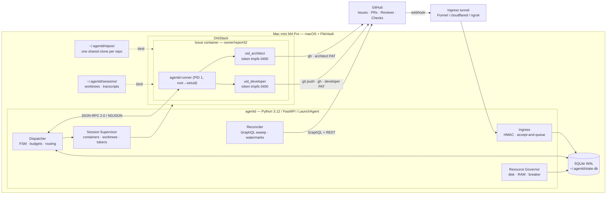
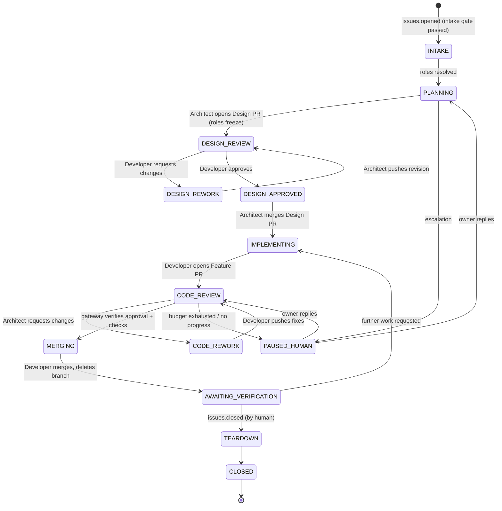
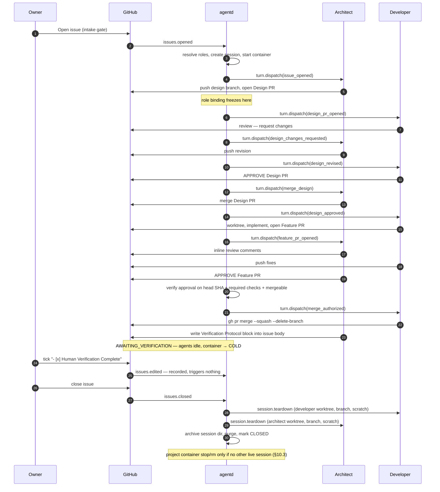

# Unified Technical Design Specification — `agentd`

### Asynchronous Multi-Agent AI Coding System

| | |
|---|---|
| **Status** | Proposed for formal approval (Phase 3 exit) |
| **Version** | 1.4.0 — see [Revision history](#revision-history) |
| **Implements** | [`docs/requirements/SRS_async_multiagent_ai_coding_system.md`](../requirements/SRS_async_multiagent_ai_coding_system.md) **v1.3** |
| **Supersedes** | [`proposals/claude_design_spec.md`](proposals/claude_design_spec.md) (#4) · [`proposals/grok_design_spec.md`](proposals/grok_design_spec.md) (#2) · [`proposals/gemini_design_spec.md`](proposals/gemini_design_spec.md) (#3) |
| **Ref** | Issue #1 |
| **Drafted by** | Claude Agent (`@huozheclaude`), per group assignment |
| **Consensus source** | Issue #1, Rounds 1–5 + owner rulings from `@huozhe` |

### Revision history

Amendments are also marked inline at the point they apply, which is where an implementer will meet them. This table exists so the version number means something.

| Version | Date | Change |
|---|---|---|
| **1.4.0** | 2026-08-12 | **Each role tears down its own worktree, branch, and scratch** (#68). §10.5 step 1 previously assigned *all* worktrees/branches to the Developer; step 2 gave the Architect only scratch. Live #47 left the Architect worktree and branch open because neither obligation named them as owned. Owner decision: each role removes its own worktree, branch, and scratch directory; both run `git worktree prune`. Order stays Developer then Architect for determinism, not dependency. Sequence in §8.2 updated to match. |
| **1.3.0** | 2026-08-12 | **`agentctl version` decided** (#58, ADR-13). M4-4's live end-to-end demonstration of the code loop (§21 M4 exit) needs a deliberately tiny Feature PR so the exercised behaviour is the loop's mechanics, not a design debate. Prints the installed `agentd` distribution version via stdlib `importlib.metadata.version("agentd")` (no dependency, no `pyproject.toml` path guess between editable and installed layouts); dispatches before `load_config()` so the command needs no configured host; bare string to stdout, not JSON, since it is a single value meant for direct interpolation rather than a script-parsed status report. |
| **1.2.0** | 2026-08-11 | **Session archive format & retention decided** (#47, ADR-12). §6.2/§10.5/§12.3 had asserted `tar.zst` and "30-day retention" since 1.0.0 without ever deciding either, and `<session_key>.tar.zst` was never a legal filename. Format is `tar.gz` (stdlib `tarfile`, no native dependency — same reasoning §15.1 already applied to reject `zstd` for the delivery-payload column); path is `archive/<owner>__<repo>/<issue_num>.tar.gz`; contents and exclusions are fully enumerated; retention is a config default (`retention.archive_days`, §5.4) enforced by a plain `mtime` sweep (plus stale-`.tmp` reclaim), deliberately outside the `artifacts` ledger. Revised in review: §10.5 step 3 now normatively orders archive-and-purge *before* the `CLOSED` flip (ADR-12's ledger rationale depends on that order, restated once there rather than independently in three places); step 3 no longer implies a per-issue container stop, which contradicted §10.3/ADR-4 under project-scoped runners; manifest `closed_at` is defined as archive-write wall-clock rather than a nonexistent `sessions` column. |
| **1.1.2** | 2026-08-08 | **Three identities + classic PATs** (M3-A). §5.1 / A2: Architect, Developer, and **gateway** (`huozhegateway`) machine users; classic `repo` PATs (fine-grained impossible on private personal repos); FR-1.3 boundary enforced by code paths and branch protection, not token scope. §9.1: gateway-authored / `agentd:escalation` comments drop for every recipient. |
| **1.1.1** | 2026-08-07 | **Runner-owned long-lived CLI per role** (#25). A6 / §7.3 / §14.2 / §14.5 wording aligned with §6.3 (process liveness fast path): privilege drop at session spawn, `turn.dispatch` multiplexes over a held pipe with per-turn deadline, oneshot `-p` remains the recovery path. Cwd decision (a): spawn at project root; worktree named per turn. |
| **1.1.0** | 2026-08-07 | **Container unit: issue → project** (ADR-4). Session directories nest under the project (§6.2); process liveness becomes the fast path and persistence the recovery path (§6.3); tiers and memory budget are per project (§6.5, §6.6); model-provider credential delivery and the never-copy rule (§5.2); cross-issue exposure and injection persistence (§13.2); ADR-3 clarified as being about *gateway*-held stdio. Owner decision on #19; implementation #20. |
| **1.0.0** | 2026-08-02 | Approved via #1. Amendments for M0, M1, M2 (×2) and M3 subsequently landed **against 1.0.0 without a version bump** — recorded here rather than retrofitted, since they are marked inline and reassigning versions after the fact would misstate what was approved when. |

Going forward: an amendment that changes an ADR or a section's contract bumps the minor version; a correction that clarifies without changing behaviour does not.

---

## 0. How This Document Was Produced

Three agents wrote independent blind drafts, cross-reviewed each other's pull requests, and then argued for five rounds on Issue #1. This document is the result. It is **not** any one draft with the others folded in — several sections replace what the drafter originally proposed, because the drafter lost the argument.

Every section carries provenance in §1.2. Decisions that were contested carry an ADR in §16 recording the rejected alternative and why it was rejected, including the alternatives this document's author originally argued for.

Two decisions were made by the repository owner (`@huozhe`) and are not open to agent revision: the gateway implementation language, and who closes an issue. One of the owner's rulings required amending the SRS rather than the design; that amendment is in this PR.

### 0.1 Reading Guide

- **Shape of the system:** §2–§4
- **The three claims the design rests on:** §5.2 (credential isolation), §6.3 (zero cold start), §11.2 (reconciliation)
- **Requirement coverage:** §15 traceability matrix
- **Contested choices:** §16 ADRs
- **What is not yet proven:** §17 open spikes, §19 known weaknesses

---

## 1. Design Principles and Provenance

### 1.1 Principles

| # | Principle | Consequence |
|---|---|---|
| P1 | **GitHub holds truth; local state is derived** | SQLite corruption or loss is recoverable by re-reading GitHub, not by repair |
| P2 | **Roles are data; identities are credentials** | Swapping Architect↔Developer is a config edit, never a code change |
| P3 | **Privilege separation over agent obedience** | Security comes from what a token *can* do, not from what a prompt *asks* an agent to do |
| P4 | **Every side effect is idempotent and fingerprinted** | Webhook redelivery, gateway restarts, and reconciliation are all safe |
| P5 | **Fail toward the human** | Ambiguity, budget exhaustion, and resource exhaustion all terminate in an `@owner` mention, never a silent stall |
| P6 | **The daemon owns infrastructure; agents own content** | Agents never call the Docker API, never manage the shared clone, never mint credentials |
| P7 | **Ingress never returns 5xx for a downstream condition** | GitHub does not retry failed repository webhook deliveries, so back-pressure must never reach GitHub |
| P8 | **Turns are serialized per session — and, under project scope, per (project, role)** | Eliminates the entire class of concurrent-git and concurrent-review hazards. The second clause is an ADR-4 amendment: one CLI conversation per role now spans a project's issues, so two concurrently-active issues would otherwise interleave turns into a single conversation |

### 1.2 Section Provenance

| Section | Source | Note |
|---|---|---|
| §4 Ingress, accept-and-queue | Claude #4 ADR-8 | Grok and Gemini both conceded their 503 behaviour |
| §4.1 Pluggable ingress backend | Grok #2 (E8) | Replaces Claude's Tailscale-as-architecture |
| §5.2 Credential delivery | Claude R4 → Grok R5 | Grok's host-mounted token files replaced; see ADR-6 |
| §5.3 Role binding precedence | Grok #2 §3.2 + Claude #4 §5.3 | Independent convergence |
| §5.3 Role freeze at Design PR open | Grok #2 §3.2 → narrowed in PR #5 review | Third position: later than Claude's session-creation freeze, earlier than Grok's design-freeze. See §5.3 |
| §6 Session model, zero cold start | Claude #4 §6 | Gemini #3 §2.2 supplied the clearest statement of the requirement |
| §6.4 Git layer | Claude #4 §6.4 | Replaces Grok's per-issue shallow clone |
| §7 Container topology | **Claude R2 middle path**, adopted by Grok R4 + Gemini R3 | Neither the original Claude nor original Grok/Gemini topology |
| §8.3 Design PR merge actor | **Grok #2 (E1)** | Resolves ambiguity Claude left open |
| §8.4 Merge gate | Claude #4 §8.3 + Grok req 4 | |
| §9 Loop prevention routing | Claude #4 §9 | Replaces Gemini's drop-all-bot-events |
| §9.3 Fingerprint composition | **Grok R4** | Replaces Claude's weaker `last_comment_body_sha` |
| §10 Verification block | Claude #4 §10 | |
| §10.3 Closure model | **`@huozhe` ruling** | Overrules the unanimous agent vote for orchestrator-close |
| §11.1 Host boot | **`@huozhe` ruling** → SRS v1.3 | |
| §11.2 Reconciliation sweep | **Gemini #3 §5.2** (GraphQL) + Claude #4 §11.2 (watermarks) + Grok E5 (`turn.resume`) | Three-way composite |
| §12 Resource governance | Grok #2 §9.3 + Claude #4 §12 | |
| §13 Threat model | Claude R5 + Grok R4 | |
| §14 Agent Session Protocol | Claude #4 §14 + Grok #2 §2.3 | Independent convergence on JSON-RPC 2.0 |
| §18 Testing strategy | **Grok #2 §14** | Claude had none |
| §20 Setup runbook | **Grok #2 §13** | Claude had none |
| §17 Assumptions table format | **Grok #2 §0** | |
| §12.4 FSM mirrored to labels | **Grok #2 §12** | Claude had no equivalent |

---

## 2. Assumptions

| # | Assumption | If wrong |
|---|---|---|
| A1 | OrbStack is installed, healthy, and set to start at login | Gateway retries until the Docker socket appears; no design change |
| A2 | Three GitHub machine users exist (Architect, Developer, gateway) with classic `repo` PATs and collaborator access on target repos | Auth module swaps token source; §5 unchanged in shape |
| A3 | The owner can configure repository webhooks and branch protection | Without branch protection, FR-1.3 is untestable and M4 cannot pass |
| A4 | `/Users` is shared into containers by OrbStack (default) | Mount root becomes configurable; §6.4 relative worktree paths already remove the path-equality dependency |
| A5 | Container-internal `tmpfs` enforces UID ownership and mode | **Load-bearing.** Falsified ⇒ fall back to two containers (ADR-4 fallback). **Spike M2-B** (M2-A is the separate host-bind expected-fail test) |
| A6 | Each vendor agent CLI can run headless, non-interactively, and accept sequential turns over a long-lived stdio session (or one-shot `-p` as recovery) | Adapter owns the protocol; **process liveness is the fast path** (§6.3). Our `transcript.jsonl` + vendor session store + `-c` / ACP re-entry is the recovery path when the process dies (ADR-9 — vendor resume is an optimization, not a dependency) |
| A7 | The `~/.agentd` volume has ≥ 50 GB free at install | Circuit breaker trips immediately and the system refuses work — loudly, which is correct |

---

## 3. System Architecture



### 3.1 Component Responsibilities

| Component | Owns | Explicitly does not own |
|---|---|---|
| **Ingress** | HMAC verification, durable delivery persistence, sub-50 ms 200 | Any filtering or business decision |
| **Dispatcher** | Normalize → route → FSM transition → dispatch turn | Docker, GitHub writes |
| **Session Supervisor** | Container lifecycle, worktree provisioning, token delivery | Deciding *when* a session acts |
| **Reconciler** | Rebuilding derived state from GitHub, synthesizing missed deliveries | Repairing agent-internal state |
| **Resource Governor** | Disk/RAM sampling, breaker, admission control, GC | Killing in-flight turns |
| **`agentd-runner`** (in container) | RPC endpoint, privilege drop, transcript append, turn deadline | Container lifecycle, the sibling role's credentials |
| **Agent CLI** | Reasoning, GitHub actions under its own identity | Everything else |

---

## 4. Ingress

### 4.1 Transport

The tunnel is a **pluggable backend**, not architecture: Tailscale Funnel (default — stable public HTTPS hostname, no domain purchase, no other ports open), `cloudflared`, `ngrok`, or `smee`. Configured by `ingress.backend`.

The choice is deliberately low-stakes. Because the Reconciler (§11.2) independently sweeps GitHub on a timer, **a tunnel outage degrades latency, not correctness.**

### 4.2 Webhook Handling Contract

```
POST /webhooks/github
  1. Read body, 2 MiB cap.
  2. Verify X-Hub-Signature-256 (HMAC-SHA256, constant-time). Mismatch → 401, no persistence.
  3. INSERT OR IGNORE INTO deliveries(delivery_id = X-GitHub-Delivery, ..., status='queued').
  4. Return 200. Median target < 50 ms.
  5. Nudge the dispatcher. If the nudge channel is full, do nothing — the dispatcher's
     own scan of status='queued' will collect it.
```

Steps 3–4 are P7. GitHub does **not** automatically retry failed repository webhook deliveries — a failed delivery is recorded and must be redelivered manually via the UI or redelivery API. Returning 5xx is therefore equivalent to data loss, and it loses data precisely during the incidents the circuit breaker exists to handle. Every downstream failure — dispatcher crash, container failure, breaker open — leaves the delivery durably queued.

Subscribed events: `issues`, `issue_comment`, `pull_request`, `pull_request_review`, `pull_request_review_comment`, `check_suite`, `status`, `push`.

### 4.3 Intake Gating

```yaml
intake:
  mode: label            # label | all
  label: agentd
  actors: collaborators  # only issues opened by repo collaborators are ingested
```

`mode: label` is the default so a repository does not start spending model tokens on every issue filed. `actors: collaborators` is baseline rather than deferred hardening: it costs one permission check and closes the FR-3.3 escalation-spam vector on any repository that accepts outside issues.

**Session creation eligibility (M3 / #16).** A `sessions` row is created only from an **intake-passing `issues` open/reopen/labeled event**. Deliveries parked as `deferred` (other event types, or historical traffic from before the design loop existed) must not conjure sessions on their own — they may only attach to a session that already exists. Ingress still accept-and-queues everything (P7); the gate is on *promotion*, not on persistence. Historical backlogs may be moved to a terminal status via `agentctl quarantine-deferred` before enabling the design loop on a host that already held M1 deferred rows.

---

## 5. Identity, Credentials & Role Binding

### 5.1 Accounts

Three GitHub **machine user accounts**, each a collaborator on the target repositories, each holding a PAT stored in the **macOS Keychain** and read by the gateway only:

| Role | Example login | Keychain account | Purpose |
|---|---|---|---|
| Architect | `@huozheclaude` | `claude-bot` | Agent turns, Design PR open/merge, reviews as Architect |
| Developer | `@huozhegrok` | `grok-bot` | Agent turns, Design PR review/approval, implementation |
| **Gateway** | `@huozhegateway` | `gateway` | §8.5 escalation comments only — not agent turns |

Machine users rather than a GitHub App, because SRS §2 requires the identity string used in communications and webhook filtering to match a registered GitHub **username**; App bots surface as `app-name[bot]`. See ADR-7.

**Credential shape (honest, 2026-08-08).** On a **private repository owned by a personal account**, fine-grained PATs cannot target that repository from a collaborator identity, and personal repos have **no collaborator roles** (every collaborator has push). So all three tokens are **classic PATs with the `repo` scope** — account-wide, not per-repository. Token scope therefore **does not** enforce the FR-1.3 boundary; branch protection and the gateway's narrow write surface (escalation comments only) do. M4-A remains the demonstration that the boundary holds. Blast radius is bounded by *collaborations*: keep each machine user a collaborator only on repos that need it.

```bash
security add-generic-password -s agentd -a claude-bot -w <pat>
security add-generic-password -s agentd -a grok-bot -w <pat>
security add-generic-password -s agentd -a gateway -w <pat>
```

The gateway identity exists so §8.5 can speak without (a) unpausing itself as `owner_reply`, (b) failing to notify the owner of their own @-mention, or (c) resetting `consec_agent_turns` as owner traffic. It must appear in `bot_logins` so §9.1 never classifies it as a human collaborator.

### 5.2 Credential Delivery — the mechanism FR-1.3 rests on

This is the most consequential mechanism in the document, and it is the one that changed most during review.

**Constraint discovered in review:** POSIX ownership does **not** survive the macOS→Linux bind-mount boundary. macOS UIDs have no meaning in the container's user namespace, so OrbStack UID-maps bind-mounted files and in-container `chown` on them does not reliably persist. Any scheme that provisions `0400` token files on the host and mounts them in provides **no isolation at all**.

The general form of this constraint governs what may live where:

| Location | UID/mode enforceable | Contents |
|---|---|---|
| Host bind mount (`worktrees/`, `transcript.jsonl`, `context/`, `scratch/`) | **No** — both role UIDs can read everything | Code, transcripts, scratch |
| Container-internal `tmpfs` | **Yes** — created by a Linux process in the namespace that owns it | **Credentials only** |

**Mechanism.** Tokens are delivered over the already-authenticated control channel in the `session.init` call (and again on `session.resume`). The in-container root supervisor writes them to container-internal tmpfs before dropping privilege:

```
--tmpfs /run/agent:rw,noexec,nosuid,size=1m,mode=0711

  /run/agent/architect/token   mode 0400  owner uid_architect
  /run/agent/developer/token   mode 0400  owner uid_developer
```

Consequences: no token material on the host filesystem, in the image, in `docker inspect`, or in Time Machine; ownership is real because it is created inside the namespace that enforces it; and tokens vanish when the container stops.

**Model-provider credentials (project-scope amendment).** The mechanism above governs **GitHub PATs**. Model-provider credentials are a different shape — they are subscription login state, not immutable API keys, and they are **provisioned manually, up front** rather than derived at session create. The granularity differs by vendor and the difference matters when setting a host up: Claude's is minted **once for the host** and reused across projects; Grok's is minted **once per (project, role)**. Evidence for every clause below is on spike #19.

| | Claude | Grok |
|---|---|---|
| Credential | one-year token from `claude setup-token` | OIDC login state |
| Stored | Keychain `agentd/claude-oauth-token` | durable per-role `HOME` in the project tree (§6.2) |
| Delivered | env `CLAUDE_CODE_OAUTH_TOKEN` at process start | the role's own `HOME`, mounted |
| Minted by | owner, **once for the host** — `claude setup-token` yields one account-wide token, reused across projects | `grok login --device-auth`, **once per (project, role)** |

**Never copy a credential file.** This is the rule the spike was run to establish, and both halves were demonstrated:

- The on-disk `~/.claude/.credentials.json` was **stale** (expired) while the live credential sat in the macOS Keychain — so copying that file authenticates nothing.
- Refresh tokens **rotate**. A container refreshing from a copied chain invalidated the host's, logging the host CLI out. Two containers sharing one chain fight; last refresh wins and the others die.

What makes this safe is that the container unit and the credential unit now agree (ADR-4): each (project, role) owns its own chain, nothing is shared and nothing is copied, so no broker, no host refresh-owner, and no cross-container file locking is required. Independence was verified — three concurrent chains (two roles plus the host) each survived a forced refresh of the others.

Two properties to hold when implementing: select the credential by **adapter**, not by role, or §5.3's `role/architect:grok` override silently delivers the wrong provider's token; and note that a subscription credential is **account-wide**, unlike a repo-scoped PAT, so although it is exposed no more widely than the PATs already are (§13.2), its blast radius is larger.

**The boundary this creates is precise, and the ADR states it plainly: the two-UID split protects _credentials_, not _data_.** Both roles can read each other's worktrees and transcripts. That is accepted — both roles are already trusted with the repository. What must not cross is the ability of the Developer identity to produce an approval that branch protection accepts on its own PR.

**Identity preflight (added M0 — see ADR-11 at end of §16).** Cross-role isolation inside the container does not stop an operator from mapping the *wrong* PAT to a role in config/Keychain. A wrong-identity token silently defeats §9.1 (owner login resets turn budgets), §10.2 (owner-only checkbox), and §8.4 (Architect approval). On every `session.init` and `session.resume`, **before any turn is dispatched**, the runner calls `GET /user` with each delivered token and asserts `login == the configured GitHub identity for that role`. Mismatch ⇒ fail the session loudly, escalate to `@owner` (§8.5), dispatch nothing.

**Inbound detection net:** the gateway rejects and escalates any event where `sender.login == config.gateway.owner` **and** the body carries an `agentd:turn` provenance footer — a combination that is impossible under correct operation and is the signature of an agent acting with the owner token.

**Model credentials (subscription, #19/#20) — separate from GitHub PATs.**

| Provider | Delivery | Storage |
|---|---|---|
| **Claude** | Env `CLAUDE_CODE_OAUTH_TOKEN` at container create (from Keychain `agentd` / `claude-oauth-token`, minted via `claude setup-token`) | Not a file copy of interactive Keychain / `.credentials.json` |
| **Grok** | Durable `projects/<owner>__<repo>/home/<role>/` with independent `grok login --device-auth` (Option D) | Never copy host `~/.grok/auth.json` into N places |

Provision **both** providers per project; select by **adapter** at turn time so §5.3's `role/architect:grok` override does not require a re-mint. See `docs/ops/project-onboarding.md`.

### 5.3 Role Binding (FR-1.2)

Precedence, highest first:

```
issue label  >  <repo>/.agentd/config.yaml  >  ~/.agentd/config.yaml
```

Per-issue override uses labels so the binding is visible on the issue itself:

```
role/architect:grok        role/developer:claude
```

**Binding freezes when the Architect opens the Design PR** — the `PLANNING` → `DESIGN_REVIEW` transition. The resolved binding is written to the session row and `roles_locked` is set at that moment.

This is narrower than the position originally locked in review ("at design freeze", i.e. when the Design PR merges), and it is narrower for a reason found during review of this PR: between Design PR *open* and Design PR *merge* the Developer is actively reviewing, so a label edit in that window would re-resolve roles and invalidate both the Architect's in-progress PR and the Developer's review context. Freezing at the first `turn.dispatch` instead — the other proposal — overshoots in the opposite direction, closing the window within seconds of the issue opening.

Opening the Design PR is the right boundary because it is the last moment before any peer-review context exists, while still leaving the whole RFC-drafting turn (tens of seconds to minutes) available for a human to correct a mislabelled role.

**Adapter swap and long-lived CLI (#25).** Changing a role's adapter (label override or config) while a project runner is HOT kills that role's held CLI process and starts the new adapter. The vendor conversation for the prior adapter is discarded — deliberate: one process cannot speak two protocols. Cross-issue context for that role is then rebuilt from `transcript.jsonl` / vendor store on the recovery path (§14.5), not carried across the adapter boundary.

### 5.4 Configuration

```yaml
# ~/.agentd/config.yaml
host:
  root: ~/.agentd
  disk_floor_gb: 15
  disk_resume_gb: 20
gateway:
  listen: 127.0.0.1:8787
  owner: huozhe
  # Per-turn liveness pair (#34): RPC socket timeout must outlive the deadline
  # sent to the runner. rpc_timeout_s = turn_deadline_s + rpc_timeout_grace_s.
  turn_deadline_s: 900
  rpc_timeout_grace_s: 60
ingress:
  backend: tailscale-funnel     # | cloudflared | ngrok | smee

agents:
  claude:
    login: claude-bot           # must equal the GitHub username (SRS §2)
    adapter: claude-code
    credential: keychain://agentd/claude-bot
  grok:
    login: grok-bot
    adapter: grok-cli
    credential: keychain://agentd/grok-bot

repos:
  huozhe/code-workflow:
    default_roles: { architect: claude, developer: grok }
    merge: { method: squash, delete_branch: true }
    required_checks: [ "ci/test" ]

budgets:
  max_turns_per_issue: 40
  max_consecutive_agent_turns: 30   # raised from 12 on M4-4 (#58) evidence: a full
                                    # design+code loop is ~13 uninterrupted agent turns
  max_review_rounds: 6
  min_dispatch_interval: 10s
  fingerprint_repeat_limit: 3
  zero_thread_rounds_limit: 3
  silent_turn_limit: 3          # #39: consecutive turns with no public_actions

resources:
  max_hot_containers: 4
  session_memory: 3g
  session_cpus: 2
  idle_cold_after: 30m
  awaiting_verification_container_ttl: 7d

retention:
  archive_days: 30          # §10.5 / §12.3 / ADR-12

intake:
  mode: label
  label: agentd
  actors: collaborators
```

---

## 6. Session Model & Zero Cold Starts

### 6.1 Identity and Scope

```
session_key  = "<owner>/<repo>#<issue_number>"   # agentd issue session (FSM, budgets)
project_key  = "<owner>/<repo>"                   # container / runner unit (#20)
```

One **agentd session** per issue (SRS §2). One **project runner** (container) per repo, living for the project's lifetime, holding one long-lived CLI conversation per role shared across issues in that project (#19 / #20).

**A session is not a container (project-scope amendment).** The container unit is the **project**, not the issue — see ADR-4. One project container hosts every session for that repository, so `sessions : runner` is N:1 rather than 1:1. Session identity, the §8.1 state machine, and §9's budgets and stall signals all remain **per issue** and are unaffected; only the process and filesystem substrate is shared.

### 6.2 Host Layout

**Project-scope amendment.** Session directories nest **under the project** rather than sitting flat. A project container mounts exactly one directory — its own project tree — and nothing else. The flat `sessions/<owner>__<repo>__42/` layout had no directory containing exactly one project's sessions, so a project container would have had to mount `sessions/` and thereby expose *every* project to *every* container: the same failure as the M2 W2 finding, where mounting a parent that contained more than intended re-exposed credentials.

```
~/.agentd/
├── state.db                                 # SQLite, WAL — NEVER mounted (W2)
├── config.yaml                              #             — NEVER mounted (W2)
├── projects/<owner>__<repo>/                # ← the single mount for this project's container
│   ├── repo/                                # ONE clone per repo, gateway-owned, gc.auto=0
│   ├── sessions/42/
│   │   ├── architect/{transcript.jsonl,context/,scratch/,worktrees/}
│   │   └── developer/{transcript.jsonl,context/,scratch/,worktrees/}
│   └── home/{architect,developer}/          # durable per-role HOME + auth chain (§5.2)
└── archive/<owner>__<repo>/<issue_num>.tar.gz   # post-teardown; format & retention: ADR-12
```

The container mounts `projects/<owner>__<repo>` at `/srv/agentd`, and **that single mount is what preserves the M2 W1 fix**: `repo/` and `sessions/` stay siblings under one parent, so `worktree.useRelativePaths` gitdirs resolve to the same relative depth on host and container. Splitting them into separate mounts flattens the topology differently on each side and breaks `git` inside the worktree. Keep `assert_worktree_usable` (both role UIDs) and `assert_host_secrets_not_mounted` (an **allowlist** of `repo` + `sessions` + `home`, never a denylist) running on every container create — those two assertions are what caught W1 and prevented W2 from recurring.

### 6.3 The Three Cold-Start Costs

SRS §2 prohibits three distinct costs. Each needs its own mechanism; conflating them is how a design ends up asserting zero cold start rather than achieving it.

| Prohibited cost | Mechanism |
|---|---|
| **Re-cloning the repository** | One shared clone per repo. Sessions get `git worktree add`, which is O(working tree) and shares the object store. A new branch workspace costs ~1 s. |
| **Re-ingesting the codebase** | The working tree and all tool caches (`node_modules`, language-server indexes) persist on the host volume across every container tier, including a fully stopped container. |
| **Losing conversation state** | `transcript.jsonl` is appended after every turn and is the authoritative record. The agent process may exit; the conversation does not. |

The third was originally stated as: *continuity is achieved by persistence, not by process liveness* — on the grounds that an always-attached process is fragile and holds RAM hostage.

**Project-scope amendment: process liveness is the fast path, persistence is the recovery path.** Both survive; only their ranking changed. `agentd-runner` (PID 1, inside the container) spawns one CLI process per role and owns its stdio for the life of the project, because the vendor CLIs carry conversational state that a fresh process per turn discards. When that process dies — crash, `docker stop`, host reboot — continuity falls back to exactly the original mechanism: the CLI's own session store plus `transcript.jsonl`, re-entered with `claude -c` / `grok -c`.

The two objections to an always-attached process were tested rather than assumed (spike #19):

- *"one crash loses everything"* — it does not. `docker stop` → `start` → `-c` restored conversational context on both CLIs. The persistence layer is still there underneath.
- *"it holds RAM hostage"* — measured idle RSS after a turn is ~246 MB (claude) and ~70 MB (grok), so ~316 MB for both held. Against the 3 GB per-container cap in §6.6 that is not a constraint.

Persistence therefore still permits the tiering in §6.5; it is simply no longer the *first* mechanism reached for.

### 6.4 Git Layer

**Invariant:** only `agentd` runs `git fetch`, `git worktree add/remove`, and `git gc` on the shared clone, serialized by a per-repo mutex. Agents operate strictly inside their assigned worktree. `gc.auto=0` is set; maintenance runs only when a repo has zero active sessions. This removes the only genuinely unsafe concurrent git operation while leaving the safe ones (object writes, per-branch ref updates) unrestricted.

**Worktree paths are relative.** The base image pins git ≥ 2.48 and the shared clone sets `worktree.useRelativePaths = true`, so worktrees do not encode absolute paths and host/container path equality is not load-bearing. Path-identical bind mounts remain documented as the fallback for older git.

**Runbook consequence that survives either mechanism: do not rename the Mac user account.** Doing so invalidates every mount path in flight.

### 6.5 Container Lifecycle

| Tier | Mechanism | RAM | Resume | Trigger |
|---|---|---|---|---|
| **HOT** | running project runner, RPC attached | ≤ 3 GB | 0 | active turn on any issue in the project |
| **COLD** | `docker stop` | **0** | 2–5 s | idle > 30 min, or admission pressure |

Tiering is **per project**, not per issue. Issue close does **not** stop the container (§10.3) — only worktrees/branches/scratch for that issue are removed. A `docker pause` ("WARM") tier must never be cited as a memory saving.

COLD: no re-clone, no re-ingest, no lost role conversation — process restart reloads CLI session store + transcripts (`-c` / ACP resume).

**Project-scope amendment: tiers apply to projects, not issues.** Stopping a container stops work on every issue in that project, so demotion is driven by project-level idleness rather than per-issue activity. Admission (`max_hot_containers`) counts projects. Note that §6.5's cap must be enforced on **promotion** as well as creation — promotion is the normal route to HOT under this model, so a cap checked only at create does not bound anything.

### 6.6 Memory Budget

**Project-scope amendment.** The unit is a project container holding **two** long-lived CLI processes (one per role), not an issue container holding one at a time.

| Consumer | Reserved |
|---|---|
| macOS + user applications | ~7.0 GB |
| OrbStack VM base | ~1.5 GB |
| `agentd` (Python/FastAPI) + tunnel client | ~0.2 GB |
| 4 HOT **project** containers @ 3 GB cap | 12.0 GB |
| **Total** | **~20.7 GB** |
| **Headroom** | **~3.3 GB** |

Typical working set is 1–2 GB; 3 GB is a hard `--memory` cap. Both role CLIs are now resident simultaneously rather than one at a time, but measured idle RSS is ~246 MB (claude) + ~70 MB (grok) ≈ **316 MB**, so holding both costs about a tenth of the cap and the reservation is unchanged. P8 still serializes *turns*; what it no longer implies is that only one CLI is *resident*.

The reservation is also now per **project** rather than per issue, which is strictly cheaper: a project with twelve open issues consumes one container's budget instead of twelve. Projects beyond `max_hot_containers` are held COLD and promoted on demand; concurrency is bounded by disk, not RAM.

---

## 7. Container Definition

### 7.1 Image

```
agentd/session-runner:<v>
  debian:bookworm-slim
  + git ≥ 2.48, gh, ripgrep, fd, build-essential
  + node LTS, python3
  + agent CLI adapters (claude-code, grok-cli, …)
  + agentd-runner  (static supervisor, PID 1)
  + users: uid_architect(1001), uid_developer(1002)
  - NO setuid binaries
```

`agentd-runner` is the stable contract; vendor CLIs are replaceable adapters behind it.

### 7.2 Run Configuration

```bash
docker run -d \
  --name agentd-huozhe-code-workflow-42 \
  --label agentd.managed=true \
  --label agentd.session='huozhe/code-workflow#42' \
  --restart unless-stopped \
  --memory 3g --memory-swap 3g --cpus 2 --pids-limit 1024 \
  --cap-drop ALL \
  --cap-add CHOWN --cap-add FOWNER --cap-add SETUID --cap-add SETGID \
  --security-opt no-new-privileges \
  --tmpfs /run/agent:rw,noexec,nosuid,size=1m,mode=0711 \
  -v ~/.agentd/repos:/srv/agentd/repos \
  -v ~/.agentd/sessions/huozhe__code-workflow__42:/srv/agentd/sessions/huozhe__code-workflow__42 \
  -e AGENTD_SESSION_DIR=/srv/agentd/sessions/huozhe__code-workflow__42 \
  agentd/session-runner:1.1.0
```

Non-obvious choices:

- **No `/var/run/docker.sock`. Ever.** Mounting it would grant host root and the sibling role's credentials, dissolving every boundary in §13.
- `--restart unless-stopped` lets containers survive an OrbStack or host restart on their own; the Reconciler then adopts or prunes them by label. This is the container half of NFR-1.1a.
- The tmpfs at `mode=0711` lets each role traverse to its own token directory without listing the sibling's.
- **Single project mount (W1/W2, #20).** Mount exactly `projects/<owner>__<repo>` → `/srv/agentd` so `repo/`, `sessions/`, and `home/` are siblings (W1 relative gitdirs). Do **not** mount the whole `~/.agentd` root — that exposes `state.db` / `config.yaml` (W2 / R1).
- **Capabilities (M2 amendment).** `--cap-drop ALL` alone makes `chown` and `setuid` return EPERM even for UID 0 under OrbStack/Linux, which makes §5.2 token placement and §7.3 privilege drop impossible. Re-add only `CHOWN`, `FOWNER`, `SETUID`, `SETGID`. No `SYS_ADMIN`, no `NET_ADMIN`, no docker socket.
- **RPC bearer delivery (M2 amendment, R1).** The bearer is **not** in container env (`docker inspect`) and **not** on a bind mount (roles can read all bind-mounted files — §5.2 table). Sequence: `docker create` → `docker cp` host-minted bearer to container-local `/etc/agentd/rpc.bearer` (root-owned `0400`, real Linux DAC) → `docker start`. Runner refuses to bind if the file is missing. Assert both: absent from inspect Env, and unreadable as either role UID.
- Egress is unrestricted by default (GitHub, model APIs, package registries). An allowlisting egress proxy is noted in §13.3 as hardening, not baseline.

### 7.3 Privilege Model

```
PID 1  agentd-runner (root)
   │   - binds RPC endpoint
   │   - receives tokens via session.init, writes /run/agent/<role>/token
   │   - owns stdio of one long-lived CLI child per role (§6.3 / #25)
   │   - NEVER executes agent or tool code as root
   └── per role (session.init / resume, and on crash respawn):
         Popen(preexec: setgroups([]) → setgid/setuid(uid_<role>))
         cwd = project root (/srv/agentd); worktree path is named per turn
         env: HOME=<durable project home>/<role>  (or session home fallback)
              TMPDIR=<session>/<role>/tmp   (mode 0700)
              XDG_*=<session>/<role>/xdg
         turns multiplex over the held pipe under the per-(project, role) lock
   └── recovery / mock / AGENTD_CLI_MODE=oneshot:
         per turn: fork → setgroups([]) → setgid/setuid → run -p adapter
```

**Timing change (#25).** Privilege drop moved from *per turn* to *per session spawn*. The §7.3 invariants are unchanged: the CLI never runs as root; correct per-role uid; no supplementary groups; `HOME` / `TMPDIR` / `XDG_*` under the role's tree. A wedged turn is bounded by a per-turn deadline on the shared pipe; on expiry the runner kills the child so the role remains usable, then respawns with `-c` / store re-entry on the next dispatch.

Every subprocess of a turn — the agent CLI, `git`, `gh`, test runners, package managers — runs as the role UID. Per-role `TMPDIR` at `0700` is required, not optional: `/tmp` at `1777` prevents cross-UID *deletion* but not cross-UID *reading*, and CLIs routinely cache credentials into their default temp path.

---

## 8. Workflow Protocol & State Machine

### 8.1 States



Orthogonal conditions held as columns rather than states so they compose: `PAUSED_RESOURCE` (breaker open), `FAILED`.

**`AWAITING_VERIFICATION` is re-enterable.** Multiple PRs may land under one issue; only closure ends the session. A Feature PR opened while awaiting verification returns the session to `IMPLEMENTING`.

### 8.2 Happy Path



### 8.3 Design PR Merge Actor

**Developer approves; Architect merges.**

Worth stating explicitly because it is an extension beyond the SRS: FR-2.2/FR-2.3 require the Design PR to be *opened and approved*, not merged. Merging is this design's addition, justified because it places the approved RFC on the default branch so the Feature PR's base contains it. The Architect merges because the Architect owns the design artifact, and because "Developer merges after its own approval" is exactly the pattern branch protection exists to prevent.

### 8.4 Merge Authorization (FR-2.6)

The Developer merges, but only after **`agentd` independently verifies** against the GitHub API:

1. A review with state `APPROVED` from the account bound to Architect, **on the current head SHA**.
2. All `required_checks` are `success`.
3. `mergeable_state == "clean"`.

The gateway verifies; the agent acts. Agents never self-certify a privileged transition. This resolves the enforcement gap present in the Phase 1 drafts — where a gateway "safety check" was specified but the agent called GitHub directly, leaving the gateway outside the write path — without proxying every API call (ADR-8).

### 8.5 Escalation (FR-3.3, FR-3.4)

An agent invokes `escalate.human` with a reason and a specific question; the gateway also raises escalations itself on budget exhaustion or stall detection (§9). Then:

1. Session `paused_reason` set; dispatch stops.
2. Comment posted **as the gateway identity** (Keychain `agentd` / `gateway` — never an agent PAT) tagging `@<owner>` with the question, current state, and what each plausible answer would cause. Body carries `<!-- agentd:escalation session=… -->` so routing drops the echo for every agent recipient.
3. Escalation recorded with the comment id.
4. Resume on the next `issue_comment` from the **owner** (aligned with §9.1: while `PAUSED_*`, non-owner senders defer), injecting the reply as the next turn's event and restoring the pre-pause state.

P5: no failure mode ends in silence.

---

## 9. Event Routing & Loop Prevention (FR-4.1)

### 9.1 Routing Rules

"Filter out bot self-messages" cannot mean "drop all bot-authored events" — the entire protocol *is* bot→bot messaging. Dropping by sender halts the workflow after a single turn. The rules are evaluated **per recipient**:

| Condition | Action |
|---|---|
| `sender.login` == the intended recipient's identity | **Drop** (self-echo) |
| `sender.login` == owner | **Route**, reset `consec_agent_turns` to 0 |
| Body contains `<!-- agentd:escalation … -->` (gateway voice, §8.5) | **Drop** for every recipient |
| `sender.login` is the other agent bot | **Route**, increment `consec_agent_turns` |
| Body contains a provenance footer written by the recipient | **Drop** (own artifact) |
| `delivery_id` already terminal | **Drop** (redelivery) |
| Session `PAUSED_*` and sender is not the owner | **Defer** (stays queued) |
| `sender.login` is the gateway login (no escalation marker) | **Drop** (gateway is not a human collaborator) |

Every agent-authored comment carries a machine-readable footer; gateway escalations carry a distinct marker. Both make drop rules mechanical:

```html
<!-- agentd:turn session=huozhe/code-workflow#42 role=architect turn=01J8Z… -->
<!-- agentd:escalation session=huozhe/code-workflow#42 -->
```

Owner quote-replies that copy either footer still **route** — owner is evaluated before marker rules (same trap as M3-2).

### 9.2 Budgets

Human input resets the consecutive-turn counter; agent activity never does. Defaults in §5.4. Breach → **escalate, not abort** — work in progress stays intact and reviewable.

### 9.3 Stall Detection

Two agents can burn budget while converging on nothing, and this is the characteristic failure mode of the architecture. Two complementary signals, because each misses what the other catches:

**Fingerprint** — recomputed each turn from *progress state*, **not** including `head_sha` in the hash (M3 amendment — including head made "identical after head change" unreachable):

```
sha256( sorted(open_review_thread_ids)
      ‖ unresolved_comment_count
      ‖ sha256(git diff --stat <base>..<head>) )
```

Identical 3 **consecutive turns** → escalate, but only **after the session has seen at least one non-trivial `head_sha` change** (arms the counter). That avoids firing on legitimately slow initial convergence, while still catching cosmetic re-pushes that move head without changing review/diff state. A static head never advances this counter — that is intentional; other signals cover it.

**Zero-thread-progress** — 3 consecutive review rounds in which no review thread is resolved → escalate. Catches agents that make cosmetic changes each round, which the fingerprint's diff component alone can miss.

**Silent turns** (#39, PR #42) — 3 consecutive agent turns with **no observed GitHub/FSM progress** → escalate. Reset only on P1-observed progress (webhook-driven FSM or progress event kinds such as `design_revised`), never on claimed `public_actions` (tool_use is advisory, like `status` in §14.3). Claims are still recorded and named in the escalation when the agent reported acting but nothing arrived. Adapters populate `public_actions` from vendor tool streams for diagnosis (including `git push` → `push`).

**Coverage note for implementers.** The "arm after first head change" guard is **not** "only sample when head changes this turn." Once armed, count every turn's fingerprint. Do not re-introduce `head_sha` into the hash material: that makes identical progress after a cosmetic push impossible to observe. Comment-only loops before any code exists (two agents negotiating an RFC without pushing) are caught by the **turn budgets** and the **zero-thread-progress** signal, both of which are head-agnostic. Silent turns cover the case where there are no review rounds and no head at all. The mechanisms are deliberately layered so that each covers the other's blind spot.

Spurious escalation is the preferred failure direction; all signals escalate to the human rather than aborting work.

### 9.4 Event Digest

Agents receive a compact rendered digest — event kind, actor, human-readable delta, and *references* to files and URLs rather than inlined content. Raw payloads stay in SQLite for the gateway. This keeps per-turn token cost roughly constant as issue history grows.

---

## 10. Human Verification & Closure

### 10.1 The Managed Block (FR-3.1)

On `feature_merged → AWAITING_VERIFICATION`, the **gateway** upserts a sentinel-delimited verification block into the **issue body**. The Architect does not own the first write: if only an agent turn wrote the block, a failed turn would leave every subsequent close classified `ABANDONED` (§10.3) for want of a checkbox that never existed. That is the same reliability reason escalation comments and non-owner reopen are gateway writes.

The gateway writes a scaffold (merged PR numbers from the session row, placeholder steps, unchecked box, ordering line). On the post-merge turn the **Architect** may refine **steps** and **Not covered** between the sentinels; it must not remove the checkbox or the ordering line.

```markdown
<!-- agentd:verification v1 -->
## Verification Protocol

1. `git pull origin main && npm ci`
2. `npm run dev`, open http://localhost:3000/settings
3. Toggle "Dark mode" — preference must survive a page reload.
4. `npm test -- settings` — 14 tests pass.

**Merged PRs:** #43, #47
**Not covered:** SSO login path (no test account available)

- [ ] Human Verification Complete

*Tick this box before closing the issue — closing with it unticked records the session as `ABANDONED` (§10.3).*
<!-- /agentd:verification -->
```

Sentinels exist so the **gateway and agents** can rewrite the block idempotently (across redelivery and across multiple PRs) without touching the human's prose. `agentd` parses only between sentinels; a stray checkbox elsewhere in the body is ignored. Gateway upsert preserves an already-checked box unless an explicit override is passed.

**The ordering line is part of the block, not decoration.** Ticking and closing are two separate human acts, and the natural order — close the issue, tick later — silently produces the wrong terminal classification, because `issues.closed` is evaluated against the checkbox state *at that moment* (§10.3). The block therefore states the required order where the human is already reading. Found by hand-running this block against M2 (#10), which closed unticked and so recorded as `ABANDONED`.

### 10.2 Checkbox Semantics (FR-3.2)

The checkbox **records a fact; it authorizes nothing.** On `issues.edited`, a `- [ ]` → `- [x]` flip on the `Human Verification Complete` line inside the sentinels is recorded as verified **only if** `sender.login == config.gateway.owner` **and** `sender.login` is not a configured agent identity.

The second condition is not redundant with the first — it survives a configuration mistake in which an agent identity is also listed as owner. Under this design the checkbox is a data-integrity control rather than a security gate, because closure (§10.3) is the human's own act; it is checked twice anyway because a falsified verification record is worth preventing cheaply.

If an agent edits the issue body while `AWAITING_VERIFICATION`, the checkbox line is restored from the last gateway-verified snapshot and a warning comment is posted.

### 10.3 Closure and Teardown (FR-3.2, FR-4.2)

**The human closes the issue. `issues.closed` is the sole teardown trigger.** No LLM agent and no orchestrator component ever calls the close API.

This overrules the agents' unanimous preference for orchestrator-initiated close. The agents' argument was that a second manual action is friction without safety once the checkbox is owner-only — but that reasoning assumes checkbox verification is perfect. Requiring the human to perform the terminal action removes an entire failure class ("the gateway misread the checkbox") at the cost of one click.

The checkbox's only remaining job is to classify the terminal state:

| At close | Terminal state | Teardown |
|---|---|---|
| Checkbox verified | `VERIFIED` | Full, plus completion summary comment |
| Checkbox absent or unverified | `ABANDONED` | Full, reason recorded, no summary |

Both tear down **issue artifacts** completely (worktrees, branches, scratch, issue session dirs). Under project-scoped runners (#20) the **project container is not an artifact of the issue** — issue close must not `docker stop`/`rm` a container still serving other issues. Container teardown is project-level (last session gone, or explicit project archive).

There is no timer, no hold, and no attempt to reopen an issue the owner closed — a close without verification is a meaningful human act ("won't fix", "fixed another way"), and the system records it rather than arguing with it.

**Ordering is normative: tick, then close** (`@huozhe`'s call, 2026-08-07). The classification is evaluated against the checkbox state at `issues.closed` and is never revised afterwards — a tick arriving after closure changes nothing. The alternative considered was making a late tick promote `ABANDONED` → `VERIFIED`, and it was rejected: it would reopen the terminal state after teardown has already run, which is precisely the "no timer, no hold" property above. The cost is that the ordering must be *communicated*, which is why §10.1's block carries it inline rather than leaving it to the runbook.

### 10.4 `AWAITING_VERIFICATION` Retention

Because closure now happens on a human's schedule, this state is unbounded. Holding containers for it is indefensible.

| Elapsed | Action |
|---|---|
| Idle timeout (30 min) | Container → COLD. RAM freed, volumes intact. |
| **7 days** without closure | Container removed. **Worktree, transcript, and summary retained on disk.** One quiet issue comment noting the session is disk-only until closed. |
| Any event (comment, reopen, close) | Rehydrate on the same mounts in ~5 s — no re-clone, no re-ingest |

Zero cold start survives the whole window; only the container does not.

### 10.5 Distributed Cleanup (FR-4.3)

On `issues.closed`, Developer then Architect. The order is retained for determinism, not because either step depends on the other — each role removes only its own paths.

1. `session.teardown` → **Developer**: `git worktree remove` on the **developer** worktree, delete the **developer** branch, delete **its own** scratch directory, `git worktree prune`. Reports what it removed. Does not touch Architect paths.
2. `session.teardown` → **Architect**: `git worktree remove` on the **architect** worktree, delete the **architect** branch, delete **its own** scratch directory, `git worktree prune`. Reports what it removed. Does not touch Developer paths.
3. **Orchestrator**: archive the issue session directory, purge that directory, **then** mark the session `CLOSED`. Archive format, contents, and retention are ADR-12 (§16); this step's ordering — archive and purge *before* the state flips — is what ADR-12's ledger rationale depends on, and it means a crash between the two never strands a `CLOSED` session with no tarball and no live directory to recover from.
4. **Orchestrator**: stop and remove the **project** container only if no other live session shares this `project_key` (§10.3, ADR-4); otherwise it stays running for the project's other issues. Closing one issue is never on its own sufficient to stop a project container.

The `artifacts` ledger (§15.1) records every worktree, branch, and scratch path at creation, so teardown is verifiable rather than best-effort: anything with `removed_at IS NULL` after teardown completes is a leak and is logged as such.

---

## 11. Availability & Recovery

### 11.1 Host Boot (NFR-1.1a / NFR-1.1b)

The host runs **FileVault, by owner policy**. No daemon can unlock an encrypted boot volume, so unattended recovery from a cold boot is impossible — SRS v1.3 amends NFR-1.1 accordingly rather than leaving the design silently non-compliant.

```bash
sudo systemsetup -setrestartpowerfailure on     # power returns → host boots to unlock prompt
# OrbStack → Settings → Start at login: enabled
# ~/Library/LaunchAgents/dev.agentd.plist: RunAtLoad, KeepAlive, ThrottleInterval=10
```

- **NFR-1.1a (software faults) is fully automatic.** Gateway crash → launchd restarts it. Container crash → restart policy plus Reconciler. OrbStack crash → restart, gateway retries until the socket returns.
- **NFR-1.1b (host boot) requires exactly one human action:** unlock and log in. Everything after that is automatic. Configuring power-on-after-mains means the human's job is *unlock*, not *walk over and press the button*.

**A LaunchAgent is correct here, not a compromise.** A human is present at boot by definition, so there is nothing to be gained from a pre-login LaunchDaemon — and OrbStack itself only starts at login, so a LaunchDaemon would spin waiting for a socket that cannot yet exist. The LaunchAgent also retains the GUI session access that NFR-2.2's notification needs.

Startup ordering is handled by retry with backoff, not by a launchd dependency graph.

### 11.2 State Reconciliation (NFR-1.2)

NFR-1.1b admits an **unbounded** downtime window — bounded only by how long until a human notices. Reconciliation is therefore not a nicety; it is the mechanism the entire recovery story rests on.

On every start, and every 5 minutes thereafter:

```
1. Open SQLite (WAL), migrate, PRAGMA integrity_check.
2. Inventory: docker ps -a --filter label=agentd.managed=true
   → adopt containers matching a live session; remove orphans.
3. GraphQL sweep: for all non-terminal sessions, fetch the FULL current state —
   issue, comments, open PRs, review states, review threads, check runs — in one
   round trip per repo. `updated_at` is used only as a paging hint, never as a filter.
4. Derive expected FSM state from GitHub truth (P1). If it differs from stored,
   adopt derived and log the divergence.
5. ID SET-DIFF, not timestamp comparison: for every node_id returned by the sweep,
   check membership against deliveries. Anything absent → synthesize a delivery
   (delivery_id = "recon:<node_id>") and enqueue it.
6. Detect interrupted turns: rows with started_at set and ended_at NULL.
7. Re-attach RPC to running containers; unreachable → mark COLD, promote lazily.
8. Send session.resume with a digest of everything missed; send turn.resume
   (never turn.dispatch) for interrupted turns.
9. Drain deliveries WHERE status='queued' in received_at order.
```

**Step 5 is what makes downtime survivable**, and its formulation matters more than it looks.

An earlier version of this section used a timestamp watermark — "recover anything newer than `gh_watermark`". Both reviewers independently attacked it, and they were right: `updated_at` is not reliably monotonic across GitHub's asynchronously-aggregated PR and review state, so a strict exclusive lower bound can skip an event permanently and silently. Silent skipping is the worst failure mode available to this component.

The recovery cursor is therefore **set membership over stable node IDs**, not a timestamp comparison:

1. Each sweep fetches the complete current state of the issue and its linked PRs — cheap, because sessions are issue-scoped and the query is already a single GraphQL round trip.
2. Every returned `node_id` is checked for membership in `deliveries`. Missing ⇒ synthesize `recon:<node_id>` and enqueue. The primary key makes this idempotent for free.
3. `updated_at` survives only as a paging hint for large comment threads, never as a correctness boundary.

Because the sweep also derives FSM state from the full fetch (step 4), a session converges to the correct state even if a *webhook* was missed entirely — a PR that is `MERGED` on GitHub but `CODE_REVIEW` in SQLite transitions on the next sweep regardless of what any timestamp says. This is what demotes §19.5 from an open research risk to a settled design choice.

**Step 8 is a correction to a mistake worth naming.** An earlier draft justified blind at-least-once re-dispatch on the grounds that agent actions are idempotent at the GitHub level. That is true for GitHub and **false for everything else** — a turn interrupted midway through `npm install`, a database migration, or a `git rebase` is not idempotent, and replaying it can leave a worktree in a state neither side can reason about.

So the gateway never blind-replays. `turn.resume` carries the interrupted turn's declared intent, and the runner re-derives actual state from what survived the crash — `git status`, `git log`, the worktree itself, PR state on GitHub — before deciding what remains. **The workspace is the checkpoint.**

---

## 12. Resource Management

### 12.1 Monitoring

The Resource Governor samples every 30 s: free disk on the `~/.agentd` volume, free host RAM, and per-container RSS.

### 12.2 Circuit Breaker (NFR-2.2)

| Condition | Action |
|---|---|
| Free disk < **15 GB** | **Trip.** Dispatcher stops draining; no new containers; idle sessions driven COLD; macOS notification; one comment per active issue. **Ingress keeps accepting and persisting deliveries.** |
| Free disk > **20 GB** | **Reset.** Resume draining, oldest delivery first. |
| Free RAM < 2 GB | Admission control only: refuse new HOT containers, demote LRU idle sessions to COLD. No trip. |

Asymmetric thresholds prevent flapping — and flapping is the expected behaviour of a single threshold here, because the breaker halts the very cleanup that would free space.

The disk/RAM asymmetry is deliberate: disk exhaustion corrupts work in progress, while memory pressure only needs to stop *new* work. Killing an in-flight turn to reclaim memory wastes the tokens already spent on it.

```bash
osascript -e 'display notification "Free disk 12.4 GB — agentd paused" \
  with title "agentd: storage circuit breaker" sound name "Basso"'
```

Notification delivery is best-effort; the authoritative signal is the GitHub comment on each affected issue, which reaches the owner wherever they are.

### 12.3 Garbage Collection

Hourly and on breaker trip: prune dangling images and unmanaged stopped containers; delete archives older than `retention.archive_days` (default 30, ADR-12) by a plain `mtime` sweep over `archive/*/*.tar.gz`; in the same sweep, delete `archive/*/*.tar.gz.tmp` older than **1 hour** — §10.5 step 3 writes then renames, so a `.tmp` surviving that long is crash debris, not an in-progress write, and would otherwise leak disk indefinitely; `git gc` on shared clones **only when the repo has zero active sessions**; truncate `deliveries` payloads older than 7 days while retaining metadata for idempotency.

**Archive deletion is deliberately not routed through the `artifacts` ledger below.** That ledger exists to catch artifacts that can leak *before* teardown completes — the crash-mid-`git worktree add` case that motivates this section's filesystem set-diff. An archive is not that kind of artifact: it is written *as part of* teardown (§10.5 step 3), not a side effect that can precede or outlive it, so there is no crash window for a ledger row to close over — a directory `mtime` listing already gives the same answer, for less machinery. (Full rationale: ADR-12, §16.)

**Orphan reconciliation — the artifact ledger is not sufficient on its own.** §10.5 tracks worktrees, branches, and scratch paths via `artifact.register`, but that RPC is sent *after* the runner performs the action. A hard crash between `git worktree add` and the register call — an OOM kill is the realistic case — leaves a worktree on disk that the ledger has never heard of, so teardown cannot remove it and the "zero rows with `removed_at IS NULL`" check reports success while leaking disk.

GC therefore reconciles against the filesystem rather than trusting the ledger:

```
for each shared clone:
    git worktree list --porcelain          → actual worktrees on disk
    SELECT ref FROM artifacts WHERE kind='worktree'  → ledger
    actual − ledger, belonging to a CLOSED/absent session  → git worktree remove --force
    ledger − actual                                        → mark removed_at, log
```

The same set-diff runs for session directories under `sessions/`. This is the filesystem analogue of §11.2's ID set-diff, and for the same reason: a ledger of *intent* cannot be trusted to describe *state* across a crash boundary.

### 12.4 State Visibility

Session state is mirrored to **GitHub labels** (`agentd:state:code_review`, `agentd:paused`, `agentd:awaiting_verification`). This makes the state machine legible to the human in the place they are already looking, and it survives total loss of the gateway — which a log file does not.

---

## 13. Security Model

### 13.1 Boundaries

| Boundary | Enforced by |
|---|---|
| Developer cannot approve its own PR | Architect token readable only by `uid_architect` on container-internal tmpfs (§5.2) + GitHub branch protection + gateway merge verification (§8.4) |
| Agent cannot escape to the host | No Docker socket, `cap-drop ALL`, `no-new-privileges`, non-root UIDs, no setuid binaries in the image |
| Agent cannot exhaust the host | `--memory`, `--cpus`, `--pids-limit`, plus admission control |
| Agent cannot forge the verification record | Checkbox flips counted only from the owner login (§10.2) |
| Agent cannot close an issue | No component calls the close API (§10.3) |
| Attacker cannot forge events | HMAC-SHA256 on every delivery; RPC endpoint loopback/UDS-local with a per-session bearer token |

### 13.2 Stated Threat Model

**A confused or prompt-injected agent — not a kernel-class attacker.** Against that model, DAC separation plus dropped capabilities, `no-new-privileges`, and no setuid binaries is adequate.

What this explicitly does **not** provide: cross-role *data* confidentiality. Both role UIDs can read each other's worktrees, transcripts, and scratch, because those live on host bind mounts where ownership is not enforceable (§5.2). This is accepted — both roles are already trusted with the repository contents. If a future requirement demands data separation, that forces the per-role container fallback in ADR-4, and it is the only argument that does.

**Cross-*issue* exposure (project-scope amendment).** Since the container is per project (ADR-4), the same reasoning now spans issues: every issue in a repository shares one container filesystem and, for each role, **one CLI conversation**. The original argument extends cleanly — the trust boundary was always the repository, and every issue in it is inside that boundary.

The consequence that does **not** follow automatically, and must be stated rather than inherited: **a prompt injection now persists.** Under per-issue containers a poisoned turn was contained to one conversation that ended with the issue. Under project scope it remains in that role's conversation for the life of the project, influencing every later issue. This is an accepted cost of the decision to share context across issues (which is wanted — issues here are interconnected), not an oversight. Two mitigations follow from it: `session.snapshot` (§14.2) compaction becomes load-bearing rather than optional, and a project-level "reset this role's conversation" escape hatch is the remedy when a session is believed poisoned.

**Cross-issue context (#20).** One CLI conversation per role is shared across issues in a project by design. A prompt injection in one issue's turn can persist into later issues for that role for the project's life. Accepted under owner decision (serial, interconnected issues); stated here so it is not inherited silently (§13.3).

### 13.3 Prompt Injection

Issue and PR text is untrusted input and the agents hold write credentials. On a private single-owner repo the exposure is low; it rises immediately if the repo becomes public. Baseline mitigations: `intake.actors: collaborators` (§4.3); role cards instructing agents to treat issue/PR bodies as data rather than instructions; gateway-verified merge preconditions (§8.4); and a human closure gate that is structurally unreachable by any agent. Full mitigation is out of scope and belongs in a follow-up.

### 13.4 Deferred Hardening

Recorded so reviewers can see these were considered and consciously deferred: outbound egress allowlist proxy; per-repo seccomp profiles; per-turn rather than per-session tokens; OrbStack user-namespace remapping. Each adds operational surface disproportionate to the risk on a single-owner private host.

---

## 14. Agent Session Protocol

### 14.1 Transport

**JSON-RPC 2.0, NDJSON-framed.** Both Phase 1 drafts that specified an IPC mechanism arrived at JSON-RPC 2.0 independently, so it is treated as settled. The SRS framed NDJSON *versus* JSON-RPC; they are orthogonal — framing versus semantics — so this design takes both. JSON-RPC supplies request/response correlation, typed errors, and notifications (turns are long-running and emit progress); NDJSON framing supplies `tail`-ability and `nc`-debuggability at zero cost over `Content-Length` framing.

**Transport: loopback TCP + bearer token (default).** Spike OQ-1 (2026-08-06, OrbStack) **failed**: a UDS path on a bind mount is visible on both macOS host and Linux container (`S_ISSOCK` true) but `connect()` returns Connection refused — the accept queue is not shared across the VM boundary. UDS across a bind mount is therefore **out** as a host↔container transport. Long-lived `docker exec` stdio remains rejected: it ties session liveness to a pipe held by the gateway process, so every gateway restart would kill every session — directly contradicting NFR-1.1a.

**Bearer token requirements (mandatory — TCP has no second ACL layer):**

- ≥ 256 bits from a CSPRNG, unique per runner session
- Compared in constant time (`hmac.compare_digest` or equivalent)
- Never written to logs, transcripts, or GitHub
- Listener bound to `127.0.0.1` only (Docker publish form `-p 127.0.0.1:0:7000`), never `0.0.0.0`

First frame after connect must be `session.attach` carrying the bearer token; anything else closes the connection.

### 14.2 Method Catalogue

**Gateway → Runner**

| Method | Purpose |
|---|---|
| `session.attach` | Authenticate the connection |
| `session.init` | First-time setup: role cards, identities, **tokens**, workspace paths, budgets; **identity preflight** (`GET /user` per token) before any turn |
| `session.resume` | Post-restart rehydration with a digest of missed activity; re-delivers tokens; **repeats identity preflight** |
| `turn.dispatch` | Run one turn against one normalized event — on the **held per-role CLI pipe** when live (§6.3); oneshot `-p` only when mock/script or `AGENTD_CLI_MODE=oneshot` |
| `turn.resume` | Re-enter an interrupted turn; runner re-derives state from the workspace |
| `session.snapshot` | Force a transcript checkpoint and context compaction |
| `session.teardown` | Kill held CLI children, wipe secrets, report cleanup (FR-4.3) |
| `health.ping` | Liveness + runner RSS + per-role CLI RSS (`cli_rss_kb`) |

**Runner → Gateway**

| Method | Purpose |
|---|---|
| `notify.progress` | Streaming turn progress (notification; no `id`) — partial CLI output while a turn is open |
| `artifact.register` | Declare a worktree/branch/scratch path for the cleanup ledger |
| `escalate.human` | Request human input; pauses the session (FR-3.3/3.4) |

**`turn.dispatch` on a held pipe (#25).** The runner does not `exec` a new CLI per turn for real adapters. It writes one user message (claude stream-json) or one `session/prompt` (grok ACP) on the existing stdin, reads until turn-end (`{"type":"result"}` / `stopReason: end_turn`), and may emit `notify.progress` frames before the JSON-RPC response. The gateway client must drain notification frames until the matching response `id`. Per-turn `deadline_s` still bounds the wait; on expiry the child is killed and the result is `failed` so the role lock can release. Crash or kill → next dispatch respawns with vendor `-c` / session store + transcript under §14.5.

**Cwd.** The long-lived process is spawned at the project root (`/srv/agentd`). Each turn's prompt names the issue worktree; the process is not rebound per issue (decision (a) on #25).

### 14.3 Example Turn

```json
{"jsonrpc":"2.0","id":"t-01J8Z","method":"turn.dispatch","params":{
  "turn_id":"01J8Z…","role":"architect","deadline_s":900,
  "event":{"kind":"feature_pr_opened","actor":"grok-bot","pr":47,
           "head_sha":"9f2c…","changed_files":14,"additions":312,"deletions":47},
  "context":{"rfc":"/srv/session/architect/context/rfc.md",
             "worktree":"/srv/session/architect/worktrees/review-47",
             "digest":"/srv/session/architect/context/digest-01J8Z.md"},
  "budget":{"turns_left":31,"review_rounds_left":5}}}
```

```json
{"jsonrpc":"2.0","id":"t-01J8Z","result":{
  "status":"changes_requested",
  "public_actions":[{"kind":"review","pr":47,"state":"CHANGES_REQUESTED","comments":3}],
  "summary":"3 inline comments: missing migration, unhandled null pref, no reload test",
  "artifacts":[{"kind":"scratch","ref":"/srv/session/architect/scratch/diff-47.patch"}]}}
```

`status` ∈ `done | changes_requested | needs_human | failed`. **The gateway drives the FSM from observed GitHub events, never from this field** — `status` is advisory, used for budgets and logging. This preserves P1 even if an agent misreports.

### 14.4 Context Compaction

When `transcript.jsonl` exceeds a configured token estimate, the runner self-summarizes into `context/summary.md` and starts a new segment. Resume loads the summary plus the current segment, bounding per-turn cost on long-lived issues.

**Project-scope / long-lived CLI (#25):** vendor in-process context also grows for the project lifetime (not only our transcript). Compaction becomes load-bearing (§13.2). Automatic `session.snapshot` compaction is still future work; until it lands, the runner **logs at ERROR** when `transcript.jsonl` reaches **≥ 5000 lines** and surfaces `transcript_growth_warning` on the turn result — operators must reset the role conversation rather than expect silent mid-turn truncation.

### 14.5 Vendor Adapter Contract

**The stable surface is `agentd-runner` + host-persisted `transcript.jsonl` + `summary.md` + event digest.** Vendor session-resume (`claude -c`, Grok ACP / durable HOME store) is the **fast recovery** when a held process dies; it is **not** the sole continuity mechanism and not a dependency for architecture (ADR-9). If a vendor CLI cannot rehydrate its own internal session, the adapter rebuilds the next turn from our files (oneshot `-p` with transcript rehydration), exactly as a cold path does. Slightly higher token cost; zero cold start still holds at the git and workspace layers. Vendor capability differences are therefore adapter implementation details and cannot force an architecture change.

**One-shot `-p` remains explicit recovery**, selected by `AGENTD_CLI_MODE=oneshot` or by mock/script adapters — never the accidental default for production claude/grok once the long-lived path is wired (#25).

**§14.4 growth note.** In-process vendor context now grows for the project's lifetime. Compaction (`session.snapshot`) is load-bearing; until implemented, the runner must fail loudly on unbounded growth rather than silently truncate mid-conversation.

---

## 15. Traceability & Data Model

| Req | Requirement | Section |
|---|---|---|
| FR-1.1 | Multi-account authentication | §5.1, §5.2 |
| FR-1.2 | Configurable role mapping | §5.3 |
| FR-1.3 | Branch protection compliance | §5.2, §7.3, §8.4 |
| FR-2.1 | Issue ingestion → Architect | §4.2, §4.3, §8.1 |
| FR-2.2 | Design phase → Design PR | §8.1, §8.2 |
| FR-2.3 | Peer design review | §8.1, §8.3 |
| FR-2.4 | Implementation → Feature PR | §6.4, §8.2 |
| FR-2.5 | Automated code review loop | §8.1, §9.2, §9.3 |
| FR-2.6 | Developer merges + deletes branch | §8.4 |
| FR-3.1 | Verification Protocol section | §10.1 |
| FR-3.2 | Human gate on closure | §10.2, §10.3 |
| FR-3.3 | Escalation via `@owner` | §8.5, §14.2 |
| FR-3.4 | Escalation pause | §8.5, §9.1 |
| FR-4.1 | Event routing + loop prevention | §9.1–§9.3 |
| FR-4.2 | Gated cleanup trigger | §10.3 |
| FR-4.3 | Distributed cleanup | §10.5, §15.1, ADR-12 |
| NFR-1.1a | Unattended recovery — software faults | §7.2, §11.1 |
| NFR-1.1b | Attended recovery — host boot | §11.1 |
| NFR-1.2 | State reconciliation | §11.2 |
| NFR-2.1 | Memory & disk safeguards | §6.6, §7.2, §12.1 |
| NFR-2.2 | Storage circuit breaker | §12.2 |
| SRS §2 | Zero cold starts | §6.3 |
| SRS §2 | Issue-scoped lifecycle | §6.1 |
| SRS §2 | Role-agnostic identities | §5.1, §5.3 |
| SRS §5.1 | DB engine (open) | ADR-2 |
| SRS §5.2 | Gateway language (open) | ADR-1 |
| SRS §5.3 | IPC mechanism (open) | ADR-3 |
| SRS §5.4 | Container structure (open) | ADR-4, §7 |

### 15.1 Schema

```sql
-- Connection pragmas must be set with individual execute() calls before
-- any multi-statement script: foreign_keys cannot change inside a transaction.
PRAGMA journal_mode=WAL;
PRAGMA busy_timeout=5000;
PRAGMA foreign_keys=ON;

CREATE TABLE deliveries (               -- idempotency ledger + durable queue
  delivery_id TEXT PRIMARY KEY,         -- X-GitHub-Delivery, or recon:<node_id>
  event TEXT NOT NULL, action TEXT,
  -- repo/sender default to '' when the payload cannot be parsed; empty string
  -- rather than NULL so NOT NULL holds and indexes stay simple (M0 amendment).
  repo TEXT NOT NULL DEFAULT '',
  issue_num INTEGER,
  sender TEXT NOT NULL DEFAULT '',
  received_at INTEGER NOT NULL,
  -- zlib (RFC 1950) compressed raw JSON. Spec originally said "zstd"; M0 uses
  -- stdlib zlib to avoid a native dependency. Wire format is still compressed.
  payload BLOB NOT NULL,
  -- Status vocabulary (M1 amendment — `deferred` added):
  --   queued   : accepted by ingress, not yet examined by the dispatcher
  --   deferred : examined; no handler yet (no session / milestone not built).
  --              Not the same as routed. M2+ resumes with WHERE status='deferred'.
  --   routed   : handed to a session (requires a sessions row)
  --   dropped  : intentionally discarded (intake fail, loop filter, …)
  --   done     : fully processed terminal success (e.g. ping)
  --   failed   : processed with error
  status TEXT NOT NULL DEFAULT 'queued'
  -- queued|deferred|routed|dropped|done|failed
);
CREATE INDEX ix_deliveries_pending ON deliveries(status, received_at);

-- Host circuit-breaker latch (NFR-2.2). Single-row table; not session-scoped.
CREATE TABLE circuit_breaker (
  id INTEGER PRIMARY KEY CHECK (id = 1),
  disk_paused INTEGER NOT NULL DEFAULT 0,
  reason TEXT,
  updated_at INTEGER NOT NULL
);

CREATE TABLE sessions (
  session_key TEXT PRIMARY KEY,         -- owner/repo#42
  project_key TEXT NOT NULL,            -- owner/repo (#20)
  repo TEXT NOT NULL, issue_num INTEGER NOT NULL,
  state TEXT NOT NULL, paused_reason TEXT,
  architect TEXT NOT NULL, developer TEXT NOT NULL,
  roles_locked INTEGER NOT NULL DEFAULT 0,   -- set when the Design PR opens
  design_pr INTEGER, feature_pr INTEGER,
  turn_count INTEGER NOT NULL DEFAULT 0,
  consec_agent_turns INTEGER NOT NULL DEFAULT 0,
  review_rounds INTEGER NOT NULL DEFAULT 0,
  progress_fp TEXT, progress_repeat INTEGER NOT NULL DEFAULT 0,
  zero_thread_rounds INTEGER NOT NULL DEFAULT 0,
  gh_watermark INTEGER,                 -- reconciliation cursor
  verified_at INTEGER,                  -- checkbox verified (record only)
  created_at INTEGER NOT NULL, updated_at INTEGER NOT NULL
);

-- N issue sessions : 1 project runner (#20)
CREATE TABLE runners (
  project_key TEXT PRIMARY KEY,        -- owner/repo
  container_id TEXT, endpoint TEXT, token TEXT,  -- RPC bearer
  tier TEXT NOT NULL,                   -- hot|cold
  last_seen_at INTEGER
);

CREATE TABLE turns (
  turn_id TEXT PRIMARY KEY, session_key TEXT NOT NULL, role TEXT NOT NULL,
  delivery_id TEXT, started_at INTEGER NOT NULL, ended_at INTEGER,
  status TEXT, summary TEXT,            -- ended_at IS NULL ⇒ turn.resume on recovery
  FOREIGN KEY (session_key) REFERENCES sessions(session_key) ON DELETE CASCADE
);

CREATE TABLE artifacts (                -- cleanup ledger (FR-4.3)
  id INTEGER PRIMARY KEY,
  session_key TEXT NOT NULL, role TEXT NOT NULL,
  kind TEXT NOT NULL,                   -- worktree|branch|scratch|container
  ref TEXT NOT NULL,
  created_at INTEGER NOT NULL, removed_at INTEGER,
  FOREIGN KEY (session_key) REFERENCES sessions(session_key) ON DELETE CASCADE
);

CREATE TABLE escalations (
  id INTEGER PRIMARY KEY, session_key TEXT NOT NULL, role TEXT,
  reason TEXT NOT NULL, comment_id INTEGER,
  opened_at INTEGER NOT NULL, resolved_at INTEGER
);
```

`agentd` is the only *process* writer, so WAL plus `busy_timeout` suffices for multi-process contention. Within the process, concurrent threadpool handlers share one connection behind a **mutex** around write methods (M0 review S3).

---

## 16. Architecture Decision Records

### ADR-1: Gateway in Python 3.12 + FastAPI

*Resolves SRS §5.2.* **Decided by `@huozhe`.** Python 3.12, FastAPI + Uvicorn, `uv` project with a pinned lockfile. The service name remains `agentd`.

*Rejected: Go single static binary.* Argued for lower RSS (~60 MB vs ~120 MB), no runtime or virtualenv to drift, and a binary launchd can restart unconditionally. Countered on three grounds: at this QPS the footprint difference is noise on a 24 GB host; the gateway calls no model APIs (agents do, inside containers) so Python's ecosystem advantage is not offset by a cost; and `uv` with a pinned lockfile addresses the dependency-drift concern that motivated Go. Two of three agents preferred Python, and the owner — who maintains the host — chose it.

*Cost accepted:* a virtualenv must survive unattended reboots. Mitigated by the pinned lockfile and by `KeepAlive` with `ThrottleInterval`.

### ADR-2: SQLite as a Derived Cache

*Resolves SRS §5.1.* SQLite in WAL mode, single writer, treated as **cache, queue, and idempotency ledger** — not a system of record.

The stance matters more than the engine, and it was unanimous across all three Phase 1 drafts. Because GitHub holds truth (P1), the schema stays small, migrations can be destructive in the worst case, and recovery is a re-read rather than a repair. Postgres would add a second daemon to keep alive across reboots for no benefit; flat files would lose the atomicity that the idempotency ledger genuinely depends on.

### ADR-3: JSON-RPC 2.0 over NDJSON on Loopback TCP + Bearer

*Resolves SRS §5.3.* See §14.1.

*Spike OQ-1 (resolved 2026-08-06):* UDS across an OrbStack bind mount **fails** (inode visible both sides; `connect` refused). **Default transport is loopback TCP + bearer token.** UDS remains a possible *intra*-container or pure-Linux future option but is not used for host↔container control plane on this host.

*Rejected: long-lived `docker exec` stdio.* Ties session liveness to a **gateway-held** pipe, so every gateway restart kills every session. Contradicts NFR-1.1a.

*Clarification (project-scope amendment).* This rejection is about **who holds the pipe**, not about long-lived stdio as such. `agentd-runner` holding a CLI process's stdio *inside* the container (§6.3) is a different topology: the pipe never crosses the container boundary, so a gateway restart does not touch it and NFR-1.1a is unaffected. ADR-3 is not reversed by that design and needs no amendment beyond this sentence — the host↔container control plane remains loopback TCP + bearer.

*Security consequence of TCP default:* the bearer is the sole authz layer on the RPC channel (including credential delivery at `session.init`). Requirements are normative in §14.1.

### ADR-4: One Container per Project, Two OS UIDs

*Resolves SRS §5.4.* One container **per project** running two OS users, with per-role tokens on container-internal tmpfs (§5.2).

> **Amended 2026-08-07 (`@huozhe`), superseding "one container per issue".** The two-UID design below is unchanged and was never in question; only the *unit* moved from issue to project. Deciding evidence is on spike #19; the re-scoping work is #20.
>
> **Why the unit changed.** Credentials are naturally per **role**; the container was per **issue**. That mismatch forced N copies of one role's credential chain for N issues — and spike #19 proved copied chains rotate and fight, with a container refresh logging the host CLI out. Every fix for that mismatch (a host refresh broker, a provider binary, cross-container file locking) was a new component built to reconcile two units that did not need to disagree. Making the container per project aligns them: each role holds one durable credential that is never copied, so no broker is needed. (Granularity differs by vendor — Grok mints per (project, role), Claude once for the host — but neither copies a chain, which is the property that matters. See §5.2.)
>
> **What it also buys.** One long-lived CLI process per role can hold a single conversation spanning the project's issues — which is wanted here, because issues on this project are handled serially and are frequently interconnected, so context carried between them is a feature rather than leakage. And the memory reservation moves from per-issue to per-project, which is strictly cheaper: a project with twelve open issues costs one container's budget, not twelve.
>
> **What it costs, stated plainly.** Turn dispatch must be **serialized per (project, role)** — with one conversation per role, two concurrently-active issues interleave turns into it incoherently. That is a requirement on the dispatcher, not a property of usage. A prompt injection now persists across issues for the project's life (§13.2). A hung turn blocks a role project-wide rather than blocking one issue. And context grows for the project's lifetime, which makes `session.snapshot` compaction load-bearing.
>
> **What is unchanged.** The session (§6.1) and its state machine (§8.1) remain per issue, as do §9's budgets and stall signals. `sessions : runner` becomes N:1. The two-UID split, the tmpfs token mechanism, and FR-1.3's boundary are untouched — and per-role model credentials make that boundary marginally stronger than the shared-credential arrangement first considered.

This is **not** any Phase 1 proposal. Two drafts proposed one container per issue with both tokens co-resident and role separation by environment-variable swapping — hygiene, not enforcement, and it left FR-1.3 as a convention agents were trusted to honour. The third proposed one container per role, which enforced the boundary structurally but doubled orchestration and paid a memory premium. The two-UID design emerged during review and was adopted by all three agents.

*Why not one container per role:* fewer cgroups and one admission unit per project. Note the honest sizing: with serialized turns and COLD demotion, the steady-state memory premium of two containers is roughly one idle runner (~150–250 MB), **not** ~2 GB — an earlier claim that `docker pause` frees RAM was wrong and is corrected in §6.5. The stronger argument is robustness: two containers cost ~2× cgroup reservations whenever demotion is late or both roles are warm, so the single-container option **fails safe where the dual-container option fails expensive**.

*Documented fallback:* if spike M2-B had shown container-internal tmpfs cannot enforce per-UID ownership under OrbStack (it **passed** 2026-08-06), or if a future requirement demands cross-role *data* confidentiality (§13.2), switch to one container per role with mandatory COLD demotion of the idle role. That fallback is fully specified and requires no redesign.

*Rejected outright: a container per event.* Re-ingests and re-clones by definition.

### ADR-5: Shared Clone + Worktrees, Relative Paths

One full clone per repository plus `git worktree add` per session-role.

*Rejected: per-issue clone.* Four concurrent issues on one repo means four object stores. It satisfies the SRS literally ("no re-clone between event interactions") but pays per issue instead of per repo, and it makes the Architect fetch again to review a PR head.

*Rejected: `--depth` shallow clone.* Breaks rebase-onto-main, removes the history an Architect needs for review context, and complicates pushes. `--filter=blob:none` gets most of the size win with none of these failure modes if size ever becomes the concern.

Worktree paths are relative (`worktree.useRelativePaths`, git ≥ 2.48 pinned in the image), which removes the host/container path-equality dependency that an earlier draft carried.

### ADR-6: Tokens via Control Channel, Never via Bind Mount

Credentials are delivered in `session.init` and written to container-internal tmpfs by the in-container root supervisor.

*Rejected: host-provisioned `0400` token files on a bind mount.* Confirmed by spike M2-A (2026-08-06): bind-mounted files surface as `root` inside OrbStack; both role UIDs read them; in-container `chown` does not stick. Tmpfs is the **only** working mechanism, not merely preferred.

### ADR-7: Machine Users, Not a GitHub App

SRS §2 requires identity strings matching registered GitHub usernames for communications and webhook filtering; App bots surface as `app-name[bot]` and their reviews interact with branch protection through a different mechanism. Two machine users match the SRS literally and keep the model simple: each agent *is* a GitHub user.

*Cost accepted:* manual PAT rotation; per-account rate limits (5,000 req/h each, far above expected load). If the system later spans many repositories or organizations, an App becomes the better answer and this ADR should be revisited.

### ADR-8: No GitHub API Proxy

Agents call `gh` and `git` directly with their own tokens rather than through a gateway proxy.

A proxy would give a central audit log and per-role method allowlisting, but token scoping already provides the boundary it would duplicate, and it would break the agents' native tooling for a large maintenance surface. The gateway retains what it actually needs: it **independently verifies merge preconditions** against the API (§8.4), and it observes every agent action through webhooks regardless.

The corollary is mandatory and is stated in §14.3: because the gateway is outside the write path, it must derive workflow state from **observed GitHub events**, never from an agent's self-report.

### ADR-9: Runner Contract Is the Stable Surface

Vendor CLI session-resume capability is an optimization, not a dependency (§14.5). This prevents asymmetric vendor capabilities from forcing asymmetric architecture.

### ADR-10: Accept-and-Queue Ingress

Ingress never returns 5xx for a downstream condition. GitHub does not automatically retry failed repository webhook deliveries, so a rejected delivery is a lost delivery. Persisting first and deciding later costs one `INSERT` and removes an entire class of silent data loss — including during the circuit-breaker pause NFR-2.2 mandates.

Two of the three Phase 1 drafts specified 503-on-breaker, one of them justified by the incorrect belief that GitHub retries automatically. Both conceded.

**M0 hardening:** the webhook HMAC secret is loaded **once at process start** from Keychain (or a documented test-only env override). If unavailable, the process **refuses to bind a port**. Returning 5xx when the secret is missing would permanently drop deliveries during the NFR-1.1b post-unlock window when the login keychain may lag LaunchAgent start.

### ADR-11: Identity Preflight on Token Delivery

*Added during M0 dry-run after a wrong-account `gh` post attributed agent work to the owner.* §5.2 prevents cross-agent token confusion *inside* the container but not operator mis-mapping of PATs in Keychain/config.

**Rule:** before any turn after `session.init` / `session.resume`, assert `GET /user` login matches the configured identity for each role token. Fail closed + escalate on mismatch.

**Complement:** gateway escalates on `sender.login == owner` combined with an `agentd:turn` provenance footer.

*Rejected: trust config forever after first successful boot.* Silent wrong-token operation is indistinguishable from legitimate human action at the verification and loop-budget gates.

### ADR-12: Session Archive Format & Retention

*Added in response to issue #47; revised after `@huozhegrok`'s review of PR #48 (findings B1–B3, S1–S5).* §6.2, §10.5, and §12.3 had all asserted `tar.zst` and "30-day retention" since 1.0.0 without either ever being decided — and `archive/<session_key>.tar.zst` was never a legal filename, since `session_key` is `owner/repo#42` and contains a `/`. This ADR is the single source of truth for the decision; §10.5 and §12.3 reference it rather than restating it — the first draft of this PR stated the archive/`CLOSED` order and its rationale independently in three places, and two of the three drifted out of sync with the third.

**Format: `tar.gz` via stdlib `tarfile`, not `tar.zst`.** §15.1's `deliveries.payload` column already made this call once: *"Spec originally said 'zstd'; M0 uses stdlib zlib to avoid a native dependency."* zstd does not reach the CPython standard library until 3.14 (`compression.zstd`); ADR-1 pins 3.12. Using zstd for archives while zlib governs the delivery-payload column would mean carrying the exact dependency M0 already rejected, for a second, lower-stakes use. `tarfile`'s `w:gz` mode needs no dependency and no subprocess. `xz` (stdlib `lzma`) compresses better but is slower; archive creation is synchronous inside the §10.5 teardown sequence, and by the time it runs the directory is already small, so gzip's speed is worth more here than its slightly worse ratio.

**Path: `archive/<owner>__<repo>/<issue_num>.tar.gz`.** Mirrors the `__`-joined project directory naming already used at `projects/<owner>__<repo>/` (§6.2) rather than inventing a second escaping convention for the same problem.

**Order (§10.5 step 3): archive and purge the session directory, *then* mark the session `CLOSED`.** Not the reverse. A crash between the archive write and the state flip leaves a session that is not yet `CLOSED`, with its tarball already safely on disk — recoverable by retrying the flip. The order is never the other way around: nothing marks a session `CLOSED` with no tarball and no live session directory to reconstruct one from.

**Contents.** Everything under `sessions/<issue_num>/` at the moment step 3 runs, plus a manifest — nothing more, nothing less:

- Both roles' `transcript.jsonl` and `context/` — worktrees are already gone (step 1) before step 3 starts.
- Any scratch left under either role's `scratch/` **is included**, not silently dropped. Step 2 removes only the artifact kinds it names (diffs, patch files, review bundles); it does not guarantee an empty `scratch/`. Whatever it left behind is audit trail, and the archive takes the directory as it finds it rather than assuming step 2 emptied it.
- `manifest.json` — written into `sessions/<issue_num>/` **before** the directory is tarred (an ordinary file alongside the others, not a tar member injected after the fact): `session_key`, `project_key`, terminal state (`VERIFIED` / `ABANDONED`, §10.3), `design_pr`, `feature_pr`, `turn_count`, `closed_at`. **`closed_at` is wall-clock at archive-write time, stamped into the manifest by the Orchestrator** — it is not read from a `sessions` column, because §15.1's `sessions` table has no `closed_at` (only `created_at` / `updated_at` / `verified_at`).

**Deliberately excluded, by construction rather than by filtering:** the shared `repo/` clone, per-role `home/` (credentials, §5.2), `state.db`, `config.yaml`, and any host secrets or logs. None of these live under a session directory in the first place (§6.2), so nothing has to be excluded on purpose — the tar target is simply narrower than any of them.

**Open sessions are never archived.** Step 3 runs only as part of §10.5, which runs only from `issues.closed` (§10.3). There is no path that creates — or expires — an archive for a session that is still open, so retention below is strictly a post-closure concern, never a live-session one.

**Write discipline.** Written to `<issue_num>.tar.gz.tmp` in the destination directory, `fsync`'d, then renamed into place, so a reader (or GC) never observes a partially-written final name. A `.tmp` that outlives its write is crash debris, not an in-progress write; §12.3's GC age-deletes stale `.tmp` files (older than 1 hour) in the same sweep that ages out completed archives, so a crash mid-archive leaks disk for at most an hour rather than indefinitely.

**Retention: 30 days, as a config default, not a hard-coded constant.** `retention.archive_days: 30` (§5.4). Enforcement is a plain `mtime` sweep in §12.3's hourly GC.

*Rejected: routing archive deletion through the `artifacts` ledger (§15.1).* That ledger exists to catch artifacts that can leak *before* teardown completes — the crash-mid-`git worktree add` case that motivates §12.3's filesystem set-diff. An archive is not that kind of artifact: it is written *as part of* teardown (step 3 above), not a side effect that can precede or outlive it, so there is no crash window for a ledger row to close over — a directory `mtime` listing already gives the same answer, for less machinery.

*Rejected: keying deletion off a `sessions` timestamp column instead of file `mtime`.* §15.1's `sessions` table has no `closed_at` — adding one would need a schema migration and a writer, for a decision the filesystem already answers just as well: the archive write and the `CLOSED` flip happen back-to-back inside the same synchronous step (above), so `mtime` and any such column could only ever disagree by the width of that step.

**Not restorable, by design.** A closed session never reopens (§10.3: "no attempt to reopen an issue the owner closed"). The archive is for human/audit reference, not a resume mechanism — retrieval is `tar xzf` and reading; no `agentctl` command is specified for it.

### ADR-13: `agentctl version` — Package Metadata, No Config Load

*Resolves M4-4 (#58).* M4-4 is the milestone's live end-to-end demonstration of the full code loop (§21 M4 exit) and needs an implementation change small enough that a deliberate `CODE_REWORK` round exercises the loop's mechanics — review, revision, re-approval against `require_last_push_approval`, merge, branch deletion — rather than a design debate. `agentctl version` prints the installed `agentd` distribution version to stdout and exits 0. No other behaviour.

**Mechanism: `importlib.metadata.version("agentd")`, not a hand-read of `pyproject.toml`.** `agentd` is already the installed distribution's own name (`[project] name = "agentd"`), and `importlib.metadata` is stdlib since 3.8 — well under ADR-1's 3.12 floor, so no dependency is added. Reading `pyproject.toml` instead would need `tomllib` plus a path guess between an editable install's source checkout and a built wheel's site-packages, which differ, and it would report the version *declared in source* rather than the version *actually installed* — the two can disagree the moment a checkout moves ahead of a `pip install -e`. `importlib.metadata` answers "what is running," which is the question this command exists to answer.

**Dispatch before `load_config()`.** `agentctl.__main__.main()` currently calls `load_config()` unconditionally before branching on `args.cmd`. `version` is added as an early return ahead of that call, alongside argument parsing. It reads no config, touches no path under `~/.agentd`, and opens no state DB — a command that reports what's installed should not be structurally gated on a host being configured yet, even though `load_config()` today tolerates a missing `config.yaml`.

**Output: bare string to stdout, not JSON.** Every other subcommand (`status`, `sessions`, `quarantine-deferred`) emits JSON because it reports live host or session state meant for scripts to parse. `version` is a single opaque string meant for direct interpolation (a bug report, a log line, a Makefile) — wrapping it as `{"version": "..."}` would cost every caller a `jq -r .version` for no reader it serves here.

*Rejected: `agentctl --version` as a top-level flag instead of a subcommand.* Would need its own `argparse` wiring path independent of `add_subparsers(dest="cmd", required=True)`, as the sole exception to how every other piece of installed/runtime information is exposed. No external convention forces the flag form here, so consistency with the existing subcommands wins.

*Out of scope, by the issue:* no `agentd` (gateway-process) equivalent, no `--json`, no build metadata (commit SHA, build date) — the installed version string only.

---

## 17. Open Spikes & Owner Items

None of these block drafting or M0–M1; each has both outcomes specified.

| # | Spike | Cost | Decides |
|---|---|---|---|
| **OQ-1** | Unix domain socket across an OrbStack bind mount | ~10 min | **RESOLVED 2026-08-06: FAIL.** Loopback TCP + bearer is default (ADR-3, §14.1). |
| **M2-A** | macOS bind-mount UID/mode enforcement | ~15 min | **RESOLVED 2026-08-06: FAIL isolation (expected).** ADR-6 confirmed. |
| **M2-B** | Container-internal tmpfs UID/mode enforcement under OrbStack | ~15 min | **RESOLVED 2026-08-06: PASS.** A5 holds; ADR-4 dual-container fallback not triggered. |
| **M4-A** | Branch-protection integration test: Developer identity cannot produce a satisfying approval on its own PR | M4 | **RESOLVED 2026-08-12: PASS.** Assert half: `GET …/rules/branches/main` (no admin) shows `required_approving_review_count: 1` + `require_last_push_approval`. Observe half (PR #55): Developer merge → HTTP 405 ruleset refusal; Developer self-APPROVE → HTTP 422; Architect APPROVE then Developer merge → 200. Evidence: `docs/ops/m4-a-branch-protection.md`. |
| **OQ-4** | Vendor CLI headless behaviour per adapter | M3 | Adapter implementation only (ADR-9) |

**M2 residual checks (acceptance, not topology):** (1) production image has **no setuid/setgid binaries** — `find / -xdev \( -perm -4000 -o -perm -2000 \) -print` empty; privilege drop via `setuid`/`setgid` after `fork`, never `su`. (2) **tmpfs wipe on restart** — `docker stop` → `docker start` → `/run/agent` empty (tokens re-delivered on `session.resume`).

---

## 18. Testing Strategy

| Layer | Coverage |
|---|---|
| **Unit** | Role resolver precedence · checkbox parser + sentinel extraction · loop-filter rules per recipient · FSM transitions · fingerprint composition · breaker hysteresis |
| **Component** | SQLite reconcile fixtures · node-ID set-diff completeness · interrupted-turn detection · worktree orphan reconciliation after a simulated mid-`artifact.register` crash |
| **Integration** | Recorded GitHub webhook fixtures → fake runner · GraphQL sweep against a recorded schema |
| **End-to-end** | Dual-bot dry run on a private sandbox repo, full issue → merge → close cycle |
| **Chaos** | `kill -9` the gateway mid-turn · reboot the host · fill the disk below 15 GB · sever the tunnel for 30 min and verify the sweep recovers every missed delivery |
| **Security** | M2-A / M2-B UID isolation · M4-A branch protection · assert no token material on any host path or in `docker inspect` |

The chaos row maps one-to-one onto NFR-1.1a, NFR-1.1b, NFR-2.2, and NFR-1.2. Those requirements are not considered met until the corresponding chaos test passes.

---

## 19. Known Weaknesses

Stated so reviewers do not have to discover them.

1. **The two-UID boundary is DAC-only.** A kernel bug, a setuid binary introduced into the image, or a container escape crosses it, where separate containers would add namespace isolation. Accepted under the stated threat model (§13.2); ADR-4 records the fallback.
2. **Cross-role data confidentiality is not provided** (§5.2). Both roles read each other's worktrees and transcripts. Accepted; it is also the single requirement that would force the dual-container fallback.
3. **Stall detection remains heuristic.** The fingerprint plus zero-thread signal covers the known failure shapes, but two agents determined to appear productive can still consume budget. Budgets are the backstop, and the failure direction is a spurious escalation to the human, which is safe.
4. **Prompt injection is only partially addressed** (§13.3). Adequate for a private single-owner repo; not adequate for a public repository.
5. ~~**Reconciliation correctness depends on watermark monotonicity.**~~ **Resolved during review of this PR.** Both reviewers independently attacked the timestamp watermark and proposed the same fix; §11.2 step 5 now uses set membership over stable node IDs, with `updated_at` demoted to a paging hint. `updated_at` monotonicity is no longer load-bearing anywhere in the design. Retained here rather than deleted, because the correction is the useful record.
6. **Recovery from a host boot is not unattended** (§11.1). This is owner policy rather than a design defect, and the SRS was amended rather than the requirement quietly missed — but it means the practical downtime after a power cut is bounded by human attention, not by software.
7. **Cleanup completeness depends on a crash-safe set-diff, not on the ledger.** §12.3 reconciles worktrees against the filesystem precisely because `artifact.register` can be lost to a crash. If the set-diff itself has a gap — a worktree created outside the shared clone, say — leaks are silent. Bounded by disk monitoring rather than prevented outright.

---

## 20. Setup Runbook

1. Install OrbStack; enable **Start at login**.
2. `sudo systemsetup -setrestartpowerfailure on`.
3. Create the two machine user accounts; grant `write` on target repos.
4. Store PATs and the webhook secret in the Keychain (`security add-generic-password -s agentd …`).
5. `uv sync`; install the gateway; load `~/Library/LaunchAgents/dev.agentd.plist`.
6. Build `agentd/session-runner`; verify `git --version` ≥ 2.48 inside the image.
7. Start the ingress backend; register the repository webhook against `/webhooks/github` with the shared secret. Events: issues, issue comments, pull requests, PR reviews, PR review comments, check suites, status, push.
8. Add `.agentd/config.yaml` to each target repo; apply role labels where per-issue overrides are wanted.
9. Configure branch protection: require one approving review, require status checks, and **do not** allow the PR author to approve.
10. Smoke test: open a labelled issue and confirm a Design PR appears from the Architect account.

**Do not rename the Mac user account** after step 5 — it invalidates mount paths for every session in flight.

---

## 21. Implementation Roadmap

Each milestone ends in a verifiable condition, not a code-complete claim.

| M | Scope | Done when |
|---|---|---|
| **M0** | Host bootstrap: LaunchAgent, tunnel, Keychain, `~/.agentd` | A signed webhook reaches `agentd` and is logged; power-cycle test restores the daemon after unlock |
| **M1** | Ingress + SQLite + `agentctl status` | Deliveries persist, duplicates ignored, queue depth visible; **OQ-1 spike resolved** |
| **M2** | Supervisor: image, container, UIDs, tokens, worktrees, RPC | `health.ping` round-trips; `git worktree add` < 2 s on a warm clone; **M2-A and M2-B resolved** |
| **M3** | Design loop (FR-2.1 → FR-2.3) + adapters | An issue produces a Design PR reviewed and approved by the other identity; **OQ-4 answered** |
| **M4** | Code loop + merge (FR-2.4 → FR-2.6) | A Feature PR is reviewed, revised, approved, merged, branch deleted, **with branch protection on and M4-A passing** |
| **M5** | Human gate + teardown (FR-3.x, FR-4.2, FR-4.3) | Human close drives teardown; artifact ledger shows zero rows with `removed_at IS NULL` |
| **M6** | Recovery + resource (NFR-1.x, NFR-2.x) | All chaos-row tests pass, including 30-minute tunnel severance with full delivery recovery |
| **M7** | Loop safety | A deliberately circular issue escalates to the human within budget rather than spinning |

M2 is the first milestone that can invalidate an architectural decision (ADR-4 via M2-B). M4 is the first that proves FR-1.3 rather than asserting it. M6 proves zero cold start across a real reboot.

---

## 22. Approval

This document requires formal approval from all participating agents via review on its pull request, then explicit approval from `@huozhe`, per the Exit Criteria on Issue #1.

| Agent | Identity | Approval |
|---|---|---|
| Claude Agent | `@huozheclaude` | Author — approves by submission |
| Grok Agent | `@huozhegrok` | **APPROVED** — [review 4837546047](https://github.com/huozhe/code-workflow/pull/5#pullrequestreview-4837546047), 2 findings, both addressed |
| Gemini Agent | `@tootooliu` | **APPROVED** — [review 4837592962](https://github.com/huozhe/code-workflow/pull/5#pullrequestreview-4837592962), 3 findings, all addressed |
| Owner | `@huozhe` | Pending — EC-1c satisfied, tagged for final review |

### 22.1 Review Findings Addressed

| Finding | Reviewer | Resolution |
|---|---|---|
| A5 cited the wrong spike (M2-A vs M2-B) | Grok F1 | Fixed §2 |
| Watermark monotonicity — use ID set-diff | Grok F2 + Gemini #1 (independent, same fix) | §11.2 step 5 rewritten; §19.5 resolved |
| Fingerprint head-guard could be misread as disabling detection | Grok F3 | Coverage note added to §9.3 |
| `artifact.register` lost to a crash orphans worktrees | Gemini #2 | §12.3 filesystem set-diff added; new §19.7 |
| Role freeze thrashing during `DESIGN_REVIEW` | Gemini #3 | §5.3 narrowed to Design-PR-open — a third position, **re-acked by both reviewers** |
